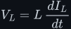
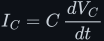
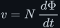
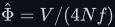
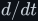

# Electronics & Electrical — study notes

A ground-up, first-principles knowledge base for power electronics, built the same way the
[Proqmed storage docs](https://example.invalid) are: narrative prose that *explains*, one
generated SVG figure per major idea, and every number stated verbatim with units. The
goal is understanding you can rebuild from scratch — not a formula sheet.

> **The thesis in one line**
>
> Three laws are the whole of it — the inductor law, the capacitor law, and Faraday's law beneath
> them both:

 &nbsp; , &nbsp;  &nbsp; and &nbsp; 

Every circuit in this tree is those laws applied to something that switches on and off. Buck and
boost converters get their step ratios from volt-second balance on the inductor; a transformer
steps voltage by its turns ratio because both windings see the same changing flux; an LC filter
keeps the average of a PWM wave because the inductor resists changes of current and the capacitor
changes of voltage; a rectifier and its capacitor turn AC back into DC; and an H-bridge driven by
sinusoidal PWM makes a 230 V, 50 Hz sine out of a DC bus. Nothing is assumed — each result is
*derived* from the laws, and the whole chain adds up to the 12 V DC to 230 V AC inverter.

## How to read this tree

Start at the fundamentals and only then open the circuits — every circuit document leans on the
laws, the waveform language (Fourier series, RMS), and the transformer derived there.

| Topic | What it covers | Status |
|---|---|---|
| [fundamentals/](fundamentals/) | The inductor and capacitor laws from first principles; electromagnetism (Ampère, Faraday <!--m:v = N\,d\Phi/dt--><!--/m-->, Lenz, self- and mutual inductance); the transformer (turns ratio, <!--m:\hat\Phi = V/(4Nf)--><!--/m-->, why high frequency means a small core); signals (edges, Fourier series, AC and RMS, mains quality) | **written** |
| [dc-dc-converters/](dc-dc-converters/) | Buck (step-down) and boost (step-up): the two switching intervals, volt-second balance, the derived step ratios, sizing L and C, and how each one starts up (the slow climb, overshoot, inrush, soft-start) | **written** |
| [filters/](filters/) | The LC low-pass filter as a PWM averager: <!--m:\omega_0 = 1/\sqrt{LC}--><!--/m-->, Q, 40 dB per decade, ripple maths, and varying the duty cycle to shape the output | **written** |
| [pwm/](pwm/) | Pulse-width modulation: duty cycle, the average <!--m:D\,V_{in}--><!--/m-->, timer and comparator methods, the spectrum, dead time | **written** |
| [rectifiers/](rectifiers/) | Half-wave and full-bridge rectifiers, average and RMS, the reservoir capacitor and its ripple <!--m:\Delta V \approx I/(2fC)--><!--/m-->, conduction angle, capacitor-only vs choke-input, 50 Hz vs 50 kHz | **written** |
| [dc-ac-inverters/](dc-ac-inverters/) | The H-bridge (switch states, shoot-through, dead time, gate drive, freewheeling) and sinusoidal PWM (carrier and reference, <!--m:m_a V_{dc}\sin\theta--><!--/m-->, spectrum, bipolar vs unipolar, overmodulation) | **written** |

Suggested order:

1. [fundamentals/inductor/](fundamentals/inductor/) — the law, the ramp, the polarity flip.
2. [fundamentals/capacitor/](fundamentals/capacitor/) — the mirror law, and **the proper
   proof of why you may differentiate <!--m:Q = C \cdot V--><!--/m-->** (the step that trips everyone up).
3. [fundamentals/electromagnetism/](fundamentals/electromagnetism/) — where both laws come from:
   Faraday's law <!--m:v = N\,d\Phi/dt--><!--/m-->, and why flux is the running integral of voltage.
4. [fundamentals/transformer/](fundamentals/transformer/) — two windings, one flux; the turns
   ratio, and why a higher frequency means *less* peak flux and a smaller core.
5. [fundamentals/signals/](fundamentals/signals/) — edges and Fourier series, then AC and RMS
   (why 230 V means a 325 V peak).
6. [dc-dc-converters/buck/](dc-dc-converters/buck/) — <!--m:V_{out} = D \cdot V_{in}--><!--/m-->, derived,
   then [its start-up](dc-dc-converters/buck/startup.md).
7. [dc-dc-converters/boost/](dc-dc-converters/boost/) — <!--m:V_{out} = V_{in}/(1-D)--><!--/m-->, same
   method, then [its start-up](dc-dc-converters/boost/startup.md).
8. [filters/lc-filter/](filters/lc-filter/) — the buck's LC seen as a filter that keeps the PWM
   average and rejects the switching.
9. [pwm/](pwm/) — PWM as a signal in its own right: generation, spectrum, dead time.
10. [rectifiers/](rectifiers/) — [half-wave](rectifiers/half-wave.md), then
    [full-bridge](rectifiers/full-bridge.md) with its reservoir capacitor (the inverter's 325 V bus).
11. [dc-ac-inverters/h-bridge/](dc-ac-inverters/h-bridge/) — four switches that reverse the load.
12. [dc-ac-inverters/spwm/](dc-ac-inverters/spwm/) — timing those switches so the filtered output
    is a sine.

## Conventions

Everything here follows [STYLE.md](STYLE.md): a one-line thesis, a numbered Contents, honest
"what this costs you" callouts, and figures that carry the argument on their own. **All maths and
all diagrams are generated SVGs** — every equation is typeset once by the
[toolchain](../toolchain/README.md) and embedded as an image, so it renders identically on GitHub,
GitLab, and any offline viewer, with no dependency on a markdown math plugin.

## Where this came from

These notes grew out of a long worked conversation and twelve pages of handwritten study
notes on buck/boost converters, then widened to the full 12 V DC to 230 V AC inverter shown in a
build video (H-bridge, transformer, rectifier, SPWM, LC filter). The confusions flagged in those notes — *when* it is legal to
apply <!--m:d/dt--><!--/m--> to both sides of an equation, why a constant voltage gives a straight-line
current, what the ramp graphs actually look like — are addressed head-on in the relevant
sections rather than glossed over.
