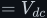

# The H-bridge

Deep treatment of the circuit that turns a DC rail into an alternating voltage: four switches that
connect a load to the supply forwards or backwards. The full argument is in
[h-bridge.md](h-bridge.md), in fourteen sections with ten figures (Figures 40–49).

> **The thesis in one line**
>
> An H-bridge makes AC by reversing the load's connection to a DC rail — one diagonal pair of
> switches gives <!--m:+V_{dc}-->, the other <!--m:-V_{dc}--> — and everything else (gate drivers, dead time,
> body diodes, PWM) exists to make that reversal fast, safe and shaped.

## Contents

The treatment covers:

1. Why DC to AC needs a reversible current path.
2. Four switches, two legs, two diagonals (fig-01).
3. The full state table: drive, zero, half-off, all-off and the forbidden shoot-through states.
4. The ±V square wave across a lamp: RMS <!--m:= V_{dc}-->, fundamental <!--m:4V_{dc}/\pi-->, THD 48 % (fig-02).
5. The MOSFET as a switch: threshold, on-resistance, gate charge, body diode (fig-03).
6. Switching transitions and switching loss, with worked numbers at 12 V and 325 V (fig-04).
7. "Steep curves": real edges, rise time, dV/dt, ringing and Miller turn-on (fig-05).
8. High-side drive with a bootstrap gate driver (IR2110 / IR2104) (fig-06).
9. Dead time: why, what the body diodes do during it, and the output-voltage error (fig-07).
10. Inductive loads: freewheeling, di/dt spikes, avalanche and snubbers (fig-08, fig-09).
11. Square-wave, bipolar PWM and unipolar PWM drive (fig-10).
12. The two H-bridges of the 12 V to 230 V inverter, with loss and efficiency numbers.
13. What this costs you.
14. Sources and cross-links.

## Reading order

Read after the [inductor](../../fundamentals/inductor/inductor.md) and
[capacitor](../../fundamentals/capacitor/capacitor.md) laws. Pair §4 with the Fourier treatment in
[../../fundamentals/signals/](../../fundamentals/signals/), then continue to [../spwm/](../spwm/)
for how the second bridge is modulated into a sine.

## Links

- Parent index: [../README.md](../README.md)
- Style guide: [../../STYLE.md](../../STYLE.md)
- Next: [../spwm/](../spwm/), [../../pwm/](../../pwm/), [../../filters/lc-filter/](../../filters/lc-filter/)
- Neighbours in the inverter chain: [../../fundamentals/transformer/](../../fundamentals/transformer/),
  [../../rectifiers/](../../rectifiers/)
