# The H-bridge — turning one DC rail into a voltage that alternates

A battery pushes current one way only. Every AC load — a mains lamp, a transformer, a motor —
needs current that reverses. The H-bridge is the circuit that does the reversing: four switches
arranged so that the load can be connected to the supply *forwards* or *backwards* at will. Flip
between the two fast enough and the load sees an alternating voltage, made out of nothing but DC.

This document builds the H-bridge from the bare idea up to the parts that make a real one work or
fail: the switch states, the square wave and what it contains, the MOSFET as a switch, switching
losses, high-side gate drive, dead time, inductive loads, and the three ways of driving it. It ends
with the two H-bridges inside the 12 V to 230 V inverter worked through with numbers.

**Contents**

1. [Why DC to AC needs a reversible current path](#1-why-dc-to-ac-needs-a-reversible-current-path)
2. [Four switches, two legs, two diagonals](#2-four-switches-two-legs-two-diagonals)
3. [Every switch state, including the forbidden ones](#3-every-switch-state-including-the-forbidden-ones)
4. [The square wave across a lamp, its RMS and its fundamental](#4-the-square-wave-across-a-lamp-its-rms-and-its-fundamental)
5. [The MOSFET as a switch](#5-the-mosfet-as-a-switch)
6. [Switching transitions and switching loss](#6-switching-transitions-and-switching-loss)
7. [Steep edges are not vertical](#7-steep-edges-are-not-vertical)
8. [Driving the high side, bootstrap gate drivers](#8-driving-the-high-side-bootstrap-gate-drivers)
9. [Dead time](#9-dead-time)
10. [Inductive loads, freewheeling, spikes and snubbers](#10-inductive-loads-freewheeling-spikes-and-snubbers)
11. [Three ways to drive the bridge](#11-three-ways-to-drive-the-bridge)
12. [The two H-bridges in the 12 V to 230 V inverter](#12-the-two-h-bridges-in-the-12-v-to-230-v-inverter)
13. [What this costs you](#13-what-this-costs-you)
14. [Sources and cross-links](#14-sources-and-cross-links)

> **The thesis in one line**
>
> An H-bridge makes AC by reversing the load's connection to a DC rail: one diagonal pair of
> switches gives <!--m:+V_{dc}--><!--/m-->, the other gives <!--m:-V_{dc}--><!--/m-->. Everything else in this document — gate drivers,
> dead time, diodes, PWM — exists to make that reversal fast, safe, and shaped.

---

## 1 Why DC to AC needs a reversible current path

Wire a lamp straight to a 12 V battery and current flows out of the + terminal, through the
filament, and back into the − terminal. The direction is fixed by the battery's chemistry; nothing
you do to the lamp changes it. To make the current go the *other* way through the lamp you would
have to unplug the lamp and connect it the other way round — swap its two wires.

That is exactly what alternating current asks for. A 50 Hz supply reverses direction 100 times a
second. So the question "how do we turn DC into AC?" is really "how do we swap the load's two wires
100 times a second — or 100 000 times a second — without touching them?" The answer has to be a
set of switches that can connect each end of the load to *either* rail. One switch per end is not
enough: each end needs a path to + and a path to −. Two ends times two rails is four switches, and
four switches arranged that way is the H-bridge.

The source video draws exactly this: the same lamp, once with current flowing left-to-right, once
right-to-left, and then the four-switch circuit that can do both without rewiring.

> **Note —** A DC-DC converter like the [buck](../../dc-dc-converters/buck/buck.md) also chops a DC
> rail with a switch, but its output only ever swings between <!--m:V_{in}--><!--/m--> and 0 — it never goes
> negative. The single extra thing the H-bridge adds is the *negative* half: the ability to put the
> supply across the load reversed.

## 2 Four switches, two legs, two diagonals

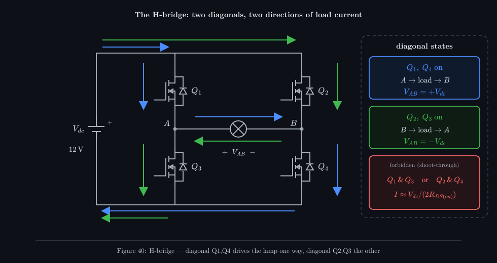

_Blue: Q1 and Q4 on, current runs through the lamp from A to B. Green: Q2 and Q3 on, the same
supply pushes current from B to A. Same lamp, same battery, opposite directions — that reversal is
all AC is._

Draw the four switches as the two uprights of a letter H with the load as the crossbar, and the
name explains itself. The naming here follows the source video: **Q1** top-left, **Q2** top-right,
**Q3** bottom-left, **Q4** bottom-right. Vocabulary worth fixing now:

- A **leg** (or half-bridge) is one upright: a high-side switch above a low-side switch, with the
  load connected at their midpoint. The left leg is Q1 over Q3, with midpoint **A**; the right leg is
  Q2 over Q4, with midpoint **B**.
- The **high side** switches (Q1, Q2) connect a midpoint to the + rail; the **low side** switches
  (Q3, Q4) connect it to the − rail (ground).
- A **diagonal** is one high-side switch with the *opposite* leg's low-side switch: Q1 with Q4, or
  Q2 with Q3.

The voltage across the load is defined as <!--m:V_{AB} = V_A - V_B-->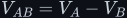<!--/m-->. Each midpoint can only sit at one of the two
rails (or float), so <!--m:V_{AB}-->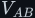<!--/m--> can only take three values:

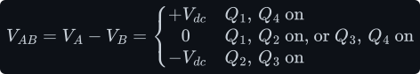

Turn on the blue diagonal and A is tied to + while B is tied to −: current leaves the battery, runs
down through Q1, across the lamp from A to B, down through Q4, and home. Turn on the green
diagonal instead and the lamp's two ends swap rails: current runs down Q2, across the lamp from B to
A, down Q3. The battery never reverses. The *lamp's connection* to it does.

The switches in the figure are N-channel MOSFETs, each drawn with the diode that is built into it
(§5 explains why that diode is there and why it turns out to be essential in §10).

## 3 Every switch state, including the forbidden ones

Four on/off switches give <!--m:2^4 = 16--><!--/m--> combinations. Organise them by leg: each leg can have its
high switch on, its low switch on, neither on, or **both** on. Both-on is a dead short from the
+ rail to ground straight through the leg — called **shoot-through** — and it is the one thing an
H-bridge must never do. Any combination containing Q1 with Q3, or Q2 with Q4, is a shoot-through;
that is 7 of the 16. The other <!--m:3 \times 3 = 9--><!--/m--> are legal:

| Left leg | Right leg | On | <!--m:V_{AB}--><!--/m--> (resistive lamp) | Name / what it is used for |
|---|---|---|---|---|
| high | low | Q1, Q4 | <!--m:+V_{dc}--><!--/m--> | **positive drive** (blue diagonal) |
| low | high | Q2, Q3 | <!--m:-V_{dc}--><!--/m--> | **negative drive** (green diagonal) |
| high | high | Q1, Q2 | 0 | **zero state, high side** — both ends at +; freewheels an inductive load |
| low | low | Q3, Q4 | 0 | **zero state, low side** — both ends at ground; also a brake for a motor |
| high | off | Q1 | 0 (no current) | half-off; inductive current continues through the body diode of Q2 |
| off | high | Q2 | 0 (no current) | half-off; mirror of the above |
| low | off | Q3 | 0 (no current) | half-off; inductive current continues through the body diode of Q4 |
| off | low | Q4 | 0 (no current) | half-off; mirror |
| off | off | none | 0 (no current) | **all off** — the bridge is high impedance; an inductive load's current returns to the supply through two body diodes (§10) |
| high + low | any | Q1 and Q3 | — | **forbidden: left-leg shoot-through** |
| any | high + low | Q2 and Q4 | — | **forbidden: right-leg shoot-through** |

The "(resistive lamp)" column matters. With a pure resistance, a load end that is not switched to
anything carries no current, so it simply follows the other end and <!--m:V_{AB} = 0-->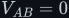<!--/m-->. With an inductive load
the current cannot stop instantly, so a floating end is dragged to whichever rail its body diode
connects it to — that is where the half-off and all-off rows get interesting, and it is covered in
§10.

How bad is shoot-through? The only things limiting the current are the two switches' on-resistance
and the wiring:

In practice the battery's own resistance and the wiring cap it lower, but the energy is dumped in
two MOSFETs that are rated for a fraction of that. A shoot-through lasting even a few microseconds
destroys them. The **two zero states** are the useful ones: they short the load *without* touching
the supply, which is how unipolar PWM (§11) produces its 0 V level.

## 4 The square wave across a lamp, its RMS and its fundamental

The simplest way to drive the bridge is the one in the source video: alternate the two diagonals
with a fixed 50 % duty. For the first half of every period Q1 and Q4 are on; for the second half Q2
and Q3 are on. Across the lamp the voltage jumps between <!--m:+12\,\mathrm{V}--><!--/m--> and <!--m:-12\,\mathrm{V}--><!--/m--> — a **bipolar square
wave**.

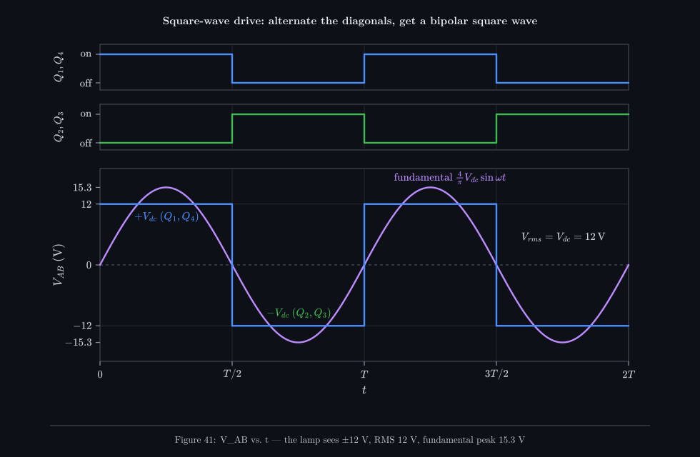

_Top two rows: the two diagonals take turns, never overlapping. Bottom: the lamp sees a square wave
between +12 V and −12 V. The purple sine is the square wave's fundamental — a 15.3 V-peak sine at the
same frequency, which is what a transformer or filter mostly "sees"._

**Its RMS is exactly the rail voltage.** RMS is the value that heats a resistor the same as DC
would. Square the waveform: <!--m:(+12)^2-->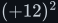<!--/m--> and <!--m:(-12)^2--><!--/m--> are both 144, so <!--m:v^2--><!--/m--> is a constant 144 and its
mean is 144:

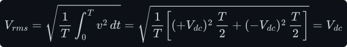

So a 12 V, 60 W lamp (<!--m:R = 2.4\,\Omega-->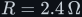<!--/m-->) glows exactly as brightly on the square wave as on the battery:

The lamp does not care which way the current flows; a filament heats on <!--m:i^2 R-->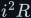<!--/m-->. This is the reason
the square wave is "good enough" for a lamp or a heater — and the reason it is *not* good enough for
anything that cares about the shape (see below).

**Its fundamental is <!--m:4V_{dc}/\pi-->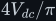<!--/m-->.** A square wave is not a sine, but by Fourier's theorem it is a sum of
sines: one at the switching frequency (the *fundamental*) plus all the odd harmonics, each smaller by
its harmonic number:

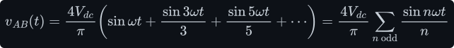

The fundamental's amplitude comes from one integral. Using <!--m:\theta = \omega t--><!--/m-->, the square wave is
<!--m:+V_{dc}--><!--/m--> on the first half-turn and <!--m:-V_{dc}--><!--/m--> on the second; on both halves the product with <!--m:\sin\theta--><!--/m--> is
positive, and each half contributes <!--m:2V_{dc}--><!--/m-->:

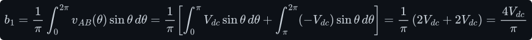

The full derivation of the series — why only odd harmonics survive and why each falls as
<!--m:1/n--><!--/m--> — is in [../../fundamentals/signals/](../../fundamentals/signals/). For the 12 V bridge:

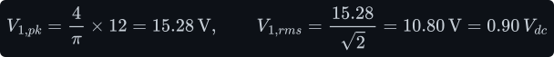

Notice the fundamental's *peak* (15.3 V) is higher than the square wave itself (12 V). That is not a
contradiction: the harmonics subtract from the sine near its peak and add near its zero crossings,
flattening it into a square. Of the 12 V RMS, only 10.8 V RMS is at the fundamental frequency; the
rest is harmonics, which shows up as a total harmonic distortion of nearly 50 %:

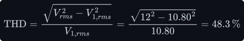

That 48 % is why the second bridge in the inverter is **not** driven with a 50 Hz square wave:
motors buzz and overheat on the 3rd and 5th harmonics, and capacitive loads draw current spikes on
every edge. A transformer, by contrast, only needs volt-seconds that balance — the first bridge's
50 kHz square wave suits it perfectly (§12).

## 5 The MOSFET as a switch

The four switches are almost always MOSFETs (at higher voltages and powers, IGBTs or SiC MOSFETs,
which behave similarly at the level of this section). The user's note says it directly: *ideally we
use PWM and MOSFETs here to control the switching.* So it is worth knowing precisely what a MOSFET
is when it is being used as a switch — because every loss and every failure in an H-bridge traces
back to one of the four properties below.

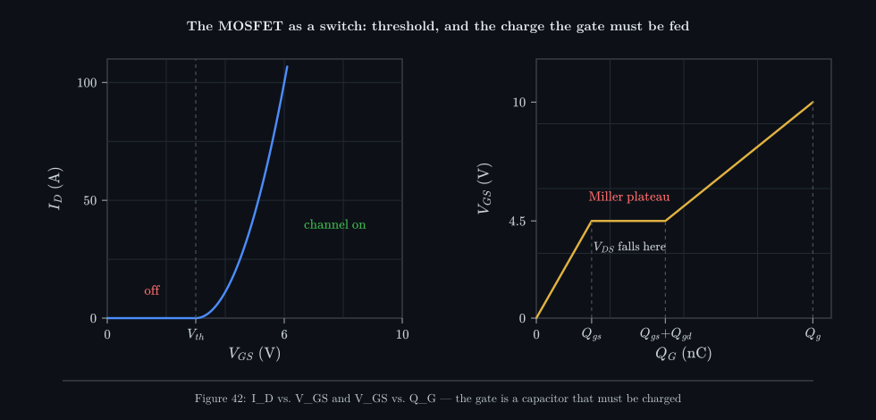

_Left: below the threshold voltage no current flows at all; a few volts above it the channel can
carry tens of amps. Right: getting the gate there means pushing a fixed amount of charge in — and in
the flat Miller plateau all that charge goes into swinging the drain voltage, not raising the gate._

**Enhancement N-channel, and the threshold voltage.** An N-channel *enhancement* MOSFET is off
with its gate at 0 V — there is no conducting channel between drain and source until the gate makes
one. Raise the gate-to-source voltage <!--m:V_{GS}--><!--/m--> above the **threshold voltage** <!--m:V_{th}-->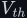<!--/m--> (typically
2–4 V) and the electric field from the gate pulls electrons into a thin layer under it, forming a
channel. The device is "enhanced" into conducting. At threshold the channel is barely there; power
MOSFETs are specified **fully on at <!--m:V_{GS} = 10\,\mathrm{V}--><!--/m-->** (or 4.5 V for "logic-level" parts). Driving a gate
with 3.3 V straight from a microcontroller leaves a standard MOSFET half-on and hot — one reason a
dedicated gate driver sits between the controller and the bridge. Enhancement-mode also means
*fail-safe*: a gate that loses drive turns the switch **off**, not on.

Note the voltage that matters is gate-to-**source**, not gate-to-ground. For the low-side switches
the source is ground, so that is the same thing. For the high-side switches it is not, and §8 is
entirely about that.

**On-resistance and conduction loss.** A fully-on MOSFET is not a perfect switch; it is a small resistor,
<!--m:R_{DS(on)}-->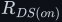<!--/m-->. A 40 V power MOSFET can reach about 1–2 mΩ; a 600 V part is more like 0.1–0.2 Ω, because the
thick drift region that blocks high voltage also resists current. While conducting, it dissipates
plain resistive heat:

Two details make this worse in practice. <!--m:R_{DS(on)}--><!--/m--> rises with temperature, roughly 1.5–2× from
25 °C to 125 °C — so use the hot value in calculations (the positive temperature coefficient does
have an upside: paralleled MOSFETs share current, because the hotter one resists more). And in an
H-bridge **two** switches are always in series with the load (one in each leg), so the load current
pays <!--m:2R_{DS(on)}-->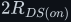<!--/m--> all the time.

**Gate charge, and why a gate needs current.** The gate is insulated from the channel by a thin
oxide: it draws *no* DC current. But it is one plate of a capacitor — in fact of two capacitors,
gate-to-source <!--m:C_{gs}-->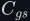<!--/m--> and gate-to-drain <!--m:C_{gd}-->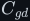<!--/m-->. To turn the switch on you must put a charge <!--m:Q_g--><!--/m--> on
that capacitance; to turn it off you must take it back out. Datasheets give this as a single number,
the **total gate charge**, because the capacitances are voltage-dependent and a charge budget is
easier to use than a capacitance. The right-hand panel of the figure is the gate-charge curve:

- From 0 to <!--m:Q_{gs}--><!--/m-->, charge raises <!--m:V_{GS}--><!--/m--> past threshold and the drain current rises to the load current.
- Across the **Miller plateau** (<!--m:Q_{gd}--><!--/m-->), <!--m:V_{GS}--><!--/m--> stalls: every coulomb delivered goes into
  discharging <!--m:C_{gd}--><!--/m--> as the drain voltage swings from the rail to nearly zero. This is the interval in
  which the switch is dissipating the most (§6).
- Beyond the plateau, the extra charge drives the gate up to 10 V to minimise <!--m:R_{DS(on)}--><!--/m-->.

Charge per time is current, so how fast the switch transitions is set by how hard the driver can
push current into the gate. To get through the roughly 100 nC of <!--m:Q_{gs} + Q_{gd}-->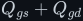<!--/m--> of a big 40 V MOSFET in 50 ns:

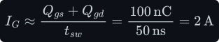

Two amps of *peak* gate current, from a device that draws zero DC current. A microcontroller pin
supplies about 20 mA, which would take 5 µs per edge — a hundred times slower, with a hundred times
the switching loss. That is the second reason for a gate driver. The *average* power the driver
spends is small, because the charge is pushed in and dumped out once per cycle:

**The body diode.** The way a power MOSFET is built, its source terminal is bonded to the
semiconductor body, and the body-to-drain junction is a p-n diode: anode at the source, cathode at
the drain. It is drawn in every symbol in this document because it is always there — you cannot buy
a power MOSFET without it. It means the MOSFET only *blocks* voltage in one direction. Pull the drain
below the source and the diode conducts, regardless of the gate. Three consequences run through the
rest of this document:

- In an H-bridge the body diodes are wired *backwards across each switch*, from the lower rail
  towards the upper. They never conduct in normal resistive operation; they come alive the moment an
  inductive load's current has nowhere else to go (§9, §10). They are the bridge's free safety
  valve.
- A diode drops about 0.7–1.2 V while conducting, far more than <!--m:I \cdot R_{DS(on)}-->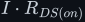<!--/m--> at modest currents.
  If the gate is on while reverse current flows, the *channel* conducts in reverse too (a MOSFET
  channel conducts both ways), bypassing the diode — this is "synchronous rectification".
- When a conducting body diode is suddenly reverse-biased by the opposite switch turning on, it
  takes time to clear its stored charge (**reverse recovery**, charge <!--m:Q_{rr}-->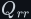<!--/m-->). During that time it
  conducts backwards — a brief partial shoot-through. Silicon high-voltage MOSFETs have notoriously
  slow body diodes; at 325 V this becomes one of the biggest losses (§12).

> **Tip —** Why N-channel on the high side at all, when a P-channel MOSFET would turn on with its
> gate pulled *below* the rail? Because holes move about 2.5–3× more slowly than electrons in
> silicon, so a P-channel device has roughly 2.5–3× the <!--m:R_{DS(on)}--><!--/m--> of an N-channel device of the
> same size and cost. Small, low-voltage bridges (motor drivers under ~1 A) do use P-channel high
> sides. Power bridges use four N-channels and pay for it with the gate-drive trick in §8.

## 6 Switching transitions and switching loss

A MOSFET that is fully on has nearly zero voltage across it; one that is fully off has nearly zero
current through it. Either way <!--m:v \cdot i-->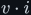<!--/m--> is tiny. The heat is made **in between** — during the tens of
nanoseconds when the device has both substantial voltage *and* substantial current at the same time.

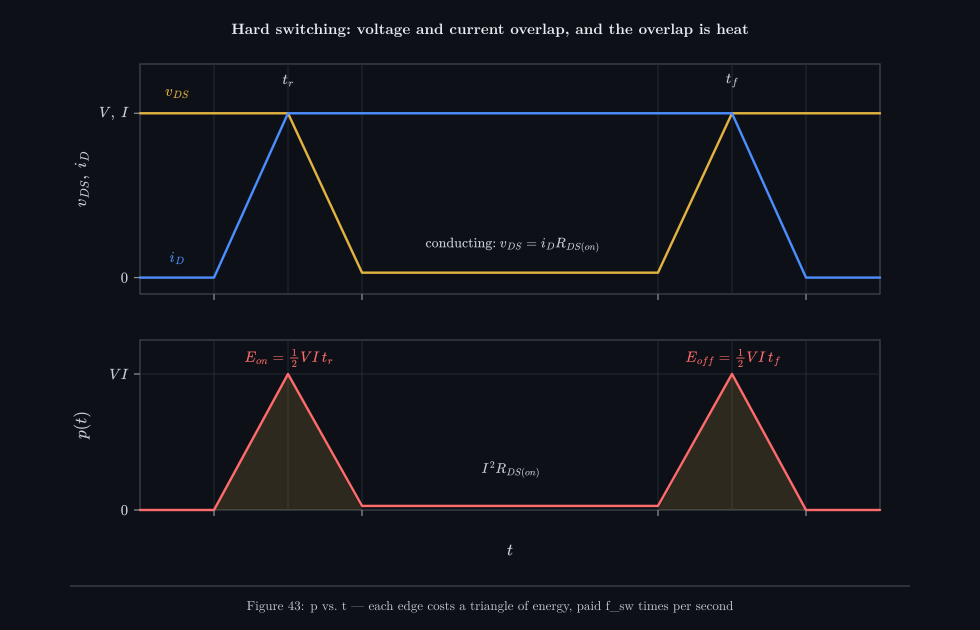

_Top: at turn-on the current rises first while the full voltage is still across the switch, then the
voltage collapses; at turn-off the order reverses. Bottom: their product is the instantaneous power,
a triangle peaking at the full V times I on every edge. The flat strip in the middle is the small
conduction loss._

Why does the current rise *before* the voltage falls? Because the load is inductive (a transformer
primary, a motor, a filter inductor), and an inductor's current cannot change instantly. Before the
switch turns on, that current was flowing through some other path — the opposite switch's body diode
(§9). The switch's drain voltage cannot fall until it has taken over the *whole* load current from
that diode, because until then the diode is still conducting and clamping the node to the rail. So
the current ramps up at full voltage, and only then does the voltage swing down (this is the Miller
plateau of §5). Turn-off is the same in reverse. This is called **hard switching**, and each
transition dissipates the area of one triangle:

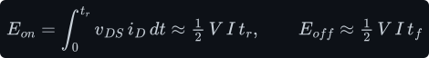

Each switch goes through one turn-on and one turn-off per switching period, and there are
<!--m:f_{sw}-->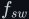<!--/m--> periods per second, so the switching loss per MOSFET is:

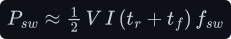

> **Watch out —** Textbooks sometimes give <!--m:VIt/6--><!--/m--> per edge instead of <!--m:VIt/2--><!--/m-->. Both are right, for
> different loads. With a *resistive* load, voltage falls while current rises simultaneously and the
> product is a parabola; with an *inductive* (clamped) load, as above, one waits for the other and
> the product is the larger triangle:

> Power converters have inductive loads, so use <!--m:\tfrac12 VIt-->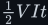<!--/m-->. Using the resistive formula
> underestimates the loss by a factor of three.

**Worked numbers, 12 V bridge at 50 kHz.** At 1 kW the battery supplies <!--m:1000/12 = 83.3\,\mathrm{A}--><!--/m-->. With
50 ns rise and 50 ns fall:

**Worked numbers, 325 V bridge at 20 kHz.** At 1 kW into 230 V the load current is
<!--m:4.35\,\mathrm{A}--><!--/m--> RMS, a sine of peak <!--m:6.15\,\mathrm{A}--><!--/m-->. Each switching event happens at whatever the current is at
that instant, so the right current to use is the average of <!--m:\lvert i \rvert-->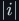<!--/m--> over the sine,
<!--m:(2/\pi) \times 6.15 = 3.92\,\mathrm{A}--><!--/m-->:

Notice the shape of the formula: switching loss grows with **voltage × current × frequency**. The
12 V bridge has the big current; the 325 V bridge has the big voltage. Doubling <!--m:f_{sw}--><!--/m--> doubles it —
the price paid for the smaller transformer and filter that high frequency buys
([../../fundamentals/transformer/](../../fundamentals/transformer/),
[../../filters/lc-filter/](../../filters/lc-filter/)).

## 7 Steep edges are not vertical

The square wave in the video — and in Figure 41 — has perfectly vertical edges. The user's note
calls them "steep curves", which is the right instinct: they are steep, but they are curves. A real
edge takes a finite time, set by the gate charge and gate current of §5, and it does not stop cleanly.

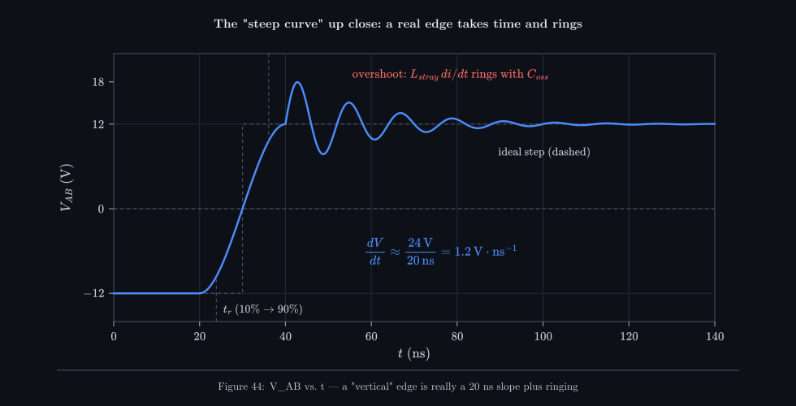

_Zoomed in to nanoseconds, a "vertical" edge is a slope lasting about 20 ns, followed by an overshoot
and a decaying ring. The slope is the dV/dt; the ring is the wiring's stray inductance resonating with
the MOSFET's output capacitance._

Three numbers characterise an edge:

- **Rise time** <!--m:t_r-->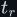<!--/m--> (and fall time <!--m:t_f-->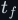<!--/m-->), measured from 10 % to 90 % of the swing. This is the <!--m:t_r--><!--/m-->
  in the switching-loss formula: faster edges, less loss.
- **Slew rate** <!--m:dV/dt-->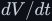<!--/m-->, the steepness of the slope:

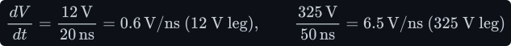

- **Overshoot and ringing**, from the stray inductance of the loop (§10).

Fast edges are not free. A high <!--m:dV/dt--><!--/m--> pushes current through every capacitance it meets
(<!--m:i = C\,dV/dt-->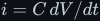<!--/m--> — the capacitor law from [../../fundamentals/capacitor/](../../fundamentals/capacitor/capacitor.md)).
The most dangerous one is the *other* MOSFET's gate-drain capacitance. When the high-side switch
slams the midpoint up at 6.5 V/ns, the off low-side switch sees that edge on its drain, and its
<!--m:C_{rss}--><!--/m--> (= <!--m:C_{gd}--><!--/m-->) injects current into its own gate:

Nearly 2 V on a gate whose threshold is 3 V, and threshold drops when hot. If it crosses, the "off"
switch turns briefly on: a self-inflicted shoot-through. The cures are a low-impedance turn-off path
(a strong driver sink, a separate low turn-off gate resistor), a negative off-voltage on the gate, or
simply slower edges — which costs switching loss. Fast edges also radiate: their spectrum extends to
about <!--m:0.35/t_r--><!--/m-->, around 17 MHz for a 20 ns edge, which is why inverters need EMI filters. The relationship
between edge time and spectrum is developed in [../../fundamentals/signals/](../../fundamentals/signals/).

## 8 Driving the high side, bootstrap gate drivers

Here is the problem §5 promised. To turn on an N-channel MOSFET you raise its gate about 10 V above
its **source**. For the low-side switches (Q3, Q4) the source is ground: put 10 V on the gate, done.
For the high-side switches (Q1, Q2) the source is the midpoint A or B — and when the switch is on,
the midpoint is at the + rail. So to keep the high-side switch on, its gate must sit about 10 V
**above the rail it is switching**: 22 V on the 12 V bridge, about 335 V on the 325 V bridge. There is
no such voltage anywhere in the circuit. And the moment the switch turns off, its source drops back
to near ground, so the gate drive has to fly up and down with it by the full rail voltage, every
cycle.

The common, cheap solution is the **bootstrap** circuit, built into half-bridge driver ICs such as
the IR2110 (separate high and low inputs, about 2 A drive, 500 V) or the IR2104 (one input,
built-in dead time, 600 V, weaker drive).

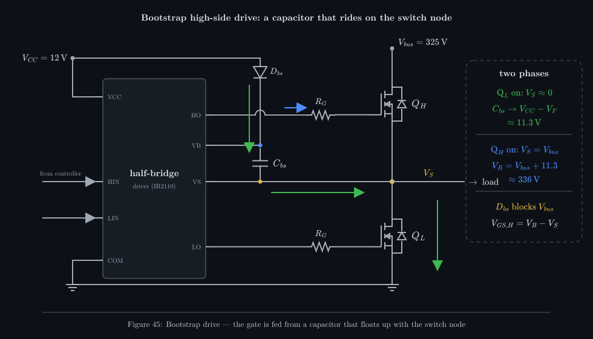

_Green: while the low-side switch is on, the switch node is at ground and the bootstrap capacitor
charges from 12 V through the diode. Blue: when the high side turns on, the capacitor's lower plate
is lifted to 325 V with the switch node, carrying its 11.3 V charge up with it — a floating battery
for the high-side gate._

The trick is a capacitor whose bottom plate is connected to the switch node <!--m:V_S--><!--/m--> (the high-side
switch's source). It works in two phases:

1. **Low side on, charge.** The switch node is at ground. The bootstrap capacitor <!--m:C_{bs}--><!--/m--> charges
   from the 12 V supply through the bootstrap diode <!--m:D_{bs}--><!--/m-->, to <!--m:V_{CC} - V_F \approx 11.3\,\mathrm{V}-->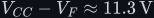<!--/m-->.
2. **High side on, float.** The driver's high-side section — which is itself powered *from* the
   capacitor, between pins VB and VS — connects VB to the gate. The gate rises, the MOSFET turns on,
   and the switch node climbs to the rail. The capacitor's bottom plate climbs with it, so its top
   plate (VB) climbs to the rail *plus* 11.3 V. The diode is now reverse-biased by the full rail and
   blocks, so the capacitor floats, holding its charge.

Because the capacitor voltage rides on top of whatever <!--m:V_S--><!--/m--> is doing, the gate-to-source voltage is
always the same:

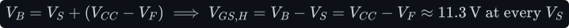

Inside the IC, a **level shifter** carries the on/off command from the ground-referenced logic input
(HIN) up to the floating high-side section. It is a pair of high-voltage transistors that send short
current pulses up to a latch sitting at VS — this is what the "500 V" or "600 V" rating of the
driver refers to, and what limits how fast VS may slew before the latch is upset (the driver's
dV/dt immunity, typically ±50 V/ns).

**Sizing the capacitor.** Each high-side turn-on takes <!--m:Q_g--><!--/m--> out of <!--m:C_{bs}--><!--/m-->, and while it is on,
the driver's floating section draws a quiescent current <!--m:I_{QBS}--><!--/m--> from it as well, plus a little
level-shifter charge <!--m:Q_{ls}--><!--/m-->. Allowing a 0.5 V droop, for a 600 V MOSFET with 60 nC of gate charge held on
for up to 50 µs per carrier cycle:

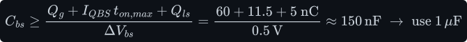

A ceramic capacitor several times the minimum is normal; bigger is safer, until it is so big that
the first charge-up at start-up takes too long.

**Minimum duty for refresh.** The capacitor only recharges while the low-side switch is on. So the
high side **cannot be held on indefinitely**: the capacitor droops, and when its voltage falls below
the driver's under-voltage lockout (about 8–9 V for the IR2110) the driver forcibly turns the high
side off. The two consequences:

- Every switching period must include *some* low-side on-time to top the capacitor up. With a
  20 kHz carrier (50 µs period), guaranteeing at least about 1 µs of low-side time limits the high
  side to roughly 98 % duty. PWM schemes that would ask for 100 % must be clipped.
- Low-frequency drive is a problem. If the 325 V bridge were driven with a plain 50 Hz square
  wave, each high-side switch would be on for 10 ms at a time, and the quiescent current alone would
  droop the capacitor by:

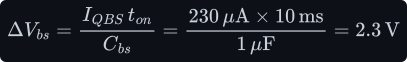

  From 11.3 V to 9.0 V — right at the edge of lockout. This is one of several practical reasons the
  second bridge is switched at a carrier frequency (SPWM, §11) rather than at 50 Hz.

> **Note —** Where a bootstrap will not do (100 % duty, or very low frequencies), designers use an
> isolated gate-drive supply per high-side switch (a small isolated DC-DC converter) with a digital
> isolator or optocoupler for the signal, or a charge-pump driver. These cost more but have no duty
> limit.

## 9 Dead time

The two switches in a leg must never be on together (§3). A controller that simply inverts the
high-side signal to make the low-side signal will get this wrong, because **a MOSFET turns off more
slowly than it turns on**. Turn-off has to remove the whole gate charge through the gate resistor,
including the plateau, and the datasheet's turn-off delay plus fall time is typically two or three
times the turn-on delay. If Q1 is told "off" and Q3 is told "on" at the same instant, Q3 is
conducting before Q1 has finished stopping: a shoot-through on every edge. It may not blow anything
up immediately; it shows up as unexplained heat, current spikes and EMI.

The fix is **dead time**: after one switch in a leg is turned off, wait a fixed interval <!--m:t_d--><!--/m--> with
*both* switches off before turning the other on. The minimum safe value is the worst-case turn-off
time minus the best-case turn-on delay, plus a margin for driver-to-driver propagation mismatch:

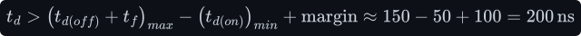

Typical values are 100 ns to 1 µs. Some drivers insert it for you (the IR2104 adds a fixed 520 ns);
others (the IR2110) leave it to the controller, which allows a tighter, tuned value.

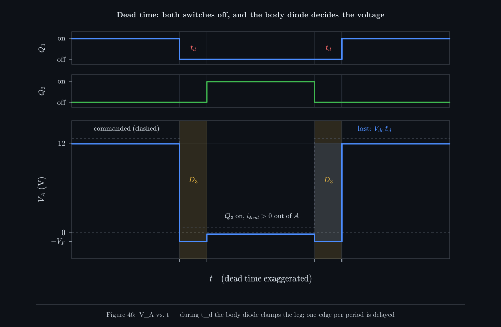

_Q1 turns off, and for t_d nothing is gated on. The load current (flowing out of A) does not care: it
is drawn up through the body diode of Q3, so A drops to −V_F at once. At the other end of the
low-side interval, A stays clamped low until Q1 actually turns on — so one edge per period arrives
t_d late, and V_dc·t_d of volt-seconds is lost._

**What happens during the dead time.** With a resistive load, nothing much: both switches are off,
the midpoint floats, and the voltage slides over. With an inductive load — and every real load in
the inverter is inductive — the current *cannot* stop for 200 ns, so it must find a path. It finds
one through whichever body diode points the right way. If the current is flowing *out* of node A
into the load, the only path that can supply it is up from ground through the body diode of Q3, so
A is pulled to <!--m:-V_F-->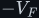<!--/m--> (about −0.8 V), exactly as if Q3 were on. If the current flows *into* A, the
body diode of Q1 carries it up to the + rail, and A sits at <!--m:V_{dc} + V_F-->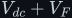<!--/m-->, as if Q1 were on. **During
dead time the output voltage is decided by the direction of the load current, not by the
controller.**

**The effect on the output voltage.** That makes the error predictable. For current flowing out of
the leg, the falling edge happens on time (the diode takes over at the instant Q1 turns off) but the
rising edge is late by <!--m:t_d--><!--/m--> (the diode holds the node low until Q1 turns on). Each period loses a sliver
<!--m:V_{dc}\,t_d-->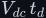<!--/m--> of volt-seconds. Averaged over a period, the leg's output is lower than commanded by:

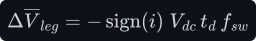

For the 325 V bridge with the IR2104's built-in dead time and a 20 kHz carrier:

About 2 % of the 325 V peak. It sounds small, but because the error *flips sign with the current*, it
is a small square wave in step with the load current — subtracted from the intended sine. It
distorts the output most near the current's zero crossings ("crossover distortion") and adds low
odd harmonics. Good inverter controllers measure the current direction and add back <!--m:V_{dc}\,t_d\,f_{sw}-->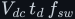<!--/m-->
(**dead-time compensation**). On the 12 V square-wave bridge the same arithmetic is simply a 2 %
shorter pulse each half-cycle (<!--m:2 \times 200\,\mathrm{ns}/20\,\mu\mathrm{s}--><!--/m-->), which the transformer does not mind.

## 10 Inductive loads, freewheeling, spikes and snubbers

A lamp is the friendly case. The two loads the inverter actually drives — a transformer primary, and
an LC filter feeding whatever is plugged in (often a motor) — are inductive. The defining fact of an
inductor is that its current cannot change instantaneously, because <!--m:v = L\,di/dt--><!--/m--> would demand an
infinite voltage (see [../../fundamentals/inductor/](../../fundamentals/inductor/inductor.md)). So every
time the bridge changes state, the load current is *still flowing* and must go somewhere.

_All four gates off, but the inductor was carrying current from A to B. It keeps flowing: up through
the body diode of Q3, through the load, up through the body diode of Q2, and into the + rail — charging
the bus capacitor with the energy the inductor had stored._

**Freewheeling through the body diodes.** Suppose Q1 and Q4 were driving current from A to B and
all four switch off. The load current has to keep going A to B. The only devices that can carry it
are the body diodes: current is drawn up from the − rail through the diode of Q3 into A, through the
load, out of B and up through the diode of Q2 into the + rail. The load now sees the supply
*reversed*, plus two diode drops, which drives its current down fast:

The energy <!--m:\tfrac12 L i_L^2--><!--/m--> goes back into the supply. A battery can absorb it; but in the inverter the
second bridge's supply is a capacitor fed by a rectifier that cannot accept reverse current
([../../rectifiers/](../../rectifiers/)), so returned energy pumps the bus capacitor's voltage up. This
is why bus capacitors are sized for more than ripple, and why motor drives have "brake choppers".
Alternatively, the controller can turn on a *zero state* (Q1+Q2, or Q3+Q4) instead of all-off: then
the current circulates through the load and the two switches, <!--m:V_{AB} \approx 0--><!--/m-->, and it decays
slowly rather than being driven back into the supply. That choice — fast decay versus slow decay — is
one of the main knobs in motor control.

_With a square wave across an inductor the current is a triangle, lagging the voltage by a quarter
period. Right after each edge the voltage has reversed but the current has not — so for that quarter
period current flows backwards through the switches, i.e. through their diodes (or reversed
channels), returning energy to the supply._

**Diodes conduct even in normal operation.** It is not only at shutdown. Drive an inductive load with
a square wave and the current lags the voltage. After every edge there is an interval where the
bridge is applying, say, <!--m:+V_{dc}--><!--/m--> (Q1, Q4 gated on) while the current is still flowing in the
negative direction (B to A). That current flows *backwards* through the Q1–Q4 positions: through
their body diodes during the dead time, and through their channels in reverse once the gates are up.
In Figure 48 these are the amber "reverse" quarters. Only after the current crosses zero do Q1 and Q4
carry it forwards. A transformer primary is exactly this case: its magnetising current is a triangle
like this one, added to the reflected load current.

**Voltage spikes from di/dt.** The wiring from the bus capacitor, through the two switches and back,
forms a loop, and every loop has inductance — roughly 1 nH per millimetre of trace. When a switch
interrupts the current through that *stray* inductance, the inductance generates a voltage that adds
to the rail, right across the switch that is turning off:

On a 12 V bridge that puts 45 V across a MOSFET that may be rated 40 V. If the energy is enough, the
MOSFET goes into **avalanche** — its drain-source junction breaks down and clamps the spike, absorbing
the energy as heat. MOSFETs are rated for some repetitive avalanche, but a design that relies on it is
running hot and close to the edge. And if there is *no* diode path at all — a bridge built with
switches that lack a reverse diode, or a broken diode — the spike is limited by nothing, which is the
"inductive kick" footgun of the inductor document.

The cures, in order of importance:

- **Layout first.** Keep the loop from the bus capacitor through the leg tiny: put a ceramic
  decoupling capacitor right across each leg, use wide, overlapping supply and return planes. Every
  millimetre removed is a nanohenry less.
- **Slower edges** (larger gate resistor) reduce <!--m:di/dt--><!--/m-->, at the cost of switching loss.
- **Snubbers.** An RC snubber across each switch (or across each leg) gives the ringing energy a
  resistor to burn in, damping the oscillation of <!--m:L_{stray}--><!--/m--> with the MOSFET's output capacitance
  <!--m:C_{oss}--><!--/m-->. The usual starting point matches the resistor to the ringing tank's impedance:

  The snubber capacitor is fully charged and discharged each cycle, so its resistor burns
  <!--m:C_s V^2 f_{sw}--><!--/m--> regardless of load:

  Cheap at 12 V, a real cost at 325 V — another reason high-voltage bridges lean harder on layout.
- **Clamps.** A TVS diode or an RCD clamp across the bus catches the energy that a snubber does not.

## 11 Three ways to drive the bridge

The same four switches can be driven with very different gate patterns. Which one is used decides
what the output contains.

_(a) The diagonals alternate once per output period: simple, but the output is a square wave with
48 % THD. (b) Bipolar PWM: the diagonals alternate at a high carrier frequency, with the duty following
a sine. (c) Unipolar PWM: each leg is switched separately, so the output steps between +V and 0, then 0
and −V — smaller steps, less ripple. Purple: the fundamental each produces._

**(a) Square wave, fixed 50 %.** One diagonal for half the period, the other for the other half.
Output: the ±V square wave of §4. There is no control over amplitude except by changing <!--m:V_{dc}--><!--/m-->.
This is exactly what the **first** bridge in the inverter does, at 50 kHz, because its job is only to
make AC for a transformer — and a transformer needs balanced volt-seconds, not a sine. Switching
loss is minimal (one transition per half period) and the edges can be made soft.

**(b) Bipolar PWM.** The two diagonals still alternate, but now at a carrier frequency far above the
output frequency, and the time spent in each is modulated. If the positive diagonal is on for a
fraction <!--m:D--><!--/m--> of a carrier period, the average across the load over that period is:

So <!--m:D = 0.5--><!--/m--> gives zero, <!--m:D = 1--><!--/m--> gives <!--m:+V_{dc}--><!--/m--> and <!--m:D = 0--><!--/m--> gives <!--m:-V_{dc}--><!--/m-->. Vary <!--m:D--><!--/m--> sinusoidally, period by
period, and the *average* traces out a sine. An LC filter then removes the carrier and leaves the
average ([../../filters/lc-filter/](../../filters/lc-filter/)). The cost: the output always swings the full
<!--m:2V_{dc}--><!--/m--> on every edge, and all four switches switch at the carrier frequency.

**(c) Unipolar PWM.** Each leg gets its own modulated duty: leg A from the sine reference, leg B from
the inverted reference. Each leg's average is <!--m:D \cdot V_{dc}--><!--/m-->, and the load sees the difference:

The same average as bipolar — but now the bridge uses the zero states. In the positive half-cycle
the output toggles between <!--m:+V_{dc}--><!--/m--> and 0; in the negative half between 0 and <!--m:-V_{dc}--><!--/m-->. The steps are
half the size, and because the two legs' edges interleave, the output ripple is at **twice** the
carrier frequency. Half the step at twice the frequency means a much smaller filter for the same
ripple. This is the usual choice for the **second** bridge in the inverter.

How the duty is generated — a sine reference compared against a triangular carrier, the modulation
index, the harmonic spectrum, overmodulation — is the subject of [../spwm/](../spwm/) and
[../../pwm/](../../pwm/).

## 12 The two H-bridges in the 12 V to 230 V inverter

The inverter in the source video (picture 25) uses two identical-looking H-bridges for two quite
different jobs:

| | H-bridge 1 | H-bridge 2 |
|---|---|---|
| Rail | 12 V battery | 325 V DC bus (after the transformer and rectifier) |
| Drive | 50 % square wave, 50 kHz | SPWM (unipolar), carrier ~20 kHz, output 50 Hz |
| Output | ±12 V square wave into a step-up transformer | 325 V-peak SPWM into an LC filter, 230 V RMS sine out |
| Current at 1 kW | 83.3 A | 4.35 A RMS (6.15 A peak) |
| Typical switch | 40–60 V MOSFET, ~1.5–2 mΩ (hot), often paralleled | 600–650 V MOSFET (~0.15 Ω hot), IGBT, or SiC MOSFET |
| Dominant loss | conduction (huge current) | switching and diode reverse recovery (high voltage) |
| Why that drive | a transformer only needs balanced volt-seconds; high frequency shrinks it | the load needs a clean 50 Hz sine |

**H-bridge 1, 12 V at 50 kHz.** With two MOSFETs of 2 mΩ (hot) always in the current path:

Add the switching estimate from §6 (10 W for four hard-switched devices; in practice the
transformer's leakage inductance and magnetising current often give near-zero-voltage turn-on and
much less) and gate drive (<!--m:4 \times 0.18 \approx 0.7\,\mathrm{W}--><!--/m-->):

The lesson is that at 12 V the copper and the channel dominate. Halving <!--m:R_{DS(on)}--><!--/m--> by paralleling two
MOSFETs per position halves the 27.8 W. The duty must also be *exactly* 50 %: any imbalance between
the two diagonals puts a net DC volt-second on the transformer every cycle, which walks the core
into saturation ([../../fundamentals/transformer/](../../fundamentals/transformer/)). Designs guard
against this with a series DC-blocking capacitor or current-mode control.

**H-bridge 2, 325 V at 20 kHz.** Now the current is small and the voltage is large:

Switching from §6 is 5.1 W; gate drive about 0.1 W. Then there is reverse recovery, which at 325 V
cannot be ignored: every time a switch turns on against the opposite body diode, the diode's stored
charge is pulled through at full voltage, costing roughly <!--m:Q_{rr} V_{dc}--><!--/m--> per event. With fast-recovery
parts that is a couple of watts; with a standard superjunction MOSFET whose body diode has
microcoulombs of <!--m:Q_{rr}--><!--/m--> it can exceed every other loss combined — which is why this bridge uses IGBTs
with fast co-packaged diodes, MOSFETs with fast body diodes, or SiC. Taking about 2 W:

Together the two bridges lose about 50 W out of 1 kW (about 95 % combined); the transformer,
rectifier and filter add their own losses on top, so whole 12 V inverters of this kind typically
land around 85–92 %.

## 13 What this costs you

- **Four switches, two of them hard to drive.** The H-bridge doubles the switch count of a
  half-bridge and brings two floating high-side gates with it. The bootstrap that drives them is
  cheap but has a duty limit and a start-up requirement (the low side must switch first to charge
  the capacitors); isolated drives remove the limit at real cost.
- **Shoot-through is always one bug away.** A software glitch, a noisy gate, or a <!--m:dV/dt--><!--/m--> induced
  turn-on shorts the supply through two switches. Hardware interlocks in the driver and enforced dead
  time are not optional.
- **Dead time buys safety with distortion.** Every nanosecond of dead time is a nanosecond of
  uncontrolled output; at high carrier frequencies it becomes a noticeable fraction of the period and
  needs compensating in software.
- **Two switches in series, always.** The load current pays <!--m:2R_{DS(on)}--><!--/m--> continuously. At 12 V and
  high power this is the dominant loss, and the remedy (paralleled devices) costs board area and money.
- **Speed trades against everything.** Faster edges cut switching loss but raise <!--m:dV/dt--><!--/m-->-induced
  turn-on, voltage spikes, ringing and EMI. Slower edges are cleaner but hotter. There is no setting
  that wins on both.
- **Inductive energy has to go somewhere.** The body diodes save the switches, but they return energy
  to a bus that may not be able to take it, and their reverse recovery is a loss and a noise source.
- **A square wave is only half an answer.** The 50 % drive is efficient and simple, but carries
  48 % THD. Making a clean sine requires PWM, a filter, a controller — and switching losses at the
  carrier frequency.
- **Idealisations in the numbers above.** The worked losses assume linear edges, hot-but-constant
  <!--m:R_{DS(on)}--><!--/m-->, and representative datasheet values (<!--m:Q_g--><!--/m-->, <!--m:C_{rss}--><!--/m-->, <!--m:I_{QBS}--><!--/m-->, dead time) rather than one specific
  part. Treat them as the right order of magnitude and redo them with the datasheets of the parts you
  actually choose.

## 14 Sources and cross-links

- Where the square wave goes next:
  - Fourier series of the ±V square wave, RMS, THD and edge spectra: [../../fundamentals/signals/](../../fundamentals/signals/).
  - The step-up transformer H-bridge 1 drives, and why 50 kHz shrinks it: [../../fundamentals/transformer/](../../fundamentals/transformer/).
  - The rectifier that makes the 325 V bus: [../../rectifiers/](../../rectifiers/).
  - Sinusoidal PWM, the drive for H-bridge 2: [../spwm/](../spwm/); PWM in general: [../../pwm/](../../pwm/).
  - The LC filter that averages the PWM into a sine: [../../filters/lc-filter/](../../filters/lc-filter/).
- The laws the inductive-load sections rest on:
  [../../fundamentals/inductor/inductor.md](../../fundamentals/inductor/inductor.md) (why the current cannot
  stop, and the inductive kick) and [../../fundamentals/capacitor/capacitor.md](../../fundamentals/capacitor/capacitor.md)
  (the <!--m:i = C\,dV/dt--><!--/m--> behind Miller turn-on), and the field picture in [../../fundamentals/electromagnetism/](../../fundamentals/electromagnetism/).
- A one-switch relative: the [buck converter](../../dc-dc-converters/buck/buck.md) is one leg of an
  H-bridge with a diode in place of the low-side switch; its "synchronous" form is exactly one leg.
- The DC-to-AC section index: [../README.md](../README.md). Style and figure conventions: [../../STYLE.md](../../STYLE.md).
- Source material: the DC-to-AC inverter video (pictures 1, 2 and 25 of the study notes); typical
  values for the IR2110 and IR2104 half-bridge drivers are from their datasheets (Infineon /
  International Rectifier) — check the current revision before designing with them.
