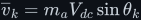
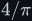
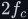

# Sinusoidal PWM (SPWM) inverters

Deep treatment of SPWM: how comparing a sine reference with a triangle carrier switches an
H-bridge so that its switching-cycle average is a sine; the derivation of
<!--m:D_k = (1 + m_a\sin\theta_k)/2--> and <!--m:\overline{v}_k = m_a V_{dc}\sin\theta_k-->; why raising the
carrier frequency gets the output closer to the reference (the question from video screenshots
22–23); the spectrum, the modulation index and overmodulation, bipolar vs. unipolar switching,
microcontroller lookup-table SPWM; the AD9833 + LM311 circuit from the video; and real numbers for
a 230 V inverter. Full argument in [spwm.md](spwm.md).

> **The thesis in one line**
>
> A straight-sided triangle turns the reference's value into a proportional on-time, so each
> carrier period's average output is one sample of <!--m:m_a V_{dc}\sin\theta-->; the carrier frequency is
> the sampling rate, and an LC filter turns the samples back into the sine.

## Contents

The treatment covers:

1. Where SPWM sits in the 12 V to 230 V inverter (fig-01).
2. From constant <!--m:D--> to a time-varying <!--m:D-->.
3. The reference, the triangle carrier, <!--m:m_a-->, <!--m:m_f--> and the comparator rule (fig-02).
4. **The core result**: <!--m:D_k = (1 + m_a\sin\theta_k)/2-->, so <!--m:\overline{v}_k = m_a V_{dc}\sin\theta_k--> (fig-03).
5. Why a faster carrier gets closer to the sine — <!--m:m_f--> = 2, 6, 21, 100 (fig-04).
6. Filtering: one LC filter against three carriers (fig-05).
7. Modulation index, the linear region and overmodulation to <!--m:4/\pi--> (fig-06).
8. The frequency ratio and the computed harmonic spectrum, sidebands at <!--m:m_f \pm 2--> (fig-07).
9. Bipolar vs. unipolar switching, three-level output, ripple at <!--m:2f_c--> (fig-08).
10. Natural vs. regular sampling; lookup-table SPWM in a microcontroller (fig-09).
11. The analogue build from the video: two AD9833 DDS generators and an LM311 comparator.
12. Practical numbers: 325 V vs. 400 V bus, a 20 kHz carrier, a 2 mH / 10 µF filter.
13. What this costs you.
14. Sources and cross-links.

Figures 71–79.

## Reading order

Read [../../pwm/](../../pwm/) first (duty cycle, the average, timers, dead time), and the
[H-bridge](../h-bridge/) for the switching states. Then [spwm.md](spwm.md), and the
[LC filter](../../filters/lc-filter/) that finishes the job.

## Links

- Style guide: [../../STYLE.md](../../STYLE.md)
- PWM: [../../pwm/](../../pwm/)
- The bridge: [../h-bridge/](../h-bridge/)
- The filter: [../../filters/lc-filter/](../../filters/lc-filter/)
- Spectra and RMS: [../../fundamentals/signals/](../../fundamentals/signals/)
