# Sinusoidal PWM — how a comparator and a triangle wave draw a sine

An inverter's output stage is an [H-bridge](../h-bridge/): four switches that can connect the load
to the DC bus one way round (<!--m:+V_{dc}--><!--/m-->), the other way round (<!--m:-V_{dc}-->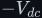<!--/m-->), or not at all. It cannot produce
230 V RMS of smooth sine directly; it can only switch. Sinusoidal PWM (SPWM) is the rule that decides
*when* to switch so that, once an LC filter has averaged away the switching, what is left is the
sine you asked for. This document derives that rule from scratch, explains the step in the video
that looks like magic (screenshots 22–23 of the notes, at 12:55–13:24: "as we raise the carrier frequency the average somehow
becomes the sine"), and puts real numbers on the 325 V inverter of the DC-to-AC project.

**Contents**

1. [Where this sits in the inverter](#1-where-this-sits-in-the-inverter)
2. [From constant D to a time-varying D](#2-from-constant-d-to-a-time-varying-d)
3. [The two signals and the comparator](#3-the-two-signals-and-the-comparator)
4. [The core result — the average follows the reference](#4-the-core-result--the-average-follows-the-reference)
5. [Why a faster carrier gets closer to the sine](#5-why-a-faster-carrier-gets-closer-to-the-sine)
6. [Filtering — what actually does the averaging](#6-filtering--what-actually-does-the-averaging)
7. [The modulation index — linear region and overmodulation](#7-the-modulation-index--linear-region-and-overmodulation)
8. [The frequency ratio and the harmonic spectrum](#8-the-frequency-ratio-and-the-harmonic-spectrum)
9. [Bipolar vs. unipolar switching on an H-bridge](#9-bipolar-vs-unipolar-switching-on-an-h-bridge)
10. [Natural vs. regular sampling — SPWM in a microcontroller](#10-natural-vs-regular-sampling--spwm-in-a-microcontroller)
11. [The analogue implementation from the video — AD9833 and LM311](#11-the-analogue-implementation-from-the-video--ad9833-and-lm311)
12. [Practical numbers for a 230 V inverter](#12-practical-numbers-for-a-230-v-inverter)
13. [What this costs you](#13-what-this-costs-you)
14. [Sources and cross-links](#14-sources-and-cross-links)

> **The thesis in one line**
>
> Within one carrier period a straight-sided triangle acts as a ruler: the comparator's on-time is
> proportional to the reference's value, so the switching-cycle average of the <!--m:\pm V_{dc}-->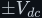<!--/m--> output is
> <!--m:m_a V_{dc}\sin\theta--><!--/m--> — a sampled copy of the sine, one sample per carrier period. More carrier
> periods per sine period means more samples, and a filter turns the samples back into the sine.

---

## 1 Where this sits in the inverter

The DC-to-AC project steps 12 V up to a 325 V DC bus (first H-bridge at 50 kHz, a transformer, a
[rectifier](../../rectifiers/)), then a *second* H-bridge turns that bus into AC, and an
[LC filter](../../filters/lc-filter/) smooths it into 230 V at 50 Hz. SPWM is the control signal for
that second bridge.

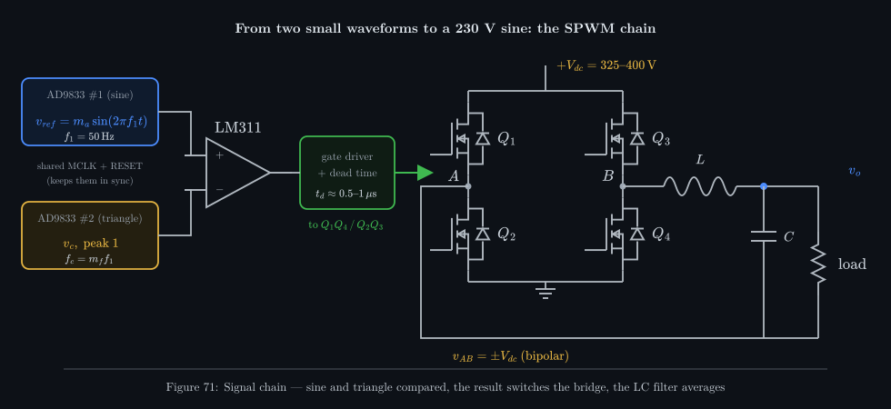

_The control side is three small chips: a sine generator, a triangle generator and a comparator. The
comparator's one-bit decision, through a gate driver that inserts dead time, chooses which diagonal
pair of the bridge conducts. Everything after the bridge is passive averaging._

## 2 From constant D to a time-varying D

Start from what the [PWM document](../../pwm/) proves. A switch that spends a fraction <!--m:D--><!--/m--> of each
period at one level and the rest at another has a switching-cycle average set by <!--m:D--><!--/m--> alone. For an
H-bridge that alternates between <!--m:+V_{dc}--><!--/m--> and <!--m:-V_{dc}--><!--/m--> the average is <!--m:(2D-1)V_{dc}-->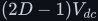<!--/m-->:
<!--m:D = 0.5--><!--/m--> gives 0 V, <!--m:D = 1--><!--/m--> gives <!--m:+V_{dc}--><!--/m-->, <!--m:D = 0--><!--/m--> gives <!--m:-V_{dc}--><!--/m-->.

A [buck converter](../../dc-dc-converters/buck/) holds <!--m:D--><!--/m--> fixed and gets a fixed output. Nothing
stops us changing <!--m:D--><!--/m--> from one switching period to the next. If we choose, for the *k*th period,
whatever duty makes the average equal to the sine's value at that moment, the sequence of averages
traces a sine. Video screenshots 14 and 15 (10:25–10:32) show exactly this on a buck: a fixed pulse pattern
gives a filtered triangle-ish output, a varying pulse pattern gives a filtered sine. The question
SPWM answers is: **how do we compute the right <!--m:D--><!--/m--> for every period, precisely and cheaply?** The
answer is that a comparator does it for free.

## 3 The two signals and the comparator

Two low-voltage waveforms are generated (video screenshot 16, 11:05):

**The reference** — the *shape* you want at the output, at exactly the output frequency:

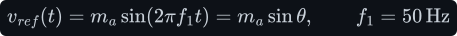

**The carrier** — a symmetric triangle of amplitude 1 and a much higher frequency <!--m:f_c-->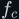<!--/m-->. It sets the
switching frequency; its shape is what makes the method work. Over one carrier period
<!--m:T_c = 1/f_c-->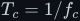<!--/m--> it is two straight lines:

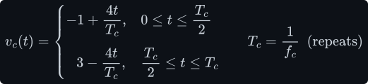

Two dimensionless numbers describe the pair:

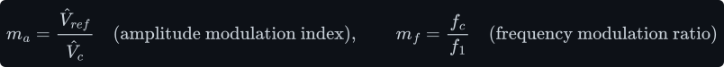

Both go into a **comparator** (video screenshots 18–20, 11:44–12:05), which answers one question only — *which input
is higher?* — and the answer drives the bridge:

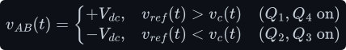

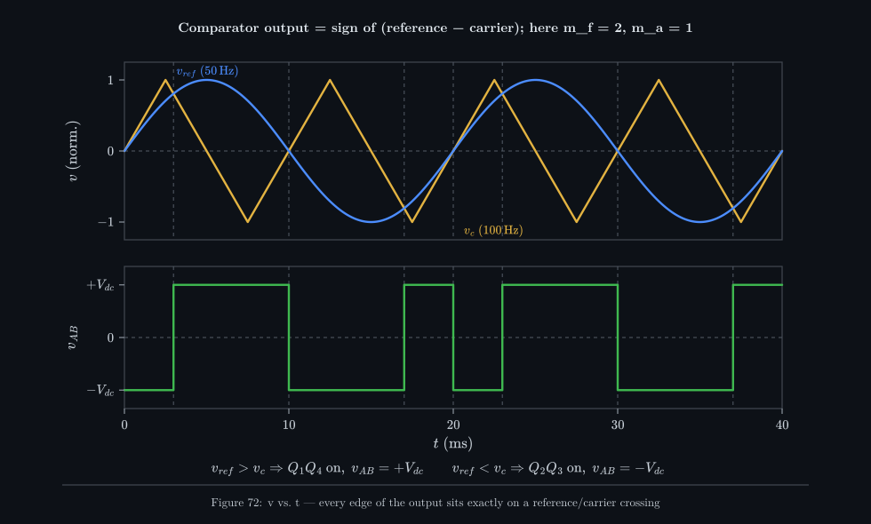

_The video's own example (screenshots 21–22, 12:42–12:55): a 50 Hz reference against a 100 Hz carrier, so
<!--m:m_f = 2-->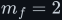<!--/m-->. Every edge of the output lies exactly under a crossing. With only two carrier periods per
sine period the output is a crude, lopsided square wave — nothing like a sine yet._

> **Note —** The comparator does not "know" anything about sines. It produces a stream of
> full-height pulses. All of the sine is hidden in *where* the edges fall, and the next section is
> about reading it back out.

## 4 The core result — the average follows the reference

This is the step to go through slowly, because everything else rests on it.

**Assumption.** The carrier is much faster than the reference, so during one carrier period the
reference barely moves. Call its value during period *k* simply <!--m:r-->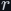<!--/m-->, a number between −1 and +1.
(§5 is about what happens when this assumption fails.)

**The intuition: the triangle is a ruler.** In one period the triangle sweeps the whole range from
−1 up to +1 and back down again, at a *constant speed*. A constant speed means it spends equal time
at every level. So the fraction of the period it spends *below* the level <!--m:r--><!--/m--> is just the fraction
of the range that lies below <!--m:r--><!--/m-->:

And "triangle below the reference" is exactly when the comparator outputs <!--m:+V_{dc}--><!--/m-->. That is the
whole idea. Now the same thing done with the equations, so nothing is taken on trust.

**The algebra.** Put the carrier period between two valleys. On the rising edge the triangle meets
the reference at <!--m:t_1--><!--/m-->; by symmetry it meets it again on the falling edge at <!--m:t_2-->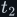<!--/m-->:

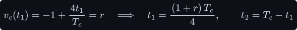

The output is high from the valley up to <!--m:t_1--><!--/m-->, and again from <!--m:t_2--><!--/m--> to the next valley:

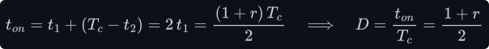

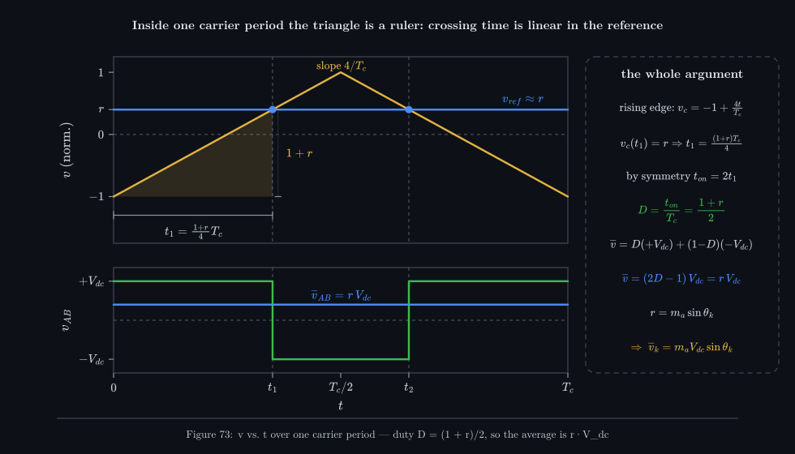

_The shaded triangle is similar to the whole rising edge: its height is <!--m:1 + r--><!--/m-->, out of a
total rise of 2, so its width <!--m:t_1--><!--/m--> is the same fraction of the half-period. Because the edge is a
straight line, the crossing time is a linear function of the reference._

Since <!--m:r--><!--/m--> is the reference's value during period *k*, write it as <!--m:r = m_a \sin\theta_k-->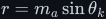<!--/m-->. The
duty cycle that the comparator produces, with no computation at all, is:

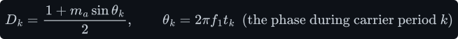

Now average the output over that period with the bipolar formula from the PWM document:

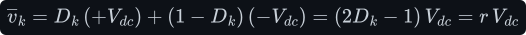

The ½ and the 1 cancel exactly — that is why the triangle is centred on zero with amplitude 1 —
leaving:

**The switching-cycle average of the output is the reference, scaled by** <!--m:V_{dc}-->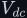<!--/m-->. Each carrier
period delivers one *sample* of the sine, encoded as a pulse width. This is the core idea behind
every SPWM inverter, and it holds for any reference shape, not just sines: the comparator turns
whatever voltage you feed it into a proportional average. Its fundamental amplitude follows
directly:

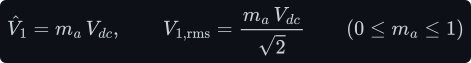

## 5 Why a faster carrier gets closer to the sine

The derivation assumed the reference is constant over a carrier period. How wrong is that? In one
carrier period the sine's phase advances by <!--m:2\pi/m_f-->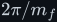<!--/m-->, so its value can change by up to:

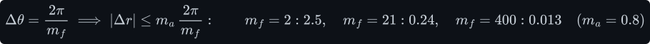

At <!--m:m_f = 2--><!--/m--> the reference swings by more than its whole range within a single carrier period —
there is no meaningful "value of the reference during this period", and the output is a poor copy.
At <!--m:m_f = 400--><!--/m--> (a 20 kHz carrier for a 50 Hz output) it changes by about 1 % of full scale, and each
pulse width is an excellent sample.

This is the answer to the question in video screenshots 22 and 23. The **carrier frequency is
the sampling rate**. One sine period contains <!--m:m_f-->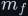<!--/m--> carrier periods, so the bridge gets <!--m:m_f--><!--/m-->
independent chances per cycle to set its average. Few samples give a coarse staircase; many samples
give a fine one that hugs the sine.

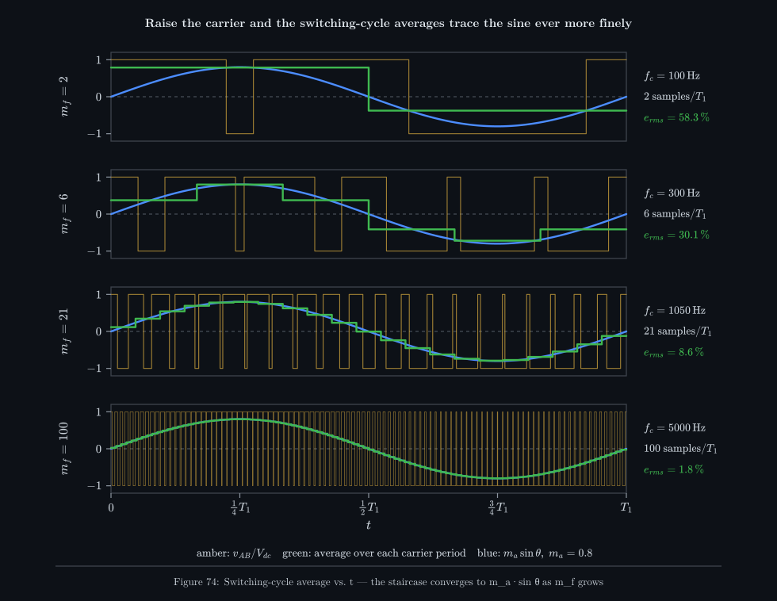

_Computed for <!--m:m_a = 0.8--><!--/m-->: the pulses (amber), the exact average over each carrier period (green
staircase) and the reference (blue). The green staircase is precisely what the video labels
"average". The RMS error between staircase and sine falls from 58 % at <!--m:m_f = 2--><!--/m--> to 8.6 % at 21
and 1.8 % at 100._

The video used 100, 200, 400 and 800 Hz carriers (<!--m:m_f--><!--/m--> = 2, 4, 8, 16); Figure 74 continues the
same sequence further. Notice two things in the top row. First, the staircase is lopsided and does
not even average the sine correctly over each window: with the reference moving that fast, the
"triangle as ruler" argument breaks down. Second, by <!--m:m_f = 21--><!--/m--> every step already sits on the
sine to within a few per cent. The error shrinks roughly in proportion to <!--m:1/m_f-->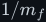<!--/m-->.

> **Tip —** The staircase is not something any circuit produces; it is the *ideal* local average.
> The physical averaging is done by the LC filter, which is never a perfect window-average — §6 shows
> what a real filter does with the same pulse trains.

## 6 Filtering — what actually does the averaging

The load must not see the pulses: the [LC filter](../../filters/lc-filter/) between the bridge and
the load is a low-pass that passes 50 Hz and blocks the switching frequency. Its job is easy or
hard depending on one ratio: how far above its corner <!--m:f_0--><!--/m--> the switching harmonics sit.

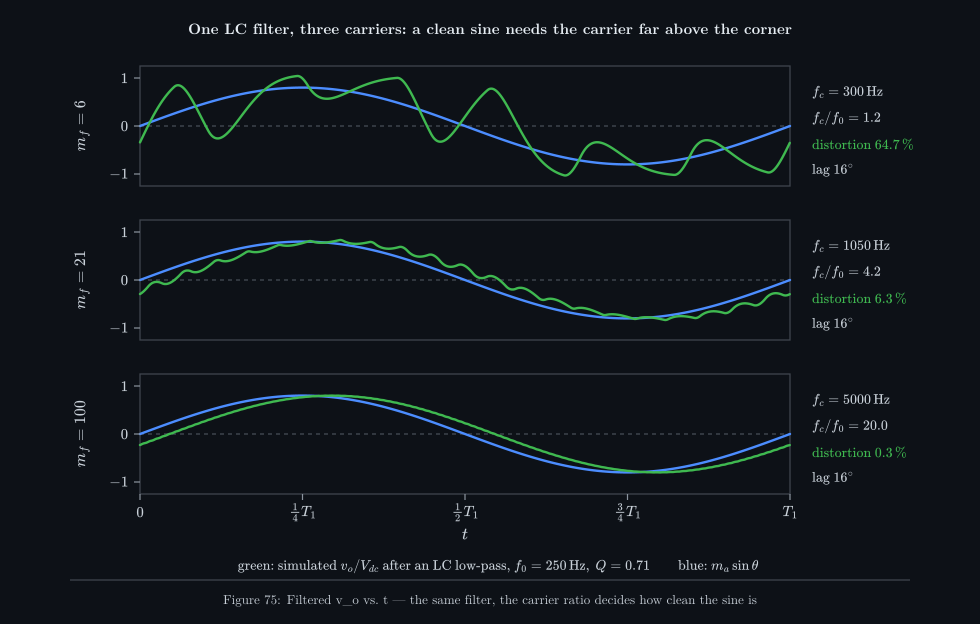

_One filter (corner 250 Hz, Q = 0.71) simulated against three carriers. At <!--m:m_f = 6-->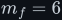<!--/m--> the carrier sits
almost on the corner and leaks straight through (65 % distortion). At 21 it is attenuated about
18-fold (6.3 %). At 100 the output is a clean sine (0.3 %). The fixed 16° lag is the filter's phase
shift at 50 Hz, the same in every row._

A second-order filter attenuates as <!--m:(f_0/f)^2-->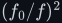<!--/m--> above its corner, so every factor of 10 in
carrier frequency buys a factor of 100 in ripple rejection — or, at equal ripple, a filter with
ten times smaller <!--m:L--><!--/m--> and <!--m:C--><!--/m-->. That is the practical reason to push <!--m:f_c--><!--/m--> up: the higher the
carrier, the further the harmonics are from 50 Hz, and the smaller, cheaper and lighter the filter
that separates them. It is also why the filter corner must sit well above 50 Hz (or it attenuates
and phase-shifts the output you want) and well below <!--m:f_c--><!--/m-->.

## 7 The modulation index — linear region and overmodulation

The amplitude modulation index <!--m:m_a-->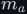<!--/m--> is the ratio of the reference's peak to the carrier's peak.
For <!--m:m_a \le 1--><!--/m--> the reference never leaves the triangle's range, every carrier period
contains two crossings, and the core result holds exactly: the fundamental is <!--m:m_a V_{dc}-->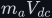<!--/m-->,
a straight line through the origin. This is the **linear region**.

Push <!--m:m_a > 1--><!--/m--> and near the sine's peaks the reference rises above the whole triangle. For
those carrier periods there are no crossings: the output stays at <!--m:+V_{dc}--><!--/m--> and pulses go missing
(*pulse dropping*). The average is clipped at <!--m:V_{dc}--><!--/m--> while the reference keeps climbing, so the
fundamental grows more slowly than <!--m:m_a--><!--/m--> and low-order harmonics (3rd, 5th, 7th — close to 50 Hz and
therefore hard to filter) appear. In the limit the output is a <!--m:\pm V_{dc}--><!--/m--> square wave, whose
fundamental is:

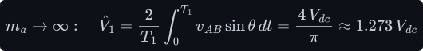

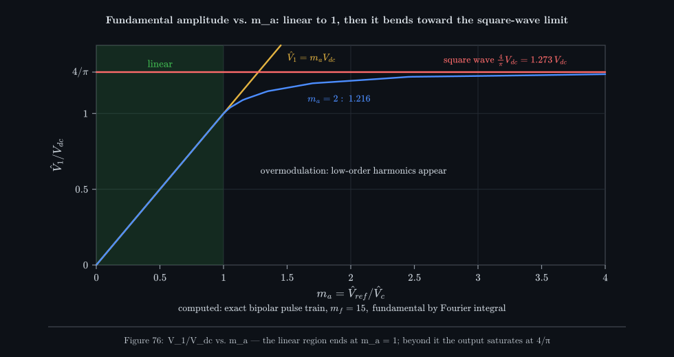

_The fundamental of the exact pulse train, computed at each <!--m:m_a--><!--/m-->. It follows <!--m:m_a V_{dc}--><!--/m--> exactly
up to 1, then bends over: <!--m:m_a = 2--><!--/m--> gives only <!--m:1.216\,V_{dc}-->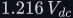<!--/m-->, and nothing ever exceeds <!--m:1.273\,V_{dc}-->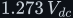<!--/m-->. The
small kinks are individual pulses dropping out._

So overmodulation buys up to 27 % more output voltage from the same bus, at the cost of distortion
your filter cannot remove. Designs that need a clean sine stay in the linear region and size the
bus so that <!--m:m_a \approx 0.8\text{–}0.9--><!--/m--> at full output.

## 8 The frequency ratio and the harmonic spectrum

Where does the energy that is not 50 Hz go? Because the output is a pulse train repeating once per
50 Hz period, its spectrum contains only multiples of 50 Hz, and the exact amplitudes can be computed
from the switching instants. The result is clean: the harmonics are bunched in **clusters around
the carrier frequency and its multiples**, with sidebands spaced at twice the output frequency.

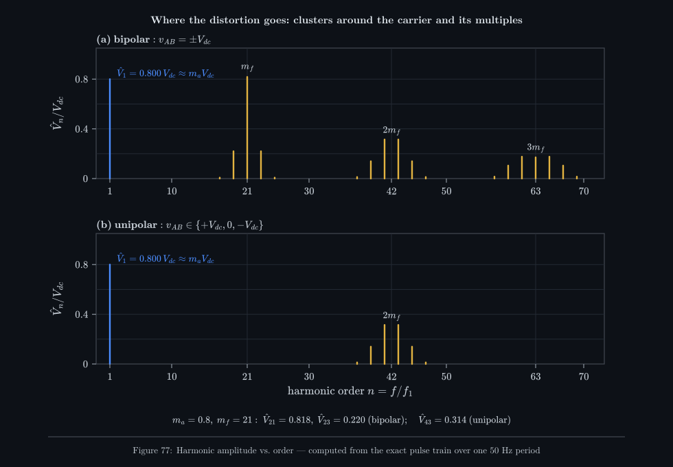

_The exact Fourier amplitudes of one 50 Hz period at <!--m:m_a = 0.8--><!--/m-->, <!--m:m_f = 21--><!--/m-->. The fundamental is
<!--m:0.800\,V_{dc}-->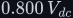<!--/m--> as §4 predicts. Nothing appears below order 17: the whole region from 50 Hz up to near the
carrier is empty. That gap is what lets a filter work._

For bipolar SPWM, harmonics appear only at orders:

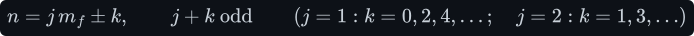

and their amplitudes have a closed form in Bessel functions (Black's double-Fourier analysis; see
Holmes and Lipo in §14). <!--m:J_k-->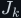<!--/m--> is the Bessel function of the first kind of order <!--m:k--><!--/m-->, a standard
tabulated function, <!--m:J_k(x) = \tfrac1\pi\int_0^\pi \cos(k\tau - x\sin\tau)\,d\tau-->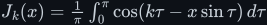<!--/m-->; it appears because
the pulse edges move sinusoidally, and the Fourier coefficients of a sinusoidally shifted edge are
exactly these integrals:

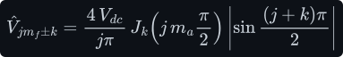

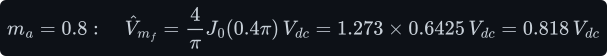

The computed spectrum in Figure 77 gives 0.818 at order 21 and 0.220 at orders 19 and 23 — matching
the formula and the standard textbook table.

**Choosing** <!--m:m_f--><!--/m-->. Three conventions follow from the spectrum:

- **Integer (synchronous).** If <!--m:m_f--><!--/m--> is not an integer, the carrier slides relative to the sine
  from cycle to cycle and produces *subharmonics* below 50 Hz, which no filter can remove. For small
  <!--m:m_f--><!--/m--> (below about 21) the carrier must be locked to the reference.
- **Odd.** With an odd integer <!--m:m_f--><!--/m--> and a valley-aligned carrier, the bipolar output has half-wave
  symmetry, so even harmonics vanish. (For three-phase inverters, also a multiple of 3, so the
  carrier-frequency harmonics cancel in the line voltages.)
- **Large.** Above roughly <!--m:m_f = 21--><!--/m--> the subharmonics from an asynchronous carrier are tiny, so
  real inverters simply run a fixed 10–20 kHz carrier with <!--m:m_f--><!--/m--> in the hundreds and do not bother
  to lock it.

## 9 Bipolar vs. unipolar switching on an H-bridge

So far the bridge has been switched **bipolar**: one comparator, diagonal pairs swapping, output
always <!--m:\pm V_{dc}--><!--/m-->. An [H-bridge](../h-bridge/) has two legs, and each can be switched on its own.

**Unipolar** SPWM gives each leg its own reference: leg A compares <!--m:+v_{ref}--><!--/m--> with the carrier,
leg B compares <!--m:-v_{ref}--><!--/m--> (the same sine shifted 180°). Each leg output is 0 or <!--m:V_{dc}--><!--/m-->, and
the load sees their difference. Applying the core result to each leg (a leg switching between 0 and <!--m:V_{dc}--><!--/m--> averages to
<!--m:V_{dc}(1+r)/2-->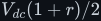<!--/m-->):

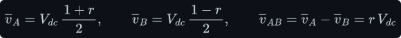

The same average as bipolar, so the same fundamental. What changes is the ripple.

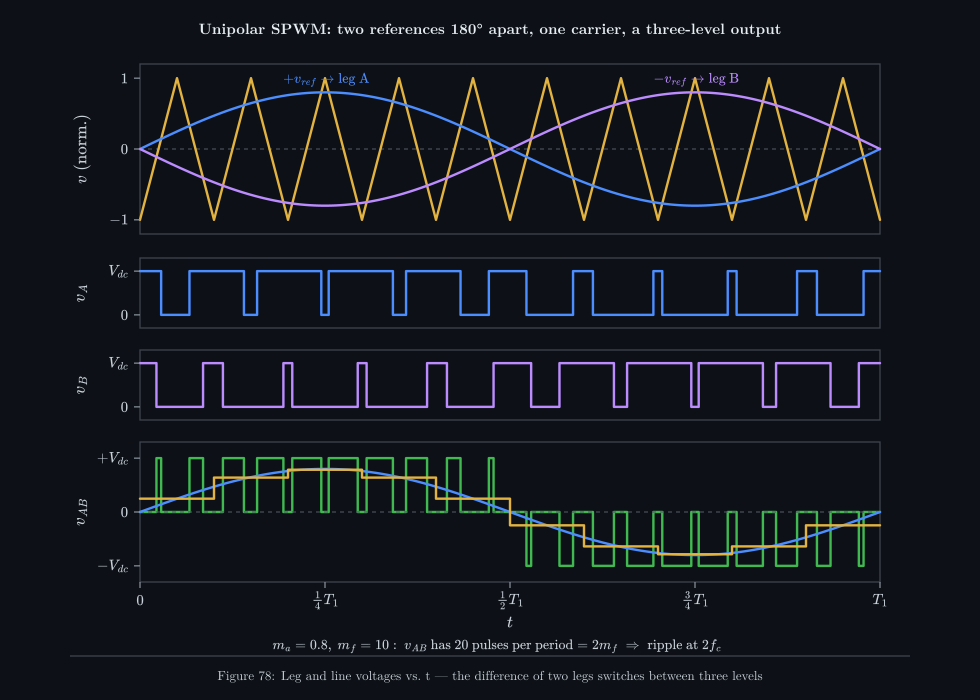

_During the positive half-cycle the line voltage switches between <!--m:+V_{dc}--><!--/m--> and 0, never to
<!--m:-V_{dc}--><!--/m-->; in the negative half between 0 and <!--m:-V_{dc}--><!--/m-->. Each carrier period now contains two output
pulses — one from each leg's edge — so the ripple repeats at twice the carrier frequency._

Three advantages follow. **Three levels:** the voltage steps are <!--m:V_{dc}--><!--/m--> instead of
<!--m:2V_{dc}-->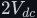<!--/m-->, halving the ripple amplitude and the <!--m:dv/dt--><!--/m--> stress. **Effective frequency
<!--m:2 f_c-->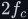<!--/m-->:** the odd-<!--m:j--><!--/m--> clusters cancel between the legs, leaving only:

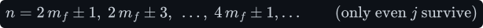

— visible in Figure 77(b), where the cluster at <!--m:m_f--><!--/m--> has vanished and the largest harmonic is
<!--m:0.314\,V_{dc}-->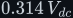<!--/m--> at order 43. **Smaller filter:** with the first cluster an octave higher and a third of the
amplitude, the same LC filter leaves several times less ripple (worked in §12). The costs are two
comparators (or two timer channels) instead of one, and a slightly more complex gate-drive pattern.
Most commercial single-phase inverters use unipolar switching for these reasons.

## 10 Natural vs. regular sampling — SPWM in a microcontroller

Everything so far is **natural sampling**: the live analogue sine is compared with the triangle, and
each edge falls exactly where they cross. A microcontroller cannot do that — it has no continuous
sine — so it uses **regular (sampled) SPWM**: it samples the sine once per carrier period, holds that
value, and compares the *held* value with the carrier. With the held value constant across the
period, the §4 derivation becomes exact rather than approximate: <!--m:D_k = (1 + r_k)/2--><!--/m--> with
<!--m:r_k = m_a\sin(2\pi k/m_f)--><!--/m-->.

_Top: the held samples (green) are what the timer actually compares with its up-down count. The
two pulse trains differ only slightly. The fundamental drops from <!--m:0.800--><!--/m--> to <!--m:0.786\,V_{dc}--><!--/m--> at this very
low <!--m:m_f = 9--><!--/m--> because holding a sample delays it by half a carrier period on average; at
<!--m:m_f = 400--><!--/m--> the difference is negligible._

In practice this is a **lookup table** and a timer in centre-aligned mode (its up-down counter *is*
the triangle carrier — see the PWM document, §6). Precompute <!--m:N = f_c/f_1--><!--/m--> compare values for one
sine period, and at every timer update load the next one into CCR (usually by DMA, so the CPU is
not involved):

An 84 MHz timer at a 20 kHz carrier has 2100 counts (11 bits) of duty resolution and needs a
400-entry table. The digital approach makes several things trivial that are awkward in analogue:
<!--m:m_a--><!--/m--> is a multiplier in software (so output-voltage regulation is a control loop changing one
number), the carrier is automatically synchronous, dead time is a timer register, and unipolar
switching is a second channel with the table read in antiphase.

## 11 The analogue implementation from the video — AD9833 and LM311

The video builds the control signal from discrete parts (screenshots 17–20). They are real,
widely available ICs:

**AD9833 (Analog Devices) — programmable waveform generator.** The chip in video screenshot 17 (11:31) is
marked AD9833. It is a *direct digital synthesis* (DDS) generator in a 10-lead MSOP package: a
28-bit phase accumulator steps through a sine lookup table at the master clock rate (MCLK, up to
25 MHz), and a 10-bit DAC turns the result into a voltage. Configured over a 3-wire SPI interface at
start-up, it outputs a **sine, a triangle or a square** wave, which is why the video uses one chip
for the reference and a second, identical chip for the carrier (screenshot 18). The frequency is set by
a 28-bit register:

Its output is small — about 0.6 V peak-to-peak. The video's "about 0.3 V peak" is that swing
described about its midpoint; on the real pin the waveform does not swing around 0 V but rides on a
DC offset of roughly 0.3 V (from about 38 mV to 0.65 V). Because both chips share the same offset,
comparing them directly still works: the offsets cancel at the comparator.

**LM311 — voltage comparator** (video screenshots 19–20). A classic single comparator with an
open-collector output (it needs a pull-up resistor, and can pull up to a different supply than its
own, convenient for driving gate-driver logic) and a response time of about 200 ns. It outputs high
when its + input (the sine) is above its − input (the triangle), exactly the rule of §3.

Honest notes on this analogue chain, none of which the video mentions:

- **<!--m:m_a--><!--/m--> is fixed at about 1 by default.** Both AD9833s produce the same amplitude whether set to
  sine or triangle, so sine peak equals triangle peak — <!--m:m_a = 1--><!--/m-->, the very edge of the
  linear region (§7). The chip has no amplitude control; setting <!--m:m_a = 0.8--><!--/m--> needs an
  attenuator on the sine (around its offset) or a digital potentiometer. Regulating the output
  voltage against load changes means adjusting that attenuator in a loop.
- **Synchronising the two chips.** Two independent DDS chips on separate clocks drift relative to
  each other, giving an asynchronous carrier. Clock both from the *same* MCLK, start them with the
  same RESET, and choose the carrier tuning word as an exact integer multiple of the sine's:

  The output is then 50.012 Hz rather than exactly 50 Hz (the price of a 0.093 Hz step), but the
  ratio is exactly 400.
- **Chatter at the crossings.** Near a crossing the two inputs differ by millivolts, and noise makes
  a fast comparator toggle several times. A little hysteresis (a large resistor from output to the +
  input) gives one clean edge per crossing.
- **The comparator gives one signal; the bridge needs four.** A gate driver must produce the
  complementary high/low-side signals and insert dead time (the PWM document, §9). Half-bridge driver
  ICs with built-in dead time (the IR2104 family, about 0.5 µs) or an RC delay network do this.

## 12 Practical numbers for a 230 V inverter

**The modulation index.** 230 V RMS means a peak of:

The video's 325 V bus requires <!--m:m_a \approx 1.0--><!--/m--> — **zero headroom**. Real losses then push it
into overmodulation: switch and diode drops, the dead-time error (about 13 V at 325 V with the
numbers below), the filter inductor's drop at full load, and the bus's own 100 Hz ripple and
sag under load all subtract from the 325 V. The output would come out low and distorted at load.
Practical 230 V inverters use a **350–400 V** bus (a slightly higher transformer ratio in the
first stage) so that full output needs only <!--m:m_a \approx 0.8\text{–}0.9--><!--/m-->, leaving room for the
regulator to compensate for load and supply changes.

**The carrier.** Typically 10–20 kHz for IGBT or MOSFET bridges at this power: high enough that the
filter is small and (at the top end) above hearing, low enough to keep switching losses modest. At
20 kHz, <!--m:m_f = 400--><!--/m-->: 400 samples per sine period.

**The filter.** Take <!--m:L = 2\,\mathrm{mH}--><!--/m--> and <!--m:C = 10\,\mu\mathrm{F}--><!--/m-->:

The corner sits 22 times above 50 Hz (so the fundamental passes almost untouched) and 18 times below
the carrier. With a 400 V bus at <!--m:m_a = 0.8--><!--/m-->, the largest carrier harmonic left on the output
is:

About 1 V of 20 kHz ripple on 325 V peak with bipolar switching; about 0.1 V with unipolar — the
same parts, ten times cleaner. The filter has its own running costs. A capacitor's current amplitude is <!--m:\omega C--><!--/m--> times its
voltage amplitude, and an inductor's voltage amplitude is <!--m:\omega L--><!--/m--> times its current amplitude
(the impedances of [../../filters/lc-filter/lc-filter.md §2](../../filters/lc-filter/lc-filter.md#2-two-laws-read-as-smoothing-rules)),
so in RMS terms the capacitor draws
<!--m:230 \times 2\pi \cdot 50 \times 10\,\mu\mathrm{F} \approx 0.72\,\mathrm{A}--><!--/m--> of reactive current
even with no load, and at 1 kW (4.35 A) the inductor drops
<!--m:2\pi \cdot 50 \times 2\,\mathrm{mH} \times 4.35\,\mathrm{A} \approx 2.7\,\mathrm{V}--><!--/m-->.

## 13 What this costs you

- **Switching losses scale with the carrier.** Each switch loses energy at every edge; roughly:

  At 20 kHz that is a few watts for the bridge at 1 kW; at 100 kHz it is five times more, plus gate
  drive. A higher carrier buys a smaller filter with heat.
- **Dead-time distortion.** Every carrier period loses (or gains, depending on the current's
  direction) a slice <!--m:t_d--><!--/m--> of each leg's pulse. The error is a square wave in phase with the load
  current:

  It flattens the sine near every current zero crossing and adds 3rd, 5th and 7th harmonics that the
  filter passes. It grows with <!--m:f_c--><!--/m-->, so it is another price of a fast carrier; digital controllers
  compensate by adding <!--m:\pm t_d--><!--/m--> to each CCR according to the measured current sign.
- **EMI.** The bridge slews hundreds of volts in tens of nanoseconds, tens of thousands of times a
  second. That couples through stray capacitance to the heatsink and earth (common-mode noise) and
  radiates. Unipolar switching halves the step size; layout, snubbers and an EMI filter do the rest.
- **Audible noise.** Carriers below about 20 kHz make the filter inductor and transformer
  magnetostrict and whine at <!--m:f_c--><!--/m--> (and at <!--m:2f_c--><!--/m--> with unipolar). Many low-cost inverters sit
  at 16–20 kHz and are faintly audible.
- **No headroom without a bigger bus.** The linear region tops out at <!--m:\hat V_1 = V_{dc}--><!--/m-->. A
  230 V output needs comfortably more than 325 V of bus (§12); overmodulation is a last resort that
  trades voltage for low-order distortion.
- **Low <!--m:m_f--><!--/m--> needs care.** Below about 21 the carrier must be synchronous and odd, or
  subharmonics appear that no filter can remove — the analogue two-chip circuit must share a clock to
  achieve this.

## 14 Sources and cross-links

- PWM itself — duty cycle, the average, timers, the spectrum, dead time: [../../pwm/](../../pwm/).
- The bridge that SPWM drives, and its switching states: [../h-bridge/](../h-bridge/).
- The filter that recovers the sine: [../../filters/lc-filter/](../../filters/lc-filter/).
- Fourier series, spectra and RMS: [../../fundamentals/signals/](../../fundamentals/signals/).
- Where the 325 V bus comes from: [../../rectifiers/](../../rectifiers/),
  [../../fundamentals/transformer/](../../fundamentals/transformer/).
- The constant-D version of the same averaging: [../../dc-dc-converters/buck/](../../dc-dc-converters/buck/).
- N. Mohan, T. Undeland, W. Robbins, *Power Electronics: Converters, Applications and Design*,
  3rd ed., ch. 8 (switch-mode DC–AC inverters; the harmonic table for <!--m:m_a = 0.8--><!--/m--> that
  Figure 77 reproduces).
- D. G. Holmes, T. A. Lipo, *Pulse Width Modulation for Power Converters*, IEEE Press/Wiley, 2003
  (natural and regular sampling, the Bessel-function harmonic solution).
- Analog Devices, *AD9833 Low Power, Programmable Waveform Generator* data sheet; Texas Instruments,
  *LM311 Differential Comparator* data sheet.
- Source video: *DC to AC* (`Power_Supply/Videos/DC_to_AC_1.mp4`), SPWM section ≈ 10:25–16:45.
- Style and figure conventions: [../../STYLE.md](../../STYLE.md).
