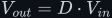

# DC-DC converters — buck and boost

Two switching circuits that change one DC voltage into another with (ideally) no loss, built
from the same four parts — a switch, a diode, an inductor, and a capacitor — wired in two orders.
Everything here is the two [fundamental laws](../fundamentals/) applied to a circuit that turns a
switch on and off tens of thousands of times a second.

> **The thesis in one line**
>
> In steady state the average voltage across the inductor over one full cycle must be exactly
> zero (*volt-second balance*). That single fact derives both step ratios — <!--m:V_{out} = D \cdot V_{in}--><!--/m--> for
> the buck and <!--m:V_{out} = V_{in}/(1-D)--><!--/m--> for the boost.

_The same four parts, reordered: switch-then-inductor steps down, inductor-then-switch steps up.
For a comparable ripple spec the boost needs roughly 3× the inductance and 3× the capacitance —
a consequence of the derivations, not a coincidence._

## Documents

| Subtopic | Result | What it covers |
|---|---|---|
| [buck/](buck/) | <!--m:V_{out} = D \cdot V_{in}--><!--/m--> | ON/OFF vocabulary, the two switching intervals, volt-second balance derived, inductor sizing, output-capacitor sizing from the triangle-charge argument, worked numbers |
| [boost/](boost/) | <!--m:V_{out} = V_{in}/(1-D)--><!--/m--> | the same method with the intervals swapped, and the genuinely-different output-capacitor sizing (the cap feeds the load alone while the switch is on) |
| [buck/startup.md](buck/startup.md), [boost/startup.md](boost/startup.md) | from 0 V to steady state | how each converter starts up: the cycle-by-cycle climb, the averaged LC step and its settling time, buck overshoot and boost inrush, the no-load boost runaway, soft-start, the real gain limit, and efficiency versus step ratio |

## Reading order

Do the [fundamentals](../fundamentals/) first — the converter maths assumes you already know
that a constant voltage across an inductor makes a straight current ramp. Then:

1. [buck/buck.md](buck/buck.md) — the step-down, derived from scratch.
2. [boost/boost.md](boost/boost.md) — the step-up, same method, mirror intervals.
3. [buck/startup.md](buck/startup.md) and [boost/startup.md](boost/startup.md) — what happens
   before steady state: how the output climbs from zero, and what soft-start is for.

The output LC of the buck is treated as a filter in its own right in
[../filters/lc-filter/](../filters/lc-filter/).

## Conventions

Follows [../STYLE.md](../STYLE.md). Switch **ON = closed = conducting**; switch **OFF = open**.
<!--m:D--><!--/m--> is the duty cycle (the fraction of each period the switch is ON) and <!--m:T--><!--/m--> is the period of one
full switching cycle, so <!--m:f_{sw} = 1/T--><!--/m-->.
