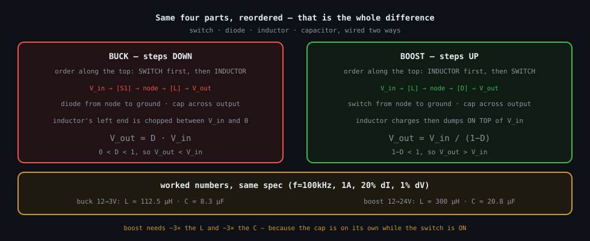

# DC-DC converters — buck and boost

Two switching circuits that change one DC voltage into another with (ideally) no loss, built
from the same four parts — a switch, a diode, an inductor, and a capacitor — wired in two orders.
Everything here is the two [fundamental laws](../fundamentals/) applied to a circuit that turns a
switch on and off tens of thousands of times a second.

> **The thesis in one line**
>
> In steady state the average voltage across the inductor over one full cycle must be exactly
> zero (*volt-second balance*). That single fact derives both step ratios — `V_out = D·V_in` for
> the buck and `V_out = V_in/(1−D)` for the boost.

_The same four parts, reordered: switch-then-inductor steps down, inductor-then-switch steps up.
For a comparable ripple spec the boost needs roughly 3× the inductance and 3× the capacitance —
a consequence of the derivations, not a coincidence._

## Documents

| Subtopic | Result | What it covers |
|---|---|---|
| [buck/](buck/) | `V_out = D·V_in` | ON/OFF vocabulary, the two switching intervals, volt-second balance derived, inductor sizing, output-capacitor sizing from the triangle-charge argument, worked numbers |
| [boost/](boost/) | `V_out = V_in/(1−D)` | the same method with the intervals swapped, and the genuinely-different output-capacitor sizing (the cap feeds the load alone while the switch is on) |

## Reading order

Do the [fundamentals](../fundamentals/) first — the converter maths assumes you already know
that a constant voltage across an inductor makes a straight current ramp. Then:

1. [buck/buck.md](buck/buck.md) — the step-down, derived from scratch.
2. [boost/boost.md](boost/boost.md) — the step-up, same method, mirror intervals.

## Conventions

Follows [../STYLE.md](../STYLE.md). Switch **ON = closed = conducting**; switch **OFF = open**.
`D` is the duty cycle (the fraction of each period the switch is ON) and `T` is the period of one
full switching cycle, so `f_sw = 1/T`.
