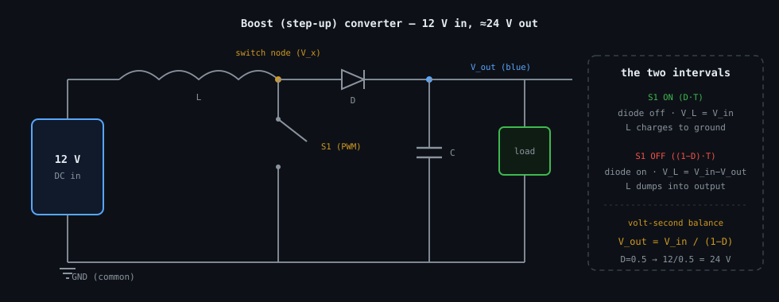
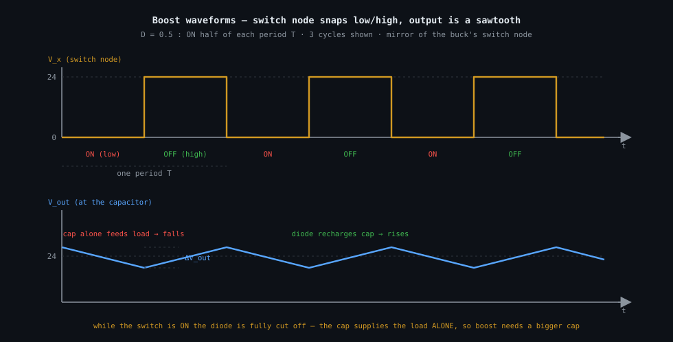

# The boost converter — where `V_out = V_in/(1−D)` comes from

A boost converter steps a DC voltage *up* — 12 V in, 24 V out — using the very same four parts as
the [buck](../buck/buck.md), just reordered: the inductor comes first, and the switch shorts the
switch node to ground. The step-up ratio is derived by the same volt-second balance; only the two
intervals swap roles.

**Contents**

1. [The circuit](#1-the-circuit)
2. [The two intervals](#2-the-two-intervals)
3. [Volt-second balance — the step-up ratio](#3-volt-second-balance--the-step-up-ratio)
4. [Sizing the inductor](#4-sizing-the-inductor)
5. [Sizing the output capacitor](#5-sizing-the-output-capacitor)
6. [Worked numbers — 12 V to 24 V](#6-worked-numbers--12-v-to-24-v)
7. [What this costs you](#7-what-this-costs-you)
8. [Sources and cross-links](#8-sources-and-cross-links)

> **The thesis in one line**
>
> When the switch opens, the inductor's voltage flips sign and adds *on top of* `V_in` — that
> reversal, forced by volt-second balance, is what pushes the output above the input.

---

## 1 The circuit



_Inductor first, then the 🟠 switch node; the switch **S1** shorts that node to ground, and a diode
carries current on to the 🔵 output. Same four parts as the buck, wired in a different order._

Same vocabulary as the buck: **ON = closed**, `D` is the fraction of each period `T` the switch is
ON, `f_sw = 1/T`. The one new idea you need is the inductor's **polarity flip**: when its current
is forced to fall, `V_L` changes sign and the inductor behaves like a battery in series with the
source (see [../../fundamentals/inductor/inductor.md §4](../../fundamentals/inductor/inductor.md#4-polarity-lenz-and-the-sign-flip)).

## 2 The two intervals

**Interval 1 — switch ON, lasting `D·T`.** S1 shorts the switch node to ground, so the inductor sits
straight across the input and the diode is reverse-biased (off). The inductor sees the full input:

$$V_L = V_{in} \quad(\text{constant, positive})$$

so its current ramps **up**, storing energy:

$$\Delta I_L(\text{rise}) = \frac{V_{in}\,D\,T}{L}$$

**Interval 2 — switch OFF, lasting `(1−D)·T`.** The switch path vanishes; the inductor's current
can't stop, so it forces the diode on and flows into the output. Its voltage flips so that the
switch-node end rises to `V_out` (which is above `V_in`). The inductor now sees:

$$V_L = V_{in} - V_{out} \quad(\text{constant, negative, since } V_{out} > V_{in})$$

so its current ramps **down**:

$$\Delta I_L(\text{fall}) = \frac{(V_{out}-V_{in})\,(1-D)\,T}{L}$$

## 3 Volt-second balance — the step-up ratio

Same steady-state argument as the buck: the rise must exactly cancel the fall, or the current would
drift forever. Set `rise = fall`:

```text
V_in·D·T / L   =   (V_out − V_in)·(1 − D)·T / L        rise = fall  (steady state)

  cancel T and L:
     V_in·D            =   (V_out − V_in)·(1 − D)
     V_in·D            =   V_out·(1 − D) − V_in·(1 − D)
     V_in·D + V_in·(1 − D) = V_out·(1 − D)
     V_in              =   V_out·(1 − D)                V_in·D + V_in·(1−D) = V_in
```

$$\boxed{\,V_{out} = \frac{V_{in}}{1-D}\,}$$

Since `1 − D < 1`, the output is always *above* the input — a step-up. As `D → 1` the ratio blows
up (in an ideal model), which is why real boosts keep `D` well below 1.

## 4 Sizing the inductor

From the ON-interval rise, with a target ripple `ΔI_L` and `T = 1/f_sw`:

$$L = \frac{V_{in}\,D}{f_{sw}\,\Delta I_L}$$

## 5 Sizing the output capacitor

This is where the boost genuinely differs from the buck. **While the switch is ON, the diode is
completely cut off** — so for that whole interval the capacitor is the *only* thing feeding the
load. No recharging happens until the switch opens again.



_While the switch is ON the diode is off and the 🔵 output voltage falls in a straight line as the
capacitor alone supplies the load; when the switch opens the diode recharges it. That "cap on its
own" interval is why a boost needs a bigger output capacitor than a buck._

During the ON interval the capacitor discharges at (roughly) the constant load current `I_load`.
Using `I_C = C·dV/dt` with `I_C = −I_load` held over the interval `D·T`:

```text
I_C = C · dV/dt,  with I_C = −I_load constant over the ON interval D·T

ΔV_out = I_load·D·T / C                    the straight-line droop while the diode is off
  ⇒  C  = I_load·D / (f_sw·ΔV_out)           solve for C, T = 1/f_sw
```

$$C = \frac{I_{load}\,D}{f_{sw}\,\Delta V_{out}}$$

## 6 Worked numbers — 12 V to 24 V

Same spec as the buck: `f_sw = 100 kHz` (`T = 10 µs`), 1 A load, 20 % current ripple, 1 % output
ripple. With `V_in = 12 V`, `V_out = 24 V`: from `V_out = V_in/(1−D)`, `1 − D = 12/24 = 0.5`, so
`D = 0.5`.

```text
ΔI_L = 20% of 1 A = 0.2 A

L = V_in·D / (f_sw·ΔI_L)
  = 12·0.5 / (100_000 · 0.2)
  = 6 / 20_000
  = 300 µH

ΔV_out = 1% of 24 V = 0.24 V

C = I_load·D / (f_sw·ΔV_out)
  = 1·0.5 / (100_000 · 0.24)
  = 0.5 / 24_000
  ≈ 20.8 µF
```

Compare with the buck (`L = 112.5 µH`, `C = 8.3 µF`) at a comparable spec:

| Quantity | Buck (12→3 V) | Boost (12→24 V) | Boost / Buck |
|---|---|---|---|
| Inductance `L` | 112.5 µH | 300 µH | ≈ 2.7× |
| Output cap `C` | 8.3 µF | 20.8 µF | ≈ 2.5× |

> **📝 Note —** The boost needs roughly **3× the inductance and 3× the capacitance** for the same
> ripple spec. That is not a coincidence — it is the direct, quantitative consequence of §5: the
> capacitor carries the load alone for a whole interval, so it has to be larger.

## 7 What this costs you

- **Bigger output capacitor, unavoidably.** §5 is the reason; there is no wiring trick around it,
  only better capacitor technology (lower ESR, higher capacitance density).
- **No inherent short-circuit protection.** Unlike a buck, a boost has a direct DC path from input
  to output through the inductor and diode, so it cannot limit output current by turning the switch
  off — a shorted output pulls current straight through.
- **High duty cycles are dangerous.** As `D → 1` the ratio `1/(1−D)` runs away and peak currents
  soar; practical boosts avoid very high `D`.
- **Same ideal-parts caveat as the buck** (§7 there): diode drop, capacitor ESR, and core losses
  all shift the real numbers.

## 8 Sources and cross-links

- The polarity flip that makes step-up possible:
  [../../fundamentals/inductor/inductor.md §4](../../fundamentals/inductor/inductor.md#4-polarity-lenz-and-the-sign-flip).
- The buck derivation this mirrors: [../buck/buck.md §3](../buck/buck.md#3-volt-second-balance--the-step-down-ratio).
- The capacitor law behind §5:
  [../../fundamentals/capacitor/capacitor.md §4](../../fundamentals/capacitor/capacitor.md#4-from-the-law-to-the-ramp).
- Style and figure conventions: [../../STYLE.md](../../STYLE.md).
