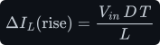
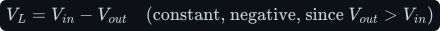
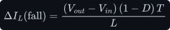
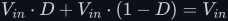
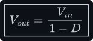
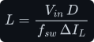
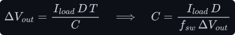
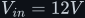
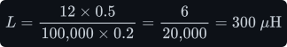
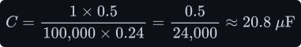

# The boost converter — where V_out = V_in/(1−D) comes from

A boost converter steps a DC voltage *up* — 12 V in, 24 V out — using the very same four parts as
the [buck](../buck/buck.md), just reordered: the inductor comes first, and the switch shorts the
switch node to ground. The step-up ratio is derived by the same volt-second balance; only the two
intervals swap roles.

**Contents**

1. [The circuit](#1-the-circuit)
2. [The two intervals](#2-the-two-intervals)
3. [Volt-second balance — the step-up ratio](#3-volt-second-balance--the-step-up-ratio)
4. [Sizing the inductor](#4-sizing-the-inductor)
5. [Sizing the output capacitor](#5-sizing-the-output-capacitor)
6. [Worked numbers — 12 V to 24 V](#6-worked-numbers--12-v-to-24-v)
7. [What this costs you](#7-what-this-costs-you)
8. [Sources and cross-links](#8-sources-and-cross-links)

> **The thesis in one line**
>
> When the switch opens, the inductor's voltage flips sign and adds *on top of* <!--m:V_{in}--><!--/m--> — that
> reversal, forced by volt-second balance, is what pushes the output above the input.

---

## 1 The circuit

_Inductor first, then the switch node; the switch **S1** shorts that node to ground, and a diode
carries current on to the output. Same four parts as the buck, wired in a different order._

Same vocabulary as the buck: **ON = closed**, <!--m:D--><!--/m--> is the fraction of each period <!--m:T--><!--/m--> the switch is
ON, <!--m:f_{sw} = 1/T--><!--/m-->. The one new idea you need is the inductor's **polarity flip**: when its current is
forced to fall, <!--m:V_L--><!--/m--> changes sign and the inductor behaves like a battery in series with the source
(see [../../fundamentals/inductor/inductor.md §4](../../fundamentals/inductor/inductor.md#4-polarity-lenz-and-the-sign-flip)).

## 2 The two intervals

**Interval 1 — switch ON, lasting <!--m:D \cdot T--><!--/m-->.** S1 shorts the switch node to ground, so the inductor sits
straight across the input and the diode is reverse-biased (off). The inductor sees the full input:

so its current ramps **up**, storing energy:

**Interval 2 — switch OFF, lasting <!--m:(1-D) \cdot T--><!--/m-->.** The switch path vanishes; the inductor's current
can't stop, so it forces the diode on and flows into the output. Its voltage flips so the switch-node
end rises to <!--m:V_{out}--><!--/m--> (above <!--m:V_{in}--><!--/m-->). The inductor now sees:

so its current ramps **down**:

## 3 Volt-second balance — the step-up ratio

Same steady-state argument as the buck: the rise must exactly cancel the fall, or the current would
drift forever. Set <!--m:\text{rise} = \text{fall}--><!--/m--> and cancel <!--m:T--><!--/m--> and <!--m:L--><!--/m-->:

Expand and collect — the <!--m:V_{in} \cdot D--><!--/m--> terms cancel and <!--m:V_{in} \cdot D + V_{in} \cdot (1-D) = V_{in}--><!--/m-->:

Since <!--m:1 - D < 1--><!--/m-->, the output is always *above* the input — a step-up. As <!--m:D \to 1--><!--/m--> the ratio blows up
(in an ideal model), which is why real boosts keep <!--m:D--><!--/m--> well below 1.

## 4 Sizing the inductor

From the ON-interval rise, with a target ripple <!--m:\Delta I_L--><!--/m--> and <!--m:T = 1/f_{sw}--><!--/m-->:

## 5 Sizing the output capacitor

This is where the boost genuinely differs from the buck. **While the switch is ON, the diode is
completely cut off** — so for that whole interval the capacitor is the *only* thing feeding the load.
No recharging happens until the switch opens again.

_While the switch is ON the diode is off and the output voltage falls in a straight line as the
capacitor alone supplies the load; when the switch opens the diode recharges it. That "cap on its
own" interval is why a boost needs a bigger output capacitor than a buck._

During the ON interval the capacitor discharges at (roughly) the constant load current <!--m:I_{load}--><!--/m-->.
Using <!--m:I_C = C \cdot dV/dt--><!--/m--> with <!--m:I_C = -I_{load}--><!--/m--> held over the interval <!--m:D \cdot T--><!--/m-->:

## 6 Worked numbers — 12 V to 24 V

Same spec as the buck: <!--m:f_{sw} = 100 \,\mathrm{kHz}--><!--/m--> (<!--m:T = 10 \mu s--><!--/m-->), 1 A load, 20 % current ripple, 1 % output
ripple. With <!--m:V_{in} = 12 V--><!--/m-->, <!--m:V_{out} = 24 V--><!--/m-->: from <!--m:V_{out} = V_{in}/(1-D)--><!--/m-->, <!--m:1 - D = 12/24 = 0.5--><!--/m-->, so
<!--m:D = 0.5--><!--/m-->, <!--m:\Delta I_L = 0.2 A--><!--/m-->, <!--m:\Delta V_{out} = 0.24 V--><!--/m-->:

Compare with the buck (<!--m:L = 112.5 \mu H--><!--/m-->, <!--m:C = 8.3 \mu F--><!--/m-->) at a comparable spec:

| Quantity | Buck (12→3 V) | Boost (12→24 V) | Boost / Buck |
|---|---|---|---|
| Inductance <!--m:L--><!--/m--> | 112.5 µH | 300 µH | ≈ 2.7× |
| Output cap <!--m:C--><!--/m--> | 8.3 µF | 20.8 µF | ≈ 2.5× |

> **Note —** The boost needs roughly **3× the inductance and 3× the capacitance** for the same
> ripple spec. That is not a coincidence — it is the direct consequence of §5: the capacitor carries
> the load alone for a whole interval, so it has to be larger.

## 7 What this costs you

- **Bigger output capacitor, unavoidably.** §5 is the reason; there is no wiring trick around it,
  only better capacitor technology (lower ESR, higher capacitance density).
- **No inherent short-circuit protection.** Unlike a buck, a boost has a direct DC path from input to
  output through the inductor and diode, so it cannot limit output current by turning the switch off.
- **High duty cycles are dangerous.** As <!--m:D \to 1--><!--/m--> the ratio <!--m:1/(1-D)--><!--/m--> runs away and peak currents
  soar; practical boosts avoid very high <!--m:D--><!--/m-->.
- **Same ideal-parts caveat as the buck** (§7 there): diode drop, capacitor ESR, and core losses all
  shift the real numbers.

## 8 Sources and cross-links

- The polarity flip that makes step-up possible:
  [../../fundamentals/inductor/inductor.md §4](../../fundamentals/inductor/inductor.md#4-polarity-lenz-and-the-sign-flip).
- The buck derivation this mirrors: [../buck/buck.md §3](../buck/buck.md#3-volt-second-balance--the-step-down-ratio).
- The capacitor law behind §5:
  [../../fundamentals/capacitor/capacitor.md §4](../../fundamentals/capacitor/capacitor.md#4-from-the-law-to-the-ramp).
- Style and figure conventions: [../../STYLE.md](../../STYLE.md).
