# Boost start-up — how the output climbs to V_in/(1−D), and what a big climb costs

[boost.md](boost.md) derives <!--m:V_{out} = V_{in}/(1-D)--><!--/m--> from volt-second balance, and it says
"in steady state" for a reason: the derivation only holds once every cycle repeats the one before.
This document covers what comes before that. When the switch starts, the output capacitor is at
(or near) zero and has to be charged. It gets charged one cycle at a time, which is the staircase
in the source video's frame at 2:16. Below we explain why the staircase has the shape it does,
why the video's unloaded circuit never stops climbing, where a load makes it stop, how many cycles
that takes, and whether a bigger step-up ratio makes all of this worse. It does, and the last two
sections put a number on how much.

**Contents**

1. [What the 3.png staircase is showing](#1-what-the-3png-staircase-is-showing)
2. [One cycle, one packet of energy](#2-one-cycle-one-packet-of-energy)
3. [Why the unloaded boost never stops climbing](#3-why-the-unloaded-boost-never-stops-climbing)
4. [Adding a load — where the climb stops](#4-adding-a-load--where-the-climb-stops)
5. [Before the first pulse — the pre-charge jump](#5-before-the-first-pulse--the-pre-charge-jump)
6. [How many cycles — the averaged model](#6-how-many-cycles--the-averaged-model)
7. [Does it depend on the step-up ratio?](#7-does-it-depend-on-the-step-up-ratio)
8. [Soft-start](#8-soft-start)
9. [The real gain curve — why 1/(1−D) is a lie at high D](#9-the-real-gain-curve--why-11d-is-a-lie-at-high-d)
10. [Efficiency versus step ratio — the honest answer](#10-efficiency-versus-step-ratio--the-honest-answer)
11. [What this costs you](#11-what-this-costs-you)
12. [Sources and cross-links](#12-sources-and-cross-links)

> **The thesis in one line**
>
> At start-up each switching cycle moves one packet of energy from the inductor into the capacitor,
> so the output climbs in steps. Only a load stops the climb: the output settles at the voltage
> where the load drains exactly what each cycle adds. In continuous conduction that voltage is
> <!--m:V_{in}/(1-D)-->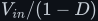<!--/m-->. With no load there is no such voltage, and the output keeps rising until a part
> fails.

---

## 1 What the 3.png staircase is showing

The video shows a 12 V source, an inductor, a switch to ground, a diode and a capacitor, with no
load. Its plot of <!--m:V_C--><!--/m--> climbs in rounded steps, and the caption reads *"If switching continues,
the capacitor's voltage keeps rising endlessly."* Two different ideas are packed into that frame,
and they need separating:

- **The staircase.** At power-on the output is *not* in steady state. The volt-second balance of
  [boost.md §3](boost.md#3-volt-second-balance--the-step-up-ratio) assumes the inductor current
  ends each cycle where it started. The matching *charge balance* on the capacitor
  ([../buck/buck.md §5](../buck/buck.md#5-sizing-the-output-capacitor)) assumes the
  capacitor voltage does the same. During start-up neither is true. Each cycle leaves net charge
  on the capacitor, so <!--m:V_C--><!--/m--> ratchets upward:

- **"Endlessly".** This happens only because the circuit has **no load**. Every cycle adds charge
  and nothing ever removes it. With a load resistor the climb stops at a definite voltage (§4).
  So the caption is correct for the circuit drawn, and it is also a warning: an open-loop boost
  with its load disconnected is a voltage multiplier with no ceiling (§3).

So your instinct was right: the output takes many cycles to reach its target. For the worked
example of [boost.md §6](boost.md#6-worked-numbers--12-v-to-24-v) (12 V to 24 V at 100 kHz) it
takes about 300 to 400 cycles, roughly 3 to 4 ms (§6). How many depends on the parts, the load,
and, for a boost, the step-up ratio (§7).

## 2 One cycle, one packet of energy

Follow one cycle with the capacitor already charged to some <!--m:V_C--><!--/m--> above <!--m:V_{in}--><!--/m-->.

**Switch ON, for <!--m:D\,T--><!--/m-->.** The switch shorts the inductor across the source. The diode is
reverse-biased, because its anode is at 0 V and its cathode is at <!--m:V_C--><!--/m-->. The inductor current
ramps up from zero to a peak set only by the source, the inductor and the on-time, and the
inductor stores the energy <!--m:\tfrac12 L I^2-->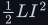<!--/m--> in its field (derived in
[../../fundamentals/electromagnetism/electromagnetism.md §10](../../fundamentals/electromagnetism/electromagnetism.md#10-energy-stored-in-the-magnetic-field)):

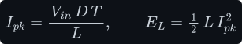

With no load, the capacitor does nothing during this interval. The diode isolates it and nothing
draws from it, so **<!--m:V_C--><!--/m--> is perfectly flat**. Those are the flat treads of the staircase.

**Switch OFF.** The inductor current cannot stop, so it forces the diode on and flows into the
capacitor (the polarity flip of
[../../fundamentals/inductor/inductor.md §5](../../fundamentals/inductor/inductor.md#5-polarity-lenz-and-the-sign-flip)).
The inductor now has <!--m:V_{in} - V_C-->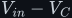<!--/m--> across it, which is negative, so its current ramps back down
to zero. It takes a time <!--m:t_d--><!--/m--> to get there and delivers a charge <!--m:Q--><!--/m-->, the area of that falling
triangle:

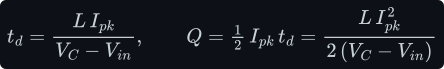

That charge raises the capacitor by <!--m:\Delta V_C = Q/C--><!--/m-->. This is the rounded riser of the
staircase: it is rounded because the current feeding the capacitor falls linearly. Once the
current reaches zero the diode blocks it from reversing, and the inductor sits at zero current
until the next ON interval. This regime, where the inductor current reaches zero inside every
cycle, is **discontinuous conduction mode (DCM)**. An unloaded boost is always in DCM once it is
running.

Where did the energy come from? The capacitor received <!--m:V_C \cdot Q--><!--/m-->. Only part of that was the
inductor's stored energy. The source also kept pushing current *through* the inductor during the
dump, which is why the output can exceed the input at all:

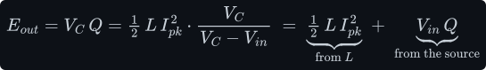

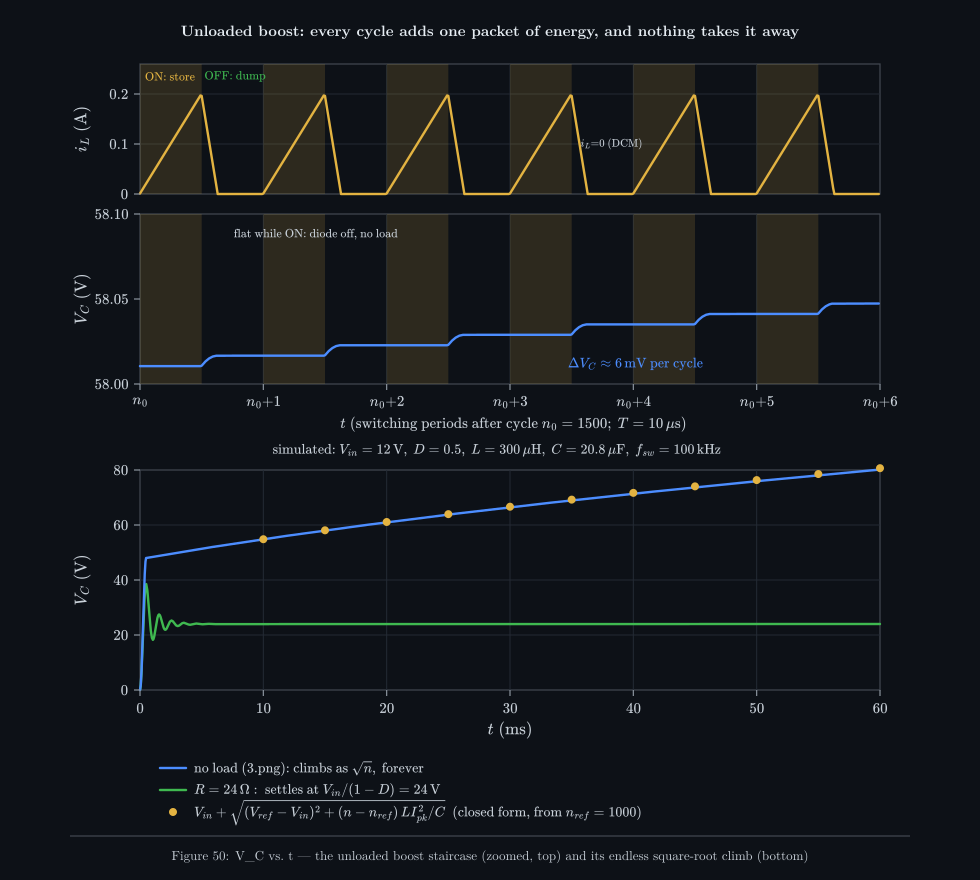

_A real switched simulation of the boost.md parts with no load. Top two panels: six cycles zoomed
in. The current triangle (store, then dump) produces one riser per cycle, and the treads are flat
because nothing draws from the capacitor while the diode is off. This is exactly the 3.png
staircase. Bottom panel: the same circuit over 6000 cycles. It never levels off. The amber dots
are the closed form of §3, and the green trace is the same converter with a 24 Ω load, which
settles at 24 V._

## 3 Why the unloaded boost never stops climbing

Put the numbers in. Each riser is

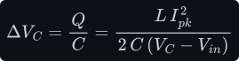

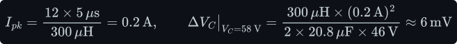

which is exactly the 6 mV per cycle the simulation shows in Figure 50. The step shrinks as <!--m:V_C--><!--/m-->
rises, because each packet of charge is pushed against a larger voltage. But it **never reaches
zero**. Treat the cycle count <!--m:n--><!--/m--> as continuous, so the step per cycle becomes <!--m:dV_C/dn-->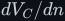<!--/m-->. Move
<!--m:(V_C - V_{in})-->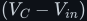<!--/m--> to the left, and both sides can be integrated directly:
<!--m:\int (V_C - V_{in})\,dV_C = \tfrac12 (V_C - V_{in})^2-->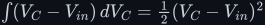<!--/m--> on the left, a constant times <!--m:n--><!--/m--> on the
right. Starting from <!--m:V_C = V_0-->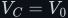<!--/m--> at <!--m:n = 0-->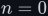<!--/m--> and solving for <!--m:V_C--><!--/m-->:

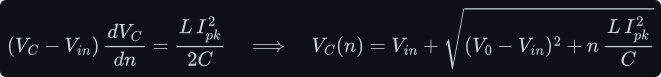

The output grows as the **square root of the number of cycles**. Every cycle adds the same
amount of energy, so the energy <!--m:\tfrac12 C V_C^2-->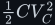<!--/m--> grows linearly and the voltage grows as its
square root. There is no equilibrium. For the worked parts the output is about 55 V after 1000
cycles (10 ms) and 80 V after 6000 cycles (60 ms), and it is still rising. The closed form,
anchored at cycle 1000, matches the simulation to the width of the line in Figure 50.

> **Watch out — the no-load runaway is a real failure mode, not a curiosity.** A boost converter
> running open loop (fixed <!--m:D--><!--/m-->, no feedback) with its load unplugged pumps its output up until
> something breaks. Usually that is the output capacitor, which has a voltage rating. Otherwise
> the MOSFET avalanches because its drain sits at <!--m:V_C--><!--/m--> while it is off, or the diode breaks down
> in reverse. A closed-loop controller with a broken feedback divider sees "output too low"
> forever and does the same thing. That is why real boost controllers have **over-voltage
> protection** (stop switching above a threshold) and run in **skip/burst mode** at light load,
> and why some designs fit a small bleeder resistor as a guaranteed minimum load.

Notice also what DCM does to the formula you derived. In DCM, **the output is no longer set by
<!--m:D--><!--/m-->**. <!--m:V_{in}/(1-D)--><!--/m--> assumed the inductor current never reaches zero, and with no load that
assumption fails. §4 gives the DCM output voltage, which depends on the load.

## 4 Adding a load — where the climb stops

Connect a resistor <!--m:R--><!--/m-->. Now the capacitor loses charge continuously, at <!--m:V_C/R--><!--/m-->, including during
the ON interval, so the treads slope down slightly (the sawtooth of
[boost.md §5](boost.md#5-sizing-the-output-capacitor)). Each cycle still adds energy, and the
load now removes energy. The output rises until the two match. **The equilibrium is the voltage
at which the energy added per cycle equals the energy the load takes per cycle.**

**Heavy enough load: continuous conduction (CCM).** The inductor current never reaches zero. Write
power in, power out, and charge balance on the capacitor. In steady state the average diode
current, <!--m:(1-D)\bar I_L-->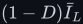<!--/m-->, must equal the load current:

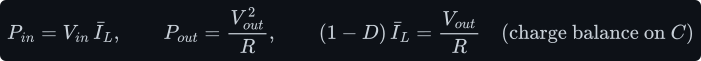

Substitute the charge balance into the power balance:

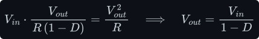

This is the same result as volt-second balance, reached through energy instead. That is not a
coincidence. For ideal parts, energy balance and volt-second balance are the same statement
viewed from two sides. The useful point is that **the energy view explains why it settles**: the
load's appetite, <!--m:V^2/R-->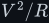<!--/m-->, grows with the square of the voltage, while the energy supplied per
cycle does not grow as fast, so the two curves must cross.

**Light load: DCM.** Use the per-cycle energy from §2, times <!--m:f_{sw}--><!--/m--> cycles per second, and set it
equal to the load power:

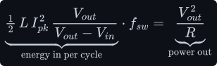

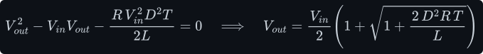

(To get there, substitute <!--m:I_{pk} = V_{in} D T/L-->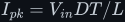<!--/m--> and <!--m:f_{sw} = 1/T--><!--/m-->, multiply both sides by
<!--m:R\,(V_{out} - V_{in})/V_{out}--><!--/m-->, and solve the resulting quadratic in <!--m:V_{out}--><!--/m-->, keeping the positive
root.) Now <!--m:R--><!--/m--> appears in the answer. The lighter the load (larger <!--m:R--><!--/m-->), the higher the output, and as
<!--m:R \to \infty--><!--/m--> the output goes to infinity, which is the runaway of §3. The boundary is where the bottom of the current
triangle just touches zero: half the ripple equals the average. The average inductor current is the
input current, <!--m:\bar I_L = V_{out}/(R(1-D)) = V_{in}/(R(1-D)^2)-->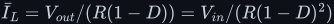<!--/m--> (charge balance above, with
<!--m:V_{out} = V_{in}/(1-D)--><!--/m-->), and half the ripple is <!--m:V_{in} D T/(2L)-->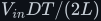<!--/m--> (§2). Setting them equal and
solving for <!--m:R--><!--/m-->, for the worked parts the converter leaves CCM when the load is lighter than

that is, below about 50 mA at 24 V. At 1 kΩ the open-loop output is already 31 V instead of 24 V,
and at 10 kΩ it is 84 V. This is the real reason a boost needs **closed-loop regulation**. A
fixed duty cycle sets the output only while the load is heavy enough to keep the converter in
CCM. A feedback loop instead trims <!--m:D--><!--/m--> (or skips pulses) until the energy per cycle matches
whatever the load happens to want.

## 5 Before the first pulse — the pre-charge jump

One thing 3.png leaves out: in a real boost the output does **not** start at 0 V when switching
begins. The moment the input is connected, there is a DC path from <!--m:V_{in}--><!--/m--> through the inductor
and the forward-biased diode straight into the capacitor, with the switch open. That is a series
LC circuit hit by a voltage step, and it rings. With no load this is the undamped (<!--m:\zeta = 0-->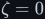<!--/m-->)
case of the step response derived in
[../buck/startup.md §3](../buck/startup.md#3-the-averaged-model--a-second-order-lc-step): there
<!--m:\sigma = 0--><!--/m-->, <!--m:\omega_d = \omega_0--><!--/m-->, and the response collapses to a pure cosine about <!--m:V_{in}--><!--/m-->; the
current is <!--m:C\,dv_C/dt-->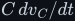<!--/m-->:

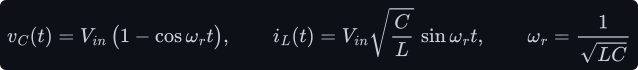

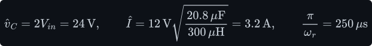

Without a load, the diode stops the current from reversing at the peak, so the capacitor is left
sitting at <!--m:2V_{in}-->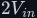<!--/m--> (24 V) before the switch has done anything. With the 24 Ω load the peak is
21.4 V, and the ringing then dies away to <!--m:V_{in}--><!--/m--> (Figure 51, shaded region). The current spike
is the **pre-charge inrush**: 3.2 A through the inductor and diode, *uncontrolled*, because the
switch is not involved at all. A soft-start cannot reduce it (§8). It is limited only by
<!--m:\sqrt{L/C}-->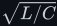<!--/m-->, by circuit resistance, or by a separate inrush limiter or load switch in front of the
converter.

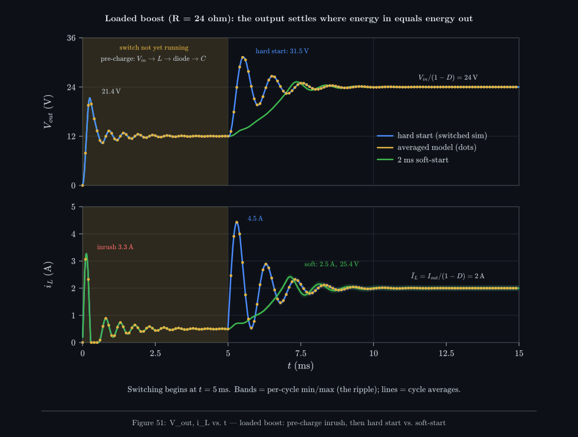

_The 12 V to 24 V boost of boost.md with its 24 Ω load. For the first 5 ms the controller is held
off: the diode pre-charges the output, ringing to 21.4 V with a 3.3 A inrush. Then switching
starts. A hard start at full duty cycle overshoots to 31.5 V and pulls 4.5 A. A 2 ms duty-cycle
ramp reaches 24 V with almost no overshoot. The amber dots, from the averaged model of §6, track
the switched simulation through both rings._

## 6 How many cycles — the averaged model

To predict the settling time without simulating every switching edge, average each quantity over
one switching period. The ripple disappears and the slow dynamics remain. Averaging the two
intervals of [boost.md §2](boost.md#2-the-two-intervals) gives:

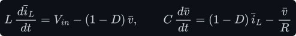

That is a second-order system. To see which one, rescale the current to the value the load side
actually sees, <!--m:i' = (1-D)\bar i_L-->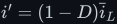<!--/m-->:

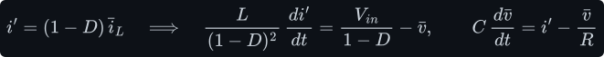

Seen from the output, an averaged boost is **a buck-style LC filter driven by
<!--m:V_{in}/(1-D)--><!--/m-->, with an effective inductance <!--m:L/(1-D)^2-->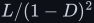<!--/m-->**. (The buck version, with no
rescaling needed, is in [../buck/startup.md §3](../buck/startup.md#3-the-averaged-model--a-second-order-lc-step).)
Everything about its step response follows from the standard second-order parameters, defined
there, with <!--m:L_e-->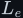<!--/m--> in place of <!--m:L--><!--/m-->; the overshoot fraction is the formula of
[../buck/startup.md §4](../buck/startup.md#4-overshoot--up-to-twice-the-target):

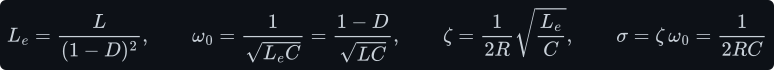

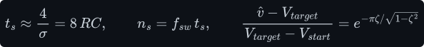

The last parameter is worth pausing on. The **decay rate of the ringing, <!--m:\sigma = 1/(2RC)--><!--/m-->, is
set only by the load and the capacitor**. The inductance and the duty cycle both cancel out. This
holds whenever the response is underdamped, which a boost almost always is. With the worked
numbers:

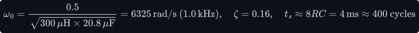

The switched simulation in Figure 51 agrees: it settles within 2 % after about 320 cycles,
overshoots by 61 % of the 12 V step (31.3 V predicted, 31.5 V simulated), and rings at 1.0 kHz,
which is about 100 switching cycles per ring. So the answer to "how many cycles?" is
**<!--m:f_{sw}--><!--/m--> times a few <!--m:RC--><!--/m-->**: hundreds of cycles for this example, and it does not get shorter
by switching faster, because the LC filter, not the switch, sets the pace.

## 7 Does it depend on the step-up ratio?

**Yes, for a boost.** Write the step-up ratio as <!--m:M = V_{out}/V_{in} = 1/(1-D)--><!--/m-->. The ratio enters through <!--m:(1-D)--><!--/m-->, and it enters in several places at once.

- **Slower ringing, later peak.** <!--m:\omega_0 = (1-D)/\sqrt{LC}--><!--/m-->. A bigger step-up means a smaller
  <!--m:(1-D)--><!--/m-->, so a larger effective inductance and a slower ring. With the same parts and the same
  24 Ω resistor, the output first reaches its target after 19 cycles at 12 V to 16 V, 30 cycles at
  12 V to 24 V, and 68 cycles at 12 V to 48 V (Figure 53, bottom panel, in the buck document). The
  envelope decay <!--m:1/(2RC)--><!--/m--> is the same in all three, so with a fixed resistor the total settling
  time stays near 8RC. But a realistic load at a higher voltage is a *larger* <!--m:R--><!--/m-->. At equal output
  power, <!--m:R = V_{out}^2/P-->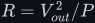<!--/m--> grows as <!--m:M^2-->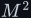<!--/m-->, and the settling time <!--m:8RC--><!--/m--> grows with it.
- **More energy to deliver.** The capacitor must be filled to <!--m:\tfrac12 C V_{target}^2-->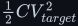<!--/m-->, which
  grows as <!--m:M^2--><!--/m-->, while the input can supply at most <!--m:V_{in}--><!--/m--> times the inductor's current limit.
  Every real controller enforces such a limit during start-up. That gives a hard minimum start-up
  time:

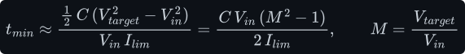

  With the worked capacitor and a 3 A limit, a 2× boost needs at least 125 µs (about 12 cycles).
  The same capacitor charged to 325 V (M = 27) needs at least 30 ms (about 3000 cycles). A
  typical 100 µF, 325 V inverter DC link holds 5.3 J; drawn from 12 V at 10 A, that is 44 ms of
  start-up at the very least. **The start-up time grows with the square of the ratio.** This is
  the "many duty cycles" intuition from 3.png, made quantitative.
- **Bigger inrush and peak current.** The steady inductor current is the input current,
  <!--m:I_{in} = I_{out}/(1-D)-->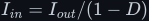<!--/m-->. With a 24 Ω load the hard-start peak inductor current is 1.8 A at
  D = 0.25, 4.5 A at D = 0.5, and 13.3 A at D = 0.75 (simulated). At a fixed load resistor the
  current scales as <!--m:M^2--><!--/m-->.
- **The right-half-plane zero.** (The name comes from control theory, which describes a
  converter's small-signal response by a transfer function in the Laplace variable <!--m:s--><!--/m-->, see
  [../../filters/lc-filter/lc-filter.md §6](../../filters/lc-filter/lc-filter.md#6-the-transfer-function-derived);
  this effect shows up as a zero of that function at a positive real <!--m:s--><!--/m-->, the right half of the
  complex plane. Only its frequency matters here.) Raising <!--m:D--><!--/m--> to push the output *up* first makes
  it go *down*,
  because a longer ON interval is a shorter diode interval, so less charge reaches the capacitor in
  that cycle. In the simulation, the step from 12 V to D = 0.5 first dips the output by 0.2 V
  before it rises. A feedback loop has to be slow compared with this wrong-way response, whose
  frequency is (the standard small-signal result; Erickson and Maksimović, ch. 8)

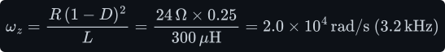

  and that frequency falls as <!--m:(1-D)^2--><!--/m-->. So a higher-ratio boost must also be controlled more
  slowly. This is a second reason, beyond the LC itself, that boost start-up gets sluggish at
  large ratios.

For the buck answer (the ratio barely matters to the timing) see
[../buck/startup.md §6](../buck/startup.md#6-does-it-depend-on-the-step-down-ratio).

## 8 Soft-start

Figure 51 shows the cure. Instead of jumping to full duty cycle, the controller ramps <!--m:D--><!--/m--> (or,
in a closed-loop part, the reference voltage) from zero to its final value over a time much
longer than the LC ring period, here 2 ms against a 1 ms ring. The output then *follows* the
ramp instead of being kicked into oscillation. The overshoot drops from 31.5 V to 25.4 V, and the
peak inductor current from 4.5 A to 2.5 A, barely above the 2 A it carries in steady state.

Every switching-regulator IC has a soft-start for exactly this reason, typically with a pin for a
capacitor that sets the ramp time. Without one, every power-up would hit the inductor with a
current spike that could saturate it, trip the current limit, or overshoot the output past what
the load can tolerate. Two limits on what soft-start can do for a boost:

- It **cannot touch the pre-charge inrush** of §5. That current flows before the first switching
  pulse, through the diode. In Figure 51 the inductor still sees 3.3 A at power-on whatever the
  ramp. Fixing it takes an input load switch or inrush limiter.
- It cannot beat the current-limited minimum of §7. A ramp faster than
  <!--m:C V_{in}(M^2-1)/(2I_{lim})-->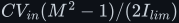<!--/m--> simply runs into the current limit.

## 9 The real gain curve — why 1/(1−D) is a lie at high D

The ideal formula promises any step-up you like: D = 0.9 gives 10×, D = 0.99 gives 100×. Real
boosts fall well short of that, and the main reason is simple: **the inductor's winding resistance
<!--m:R_L-->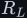<!--/m-->** (add the switch's on-resistance to it if you like). Redo the averaged balance with <!--m:R_L--><!--/m-->
in series with the inductor:

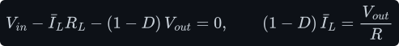

Eliminate <!--m:\bar I_L-->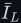<!--/m-->:

The correction term has a direct physical meaning. It is the fraction of the output power burned
in the inductor resistance by the *input* current:

Since the input current is <!--m:1/(1-D)--><!--/m--> times the output current, that fraction grows as <!--m:1/(1-D)^2--><!--/m-->.
At high duty cycle the denominator wins, and the gain **reaches a maximum and then collapses back
toward zero**. Minimising the denominator gives the peak: its derivative with respect to <!--m:D--><!--/m--> is
<!--m:-1 + (R_L/R)/(1-D)^2--><!--/m-->, which is zero when <!--m:(1-D)^2 = R_L/R--><!--/m-->; putting that back into the gain
formula gives <!--m:M_{max}--><!--/m-->:

_With <!--m:R_L/R--><!--/m--> = 0.002, 0.01 and 0.04 the gain peaks at 11.2×, 5× and 2.5×, and every peak sits at
50 % efficiency (bottom panel). Pushing <!--m:D--><!--/m--> past the peak gives less voltage and more heat. The
usable part of each curve is well to the left of its peak._

The efficiency in this model is

and at the gain peak the correction term equals 1, so **η = 50 % exactly**: half the input power
is heating the inductor. A practical design stays far below the peak. For about 95 % copper
efficiency the correction term must stay below about 0.05. With realistic ratios of <!--m:R_L/R--><!--/m-->
between 0.001 and 0.01, that limits the practical gain to roughly **5× to 10×**. Real controllers
also cap the duty cycle at around 90 to 95 %, because they need some off-time to blank the
current sense and let the diode conduct. Taken alone, that cap limits the ideal gain to 10× to
20×.

The source video's next step, 12 V to 325 V, shows how far outside that range a mains inverter
DC link is:

A 0.37 µs off-time in which the diode must pass the whole energy packet, and a copper-loss
budget that needs an inductor resistance of a few hundredths of an ohm while carrying the full
input current. Both are possible on paper and miserable in practice. §10 shows where the losses
actually end up.

## 10 Efficiency versus step ratio — the honest answer

Your instinct, *"it's best not to use it for step-ups/downs that are too much"*, is correct, and
it is standard engineering practice. Here is why, in one quantity. Define the **switch stress
factor** as the peak voltage the switch must block, times the current it must carry, divided by
the power delivered:

**For both the buck and the boost, the switch stress equals the step ratio <!--m:M--><!--/m-->.** A boost switch
carries the large *input* current and also blocks the high *output* voltage, so it gets the worst
of both sides. A 27× boost needs a switch rated at more than 325 V that carries the full 12 V
side current: a high-voltage part, which means a high on-resistance, used at high current, which
means high conduction loss. It also switches 325 V at that current, which means high switching
loss. A transformer-based converter splits the job. The low-voltage switches carry the large
current but block only about <!--m:2V_{in}--><!--/m-->, and the high-voltage side carries only the small output
current. Its stress factor stays near 1 to 2 *whatever the ratio*, because the turns ratio does
the stepping.

_The same loss budget applied to every converter: inductor copper, switch conduction with an
on-resistance that rises with the voltage rating, overlap switching loss, and diode drop. All the
assumptions are printed under the plot. The exact curves depend on the parts you pick; the shape
does not. Below about 5× every option is above 94 %. Past about 10× the boost and the low-voltage
buck fall away fast, and at 12 V to 325 V the boost is down to 73 %._

The loss budget behind Figure 55 at its key points (50 W, 100 kHz):

| Step ratio <!--m:M--><!--/m--> | Boost 12 → 12M V | Buck 12M → 12 V | Sync buck 12 → 12/M V | Diode buck 12 → 12/M V |
|---|---|---|---|---|
| 2 | 96.6 % | 96.7 % | 97.5 % | 94.0 % |
| 5 | 96.3 % | 94.8 % | 93.9 % | 82.1 % |
| 10 | 93.2 % | 93.2 % | 88.6 % | 67.9 % |
| 27 | 72.7 % | 89.3 % | 74.1 % | 42.7 % |

At M = 27 the boost's 19 W of loss breaks down as roughly 13.6 W of switch conduction (a 490 V
class MOSFET at 0.43 Ω carrying 5.8 A for 96 % of every cycle), 4.7 W of switching loss, and
0.7 W of inductor copper. That is the stress factor in watts.

**The rule of thumb.** Keep a single buck or boost stage to a modest ratio: comfortably up to
about 5×, and with care up to about 10×. Bucks stretch further than boosts when the input is the
high side (the blue curve). Beyond that, the options are:

- **Use a transformer.** For 12 V to 325 V, chop the 12 V into AC with an
  [H-bridge](../../dc-ac-inverters/h-bridge/), step it up with a
  [transformer](../../fundamentals/transformer/) of turns ratio about 1:27, then rectify. The turns
  ratio provides the gain, so no duty cycle has to sit near 0 or 1. This is exactly where the
  source video goes next, and it is how every practical 12 V inverter and every offline supply is
  built.
- **Cascade two modest stages.** Two 5× boosts give 25×. The efficiencies multiply (about
  0.95 × 0.95 ≈ 0.90), which still beats one stage at 25×.
- **Use coupled-inductor variants** (flyback, tapped-inductor boost). These are transformers in
  disguise, and they work for the same reason.

## 11 What this costs you

- **The steady-state formulas say nothing about start-up.** <!--m:V_{in}/(1-D)--><!--/m--> describes where the
  output ends up, not how it gets there. Expect an overshoot of tens of percent and a few RC of
  ringing unless something (soft-start, feedback) shapes the climb.
- **No load is dangerous.** An open-loop boost with no load has no equilibrium (§3), and even a
  light load moves the output far above <!--m:V_{in}/(1-D)--><!--/m--> once the converter is in DCM (§4).
  Over-voltage protection and closed-loop control are not optional.
- **The pre-charge inrush is outside the controller's reach** (§5). The diode path from input to
  output is the same one that gives a boost no short-circuit protection
  ([boost.md §7](boost.md#7-what-this-costs-you)), so an inrush limiter or load switch is part of
  a serious design.
- **Large ratios cost time, current and efficiency together.** Start-up time grows as <!--m:M^2--><!--/m-->
  (§7). Peak and input currents grow with <!--m:M--><!--/m-->, or with <!--m:M^2--><!--/m--> at a fixed load. The gain curve turns
  over (§9). The switch stress grows as <!--m:M--><!--/m--> (§10).
- **The models are simplified.** The simulations use ideal switches and an ideal diode, and no
  ESR except where §9 adds <!--m:R_L--><!--/m-->. Real circuits ring a little less (resistance damps the ringing)
  and lose a little more. The trends and orders of magnitude hold. The figure-55 percentages are
  one illustrative loss budget, not a datasheet.

## 12 Sources and cross-links

- The steady-state derivation this extends: [boost.md](boost.md) (§3 volt-second balance, §5 the
  capacitor sawtooth, §6 the worked parts used throughout).
- The buck counterpart (overshoot, inrush, and why the buck's timing is ratio-free):
  [../buck/startup.md](../buck/startup.md).
- The inductor's polarity flip behind the OFF interval:
  [../../fundamentals/inductor/inductor.md §5](../../fundamentals/inductor/inductor.md#5-polarity-lenz-and-the-sign-flip).
- The energy stored in an inductor, <!--m:\tfrac12 L I^2--><!--/m-->:
  [../../fundamentals/inductor/inductor.md §1](../../fundamentals/inductor/inductor.md#1-what-an-inductor-actually-is).
- The averaged LC as a filter: [../../filters/lc-filter/](../../filters/lc-filter/).
- The large-ratio alternative: [../../fundamentals/transformer/](../../fundamentals/transformer/)
  and [../../dc-ac-inverters/h-bridge/](../../dc-ac-inverters/h-bridge/).
- How the duty cycle is generated: [../../pwm/](../../pwm/).
- The figures are numerical simulations in `toolchain/figures/startup.js` (switched circuit, 400
  steps per period, ideal diode clamp), using the boost.md and buck.md worked parts.
- Style and figure conventions: [../../STYLE.md](../../STYLE.md).
