# The buck converter — where `V_out = D·V_in` actually comes from

A buck converter steps a DC voltage *down* — 12 V in, 3 V out — by switching a transistor on and
off fast and letting an inductor and capacitor average the result. The famous formula
`V_out = D·V_in` is not an assumption; it is forced by one steady-state fact about the inductor.
This document derives it, then sizes the parts.

**Contents**

1. [The circuit, and what ON/OFF means](#1-the-circuit-and-what-onoff-means)
2. [The two intervals](#2-the-two-intervals)
3. [Volt-second balance — the step-down ratio](#3-volt-second-balance--the-step-down-ratio)
4. [Sizing the inductor](#4-sizing-the-inductor)
5. [Sizing the output capacitor](#5-sizing-the-output-capacitor)
6. [Worked numbers — 12 V to 3 V](#6-worked-numbers--12-v-to-3-v)
7. [What this costs you](#7-what-this-costs-you)
8. [Sources and cross-links](#8-sources-and-cross-links)

> **The thesis in one line**
>
> In steady state the inductor's average voltage over a full cycle is zero, so the volt-seconds it
> gains while the switch is ON must exactly cancel those it loses while OFF — and that cancellation
> *is* `V_out = D·V_in`.

---

## 1 The circuit, and what ON/OFF means

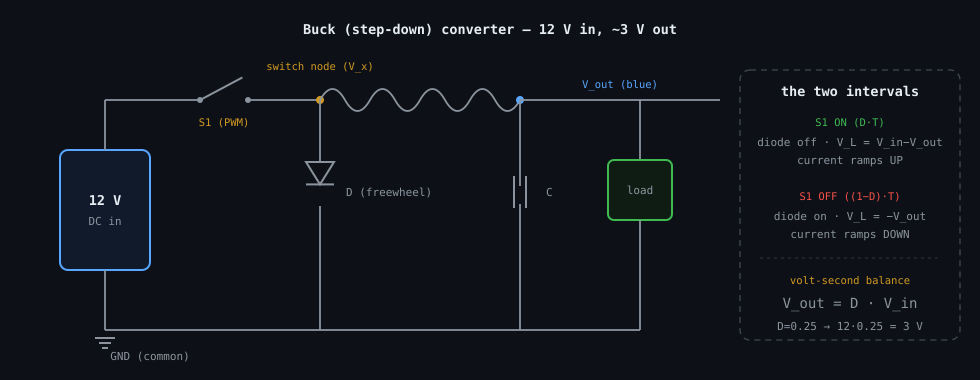

_Switch, then inductor, along the top; a freewheel diode from the switch node down to ground; the
capacitor across the output. When the switch opens, the diode gives the inductor's current a path
so it never breaks._

First, kill an ambiguity that trips everyone up:

- **Switch ON = closed = conducting** (current is allowed through, like a closed gate).
- **Switch OFF = open** (that path is blocked, like an open gate).

The switch **S1** is driven by a PWM signal at a fixed period `T`. The fraction of each period it
spends ON is the **duty cycle `D`** (so ON lasts `D·T`, OFF lasts `(1−D)·T`). The **switch node** is
the point right after the switch, where the diode also connects — it is chopped between `V_in`
(switch ON) and roughly 0 V (switch OFF, diode conducting).

> **📝 Note —** If you literally probed the 12 V *supply's own terminals* you'd see a flat 12 V — an
> ideal source doesn't care what's downstream. The square wave lives at the **switch node**, not at
> the supply. This is a common labelling slip.

## 2 The two intervals

Because the inductor obeys `V_L = L·dI/dt`, a *constant* voltage across it makes its current a
*straight ramp* (see [../../fundamentals/inductor/inductor.md §3](../../fundamentals/inductor/inductor.md#3-from-the-law-to-the-ramp--the-integral-done-slowly)).
The buck gives the inductor two constant-voltage intervals per cycle.

**Interval 1 — switch ON, lasting `D·T`.** Current flows `V_in → switch → L → output`. The diode is
reverse-biased (off). The inductor sees the difference between what pushes on its left end (`V_in`)
and what pushes back on its right (`V_out`):

so the current ramps **up** by:

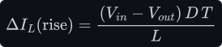

**Interval 2 — switch OFF, lasting `(1−D)·T`.** The switch path is gone, so the inductor forces the
diode to conduct, pinning its left end near ground. Now:

so the current ramps **down** by:

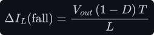

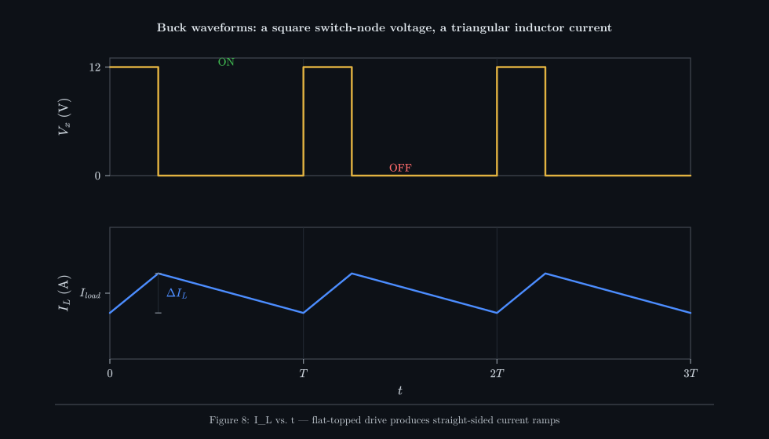

_The flat-topped square voltage at the switch node makes the inductor current a straight-sided
triangle: up while ON, down while OFF. Each side is one constant-`V_L` ramp from the inductor law._

## 3 Volt-second balance — the step-down ratio

Now the key idea. In **steady state** the current waveform repeats identically every cycle — the
triangle starts each period exactly where it started the last one. For that to be true, whatever
the current *rose* by in Interval 1 must be *exactly* undone by what it *fell* by in Interval 2. If
it weren't, the current would creep up (or down) a little every cycle, forever. So `rise = fall`;
cancelling `T` and `L` from both sides:

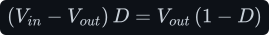

Expand and simplify — the `V_out·D` terms cancel:

That is the entire origin of the buck's step-down ratio — *derived*, not assumed. Equivalently, the
average inductor voltage over a cycle is zero (**volt-second balance**): the positive volt-seconds
cancel the negative ones.

> **💡 Tip —** Volt-second balance is the master key for *every* converter in this tree. Write `V_L`
> for each interval, set the average over one period to zero, and solve. The boost uses the
> identical move — see [../boost/boost.md §3](../boost/boost.md#3-volt-second-balance--the-step-up-ratio).

## 4 Sizing the inductor

The rise/fall equations already contain `L`, so pick a target ripple `ΔI_L` and solve. A common
rule of thumb is 20–40 % of the average (load) current. Using the ON-interval rise with `T = 1/f_sw`:

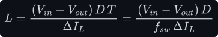

Bigger `L` → smaller ripple, but a physically bigger, costlier part with more resistance. That is
the trade-off `ΔI_L` sets.

## 5 Sizing the output capacitor

The inductor current is a triangle averaging to the load current `I_load`. The load takes that
average; the *leftover* — `i_C = i_L − I_load` — is what actually flows in and out of the capacitor.
It is a triangle centred on zero, swinging `±ΔI_L/2`.

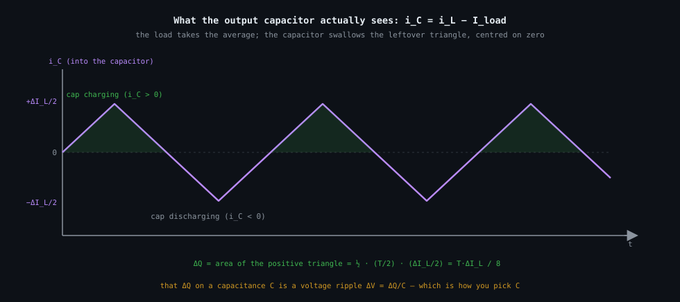

_The capacitor current is the inductor triangle minus the flat load line: a triangle centred on
zero. The shaded positive half is the charge `ΔQ` piled onto the cap; that charge over `C` is the
output voltage ripple._

The charge added during the positive (charging) half-cycle is the **area of that little triangle** —
base `T/2`, height `ΔI_L/2`:

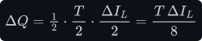

That charge on a capacitance `C` is a voltage ripple `ΔV_out = ΔQ/C`, so:

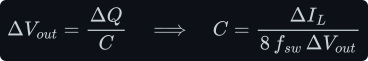

## 6 Worked numbers — 12 V to 3 V

Take `f_sw = 100 kHz` (so `T = 10 µs`), a 1 A load, a target 20 % current ripple and 1 % output
voltage ripple. With `V_in = 12 V`, `V_out = 3 V`, the duty cycle is `D = V_out/V_in = 0.25`, and
`ΔI_L = 0.2 A`, `ΔV_out = 0.03 V`:

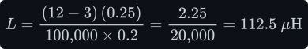

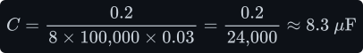

> **📝 Note —** Sanity-check the duty cycle against the result: `V_out = D·V_in = 0.25 × 12 = 3 V`.
> ✓. And the ripple assumptions are self-consistent — `ΔI_L = 0.2 A` on a 1 A load is 20 %, exactly
> what we targeted.

## 7 What this costs you

- **Ripple vs. size.** Smaller ripple means a bigger `L` and bigger `C` — more board area and cost.
  The 20–40 % rule is a compromise, not a law.
- **The diode drop.** A real freewheel diode drops ~0.3–0.7 V while conducting, so `V_out` is
  slightly below `D·V_in` and some power is lost as heat. A *synchronous* buck replaces the diode
  with a second MOSFET to cut that loss — at the cost of gate-drive complexity.
- **Ideal-parts assumption.** These formulas assume a pure `L` and pure `C`. Real parts have
  resistance (the capacitor's ESR adds its own ripple term, often dominant) and frequency-dependent
  losses. Treat the results as a starting point.

## 8 Sources and cross-links

- The inductor ramp this is built on:
  [../../fundamentals/inductor/inductor.md §3](../../fundamentals/inductor/inductor.md#3-from-the-law-to-the-ramp--the-integral-done-slowly).
- The capacitor-charge argument for §5:
  [../../fundamentals/capacitor/capacitor.md §4](../../fundamentals/capacitor/capacitor.md#4-from-the-law-to-the-ramp).
- Mirror circuit, same method: [../boost/boost.md](../boost/boost.md).
- Style and figure conventions: [../../STYLE.md](../../STYLE.md).
