# Buck start-up — inrush, overshoot, and why a deep step-down is not slower

[buck.md](buck.md) derives 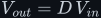<!--m:V_{out} = D\,V_{in}--> for the steady state, where every cycle repeats
the last. This document covers the run-up to that state: what happens in the first cycles after
the switch starts, how many cycles it takes to settle, whether a much lower target makes it take
longer, and what a large step-down really costs. It is the buck counterpart of
[../boost/startup.md](../boost/startup.md), which explains the boost staircase from the source
video (3.png).

**Contents**

1. [The buck version of the 3.png question](#1-the-buck-version-of-the-3png-question)
2. [The first cycles — the full input across the inductor](#2-the-first-cycles--the-full-input-across-the-inductor)
3. [The averaged model — a second-order LC step](#3-the-averaged-model--a-second-order-lc-step)
4. [Overshoot — up to twice the target](#4-overshoot--up-to-twice-the-target)
5. [How many cycles — worked numbers](#5-how-many-cycles--worked-numbers)
6. [Does it depend on the step-down ratio?](#6-does-it-depend-on-the-step-down-ratio)
7. [Soft-start](#7-soft-start)
8. [Large step-downs — where the ratio does bite](#8-large-step-downs--where-the-ratio-does-bite)
9. [What this costs you](#9-what-this-costs-you)
10. [Sources and cross-links](#10-sources-and-cross-links)

> **The thesis in one line**
>
> A buck reaches 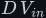<!--m:D\,V_{in}--> through an LC filter, so its start-up is the step response of a
> second-order system. It settles in about <!--m:8RC--> whatever the step-down ratio. Without soft-start
> it overshoots, up to nearly twice the target at light load, and it pulls an inrush current set
> by <!--m:\sqrt{L/C}-->. A deep step-down is not slower. It is less efficient, and its on-time gets
> uncomfortably short.

---

## 1 The buck version of the 3.png question

In the boost, the output climbs in a staircase because each cycle moves one packet of energy into
the capacitor (see [../boost/startup.md §2](../boost/startup.md#2-one-cycle-one-packet-of-energy)).
Does a buck do the same thing, especially when the target is far below the input?

**Partly.** A buck also builds its output cycle by cycle. Volt-second balance
([buck.md §3](buck.md#3-volt-second-balance--the-step-down-ratio)) only holds once the averages
have stopped changing. Before that, each cycle leaves a net change in the inductor current and
net charge on the capacitor. But there are two big differences from the boost:

- **A buck feeds the output directly.** Its inductor is in series with the output during the ON
  interval, *and* during the OFF interval through the freewheel diode. Current flows into the
  capacitor for the whole cycle rather than in one dump per cycle. So a buck's start-up looks
  less like a staircase and more like a smooth, ringing curve with a little ripple on it.
- **A buck's climb is bounded.** Even with no load, a buck cannot exceed <!--m:V_{in}-->: once
  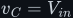<!--m:v_C = V_{in}-->, the inductor has zero volts across it during ON and nothing more can be
  pushed in. A non-synchronous (diode) buck with no load does climb past <!--m:D\,V_{in}-->, because its diode
  stops the inductor current from reversing (the *discontinuous conduction* explained in §4), but
  it stops at <!--m:V_{in}-->, never "endlessly".

## 2 The first cycles — the full input across the inductor

At power-on the capacitor is at 0 V. During the first ON intervals, the inductor sees almost the
**entire input** across it, not the small 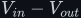<!--m:V_{in} - V_{out}--> it sees in steady state:

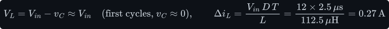

During OFF it sees only <!--m:-v_C \approx 0-->, so the current hardly falls. The current therefore
**ratchets upward cycle after cycle**. This is the buck's version of the staircase, but in the
*current*, not the voltage. Per cycle, the current rises by 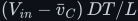<!--m:(V_{in} - \bar v_C)\,DT/L--> during ON
and falls by 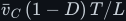<!--m:\bar v_C\,(1-D)\,T/L--> during OFF (the two ramps of
[buck.md §2](buck.md#2-the-two-intervals) with <!--m:v_C--> in place of <!--m:V_{out}-->). The difference is the
net change; the 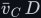<!--m:\bar v_C\,D--> terms cancel, exactly as they did in the steady-state balance:

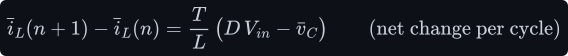

which is positive for as long as the output is below the target <!--m:D\,V_{in}-->. So the current keeps
growing until the capacitor reaches the target. By then the current is well above what the load
needs, and the surplus carries the output *past* the target. This is the **inrush current** and
the **overshoot**, and §3 to §4 turn it into numbers.

> **Note —** In steady state the inductor sees only <!--m:V_{in} - V_{out}--> during ON (9 V for
> 12 V to 3 V). In the first cycle it sees 12 V, so it ramps 4/3 as fast. For a large step-down
> such as 48 V to 1 V the contrast is extreme: 48 V at start-up against 47 V in steady state is
> nearly the same. What changes is the OFF interval, where the inductor sees almost nothing
> (about 0 V instead of <!--m:-V_{out}-->) until the output builds up.

## 3 The averaged model — a second-order LC step

Average both intervals over one period, as in [buck.md §3](buck.md#3-volt-second-balance--the-step-down-ratio).
The switch node averages to <!--m:D\,V_{in}-->, so the converter becomes a voltage source of value
<!--m:D\,V_{in}--> feeding an LC filter with a resistive load. The inductor carries the difference between
that source and the output (Kirchhoff's voltage law), and the capacitor receives the inductor
current minus the load's 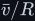<!--m:\bar v/R--> (Kirchhoff's current law):

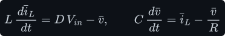

Eliminate the current. The second equation gives 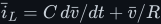<!--m:\bar i_L = C\,d\bar v/dt + \bar v/R-->;
differentiate it, 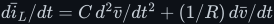<!--m:d\bar i_L/dt = C\,d^2\bar v/dt^2 + (1/R)\,d\bar v/dt-->, multiply by 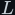<!--m:L--> and set it
equal to the right side of the first equation. That gives the textbook damped second-order
equation:

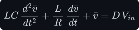

Divide through by <!--m:LC--> and compare with the standard form of a damped oscillator,
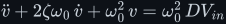<!--m:\ddot v + 2\zeta\omega_0\,\dot v + \omega_0^2\,v = \omega_0^2\,D V_{in}--> (dots are time
derivatives). Matching the coefficients, 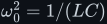<!--m:\omega_0^2 = 1/(LC)--> and 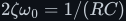<!--m:2\zeta\omega_0 = 1/(RC)-->, names
the usual parameters: the **natural angular frequency** <!--m:\omega_0--> (radians per second) at which an
undamped LC swaps energy back and forth; the **damping ratio** <!--m:\zeta--> (dimensionless; below 1 the
response rings, above 1 it creeps); the **decay rate** <!--m:\sigma--> (per second) of the ringing's
envelope 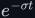<!--m:e^{-\sigma t}-->; and the **characteristic impedance** <!--m:Z_0--> (ohms), the ratio of peak
voltage to peak current when energy swings between 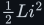<!--m:\tfrac12 L i^2--> and 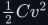<!--m:\tfrac12 C v^2-->:

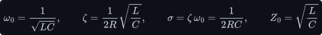

How the response is found: without the source, the equation is solved by
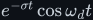<!--m:e^{-\sigma t}\cos\omega_d t--> and 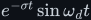<!--m:e^{-\sigma t}\sin\omega_d t--> with
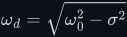<!--m:\omega_d = \sqrt{\omega_0^2 - \sigma^2}--> (substitute either and the terms cancel — try it);
with the source, add the constant <!--m:D\,V_{in}-->, which satisfies the equation on its own. The two
free constants are fixed by the start: 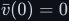<!--m:\bar v(0) = 0-->, and 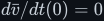<!--m:d\bar v/dt(0) = 0--> because the
capacitor current starts at zero. Starting from zero current and zero voltage, the underdamped step
response is therefore

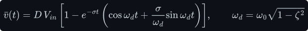

This is why the buck's PWM-plus-LC is often described as *a low-pass filter applied to a square
wave*. That view is developed in [../../filters/lc-filter/](../../filters/lc-filter/). The filter
passes the average, <!--m:D\,V_{in}-->, which is the steady-state formula, and its step response is the
start-up transient.

## 4 Overshoot — up to twice the target

Differentiate the step response and almost everything cancels:
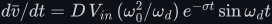<!--m:d\bar v/dt = D\,V_{in}\,(\omega_0^2/\omega_d)\,e^{-\sigma t}\sin\omega_d t-->. It is first zero again at
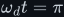<!--m:\omega_d t = \pi-->, the first peak. Put 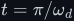<!--m:t = \pi/\omega_d--> into the response (<!--m:\cos\pi = -1-->,
<!--m:\sin\pi = 0-->) and use 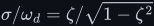<!--m:\sigma/\omega_d = \zeta/\sqrt{1-\zeta^2}-->. The peak of that response is

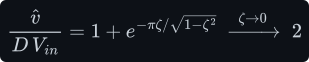

With light damping (a light load, so a large <!--m:R--> and a small <!--m:\zeta-->) **the output overshoots
to almost twice its target**. The LC stores the surplus current as magnetic energy and hands it to
the capacitor, exactly as an undamped spring released from rest overshoots its equilibrium by its
full displacement. The peak inductor current while it does so is set by the characteristic
impedance. With no damping the response is 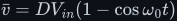<!--m:\bar v = D V_{in}(1 - \cos\omega_0 t)-->, so the
capacitor's current <!--m:C\,d\bar v/dt = D V_{in}\,\omega_0 C\sin\omega_0 t--> peaks at
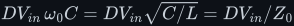<!--m:D V_{in}\,\omega_0 C = D V_{in}\sqrt{C/L} = D V_{in}/Z_0-->; the inductor carries that plus the load
current, plus half the switching ripple on top:

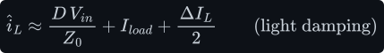

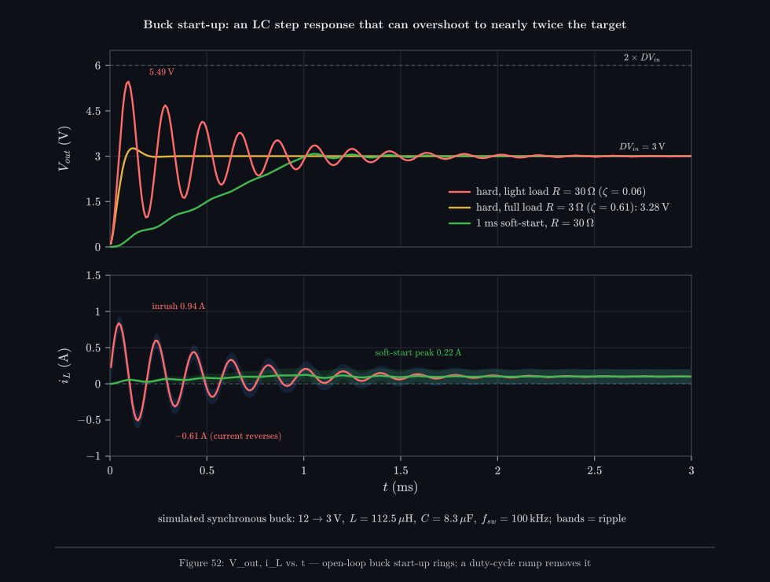

_A switched simulation of the buck.md 12 V to 3 V converter. At full load (3 Ω, ζ = 0.61) the
LC is well damped and the output barely overshoots, to 3.28 V. At light load (30 Ω, ζ = 0.06) it
rings up to 5.49 V, 1.83 times the target, and the inductor current swings from +0.94 A to
−0.61 A while it rings. A 1 ms duty-cycle ramp removes almost all of it._

Two details in Figure 52 are worth noticing:

- **The current goes negative** at light load. In a synchronous buck (a second MOSFET in place of
  the diode) that is allowed: the converter pulls charge *back* out of the overshooting
  capacitor and returns it to the input. In a diode buck it cannot happen. The diode blocks
  reverse current, the inductor sits at zero (discontinuous conduction), and the capacitor can
  only discharge through the load. The overshoot is the same, but it decays much more slowly.
- **With no load at all, a diode buck climbs to the input.** In DCM the output is set by the load,
  not by <!--m:D--> alone, and it rises toward <!--m:V_{in}--> as the load disappears. Balancing the charge
  delivered per cycle against the load (the same energy-per-cycle argument as
  [../boost/startup.md §4](../boost/startup.md#4-adding-a-load--where-the-climb-stops); the
  standard DCM result, e.g. Erickson and Maksimović, *Fundamentals of Power Electronics*, ch. 5)
  gives:

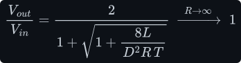

  The simulation of the unloaded diode buck at D = 0.25 shows 6 V after 10 cycles, 11.3 V after
  500, and the full 12 V after about 3000. This is the buck analogue of the endless boost climb,
  with a ceiling. Closed-loop control (skip/burst mode at light load) is what holds a real buck
  at its target.

## 5 How many cycles — worked numbers

Put in the parts of [buck.md §6](buck.md#6-worked-numbers--12-v-to-3-v):

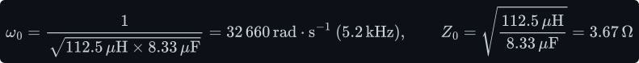

The ringing envelope decays as <!--m:e^{-\sigma t}--> with <!--m:\sigma = 1/(2RC)-->. After four of its time
constants 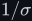<!--m:1/\sigma--> it has shrunk to 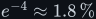<!--m:e^{-4} \approx 1.8\,\%-->, so it settles to within about 2 % in
roughly four time constants:

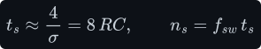

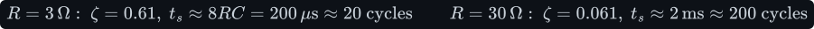

The simulation agrees: 18 cycles at full load and 193 cycles at light load to settle within 2 %.
The light-load peak of 5.49 V matches the formula (<!--m:3 \times 1.83-->), and so does the inrush
estimate (about 1.0 A predicted, 0.94 A simulated). Compare this with the boost's roughly 320
cycles ([../boost/startup.md §6](../boost/startup.md#6-how-many-cycles--the-averaged-model)). The
buck is quicker for two reasons: it has a smaller capacitor, and there is no 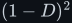<!--m:(1-D)^2--> inflating
its effective inductance.

## 6 Does it depend on the step-down ratio?

**For the timing, essentially no.** Look at the averaged model again. The duty cycle enters only
through the size of the input step, <!--m:D\,V_{in}-->. The dynamics, <!--m:\omega_0-->, <!--m:\zeta--> and <!--m:\sigma-->,
depend on <!--m:L-->, <!--m:C--> and <!--m:R--> alone. The system is linear, so a smaller target gives a
proportionally smaller response *with exactly the same shape and timing*. The overshoot as a
fraction of the target is the same at every ratio.

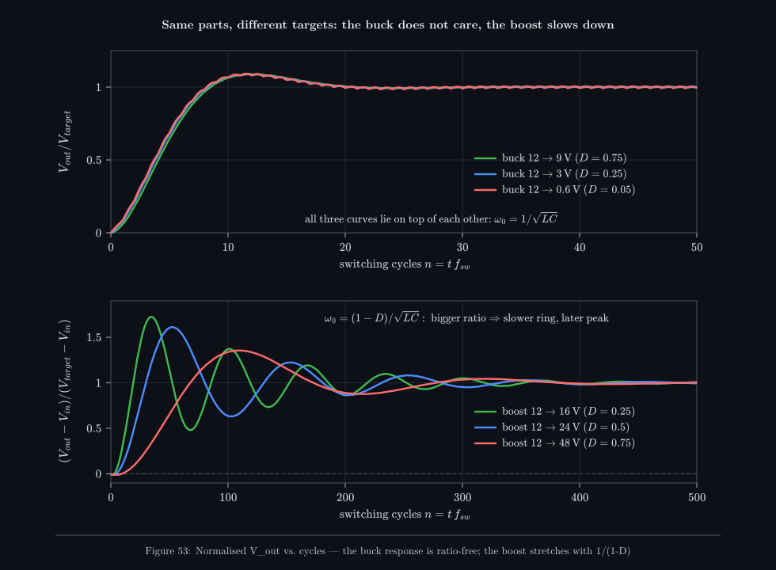

_Top: the same buck hardware stepped to 9 V, 3 V and 0.6 V (ratios 1.3:1, 4:1 and 20:1),
normalised to each target. The three simulated curves lie on top of each other; only the ripple
differs. Bottom: the same experiment on a boost. There the ratio changes the ring frequency
through <!--m:(1-D)-->, so higher ratios rise later and ring slower._

What *does* scale with the ratio:

- **Absolute overshoot and inrush scale with the target**, not with the ratio. A lower target
  means a smaller swing in volts and a smaller current (<!--m:D\,V_{in}/Z_0-->).
- **A current-limited start is faster for a lower target.** In a buck the inductor current *is*
  the capacitor's charging current, so a controller limiting it to 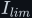<!--m:I_{lim}--> fills the capacitor
  at a bounded rate:

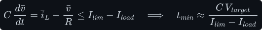

  The time is proportional to <!--m:V_{target}-->. Contrast the boost, where the input-side current limit
  makes the minimum start-up time grow as <!--m:M^2-->, the square of its step ratio
  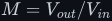<!--m:M = V_{out}/V_{in}-->
  ([../boost/startup.md §7](../boost/startup.md#7-does-it-depend-on-the-step-up-ratio)).
- **In a real design, <!--m:L--> and <!--m:C--> are sized for the ratio.** The ripple formulas of
  [buck.md §4–5](buck.md#4-sizing-the-inductor) contain <!--m:D-->, so the parts you pick for 48 V to 1 V
  differ from those for 12 V to 9 V, and the settling time changes with them. But that is a
  consequence of the design choice, not of the ratio itself.

So for a deep step-down you do **not** need to wait for many more cycles. The cost of a large
buck ratio is elsewhere (§8).

## 7 Soft-start

The fix for the overshoot and the inrush is the same as for the boost: **ramp the duty cycle**
(or, in a closed-loop controller, the reference) from zero over a time much longer than the LC
period, which is about 0.2 ms here. In Figure 52 a 1 ms ramp holds the light-load peak to 3.09 V
(3 % over) instead of 5.49 V, and the peak inductor current to 0.22 A instead of 0.94 A. The
output follows the slowly moving average instead of being hit with a step.

Every buck controller IC has a soft-start, either internal or set by a capacitor on an SS pin.
Besides taming the overshoot, it keeps the inrush from tripping the input supply's own current
limit, saturating the inductor, or slamming a large output capacitor bank. Unlike the boost
([../boost/startup.md §5](../boost/startup.md#5-before-the-first-pulse--the-pre-charge-jump)),
a buck has no uncontrolled pre-charge path, because its switch sits between the input and
everything else. So soft-start covers the whole inrush.

## 8 Large step-downs — where the ratio does bite

A big step-down does not slow the start-up, but it costs you in four other ways:

Below, <!--m:M = V_{in}/V_{out}--> is the buck's step-down ratio (so <!--m:M = 1/D--> for the ideal buck).

**1. Minimum on-time.** The ON interval is 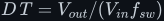<!--m:D\,T = V_{out}/(V_{in} f_{sw})-->. Every controller
has a minimum on-time, typically 50 to 150 ns, below which it cannot make a clean pulse (gate
drive, current-sense blanking, propagation delay):

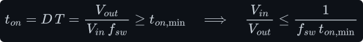

Small modern bucks switch at 1 to 3 MHz to shrink <!--m:L--> and <!--m:C-->, and at those frequencies even a
12 V to 1 V conversion is near the limit. Below the minimum on-time the controller starts skipping
pulses and the output ripple grows. This is why a 48 V to 1 V rail is usually built as two
stages (48 V to 12 V, then 12 V to 1 V) or at a lower frequency.

**2. The freewheel diode's drop becomes a large fraction of the output.** In a deep step-down the
diode conducts for almost the whole cycle, <!--m:(1-D) \approx 1-->, carrying the full output current.
With <!--m:V_F--> the diode's forward drop, its loss is <!--m:(1-D)\,V_F\,I_{out}-->, and that alone caps the
efficiency <!--m:\eta-->, the output power as a fraction of the input power:

A synchronous buck replaces the diode with a MOSFET whose drop is only <!--m:I \cdot R_{on}-->. That is why
every low-voltage processor rail is synchronous.

**3. The switch stress grows with the ratio.** The switch must block the full <!--m:V_{in}--> while it
carries the full <!--m:I_{out}-->:

At 20:1 the switch is rated for 20 times the output voltage, at the full output current, to
deliver power at only 1/20 of that voltage. Switching losses scale with <!--m:V_{in} I_{out} f_{sw}-->,
so they grow with <!--m:M--> relative to the output power.

**4. Efficiency versus ratio, quantified.** The full loss budget is plotted in
[../boost/startup.md §10](../boost/startup.md#10-efficiency-versus-step-ratio--the-honest-answer)
(Figure 55). For the buck at 50 W: stepping down *to* 12 V from 24 V, 60 V, 120 V and 324 V gives
96.7 %, 94.8 %, 93.2 % and 89.3 %. Stepping down *from* 12 V to 6 V, 2.4 V, 1.2 V and 0.44 V at
the same current gives 97.5 %, 93.9 %, 88.6 % and 74.1 % with a synchronous rectifier, but
94.0 %, 82.1 %, 67.9 % and 42.7 % with a diode.

**The rule of thumb:** a single buck stage is comfortable up to about 10:1, and up to about 20:1
at modest switching frequency with a synchronous rectifier. Beyond that, use two stages or a
transformer-isolated converter, for the same reasons as the boost.

## 9 What this costs you

- **Open-loop start-up overshoots.** At light load an un-soft-started buck can put almost
  <!--m:2\,D\,V_{in}--> on its output, which can destroy a 3.3 V logic rail that sees 6 V. Soft-start
  and closed-loop control are not luxuries.
- **The inrush is real current through real parts.** The inductor must not saturate at the
  start-up peak, not just at the steady-state peak, and the input source must be able to supply
  it.
- **Synchronous rectification changes the transient.** With a MOSFET in place of the diode the
  current can reverse, which damps an overshoot actively. With a diode it cannot, and light-load
  behaviour moves into DCM, where <!--m:V_{out}--> is no longer <!--m:D\,V_{in}-->.
- **A deep step-down costs efficiency, not time.** Minimum on-time, diode drop and switch stress
  all scale with the ratio (§8).
- **Ideal-parts simulation.** The figures use ideal switches and no ESR. Real resistance adds
  damping, so actual rings are somewhat smaller than Figure 52. The scaling arguments are
  unaffected.

## 10 Sources and cross-links

- The steady state this approaches: [buck.md](buck.md) (§3 volt-second balance, §6 the worked
  parts used throughout).
- The boost counterpart (the 3.png staircase, the endless no-load climb, the real gain curve and
  the efficiency-versus-ratio figure): [../boost/startup.md](../boost/startup.md).
- The LC filter view of PWM averaging: [../../filters/lc-filter/](../../filters/lc-filter/).
- How the duty cycle is generated and ramped: [../../pwm/](../../pwm/).
- The inductor and capacitor laws underneath the averaged model:
  [../../fundamentals/inductor/inductor.md](../../fundamentals/inductor/inductor.md),
  [../../fundamentals/capacitor/capacitor.md](../../fundamentals/capacitor/capacitor.md).
- For large ratios, the transformer route: [../../fundamentals/transformer/](../../fundamentals/transformer/),
  [../../dc-ac-inverters/h-bridge/](../../dc-ac-inverters/h-bridge/).
- Figures are switched-circuit simulations in `toolchain/figures/startup.js`.
- Style and figure conventions: [../../STYLE.md](../../STYLE.md).
