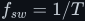

# Filters — keeping the average, rejecting the switching

A switching circuit makes its output by chopping: a transistor slams fully on and fully off tens of
thousands of times a second. What the load needs is the smooth, slow part of that chopped wave. A
filter is the circuit that separates the two. This section builds the one every power converter and
inverter in this tree relies on.

> **The thesis in one line**
>
> A series inductor and a shunt capacitor form a second-order low-pass filter that passes the average
> of a PWM wave, <!--m:D\,V_{in}-->, and attenuates the switching frequency at <!--m:-40\,\mathrm{dB}--> per decade — so
> a duty cycle that varies slowly becomes an output voltage that varies the same way.

## Documents

| Subtopic | Result | What it covers |
|---|---|---|
| [lc-filter/](lc-filter/) | <!--m:H(s) = 1/(s^2LC + sL/R + 1)--> | the LC filter as the buck converter; series <!--m:L--> smooths current, shunt <!--m:C--> smooths voltage; the freewheel diode; PWM average derived; transfer function, <!--m:\omega_0--> and <!--m:Q-->; ripple maths; step response and damping; cycle-by-cycle duty control synthesising ramps and sines; why one switch cannot make AC |

## Reading order

Do the [fundamentals](../fundamentals/) and the [buck converter](../dc-dc-converters/buck/) first,
then [lc-filter/lc-filter.md](lc-filter/lc-filter.md). It leads directly into [PWM](../pwm/) and the
[DC-AC inverter](../dc-ac-inverters/spwm/) documents.

## Conventions

Follows [../STYLE.md](../STYLE.md). Switch **ON = closed = conducting**. <!--m:D--> is the duty cycle,
<!--m:f_{sw} = 1/T--> the switching frequency, <!--m:v_s--> the switch-node voltage and <!--m:v_{out}--> the load voltage;
an overbar means the average over one switching period.
