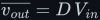

# The LC filter

Deep treatment of how a series inductor and a shunt capacitor turn a PWM wave into a smooth voltage
equal to its average, <!--m:\overline{v_{out}} = D\,V_{in}--><!--/m--> — and how varying <!--m:D--><!--/m--> cycle by cycle turns that into a
programmable waveform. The full argument is in [lc-filter.md](lc-filter.md), in fifteen sections with
ten figures (56–65), every waveform simulated from the switched circuit.

> **The thesis in one line**
>
> An inductor smooths current and a capacitor smooths voltage, so together they keep the slow average of
> a PWM wave and reject the switching — and since that average is <!--m:D\,V_{in}--><!--/m-->, controlling <!--m:D(t)--><!--/m-->
> controls <!--m:v_{out}(t)--><!--/m-->.

## Contents

The treatment covers:

1. The circuit — switch, freewheel diode, series <!--m:L--><!--/m-->, shunt <!--m:C--><!--/m-->, load — and why it *is* the buck converter (fig-01).
2. The two laws read as smoothing rules, and why placement (series vs. shunt) matters.
3. Why the diode has to be there (the 60 kV inductive kick), and why <!--m:C--><!--/m--> cannot come first.
4. The average of a PWM wave, <!--m:D\,V_{in}--><!--/m-->, derived from the integral (fig-02).
5. The circuit equations and the averaged model.
6. The transfer function <!--m:H(s) = 1/(s^2LC + sL/R + 1)--><!--/m--> derived; <!--m:\omega_0--><!--/m-->, <!--m:Q--><!--/m-->, <!--m:-40\,\mathrm{dB}--><!--/m-->/decade (fig-05).
7. Choosing <!--m:f_0--><!--/m--> between a 50 Hz signal and 50 kHz switching; the design used throughout.
8. Ripple maths with worked numbers, confirmed by simulation (fig-03).
9. Constant, lower and higher duty cycles: flat DC at three levels (fig-04).
10. A step in <!--m:D--><!--/m-->: ringing, overshoot above the supply, damping by the load (fig-06).
11. The big idea: vary <!--m:D--><!--/m--> cycle by cycle — ramp, sine, and a realistic 50 Hz sine (fig-07, fig-08, fig-09).
12. How fast <!--m:D--><!--/m--> may change: the signal must stay below <!--m:f_0--><!--/m--> (fig-10).
13. One switch gives one polarity; the H-bridge gives AC.
14. What this costs you — size, sizing, resonance, speed limit, losses.
15. Sources and cross-links.

## Reading order

Read the [inductor](../../fundamentals/inductor/) and [capacitor](../../fundamentals/capacitor/) laws
and the [buck converter](../../dc-dc-converters/buck/) first, then [lc-filter.md](lc-filter.md). Go on
to [PWM](../../pwm/), [sinusoidal PWM](../../dc-ac-inverters/spwm/) and the
[H-bridge](../../dc-ac-inverters/h-bridge/).

## Links

- Parent index: [../README.md](../README.md)
- Style guide: [../../STYLE.md](../../STYLE.md)
- Same circuit as a converter: [../../dc-dc-converters/buck/](../../dc-dc-converters/buck/)
- Where it leads: [../../dc-ac-inverters/spwm/](../../dc-ac-inverters/spwm/),
  [../../dc-ac-inverters/h-bridge/](../../dc-ac-inverters/h-bridge/)
