# The LC filter — how a chopped voltage becomes a smooth, controllable one

A switch can only be fully on or fully off, so on its own it can only hand a load the full supply
or nothing at all. Put an inductor in series and a capacitor in parallel after it and something
remarkable happens: the load sees a smooth voltage equal to the *average* of the chopped one, and
by changing the duty cycle you can set that average to anything between zero and the supply. Do
that slowly, cycle by cycle, and you can draw *any slow waveform* — including the sine wave an
inverter needs. This document derives every step of that, with simulated waveforms from the real
switched circuit.

**Contents**

1. [The circuit, and why it is the buck converter](#1-the-circuit-and-why-it-is-the-buck-converter)
2. [Two laws, read as smoothing rules](#2-two-laws-read-as-smoothing-rules)
3. [Why the diode has to be there](#3-why-the-diode-has-to-be-there)
4. [The average of a PWM wave](#4-the-average-of-a-pwm-wave)
5. [The circuit equations, and why the filter keeps the average](#5-the-circuit-equations-and-why-the-filter-keeps-the-average)
6. [The transfer function, derived](#6-the-transfer-function-derived)
7. [Choosing the corner frequency — and the design used here](#7-choosing-the-corner-frequency--and-the-design-used-here)
8. [Ripple — what the filter lets through](#8-ripple--what-the-filter-lets-through)
9. [Constant D gives flat DC; change D, change the DC](#9-constant-d-gives-flat-dc-change-d-change-the-dc)
10. [A step in D — ringing, and damping by the load](#10-a-step-in-d--ringing-and-damping-by-the-load)
11. [The big idea — vary D cycle by cycle](#11-the-big-idea--vary-d-cycle-by-cycle)
12. [How fast may D change?](#12-how-fast-may-d-change)
13. [One switch, one polarity — the road to the inverter](#13-one-switch-one-polarity--the-road-to-the-inverter)
14. [What this costs you](#14-what-this-costs-you)
15. [Sources and cross-links](#15-sources-and-cross-links)

> **The thesis in one line**
>
> A series inductor smooths current and a shunt capacitor smooths voltage, so together they pass
> the slow *average* of a PWM wave and reject the fast switching — and because that average is
> <!--m:D\,V_{in}-->, controlling <!--m:D--> cycle by cycle controls the output voltage as a function of time.

---

## 1 The circuit, and why it is the buck converter

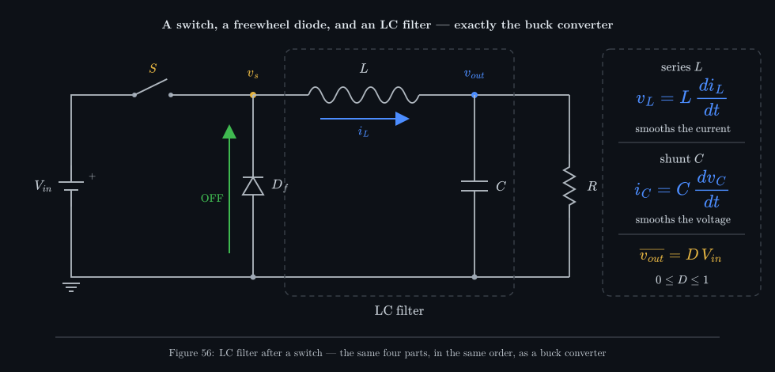

_Switch, freewheel diode, series inductor, shunt capacitor, load. Draw a dashed box around the
inductor and capacitor and call it a filter, or step back and call the whole thing a buck
converter — it is the same circuit, part for part._

Five parts, in order from the source:

- **The switch <!--m:S-->** (in practice a MOSFET) connects the supply 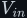<!--m:V_{in}--> to the *switch node*
  <!--m:v_s-->, or disconnects it. It is driven by PWM at a fixed switching frequency <!--m:f_{sw} = 1/T-->;
  the fraction of each period it is ON (closed) is the duty cycle <!--m:D-->.
- **The freewheel diode 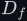<!--m:D_f-->** runs from ground (anode) up to the switch node (cathode). It does
  nothing while the switch is ON (it is reverse-biased by <!--m:V_{in}-->) and carries the inductor's
  current while the switch is OFF (§3).
- **The inductor <!--m:L-->** sits *in series*: every bit of current that reaches the load passes through
  it.
- **The capacitor <!--m:C-->** sits *in parallel* (shunt) with the load: it sees exactly the output voltage.
- **The load <!--m:R-->** — whatever is being powered, modelled here as a resistor.

The switch node <!--m:v_s--> is therefore a square wave between <!--m:V_{in}--> (switch ON) and about <!--m:0\,\mathrm{V}-->
(switch OFF, diode conducting) — a PWM wave. The inductor and capacitor are the **LC filter**, and
the voltage across the load is <!--m:v_{out}-->.

If this looks familiar, it should: it is **exactly the [buck converter](../../dc-dc-converters/buck/)**,
with the same parts in the same order. The buck document derives <!--m:V_{out} = D\,V_{in}--> from
volt-second balance on the inductor; this document reaches the same result from the other side —
by treating the <!--m:L--> and <!--m:C--> as a *filter* that keeps the average of the PWM wave and throws away
the rest. The two views are the same physics, and holding both in your head is what makes the next
step obvious: if the filter keeps the *average*, and the average is something you control, then
you control the output — not just its DC level but its shape over time.

> **Note —** Many tutorials (including the source video for this note) label the load voltage
> <!--m:V_L-->. Here it is <!--m:v_{out}-->, because 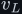<!--m:v_L--> is reserved for the voltage *across the inductor* in
> 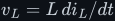<!--m:v_L = L\,di_L/dt-->. Lower-case letters are instantaneous values; an overbar (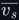<!--m:\overline{v_s}-->)
> means the average over one switching period.

## 2 Two laws, read as smoothing rules

The whole filter is two component laws, each read as a statement about what that part *refuses to
let happen quickly*. Start with the inductor:

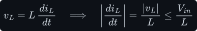

Read it backwards. The inductor's *voltage* can jump around however it likes — in this circuit it
jumps every time the switch flips — but its *current* can only change at a rate set by that
voltage. Since nothing in the circuit is bigger than <!--m:V_{in}-->, the current's slope is **bounded**.
With the numbers used throughout this document (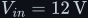<!--m:V_{in} = 12\,\mathrm{V}-->, <!--m:L = 1\,\mathrm{mH}-->):

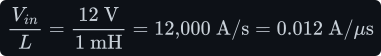

In one <!--m:20\,\mu\mathrm{s}--> switching period the current can move by at most a quarter of an amp, no
matter how violently the voltage across it jumps. That is what "an inductor smooths the current"
means precisely: **a voltage jump becomes a current slope**. The square wave on its left becomes a
gentle triangle of current through it (Fig. 58).

Now the capacitor — the same law with voltage and current swapped:

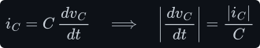

The capacitor's *current* can jump around, but its *voltage* can only change at a rate set by that
current. Feed it a triangle of current and its voltage barely moves: **a current jump becomes a
voltage slope**. That is "a capacitor smooths the voltage".

Then notice *where* each part is placed, because placement is what makes each law useful:

Both bullets below use **impedance**, the AC version of resistance: for a sine wave of angular
frequency 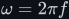<!--m:\omega = 2\pi f-->, the ratio of a part's voltage amplitude to its current amplitude. The
two laws give it at once. A sine current of amplitude <!--m:\hat I--> through the inductor makes
<!--m:v_L = L\,di_L/dt--> of amplitude 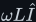<!--m:\omega L\hat I-->, so <!--m:|Z_L| = \omega L-->; a sine voltage of amplitude
<!--m:\hat V--> on the capacitor makes 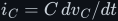<!--m:i_C = C\,dv_C/dt--> of amplitude 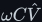<!--m:\omega C\hat V-->, so
<!--m:|Z_C| = 1/(\omega C)--> (the same argument as
[../../fundamentals/signals/edges-and-fourier.md §9](../../fundamentals/signals/edges-and-fourier.md#9-why-the-harmonics-matter-downstream);
§6 adds the timing).

- **The inductor is in series** — in the path of the current. A series element controls what
  *flows through* it, so a part that refuses fast changes of current, placed in series, makes the
  current delivered downstream smooth. At high frequency its impedance <!--m:|Z_L| = \omega L--> is large:
  it *blocks* the switching frequency.
- **The capacitor is in parallel** — across the output. A shunt element controls the voltage
  *across* it, so a part that refuses fast changes of voltage, placed in shunt, holds the output
  voltage steady. At high frequency its impedance <!--m:|Z_C| = 1/(\omega C)--> is small: it *shorts* what
  is left of the switching frequency to ground.

The pair works as a two-stage voltage divider whose ratio collapses at high frequency from both
ends at once — the inductor's impedance rises while the capacitor's falls. Each contributes a factor
of <!--m:\omega-->, which is where the <!--m:-40\,\mathrm{dB}--> per decade of §6 comes from.

> **Tip —** This duality is the same table as in the
> [capacitor document §6](../../fundamentals/capacitor/capacitor.md#6-the-duality--one-table-read-both-ways):
> swap <!--m:V \leftrightarrow I-->, <!--m:L \leftrightarrow C-->, and series <!--m:\leftrightarrow--> parallel, and
> each statement about one part becomes the statement about the other.

## 3 Why the diode has to be there

The inductor's stiffness is a gift while the switch is ON and a threat the instant it opens. At that
moment the inductor is carrying roughly the load current — <!--m:0.6\,\mathrm{A}--> in the running example —
and the law in §2 says that current cannot change instantly. If the switch were the only path, opening
it would force the current from <!--m:0.6\,\mathrm{A}--> to zero in the few nanoseconds the switch takes to
open. The law then demands:

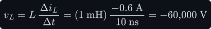

Sixty thousand volts across the inductor, appearing at the switch node with a negative sign. In
practice the switch breaks down and arcs long before that — this is the *inductive kick* described in
the [inductor document §7](../../fundamentals/inductor/inductor.md#7-the-inductive-kick-and-why-the-diode-is-there),
and it destroys transistors.

The freewheel diode removes the problem without being told to. As soon as the switch opens, the
inductor starts dragging the switch-node voltage down; the moment it dips just below ground, the
diode becomes forward-biased and gives the current a path: ground → diode → inductor → load →
ground. The node is clamped near <!--m:0\,\mathrm{V}--> (one diode drop below, in reality), the inductor
sees a bounded voltage 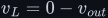<!--m:v_L = 0 - v_{out}-->, and its current ramps *down* gently instead of being
chopped off. The green arrow in Fig. 56 is this freewheeling path. The current never stops — only its
slope changes, from rising to falling.

There is a mirror-image reason the capacitor must not come *first*. Put <!--m:C--> directly on the switch
node with no inductor, and every time the switch closes it connects a stiff 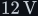<!--m:12\,\mathrm{V}--> source
straight across a capacitor sitting at, say, 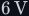<!--m:6\,\mathrm{V}-->:

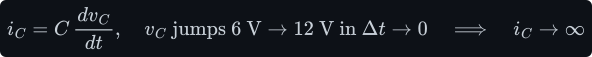

That is a current spike limited only by stray resistance — the capacitor's version of the inductive
kick. The inductor in front prevents it: it is the series element that turns the source's voltage step
into a bounded current ramp *before* the current reaches the capacitor. So the order is not arbitrary:
**switch, then diode, then series <!--m:L-->, then shunt <!--m:C-->** is the one arrangement in which neither part is
ever asked to do the impossible.

## 4 The average of a PWM wave

Before asking what the filter does, pin down what it is being fed. The switch node spends <!--m:DT--> at
<!--m:V_{in}--> and 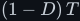<!--m:(1-D)\,T--> at <!--m:0-->. Its average over one period is, by definition, the integral of the
waveform divided by the period:

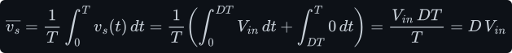

The integral of a rectangle is its area. Only the ON part has any area, 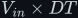<!--m:V_{in} \times DT-->, and
spreading that area over the whole period <!--m:T--> gives a level of <!--m:D\,V_{in}-->. Geometrically: the tall
thin rectangle and the short wide one in Fig. 57 have the same area.

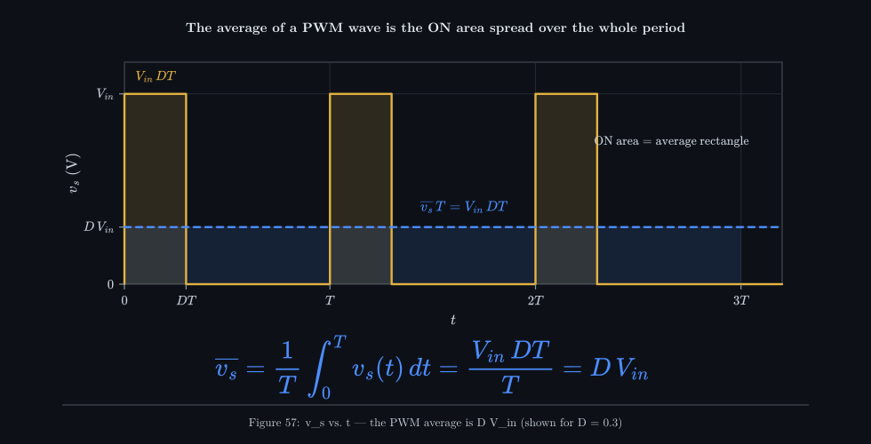

_The shaded ON rectangle (height <!--m:V_{in}-->, width <!--m:DT-->) and the blue average rectangle (height <!--m:D\,V_{in}-->,
width <!--m:T-->) hold the same area. An averaging filter cannot tell them apart._

So a PWM wave is a DC level <!--m:D\,V_{in}--> **plus** a zero-average wobble at the switching frequency
and its harmonics. If the filter can keep the first and discard the second, the output is <!--m:D\,V_{in}-->.
The rest of the document is about how well it does each.

## 5 The circuit equations, and why the filter keeps the average

Write one law for each energy-storing part. The inductor sits between the switch node and the output,
so its voltage is the difference between them; the capacitor sits at the output, and its current is
whatever the inductor delivers minus what the load takes:

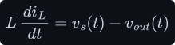

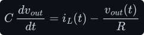

These two equations, with <!--m:v_s--> jumping between <!--m:V_{in}--> and <!--m:0--> (and the diode stopping 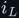<!--m:i_L--> from
going negative), are *exactly* what the simulator behind every waveform figure here integrates — the
figures are numerical solutions of these equations, not sketches.

Now average the inductor equation over one switching period. The left side becomes <!--m:L--> times the
rate of change of the *average* current, and the right side becomes 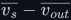<!--m:\overline{v_s} - \overline{v_{out}}-->.
We know 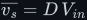<!--m:\overline{v_s} = D\,V_{in}--> from §4. In steady state the average current is not drifting, so
the left side is zero:

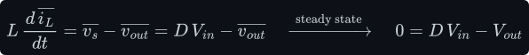

This is volt-second balance — the same argument as the
[buck document §3](../../dc-dc-converters/buck/buck.md#3-volt-second-balance--the-step-down-ratio),
reached by averaging rather than by matching the rise and fall of the current triangle. Notice it says
something stronger than the buck derivation needed: the averaged equations are *linear* in
<!--m:\overline{v_s}-->. Whatever you do to <!--m:\overline{v_s}-->, the averages of <!--m:i_L--> and <!--m:v_{out}--> respond as a
linear circuit driven by it. That is the door to §11.

## 6 The transfer function, derived

Because the averaged circuit is linear, it has a **transfer function** <!--m:H-->: the ratio of output to
input for each frequency. The tool that gets it in three lines is the *Laplace variable* <!--m:s-->. Here
is all of it that this document needs.

- **Derivatives become multiplication.** For a signal that varies as 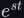<!--m:e^{st}-->, <!--m:d/dt--> just multiplies
  it by <!--m:s-->: 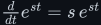<!--m:\tfrac{d}{dt}e^{st} = s\,e^{st}-->. A steady sine is the case 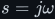<!--m:s = j\omega-->, where
  <!--m:j = \sqrt{-1}-->, because Euler's formula 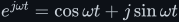<!--m:e^{j\omega t} = \cos\omega t + j\sin\omega t--> packs a
  cosine and a sine into one exponential (the physical signal is the real part). The full Laplace
  transform extends this to any signal, but the rule is the same.
- **So every part has an impedance 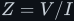<!--m:Z = V/I-->, a plain algebraic factor.** The inductor law
  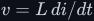<!--m:v = L\,di/dt--> becomes 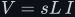<!--m:V = sL\,I-->, so <!--m:Z_L = sL-->. The capacitor law <!--m:i = C\,dv/dt--> becomes
  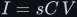<!--m:I = sC\,V-->, so <!--m:Z_C = 1/(sC)-->. A resistor is <!--m:Z_R = R-->. At <!--m:s = j\omega--> their sizes are the
  <!--m:\omega L--> and <!--m:1/(\omega C)--> of §2, and the <!--m:j--> records the quarter-cycle shift.
- **Impedances combine exactly like resistances,** because Kirchhoff's laws are unchanged: in series
  they add; in parallel, 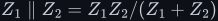<!--m:Z_1 \parallel Z_2 = Z_1 Z_2/(Z_1 + Z_2)-->; and a divider with 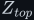<!--m:Z_{top}-->
  above <!--m:Z_{bottom}--> passes the fraction 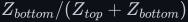<!--m:Z_{bottom}/(Z_{top} + Z_{bottom})--> of its input.

So treat the filter as a voltage divider: the inductor (impedance <!--m:sL-->) on top,
and the parallel combination of capacitor (impedance <!--m:1/(sC)-->) and load <!--m:R--> on the bottom:

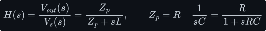

Substitute 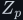<!--m:Z_p--> and clear the inner fractions by multiplying top and bottom by <!--m:(1 + sRC)-->:

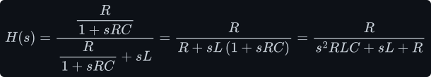

Divide top and bottom by <!--m:R-->:

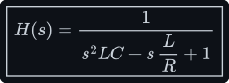

This is the standard second-order low-pass. Matching it term by term against the textbook form names
its two parameters — the natural (corner) frequency <!--m:\omega_0--> and the quality factor <!--m:Q-->:

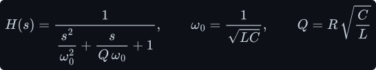

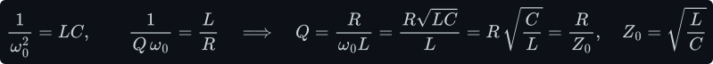

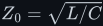<!--m:Z_0 = \sqrt{L/C}--> is the filter's *characteristic impedance*. <!--m:Q--> is simply the load resistance
measured in units of <!--m:Z_0-->: a heavy load (small <!--m:R-->) gives a small <!--m:Q-->, a light load (large <!--m:R-->) a
large one. Put <!--m:s = j\omega--> to get the response to a sine. Then 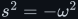<!--m:s^2 = -\omega^2-->, so the
denominator becomes a complex number 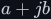<!--m:a + jb--> with 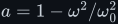<!--m:a = 1 - \omega^2/\omega_0^2--> and
<!--m:b = \omega/(Q\omega_0)-->. Its size is <!--m:\sqrt{a^2 + b^2}--> (Pythagoras on the real and imaginary
parts), and the size of <!--m:1/(a + jb)--> is <!--m:1/\sqrt{a^2 + b^2}-->. That is the magnitude response:

Three regimes tell you everything:

- **Far below <!--m:\omega_0-->** the gain is 1: slow things pass untouched. DC — the average — is the
  slowest thing there is (<!--m:H(0) = 1--> exactly).
- **At <!--m:\omega_0-->** the gain is <!--m:Q-->. For <!--m:Q > 1--> the filter *amplifies* signals near its resonance —
  the peak in Fig. 60.
- **Far above <!--m:\omega_0-->** the gain falls as the square of frequency. In decibels (<!--m:20\log_{10}--> of an
  amplitude ratio, as defined in
  [../../fundamentals/signals/edges-and-fourier.md §3](../../fundamentals/signals/edges-and-fourier.md#3-why-steep-edges-matter--c-dvdt-and-l-didt)),
  per *decade* (a factor of 10 in frequency):

Every factor of ten in frequency costs a factor of a hundred in amplitude — one factor of ten from the
inductor's rising impedance and one from the capacitor's falling one, as promised in §2.

_The same <!--m:L--> and <!--m:C--> with three loads. All three agree far from <!--m:f_0-->: flat at 50 Hz, a <!--m:-40\,\mathrm{dB}-->/decade
cliff above. Only near <!--m:f_0--> does the load matter — a light load lets the resonance peak up to
<!--m:+12\,\mathrm{dB}--> (<!--m:Q = 4-->), a heavy one rounds it off._

## 7 Choosing the corner frequency — and the design used here

The filter has one job with two sides: pass the thing you want, reject the switching frequency. So
<!--m:f_0--> must sit **far above the slowest-changing signal you want to keep** and **far below the switching
frequency**. For a DC supply the first condition is free. For the inverter this tree is building
towards, the signal is a <!--m:50\,\mathrm{Hz}--> sine and the switching frequency is <!--m:50\,\mathrm{kHz}-->, so:

Placing <!--m:f_0--> at the geometric mean gives equal margin on both sides: a factor of about 32 (one and a
half decades) each way. The design used for every figure in this document does exactly that:

with <!--m:V_{in} = 12\,\mathrm{V}-->, <!--m:L = 1\,\mathrm{mH}-->, <!--m:C = 10\,\mu\mathrm{F}-->, <!--m:R = 10\,\Omega-->. Reading the
Bode plot (Fig. 60: <!--m:|H|--> in decibels against frequency on a logarithmic axis) at the two
frequencies that matter:

The switching frequency is cut by a factor of a thousand; the <!--m:50\,\mathrm{Hz}--> signal passes at full
size with only about <!--m:1.8°--> of phase lag (the phase is worked out in §12). How these particular values of <!--m:L--> and <!--m:C--> were picked from
<!--m:f_0--> and <!--m:Z_0--> is in §14.

## 8 Ripple — what the filter lets through

A thousand-fold attenuation is not infinite, so something of the switching survives. Compute it two
ways and check that they agree.

**Inductor current ripple.** While the switch is ON the inductor sees <!--m:V_{in} - V_{out} = V_{in}(1-D)-->
for a time <!--m:DT-->, so its current rises by:

(It falls by the same amount while OFF — that is steady state.) <!--m:D(1-D)--> peaks at <!--m:D = 0.5-->, so the
running example is the worst case.

**Capacitor voltage ripple.** The load takes the average current; the capacitor absorbs the triangle's
deviation from it, a triangle centred on zero. The charge in its positive half is <!--m:T\,\Delta I_L/8--> (the
same triangle-area argument as the
[buck document §5](../../dc-dc-converters/buck/buck.md#5-sizing-the-output-capacitor)), so:

Fifteen millivolts on six volts — a quarter of a percent. Substituting <!--m:\Delta I_L-->, and writing
<!--m:1/(LC) = \omega_0^2 = (2\pi f_0)^2-->, shows the ripple is the filter-attenuation story in disguise
(the last step uses <!--m:D(1-D) \le \tfrac14-->):

The ripple scales as <!--m:(f_0/f_{sw})^2--> — exactly the <!--m:-40\,\mathrm{dB}-->/decade slope evaluated at the
switching frequency. Halve <!--m:f_0--> (or double <!--m:f_{sw}-->) and the ripple drops by four.

_The simulation agrees with the hand calculation to the digit: a <!--m:0.060\,\mathrm{A}--> current triangle and a
<!--m:15.0\,\mathrm{mV}--> voltage ripple. On the <!--m:0-->–<!--m:12\,\mathrm{V}--> scale (third panel) the output is a ruler-straight
line; only a thousand-fold zoom (bottom) shows the residue, now nearly a sine because the filter has
stripped the square wave's harmonics._

## 9 Constant D gives flat DC; change D, change the DC

Hold the duty cycle fixed and the output is a straight line at <!--m:D\,V_{in}--> — the third panel of Fig. 58,
and what the source video shows in its first output trace. Change the fixed value and the line moves:

_Narrow pulses give a low line, wide pulses a high one: <!--m:D = 0.25, 0.5, 0.75--> give <!--m:3, 6, 9\,\mathrm{V}--> from
a <!--m:12\,\mathrm{V}--> supply. Every one of them is still DC — the output has no time-variation beyond the
millivolt ripple._

This is already useful — it is a step-down DC supply with an adjustable output — but on its own it is
still just DC. The interesting question is what happens *between* the flat lines, when <!--m:D--> changes.

## 10 A step in D — ringing, and damping by the load

Jump <!--m:D--> from <!--m:0.25--> to <!--m:0.75-->. The average of the switch node jumps from <!--m:3\,\mathrm{V}--> to <!--m:9\,\mathrm{V}-->
instantly, but the output cannot: the capacitor's voltage can only rise as fast as the inductor's current
lets it, and that current can only rise as fast as <!--m:V_{in}/L--> allows. The output follows the
second-order step response of <!--m:H(s)-->. That response is derived in
[../../dc-dc-converters/buck/startup.md §3–§4](../../dc-dc-converters/buck/startup.md#3-the-averaged-model--a-second-order-lc-step)
in terms of the damping ratio <!--m:\zeta-->; comparing its standard form with §6 here gives
<!--m:\zeta = 1/(2Q)-->, so the overshoot <!--m:e^{-\pi\zeta/\sqrt{1-\zeta^2}}--> and the envelope time constant
<!--m:\tau = 1/(\zeta\omega_0)--> become, in terms of <!--m:Q-->:

_Same filter, three loads. At <!--m:Q = 1--> (blue) the output overshoots to about <!--m:10\,\mathrm{V}--> and settles
within a millisecond. The light load (red, <!--m:Q = 4-->) overshoots to about <!--m:13\,\mathrm{V}--> — above the
<!--m:12\,\mathrm{V}--> supply — and rings for several milliseconds. The heavy load (green) never overshoots but
is slow._

Three things to take from it:

- **The load resistor is the only damper.** An ideal <!--m:L--> and <!--m:C--> trade energy back and forth forever;
  the resistor is what bleeds that oscillation away, with time constant <!--m:2RC-->. Remove the load and the
  filter would ring indefinitely.
- **The output can exceed the supply.** Energy stored in the inductor during the rise keeps pushing
  charge into the capacitor after it has reached the target. A light-load design must survive that
  overshoot.
- **The diode makes the downward step asymmetric.** On the fall (at <!--m:3.5\,\mathrm{ms}-->) the light-load
  ringing is visibly shorter than on the rise. Ringing needs the inductor current to swing negative,
  and the diode refuses to conduct backwards; the current sits at zero for part of each cycle
  (*discontinuous conduction*), which damps the oscillation. The simulator models this; an idealised
  linear analysis would not.

The practical upshot: the filter needs a few resonant periods (<!--m:1/f_0 \approx 0.63\,\mathrm{ms}--> each) to
follow a sudden change. It is not instantaneous — and that is the speed limit of §12.

## 11 The big idea — vary D cycle by cycle

Nothing says <!--m:D--> has to be the same in every switching period. The switch controller can choose a new
duty cycle for each period — narrow pulses here, wide ones there. Ramp <!--m:D--> up over many periods and the
local average of the switch node ramps up with it; the filter, which passes slow things and rejects the
switching, delivers that slowly-moving average to the load:

_Pulses grow from a sliver to nearly full width and back. The output (solid) follows the local average
<!--m:D(t)\,V_{in}--> (dashed) up and back down. The switching is slowed to <!--m:10\,\mathrm{kHz}--> here so every pulse
can be seen; that is why the ripple is visible and the lag is noticeable._

This is the linearity of §5 paying off. The averaged circuit is linear and driven by
<!--m:\overline{v_s}(t) = D(t)\,V_{in}-->, so the averaged output is that input passed through <!--m:H(s)-->:

For a ramp, the filter's finite speed shows up as a constant delay — the output runs parallel to the
target, a fixed time behind it. The reason: for slowly varying inputs <!--m:s--> is small, and
<!--m:H(s) = 1/(1 + sL/R + s^2LC) \approx 1 - sL/R--> (drop the tiny <!--m:s^2--> term and use
<!--m:1/(1 + x) \approx 1 - x-->). Multiplying by <!--m:s--> means differentiating, so the output is the input minus
<!--m:L/R--> times its slope — which for a straight line is the same line shifted <!--m:L/R--> later:

<!--m:L/R = 0.1\,\mathrm{ms}--> here, plus about half a switching period because each period's duty cycle is
decided at its start — together the visible gap in Fig. 62.

The ramp is just one shape. Make <!--m:D(t)--> a sinusoid and the output is a sinusoid:

_A sinusoidal duty-cycle pattern produces a sinusoidal output. Its centre is <!--m:V_{in}/2-->, its peaks
approach <!--m:V_{in}--> and <!--m:0--> — never beyond. At <!--m:500\,\mathrm{Hz}--> (a third of <!--m:f_0-->) the filter's phase lag is
already visible._

Now do it with realistic numbers — a <!--m:50\,\mathrm{Hz}--> pattern on a <!--m:50\,\mathrm{kHz}--> carrier, a thousand
switching periods per output cycle:

_Top: two <!--m:200\,\mu\mathrm{s}--> windows of the switch node — wide pulses near the crest, slivers near the
trough. Bottom: the simulated output (blue) lies on top of <!--m:D(t)\,V_{in}--> (dashed amber); with three
decades between the signal and the switching, the ripple and lag are invisible. But it is a sine around
<!--m:6\,\mathrm{V}-->, not around zero (red: what an AC load needs)._

This is the central idea of every modern inverter, motor drive and class-D amplifier: **a switch that is
only ever fully on or fully off, plus an LC filter, behaves like a voltage source you can program in
time**. The pattern of duty cycles *is* the waveform; the filter just erases the switching. How to
generate that pattern — comparing a sine against a triangle carrier — is
[sinusoidal PWM](../../dc-ac-inverters/spwm/); the general machinery of duty cycle and carriers is in
[pwm/](../../pwm/).

## 12 How fast may D change?

The phrase "well below <!--m:f_0-->" in §11 carries the whole caveat. The filter cannot tell the difference
between a fast change of <!--m:D--> that you *wanted* and switching ripple that you didn't — both are just
high-frequency content, and both are attenuated alike. The phase of <!--m:H--> shows how the delay grows. With the denominator
<!--m:a + jb--> of §6, the phase of <!--m:1/(a + jb)--> is <!--m:-\arctan(b/a)-->, the angle of the point <!--m:(a, b)-->
measured from the real axis and reversed in sign:

_The same duty-cycle sine at three speeds. At a tenth of <!--m:f_0--> the output tracks it. At <!--m:f_0--> the output is
a quarter-cycle late (and, with a lighter load, would also be <!--m:Q--> times too big). At three times <!--m:f_0--> the
filter treats the wanted signal as ripple and removes almost all of it._

So there are two separate conditions for <!--m:v_{out}(t) \approx D(t)\,V_{in}-->:

1. **<!--m:D--> must change slowly compared with <!--m:f_{sw}-->** — many switching periods per feature of the waveform —
   or there is no meaningful "local average" to follow.
2. **The waveform's frequency content must sit well below <!--m:f_0-->** — or the filter itself distorts it.

Both are the same separation, <!--m:f_{signal} \ll f_0 \ll f_{sw}-->, read from the two ends.

## 13 One switch, one polarity — the road to the inverter

Every output in this document stays between <!--m:0--> and <!--m:V_{in}-->, and it cannot do otherwise. The switch node
only ever takes the values <!--m:V_{in}--> and <!--m:0-->, and the duty cycle is a fraction:

A single switch can make any *slow, one-polarity* waveform — a DC level, a ramp, a sine riding on an
offset — but never a voltage below zero. Mains-style AC must swing both ways (red trace, Fig. 64).
Blocking the offset with a series capacitor is no answer for <!--m:50\,\mathrm{Hz}--> power: the capacitor
would be enormous and the offset still wastes half the supply's range.

The fix is to make the switch node itself bipolar. An
[H-bridge](../../dc-ac-inverters/h-bridge/) of four switches can connect the load either way round
across the supply, so the voltage between its two output nodes takes the values <!--m:+V_{in}--> and
<!--m:-V_{in}-->. Averaging that wave exactly as in §4:

Now <!--m:D = 0.5--> gives zero, <!--m:D > 0.5--> positive and <!--m:D < 0.5--> negative output, and the very same LC filter
and the very same cycle-by-cycle trick produce a true AC sine. That is the inverter, assembled from the
three ideas of this document: PWM average, LC filtering, and a duty cycle that moves.

## 14 What this costs you

- **Size and weight.** The filter's <!--m:L--> and <!--m:C--> must store enough energy to bridge a switching period at
  full load. At low switching frequency they are big; the <!--m:(f_0/f_{sw})^2--> ripple law is why designers
  chase higher <!--m:f_{sw}--> — which in turn costs switching loss in the transistor and diode.
- **Sizing is a two-number choice.** <!--m:f_0--> fixes the product <!--m:LC-->; the split between them is set by
  <!--m:Z_0 = \sqrt{L/C}-->, which should be comparable to the load so that <!--m:Q--> lands near 1. Given <!--m:f_0--> and
  <!--m:Z_0-->:

  

  This is how the running example was chosen: <!--m:\omega_0 = 10^4\,\mathrm{rad\cdot s^{-1}}--> (<!--m:f_0 \approx 1.59\,\mathrm{kHz}-->,
  the geometric mean of <!--m:50\,\mathrm{Hz}--> and <!--m:50\,\mathrm{kHz}-->) and <!--m:Z_0 = R = 10\,\Omega--> for <!--m:Q = 1-->.
  A bigger <!--m:L--> with a smaller <!--m:C--> lowers the ripple current but makes the filter softer (output sags more
  under sudden load steps); the reverse needs a capacitor that can carry more ripple current.
- **Resonance and load dependence.** <!--m:Q = R/Z_0--> depends on the load, which the designer does not
  control. At light load <!--m:Q--> grows, the response peaks at <!--m:f_0--> (Fig. 60) and steps ring and overshoot
  above the supply (Fig. 61). At no load an ideal filter would not damp at all. Real designs add damping
  (a resistor in series with an extra capacitor across the output, or active damping in the control
  loop) and rely on feedback rather than trusting <!--m:v_{out} = D\,V_{in}--> open-loop.
- **A speed limit.** The output can only follow <!--m:D(t)--> for frequencies well below <!--m:f_0-->, and <!--m:f_0--> must
  stay well below <!--m:f_{sw}-->. A <!--m:50\,\mathrm{Hz}--> inverter is comfortable; synthesising a <!--m:20\,\mathrm{kHz}-->
  audio signal needs a switching frequency in the hundreds of kilohertz.
- **Losses and non-idealities.** The inductor's winding resistance, the capacitor's ESR (which adds its own
  ripple term, often larger than the <!--m:15\,\mathrm{mV}--> computed here), the diode's forward drop (so
  <!--m:v_{out}--> sits slightly below <!--m:D\,V_{in}-->), and the diode's refusal to conduct backwards at light load
  (discontinuous conduction, §10), which breaks the linear model. Synchronous rectification — a second
  transistor in place of the diode — removes the drop and the discontinuity at the cost of gate-drive
  complexity.
- **One polarity only.** A single switch with an LC filter cannot go negative (§13); AC needs the
  four-switch H-bridge and twice the transistors.

## 15 Sources and cross-links

- **The same circuit as a DC-DC converter:** [../../dc-dc-converters/buck/](../../dc-dc-converters/buck/)
  — volt-second balance, inductor and capacitor sizing; its start-up behaviour is in
  [../../dc-dc-converters/buck/startup.md](../../dc-dc-converters/buck/startup.md).
- **The two laws:** [../../fundamentals/inductor/](../../fundamentals/inductor/) (<!--m:v_L = L\,di/dt-->, the
  inductive kick) and [../../fundamentals/capacitor/](../../fundamentals/capacitor/) (<!--m:i_C = C\,dv/dt-->,
  the duality table).
- **Frequency, phase and decibels:** [../../fundamentals/signals/](../../fundamentals/signals/).
- **Where this leads:** [../../pwm/](../../pwm/) (duty cycle and carriers),
  [../../dc-ac-inverters/spwm/](../../dc-ac-inverters/spwm/) (sinusoidal PWM — the <!--m:D(t)--> pattern of §11)
  and [../../dc-ac-inverters/h-bridge/](../../dc-ac-inverters/h-bridge/) (the bipolar switch node of §13).
- **Source material:** the walkthrough this note expands (a tutorial video on DC-to-AC conversion, PWM and
  LC filtering, around 9:30–10:20). Every waveform here is re-derived and re-simulated rather than copied:
  the simulator is `toolchain/figures/lc_filter.js`, which integrates the equations of §5 with exact
  switching edges and an ideal diode.
- Style and figure conventions: [../../STYLE.md](../../STYLE.md).
