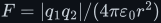
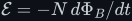
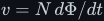
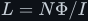
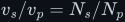
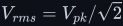
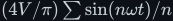
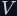

# Fundamentals — the defining laws and the language of waveforms

The whole of switched-mode power conversion rests on two component laws and a little calculus, and
those two laws rest on three field laws. This topic builds the field laws first (Coulomb's, Ampère's
and Faraday's), derives the inductor and capacitor laws from them, ties all of it together in an
overview, uses it to derive the transformer, and sets up the waveform language — Fourier series, AC
and RMS — that the inverter documents speak. So when you reach the
[buck](../dc-dc-converters/buck/) and [boost](../dc-dc-converters/boost/) converters, the
[rectifiers](../rectifiers/) or the [inverters](../dc-ac-inverters/), nothing is asserted — it is
all derived.

> **The thesis in one line**
>
> An inductor fixes how fast **current** can change; a capacitor fixes how fast **voltage** can
> change. They are exact mirrors of each other — learn one and you get the other by swapping
> <!--m:V \leftrightarrow I--> and <!--m:L \leftrightarrow C-->.

## Documents

| Subtopic | The law | What it covers |
|---|---|---|
| [coulombs-law/](coulombs-law/) | <!--m:F = \lvert q_1 q_2\rvert/(4\pi\varepsilon_0 r^2)--> | charge and its quantum <!--m:e-->; current as charge per second, <!--m:1\ \mathrm{A} = 1\ \mathrm{C\cdot s^{-1}}-->; the force between two charges with every symbol and unit; superposition; the electric field; work, potential and the volt, <!--m:1\ \mathrm{V} = 1\ \mathrm{J\cdot C^{-1}}-->; Gauss's law; parallel-plate capacitance <!--m:C = \varepsilon_0 A/d-->; why there is no magnetic charge (Figures 91–99) |
| [amperes-law/](amperes-law/) | <!--m:\oint \vec{B}\cdot d\vec{l} = \mu_0 I_{enc}--> | the magnetic field and the tesla; Oersted's compass; the right-hand grip rule; Biot–Savart; the circuital law applied to the wire, the conductor's inside, the solenoid, the toroid and the coaxial cable; H and cores; the force between wires; displacement current (Figures 100–113) |
| [faradays-law/](faradays-law/) | <!--m:\mathcal{E} = -N\,d\Phi_B/dt--> | flux and the weber; flux linkage <!--m:\lambda = N\Phi_B-->; what an EMF is; the flux rule and Lenz's minus sign; motional and transformer EMF; the Maxwell–Faraday equation and curl; the Faraday paradox; the generator, transformer, inductor, eddy currents and the induction cooktop (Figures 115–134) |
| [inductor/](inductor/) | <!--m:V_L = L \cdot dI/dt--> | the inductor law derived from Faraday's law with the minus sign accounted for; magnetic-field storage; the constant-voltage ramp (with the definite-integral proof done slowly); the polarity flip that powers a boost; the inductive-kick footgun (Figures 1–3, 90, 135–136) |
| [capacitor/](capacitor/) | <!--m:I_C = C \cdot dV/dt--> | electric-field storage, **the proper proof of why you may differentiate <!--m:Q = C \cdot V-->**, the mirror ramp, and the inductor↔capacitor duality (Figures 4–6) |
| [electromagnetism/](electromagnetism/) | <!--m:v = N\,d\Phi/dt--> | **the overview** that ties the three field laws together and puts them to work on windings: flux as the running integral of voltage; Lenz's sign in circuit form; self-inductance <!--m:L = N\Phi/I-->, which derives the inductor law; mutual inductance; energy in the field; magnetic materials; frequency and core size; displacement current; Maxwell's four equations; a symbol and unit table (Figures 13–19) |
| [transformer/](transformer/) | <!--m:v_s/v_p = N_s/N_p--> | the ideal transformer from Faraday's law; turns ratio for voltage and current; magnetising inductance; peak core flux <!--m:\hat\Phi = V/(4Nf)-->, so a higher frequency means a smaller core; saturation and why DC cannot pass; core and copper losses; 50 Hz iron vs 50 kHz ferrite (Figures 30–39) |
| [signals/](signals/) | <!--m:V_{rms} = V_{pk}/\sqrt2--> | [AC and RMS](signals/ac-and-rms.md) (why 230 V means 325 V peak, RMS vs average, South African mains quality under NRS 048-2); [edges and Fourier series](signals/edges-and-fourier.md) (rise time, slew rate, the square wave as <!--m:(4V/\pi)\sum \sin(n\omega t)/n-->, the H-bridge spectrum, THD) (Figures 20–29) |

## Reading order

1. [coulombs-law/coulombs-law.md](coulombs-law/coulombs-law.md) — start here: charge, current,
   the electric field and the volt, which every later document uses.
2. [amperes-law/amperes-law.md](amperes-law/amperes-law.md) — a current makes a magnetic field;
   the solenoid field that every coil and core is built on.
3. [faradays-law/faradays-law.md](faradays-law/faradays-law.md) — a *changing* flux makes an EMF,
   and Lenz's minus sign.
4. [inductor/inductor.md](inductor/inductor.md) — Faraday's law applied to a coil's own flux gives
   the inductor law; the ramp argument is simplest to see with current as the effect.
5. [capacitor/capacitor.md](capacitor/capacitor.md) — the mirror law, plus the calculus rule that
   the whole subject leans on.
6. [electromagnetism/electromagnetism.md](electromagnetism/electromagnetism.md) — the overview:
   the three field laws side by side, the inductor law derived again from self-inductance, energy,
   mutual inductance, cores and saturation, and frequency against core size — the bridge to the
   transformer.
7. [transformer/transformer.md](transformer/transformer.md) — Faraday's law applied to two
   windings on one core.
8. [signals/ac-and-rms.md](signals/ac-and-rms.md), then
   [signals/edges-and-fourier.md](signals/edges-and-fourier.md) (which uses the RMS result) — the
   waveform language for the inverter documents.

If you already know the physics, you can start at step 4 and follow the links back to the field-law
documents whenever a law is used.

## Conventions

Follows [../STYLE.md](../STYLE.md). All maths and diagrams are generated SVGs — display equations,
inline symbols, and the arXiv-style <!--m:V-->-vs-<!--m:t--> / <!--m:I-->-vs-<!--m:t--> figures are each typeset once by the
[toolchain](../../toolchain/README.md) and embedded as images, so they render identically
everywhere with no markdown math plugin.
