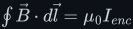
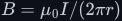
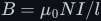
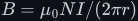

# Ampère's law

How a current makes a magnetic field, built from nothing. It covers the force that defines the
field and the tesla, Oersted's compass, the right-hand grip rule, and the Biot–Savart law. Then
comes Ampère's circuital law <!--m:\oint \vec{B}\cdot d\vec{l} = \mu_0 I_{enc}-->,
used step by step on the wire, the inside of a conductor, the solenoid, the toroid and the
coaxial cable. Last come the H-field and cores, the force between wires, and Maxwell's correction.
The full argument is in [amperes-law.md](amperes-law.md), in sixteen sections with fourteen
figures (Figures 100–113), four of them animated.

> **The thesis in one line**
>
> A current is wrapped in a magnetic field that circles it. Walk once around any closed loop,
> adding up the field along your path, and the total depends only on the current that threads
> the loop.

## Contents

1. The magnetic field <!--m:\vec{B}-->, the force <!--m:q\vec{v}\times\vec{B}--> on a moving charge, and the tesla
   (<!--m:\mathrm{T = N\cdot A^{-1}\cdot m^{-1} = V\cdot s\cdot m^{-2}}-->); the force <!--m:BIL--> on a wire.
2. Oersted's discovery: a current turns a compass needle (Figure 101, animated; Figure 100,
   animated).
3. **The right-hand grip rule**, the dot and cross symbols, and the rule for a coil (Figures
   102–104).
4. The Biot–Savart law, every symbol defined, and the units of <!--m:\mu_0--> (Figure 105).
5. The long straight wire by Biot–Savart, in eight steps:
   <!--m:B = \mu_0 I/(2\pi r)-->; <!--m:10\ \mathrm{A}--> at <!--m:1\ \mathrm{cm}--> is <!--m:200\ \mu\mathrm{T}-->.
6. Ampère's circuital law: the line integral done slowly, the enclosed current and its sign, why the
   loop's shape drops out, and why symmetry decides the loop (Figures 106 animated, 107).
7. The straight wire again in three steps, compared with Biot–Savart; Oersted's 33.7°.
8. Inside the conductor: <!--m:B \propto r--> (Figure 108).
9. The solenoid, <!--m:B = \mu_0 N I/l-->, with a rectangular Amperian loop; 100 turns over 5 cm;
   how long "long" must be (Figure 109).
10. The toroid, <!--m:B = \mu_0 N I/(2\pi r)--> (Figure 110).
11. The coaxial cable: four regions, no field outside, inductance per metre (Figure 111).
12. H, permeability <!--m:\mu = \mu_0\mu_r-->, ferromagnetic cores and saturation.
13. The force between parallel wires and the old definition of the ampere (Figure 112).
14. Maxwell's correction: displacement current and the speed of light (Figure 113).
15. What this costs you.
16. Sources and cross-links.

## Reading order

Read [../coulombs-law/](../coulombs-law/) first for charge and the electric field. Then read
[amperes-law.md](amperes-law.md), then [../faradays-law/](../faradays-law/), the partner law in
which a changing field makes a voltage. After that, [../inductor/](../inductor/) and
[../capacitor/](../capacitor/) apply the laws to the two components, and
[../electromagnetism/](../electromagnetism/), the overview, puts them together into inductance,
cores and transformers.

## Links

- Parent index: [../README.md](../README.md)
- Style guide: [../../STYLE.md](../../STYLE.md)
- Companion laws: [../coulombs-law/](../coulombs-law/), [../faradays-law/](../faradays-law/)
- The field laws together: [../electromagnetism/](../electromagnetism/)
- The component built on §9: [../inductor/](../inductor/)
