# Ampère's law — how a current makes a magnetic field

Every inductor, transformer, motor and relay in this tree works because **a current is wrapped in
a magnetic field**. This document builds that fact from nothing. It starts with what a magnetic
field *is* (the force it puts on a moving charge), then Oersted's discovery that a current makes
one, and the right-hand grip rule that gives its direction. Then come the two laws that give its
size. The **Biot–Savart law** adds up the field piece by piece. **Ampère's circuital law** gets
the same answer in one line whenever the geometry is symmetric enough. Both are used, step by step,
on the long straight wire, the inside of a conductor, the solenoid, the toroid and the coaxial
cable. Then come the H-field and magnetic cores, the force between two wires (which used to define
the ampere), and Maxwell's correction, which completes the law. Every result has worked numbers.

**Contents**

1. [The magnetic field B and the force on a moving charge](#1-the-magnetic-field-b-and-the-force-on-a-moving-charge)
2. [Oersted's discovery — a current makes a magnetic field](#2-oersteds-discovery--a-current-makes-a-magnetic-field)
3. [The right-hand grip rule](#3-the-right-hand-grip-rule)
4. [The Biot-Savart law](#4-the-biot-savart-law)
5. [The long straight wire by Biot-Savart](#5-the-long-straight-wire-by-biot-savart)
6. [Ampere's circuital law](#6-amperes-circuital-law)
7. [The straight wire again by Ampere's law](#7-the-straight-wire-again-by-amperes-law)
8. [Inside the conductor — B grows in proportion to r](#8-inside-the-conductor--b-grows-in-proportion-to-r)
9. [The solenoid](#9-the-solenoid)
10. [The toroid](#10-the-toroid)
11. [The coaxial cable](#11-the-coaxial-cable)
12. [H, permeability and ferromagnetic cores](#12-h-permeability-and-ferromagnetic-cores)
13. [The force between parallel wires and the old ampere](#13-the-force-between-parallel-wires-and-the-old-ampere)
14. [Maxwell's correction — displacement current](#14-maxwells-correction--displacement-current)
15. [What this costs you](#15-what-this-costs-you)
16. [Sources and cross-links](#16-sources-and-cross-links)

> **The thesis in one line**
>
> A current is wrapped in a magnetic field that circles it. Walk once around any closed loop,
> adding up the field along your path, and the total depends only on the current that threads the
> loop. Nothing else matters: not the loop's shape, and not currents outside it.

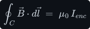

**What you need first.** Electric charge, the coulomb, the electric field <!--m:\vec{E}--> and the
permittivity of free space <!--m:\varepsilon_0--> are built in [../coulombs-law/](../coulombs-law/). This
document uses them only in §1 (one line) and §14. The partner law, in which a *changing* magnetic
field makes a voltage, is [../faradays-law/](../faradays-law/). Read it after this one.

---

## 1 The magnetic field B and the force on a moving charge

**Charge and current.** Charge <!--m:q--> is measured in **coulombs** (C) (see
[../coulombs-law/](../coulombs-law/)). A **current** <!--m:I--> is the rate at which charge <!--m:Q--> flows past a
point. Its unit is the **ampere** (A), and one ampere is one coulomb per second:

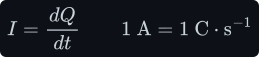

By convention the direction of a current is the direction *positive* charge would move. This is
called **conventional current**. In a metal wire the carriers are electrons, which carry negative
charge and drift the other way, but every rule in this document uses conventional current.

**Vectors.** An arrow over a symbol marks a vector, a quantity with a size and a direction:
<!--m:\vec{v}--> is the velocity of a charge (in <!--m:\mathrm{m\cdot s^{-1}}-->), and <!--m:v--> without the arrow is
its size. A hat marks a **unit vector**, an arrow of length exactly one that carries a direction
only.

**What a magnetic field is.** Put a charge <!--m:q--> near a magnet or near a wire carrying current. If the
charge sits still, the magnet does nothing to it. If it *moves*, it feels a force, and that force
has three strange properties. It is proportional to the speed. It vanishes for one particular
direction of motion. And it always points sideways, at right angles to the motion. A vector field
<!--m:\vec{B}-->, the **magnetic field** (also called the *magnetic flux density*), sums up all three. Its
direction at each point is the direction of motion that feels no force. Its size sets how strong
the force is. The force is

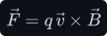

- <!--m:\vec{F}--> — the force on the charge, in newtons (N);
- <!--m:q--> — the charge, in coulombs (C), with its sign;
- <!--m:\vec{v}--> — the charge's velocity, in <!--m:\mathrm{m\cdot s^{-1}}-->;
- <!--m:\vec{B}--> — the magnetic field where the charge is, in **tesla** (T, defined below);
- <!--m:\times--> — the **cross product**, defined next.

This equation is the *definition* of <!--m:\vec{B}-->: the magnetic field is whatever vector makes this
force law come out right at every point.

**The cross product.** For two vectors 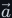<!--m:\vec{a}--> and <!--m:\vec{b}--> with an angle <!--m:\theta--> between them,
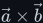<!--m:\vec{a}\times\vec{b}--> is a third vector:

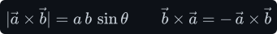

- **Size:** 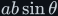<!--m:ab\sin\theta-->. It is largest when the two vectors are at right angles and zero when
  they are parallel.
- **Direction:** perpendicular to *both* <!--m:\vec{a}--> and <!--m:\vec{b}-->. Of the two directions that are
  perpendicular to both, the **right-hand rule for the cross product** picks one. Point the
  fingers of your right hand along <!--m:\vec{a}-->, curl them toward <!--m:\vec{b}--> through the smaller angle,
  and your thumb points along <!--m:\vec{a}\times\vec{b}-->.
- **Order matters:** swapping the two reverses the result.

Applied to 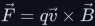<!--m:\vec{F} = q\vec{v}\times\vec{B}-->, with <!--m:\theta--> the angle between the velocity and the
field:

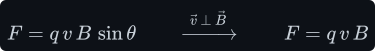

Two consequences matter later. First, a charge moving *along* the field (<!--m:\theta = 0-->) feels
nothing, which is how the direction of <!--m:\vec{B}--> was defined. Second, the force is always at right
angles to the velocity, so it can bend a path but never speed a charge up. The power the force
delivers, force dotted with velocity (the **dot product** 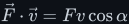<!--m:\vec{F}\cdot\vec{v} = Fv\cos\alpha-->, where
<!--m:\alpha--> is the angle between them), is zero:

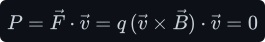

A static magnetic field does no work on a free charge. (Energy enters and leaves magnetic fields
through the electric field that a *changing* magnetic field makes, which is
[../faradays-law/](../faradays-law/).) Add the electric force 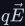<!--m:q\vec{E}--> from
[../coulombs-law/](../coulombs-law/) and you have the complete **Lorentz force** on a charge:

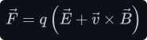

**The tesla.** Read the unit of <!--m:B--> off the force law, with <!--m:\vec{v}--> perpendicular to <!--m:\vec{B}--> so
that 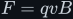<!--m:F = qvB-->:

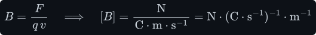

A coulomb per second is an ampere, so

That is the first form of the tesla: **a field of one tesla pushes with one newton on each metre of
wire carrying one ampere across it** (the wire force is derived just below). For the second form,
rewrite the newton. Work is force times distance, so a newton is a joule per metre. A volt is a
joule per coulomb, so a joule is a volt times a coulomb:

Substitute, then collect the coulomb and the ampere. A coulomb per ampere is a second, because an
ampere is a coulomb per second:

So 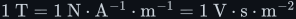<!--m:1\ \mathrm{T} = 1\ \mathrm{N\cdot A^{-1}\cdot m^{-1}} = 1\ \mathrm{V\cdot s\cdot m^{-2}}-->. The second form says a
tesla is *volt-seconds spread over an area*. That is the form that matters in Faraday's law and in
transformer design ([../faradays-law/](../faradays-law/)).

For scale: the Earth's field is about <!--m:50\ \mu\mathrm{T}--> (25 to 65 depending on where you stand), a
fridge magnet about <!--m:5\ \mathrm{mT}-->, a ferrite transformer core runs at <!--m:0.1--> to <!--m:0.3\ \mathrm{T}-->, the
surface of a neodymium magnet about <!--m:1\ \mathrm{T}-->, and a hospital MRI scanner <!--m:1.5--> to <!--m:3\ \mathrm{T}-->.

**The force on a wire.** A wire carrying current is full of moving charge, so a magnetic field
pushes on it. Take a short piece of wire <!--m:d\vec{l}-->: a vector whose length 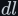<!--m:dl--> is the length of the
piece (m) and whose direction is the direction of the current. The charge 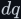<!--m:dq--> that crosses this
piece in time 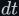<!--m:dt--> moves with velocity 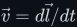<!--m:\vec{v} = d\vec{l}/dt-->. The key step is to regroup:

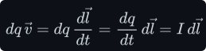

So the force on the piece is 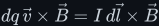<!--m:dq\,\vec{v}\times\vec{B} = I\,d\vec{l}\times\vec{B}-->. For a straight wire of
length <!--m:L--> (m) at right angles to a uniform field, every piece pushes the same way and the forces
add:

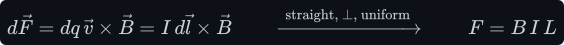

*Worked number.* A motor has <!--m:0.5\ \mathrm{T}--> in its air gap, and <!--m:5\ \mathrm{cm}--> of conductor in that gap
carries <!--m:10\ \mathrm{A}-->:

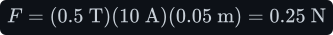

The same 10 A wire, 1 m long, across the Earth's <!--m:50\ \mu\mathrm{T}--> feels only <!--m:0.5\ \mathrm{mN}-->. This is why
motors need strong fields.

**Field lines.** A magnetic field is drawn as **field lines**. The line's direction at each point is
the direction of <!--m:\vec{B}-->, and the lines are drawn closer together where the field is stronger.
Magnetic field lines never start or end: they close on themselves. (This is the statement that
there are no magnetic "charges", or *monopoles*, written formally as Gauss's law for magnetism in
[../electromagnetism/electromagnetism.md §15](../electromagnetism/electromagnetism.md#15-the-whole-set--maxwells-four-equations).)

## 2 Oersted's discovery — a current makes a magnetic field

Until 1820, electricity and magnetism were thought to be separate subjects. In April of that year
Hans Christian Oersted, lecturing in Copenhagen, ran a current from a battery through a wire laid
over a compass, along the north–south line. The needle swung away from north. When he broke the
circuit, it swung back. Reversing the current swung the needle the other way. A wire laid over the
compass east–west did nothing visible. He published the result in July 1820 as a four-page Latin
pamphlet. Within weeks André-Marie Ampère in Paris showed that two currents push on each other (§13),
and Jean-Baptiste Biot and Félix Savart measured how the field falls off with distance (§4).


_The needle under the wire is pushed by two fields at once: the Earth's, pointing north, and the
wire's, pointing sideways. It settles along their sum, which is why it turns part of the way and
not all of it. §7 works out the 33.7° in the figure._

What Oersted's needle says, and what careful later measurement confirmed:

- **A current makes a magnetic field.** No magnet is needed: moving charge is enough. (A permanent
  magnet's field turns out to come from the same source, the circulating charge of its electrons,
  §12.)
- **The field circles the wire.** Its lines are closed circles centred on the wire, in planes at
  right angles to it. Under the wire the field points one way across the needle; over the wire it
  points the other way.
- **The field is proportional to the current.** Double the current and you double the field.
  Reverse the current and the field reverses.
- **The field weakens with distance from the wire.** §5 and §7 show it falls as one over the
  distance.

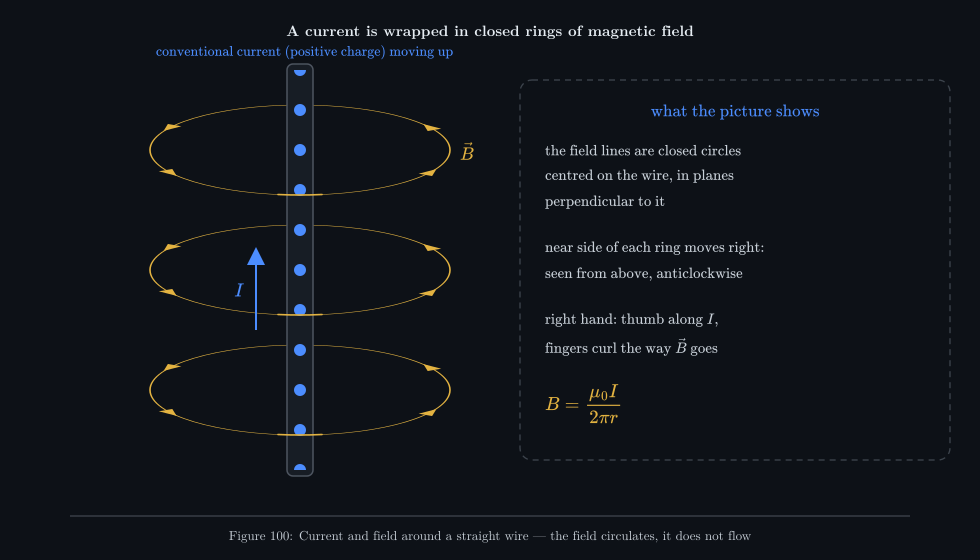

_The field is not a fluid that flows round the wire. The moving arrowheads only show which way the
field points around each circle. The rings are the same at every height along a long straight
wire._

## 3 The right-hand grip rule

The field circles the wire, so we need a rule for *which way* it circles. First, a way of drawing a
current that points straight into or out of the page.

**The dot and the cross.** Think of the current as an arrow. If the arrow points *out of* the page,
toward you, you see its point: a dot in a circle, <!--m:\odot-->. If it points *into* the page, away from you,
you see the cross of its tail feathers: a cross in a circle, <!--m:\otimes-->. The circle itself is the rim of
the wire.

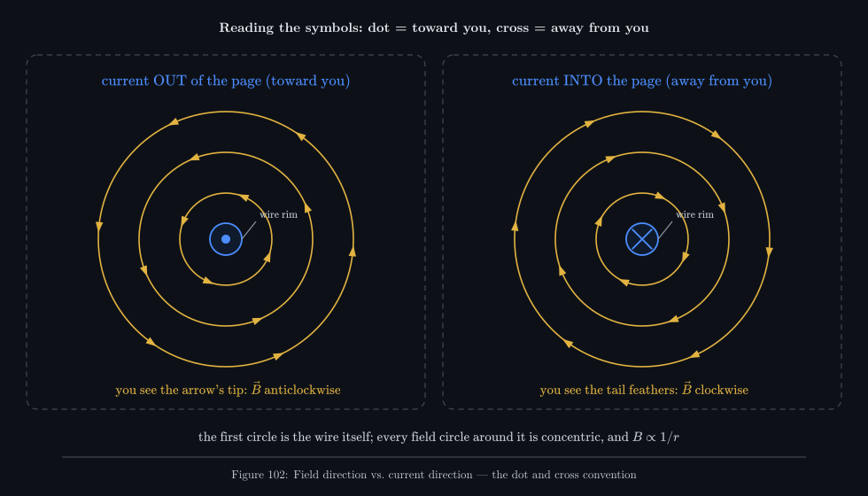

_Every field circle is centred on the wire. Around a current coming toward you the field runs
anticlockwise; around a current going away it runs clockwise. The field is strongest on the
innermost circle and weakens as one over the radius._

**The rule.** Grip the wire with your **right** hand, thumb pointing along the conventional current.
Your fingers curl around the wire in the direction of the magnetic field.

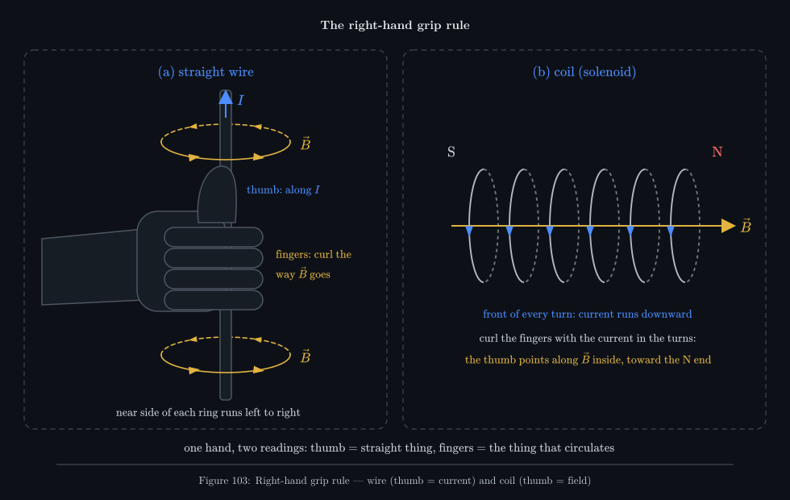

_Panel (a): thumb along the current, fingers along the field. Panel (b) is the same hand used the
other way round for a coil. The current circulates in the turns, so the fingers follow it, and the
thumb gives the field down the middle and the coil's north end. The thumb always takes the
straight thing; the fingers always take the thing that goes round._

Check it against the symbols. Point your right thumb at your own face (current out of the page,
<!--m:\odot-->): your fingers curl anticlockwise as you look at them. Point it away (<!--m:\otimes-->): clockwise. Those
are the two directions drawn in the figures.

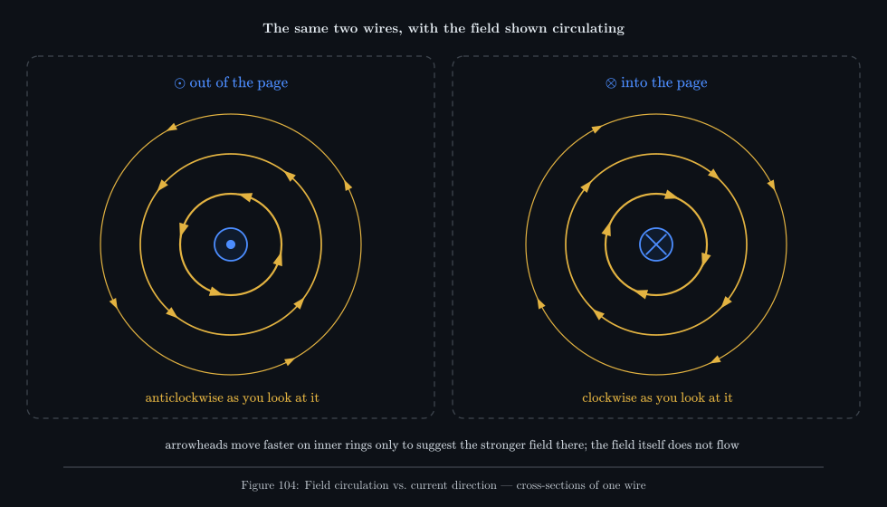

_The same two cross-sections, with the direction of circulation shown moving. Use it to check the
grip rule: thumb toward you, fingers anticlockwise._

**For a coil (solenoid).** Curl the fingers of your right hand the way the current runs around the
turns. Your thumb then points along the field *inside* the coil, which is also the direction the
field leaves the coil: the coil's **north** end. This is the same physics. Apply the
straight-wire rule to any short piece of any turn and you find that every piece pushes field the
same way through the middle (§9).

> **Watch out —** The rule is for **conventional** current, the direction positive charge would
> move. Electrons in a wire move the other way. If you follow the electrons with your right hand you
> get every field backwards. (Some textbooks teach a "left-hand rule" for electron flow; it is the
> same rule with the sign flipped. Pick conventional current and the right hand, and never mix.)

**A quick check.** A vertical wire carries current upward. A compass sits due east of it. Which way
does the wire's field point at the compass? Thumb up: seen from above, your fingers run
anticlockwise, so on the east side of the wire they point north. The wire's field at the compass
points north.

> **Note —** Why the *right* hand? Nature does not prefer one. The right-hand choice is built into
> the definition of the cross product (§1). Use it consistently in <!--m:\vec{F} = q\vec{v}\times\vec{B}-->
> and in the field laws below, and every prediction comes out right. Use the left hand everywhere
> and every <!--m:\vec{B}--> would point the other way. Every force would still come out the same, because
> each force has two cross products and the sign cancels. This is why <!--m:\vec{B}--> is called a
> *pseudovector*.

## 4 The Biot-Savart law

Oersted's observations say *that* a current makes a field. The Biot–Savart law says *how much*. The
idea is to cut the circuit into tiny pieces. Each piece 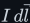<!--m:I\,d\vec{l}--> contributes a small field 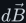<!--m:d\vec{B}--> at
the point of interest, and the total field is the sum of all of them:

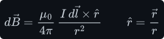

Every symbol:

- <!--m:d\vec{B}--> — the field contributed by this one piece, in tesla;
- <!--m:I--> — the current in the piece, in amperes;
- <!--m:d\vec{l}--> — the piece itself: a vector along the wire in the direction of the current, whose
  length <!--m:dl--> (m) is the piece's length;
- <!--m:\vec{r}--> — the vector *from the piece to the point* where you want the field (m);
- <!--m:r--> — the length of <!--m:\vec{r}-->, the distance from piece to point (m);
- <!--m:\hat{r}--> — the unit vector along <!--m:\vec{r}-->, which carries the direction only;
- <!--m:\times--> — the cross product of §1, which makes <!--m:d\vec{B}--> perpendicular to both the wire and the
  line of sight;
- <!--m:\mu_0--> — the **permeability of free space**, a constant of nature (below).

Taking sizes, with <!--m:\theta--> the angle between <!--m:d\vec{l}--> and <!--m:\vec{r}-->:

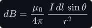

and the field of the whole circuit is the sum (the integral) of every piece. The circle on the
integral sign means *all the way around the closed circuit*. A steady current always flows in a
closed loop.

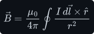

Read the law in words. Each piece contributes a field that:

- grows with the current and with the length of the piece;
- falls as **one over the square** of the distance, like Coulomb's law for charges
  ([../coulombs-law/](../coulombs-law/));
- is zero for a point straight ahead of the piece (<!--m:\theta = 0-->) and largest for a point off to the
  side (<!--m:\theta = 90^\circ-->);
- points around the wire, never toward or away from it. This is the right-hand grip rule of §3
  written as a cross product.

**The constant.** In the SI, <!--m:\mu_0--> has the value

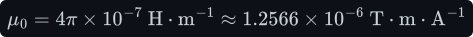

Its unit follows from the law itself. Solve for <!--m:\mu_0--> and put in the unit of each symbol:

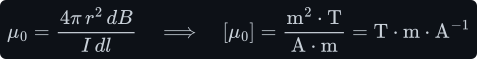

The datasheet unit is the **henry per metre**. The henry (H) is the unit of inductance: one weber of
flux per ampere. A **weber** (Wb) is one tesla across one square metre, the unit of magnetic
**flux** (the field times the area it crosses, built in [../faradays-law/](../faradays-law/)). So:

The last form uses <!--m:1\ \mathrm{T} = 1\ \mathrm{N\cdot A^{-1}\cdot m^{-1}}--> from §1.

> **Note —** Until 2019, <!--m:\mu_0--> was *exactly* 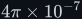<!--m:4\pi\times10^{-7}-->, because the ampere was defined
> through the force between two wires (§13). Since the 2019 redefinition of the SI the elementary
> charge is fixed instead, and <!--m:\mu_0--> became a measured quantity. The CODATA value agrees with
> <!--m:4\pi\times10^{-7}--> to better than one part in a billion, so for all engineering purposes it is
> still 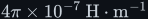<!--m:4\pi\times10^{-7}\ \mathrm{H\cdot m^{-1}}-->.

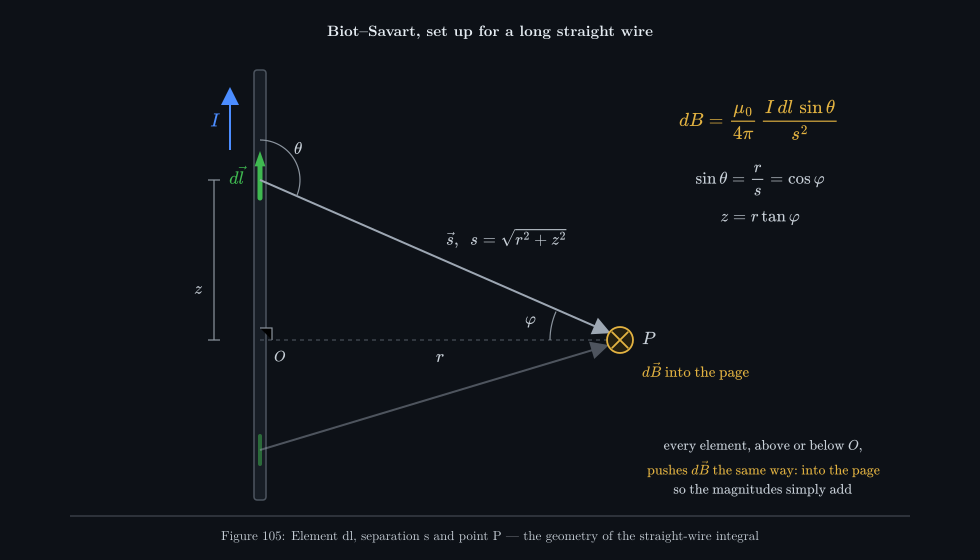

_The set-up for the next section. One piece <!--m:d\vec{l}--> of the wire, the arrow <!--m:\vec{s}--> from it to the
point <!--m:P-->, and the two angles. Pieces above and below <!--m:O--> both push their contribution into the
page at <!--m:P-->, so nothing cancels._

## 5 The long straight wire by Biot-Savart

This is the first real use of the law: the field at distance <!--m:r--> from a long straight wire
carrying current <!--m:I-->. It is a long calculation, and §7 gets the same answer in three lines. It is
worth doing once, because it shows that the <!--m:1/r--> law for a wire really is the sum of many 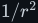<!--m:1/r^2-->
pieces.

> **Note —** In this section the letter <!--m:r--> means the *perpendicular distance from the wire to the
> point*, because that is what the final answer is written in. So the piece-to-point distance,
> called <!--m:r--> in §4, is renamed <!--m:s--> here, with <!--m:\vec{s}--> the vector and <!--m:\hat{s}--> its unit vector.

**Step 1 — set up.** Lay the wire along a <!--m:z-->-axis with the current flowing toward 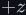<!--m:+z--> (up the page
in Figure 105). Put the point <!--m:P--> at perpendicular distance <!--m:r--> from the wire, level with the
origin <!--m:O-->. Take a piece 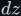<!--m:dz--> of wire at height <!--m:z-->. Then <!--m:d\vec{l}--> points up with length <!--m:dz-->, and
the piece-to-point distance is 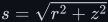<!--m:s = \sqrt{r^2 + z^2}--> (Pythagoras on the right-angled triangle
of Figure 105).

**Step 2 — direction.** <!--m:d\vec{l}--> points up, and <!--m:\vec{s}--> points from the piece across to <!--m:P-->. By
the cross-product rule, 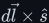<!--m:d\vec{l}\times\hat{s}--> points into the page at <!--m:P-->. That is true for *every*
piece, above <!--m:O--> and below it. So every contribution points the same way, and the total is just the
sum of the sizes. (This is the step that makes the calculation easy. In most problems the
contributions point in different directions and must be added as vectors.)

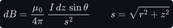

**Step 3 — remove the angle.** In the right-angled triangle of Figure 105, the side opposite
<!--m:\theta--> is <!--m:r--> and the hypotenuse is <!--m:s-->, so <!--m:\sin\theta = r/s-->:

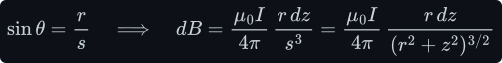

**Step 4 — add up every piece.** A long wire runs from <!--m:z = -\infty--> to <!--m:z = +\infty-->. Pull the
constants out of the integral:

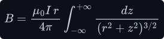

**Step 5 — change variable.** Measure each piece by the angle <!--m:\varphi--> at which <!--m:P--> sees it
(Figure 105) rather than by its height. Then 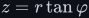<!--m:z = r\tan\varphi-->. Running <!--m:z--> from <!--m:-\infty--> to <!--m:+\infty--> means
running <!--m:\varphi--> from 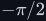<!--m:-\pi/2--> to 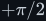<!--m:+\pi/2-->. Differentiating gives <!--m:dz-->, and the denominator simplifies:

Here <!--m:\sec\varphi = 1/\cos\varphi-->, and <!--m:d(\tan\varphi)/d\varphi = \sec^2\!\varphi-->. The step that confuses people
is <!--m:1 + \tan^2\!\varphi = \sec^2\!\varphi-->. It is just Pythagoras: divide <!--m:\sin^2\!\varphi + \cos^2\!\varphi = 1--> through by
<!--m:\cos^2\!\varphi-->:

**Step 6 — simplify the integrand.** The power <!--m:3/2--> of <!--m:r^2\sec^2\!\varphi--> is <!--m:r^3\sec^3\!\varphi-->:

**Step 7 — integrate.**

**Step 8 — assemble.**

That is the field of a long straight wire. It is proportional to the current, falls as **one over
the distance**, and circles the wire.

**Where the field comes from.** If you stop the integral at <!--m:\varphi_1--> and <!--m:\varphi_2--> instead of <!--m:\pm\pi/2-->,
you get the field of a *finite* straight segment, seen from a point at perpendicular distance <!--m:r-->
from its line:

Take just the stretch of wire within <!--m:\pm r--> of <!--m:O-->, so <!--m:\varphi--> runs from <!--m:-45^\circ--> to <!--m:+45^\circ-->:

About 71 % of the field comes from the length of wire within one distance <!--m:r--> of the nearest point.
A wire counts as "long" once it runs a few times <!--m:r--> either side of you.

**Worked number — 10 A at 1 cm.**

That is four times the Earth's field, from an ordinary 10 A wire one centimetre away. It is worth
remembering the constant in front:

At <!--m:10\ \mathrm{cm}--> the same wire gives <!--m:20\ \mu\mathrm{T}-->, and at <!--m:1\ \mathrm{m}--> it gives <!--m:2\ \mu\mathrm{T}-->.

## 6 Ampere's circuital law

Biot–Savart always works, but the integral in §5 was for the easiest shape there is. Ampère's
circuital law says the same physics in a form that, for symmetric shapes, makes the answer almost
free:

- <!--m:C--> — a closed loop that **you choose**, called the **Amperian loop**. It is imaginary: a path in
  space, not a wire. You also choose which way round to walk it.
- <!--m:d\vec{l}--> — a small step along the loop, in the direction you are walking, with length <!--m:dl--> (m).
- <!--m:\vec{B}--> — the magnetic field at that step (T). The total field, from every current anywhere.
- <!--m:\vec{B}\cdot d\vec{l}--> — the dot product: the part of the field *along* your step, times the
  step length.
- <!--m:\oint_C--> — add up <!--m:\vec{B}\cdot d\vec{l}--> over every step, once around the loop. The units are
  <!--m:\mathrm{T\cdot m}-->.
- <!--m:I_{enc}--> — the **enclosed current**: the net current passing through the loop, counted with a
  sign (below), in amperes.
- <!--m:\mu_0--> — the same constant as in Biot–Savart.

**The line integral, slowly.** The symbol <!--m:\oint_C \vec{B}\cdot d\vec{l}--> is a recipe for a sum. Walk
around <!--m:C--> in <!--m:K--> short steps. Step number <!--m:k--> is a little arrow <!--m:\Delta\vec{l}_k--> along the path. At
that step the field is <!--m:\vec{B}_k-->, at some angle <!--m:\alpha_k--> to the step. Only the part of the field
along the step counts:

A field along your step counts fully (<!--m:\cos 0 = 1-->). A field across it counts nothing
(<!--m:\cos 90^\circ = 0-->). A field against it counts negative (<!--m:\cos 180^\circ = -1-->). Add the
contributions of all <!--m:K--> steps:

Now make the steps shorter and more numerous. The sum settles to a fixed number, and that limit is
what the integral sign means:

_The integral as a walk. On a circle centred on the wire, the field at every step points exactly
along the step, so every step contributes <!--m:B\,dl--> and the total is <!--m:B--> times the circumference._

*A toy check.* Take a uniform field <!--m:B_0--> pointing along <!--m:x--> (no current anywhere) and a square
loop of side <!--m:a--> with two sides along <!--m:x-->. Walk it. The bottom side runs with the field, <!--m:+B_0a-->. The
top side runs against it, <!--m:-B_0a-->. The two vertical sides are at right angles to the field and give
zero:

Zero, as the law demands for a loop with no current through it. Note that zero total does **not**
mean zero field along the loop. The field here is <!--m:B_0--> everywhere; the contributions cancel.

**The enclosed current.** Imagine a soap film stretched across the loop. Any surface whose edge is
the loop will do. Every wire that pierces the film carries current through the loop. Add these
currents up, with signs:

- **The sign comes from the right hand.** Curl the fingers of your right hand along the direction
  you walk the loop. Current crossing the film in the direction of your thumb counts **plus**;
  current crossing the other way counts **minus**.
- **A current outside the loop counts zero.** It still changes the field at every point of the
  loop, but its contributions to the integral cancel exactly (proved below).
- **A wire that passes through the loop several times counts every time.** A coil of <!--m:N--> turns
  threading the loop contributes <!--m:NI-->. This is what makes coils strong (§9).

_Panel (a): walking anticlockwise means out of the page counts plus. The 5 A counts <!--m:+5-->, the 3 A
going into the page counts <!--m:-3-->, and the 4 A outside the loop counts nothing. Panel (b): why the
loop's shape cannot matter._

*Worked enclosed current (panel a):*

**Why the shape of the loop does not matter.** Prove it for a single long wire, using the field
from §5. Look at panel (b). Any short step <!--m:d\vec{l}--> on the loop can be split into a part pointing
straight away from the wire and a part going around it. The field of a straight wire points
purely *around* (§3), so only the second part counts in <!--m:\vec{B}\cdot d\vec{l}-->. If the step moves
the angle seen from the wire by <!--m:d\varphi-->, that around-part has length <!--m:r\,d\varphi--> (arc length is
radius times angle). So:

The distance <!--m:r--> has cancelled. A far-away step has a weaker field but sweeps the same angle with a
longer path, and the two effects balance exactly. So the integral only counts the total angle
swept:

A loop that goes once around the wire sweeps a full turn, <!--m:2\pi-->. A loop that does not go around the
wire swings out and back and sweeps zero. That is Ampère's law for a straight wire and any loop at
all. For a field made by many currents, add the fields: each current contributes <!--m:\mu_0 I--> if it is
enclosed and zero if not. (The general proof for any shape of steady current, starting from
Biot–Savart, is in Griffiths §5.3; see §16.)

**Why the choice of loop matters.** Ampère's law is true for *every* loop, but it hands you the
field only when you can pull <!--m:B--> out of the integral. That needs a loop on which, piece by piece,
one of three things holds:

1. the field points along the loop and has the **same size** all along that piece, so the piece
   contributes <!--m:B\times--> its length;
2. the field is **at right angles** to the loop on that piece, so it contributes zero;
3. the field is **zero** on that piece.

Symmetry is what tells you this in advance. Take a square loop around a straight wire instead of a
circle. Ampère's law still says the integral is <!--m:\mu_0 I-->. But along each side the field changes
size and angle from point to point, so you cannot pull <!--m:B--> out and the law tells you nothing
about <!--m:B-->. The useful geometries are the symmetric ones: the long straight wire and round conductor
(§7, §8), the long solenoid (§9), the toroid (§10) and the coaxial cable (§11). For everything
else, such as a short coil, a square loop or a PCB track, you are back to Biot–Savart or to a
computer.

> **Watch out —** This form of the law is for **steady** currents (magnetostatics), currents that
> do not change with time and that flow around closed circuits. For a current that is changing,
> or one that stops at a capacitor plate, it gives the wrong answer. §14 shows the term Maxwell
> added to fix it.

## 7 The straight wire again by Ampere's law

Now the payoff. The field of a long straight wire, by Ampère's law.

**Symmetry first.** Before computing anything, decide what the field must look like.

- **It has no part pointing along the wire.** In Biot–Savart, <!--m:d\vec{l}\times\hat{s}--> is perpendicular to
  <!--m:d\vec{l}-->, which points along the wire. No piece can push field along the wire.
- **It has no part pointing away from or toward the wire.** If it had, field lines would stream out
  of (or into) the wire all along its length. But magnetic field lines never start or end (§1).
- **Its size depends only on the distance <!--m:r-->.** Rotate the long wire about its own axis, or slide it
  along itself, and nothing changes, so the field cannot change either.

So the field points *around* the wire and has the same size everywhere on a circle of radius <!--m:r-->
centred on the wire. Choose that circle as the Amperian loop, walked in the direction of the
right-hand grip rule. It meets condition 1 of §6 at every point.

**Step 1.** The field is parallel to every step, so the dot product is just the product of sizes:

**Step 2.** <!--m:B--> is the same at every point of the circle, so it comes out of the integral:

**Step 3.** Adding up the step lengths around a circle gives its circumference, <!--m:2\pi r-->. The only
current through the circle is the wire's, <!--m:I-->:

The same answer as eight steps of Biot–Savart in §5.

| | Biot–Savart (§5) | Ampère (§7) |
|---|---|---|
| What you do | add up every piece of the wire | walk one loop |
| Steps for the straight wire | eight, including a trigonometric substitution | three |
| Needs symmetry? | no — always works | yes — otherwise it is true but useless |
| Gives the field of a finite segment? | yes | no |
| Gives the direction too? | yes, from the cross product | no — that comes from the symmetry argument and the grip rule |
| Best for | short coils, loops, odd shapes | long wires, solenoids, toroids, coax |

**Worked numbers.** At <!--m:1\ \mathrm{cm}--> from <!--m:10\ \mathrm{A}--> the field is <!--m:200\ \mu\mathrm{T}--> (§5). For
Oersted's compass in Figure 101, <!--m:2\ \mathrm{A}--> flows south along a wire <!--m:3\ \mathrm{cm}--> above the
needle. Assume the horizontal part of the Earth's field is <!--m:20\ \mu\mathrm{T}--> (it ranges from almost
zero near the magnetic poles to about <!--m:40\ \mu\mathrm{T}--> near the equator):

The direction follows from the grip rule. Thumb pointing south along the wire, the fingers pass
*under* the wire, where the compass is, heading east. The needle settles <!--m:33.7^\circ--> east of north,
along the sum of the two fields.

## 8 Inside the conductor — B grows in proportion to r

A real wire has a radius. What is the field inside the copper? Take a round wire of radius <!--m:R-->
carrying a steady (DC) current <!--m:I--> spread evenly over its cross-section. The current per square
metre of cross-section, the **current density** <!--m:J-->, is then

The symmetry argument of §7 still holds inside, so take a circle of radius <!--m:r--> *smaller* than <!--m:R-->
as the loop. It now encloses only the current flowing through its own area, <!--m:\pi r^2-->:

The left side of Ampère's law is <!--m:B(2\pi r)-->, exactly as before:

Inside, the field grows **in proportion to** <!--m:r-->: zero on the axis, largest at the surface. At <!--m:r = R-->
the inside formula gives <!--m:\mu_0 I/(2\pi R)-->, the same value as the outside formula, so the field is
continuous through the surface of the wire. Reference charts quote this pair as
<!--m:B_{in} = \mu_0 I r/(2\pi R^2)--> and <!--m:B_{out} = \mu_0 I/(2\pi r)-->.

_The field is largest at the surface of the wire, not at its centre. The dashed line shows what
<!--m:1/r--> would do if all the current sat on the axis: it would grow without limit. A real wire never
does, because a smaller loop encloses less current._

*Worked numbers.* <!--m:10\ \mathrm{A}--> in a wire of radius <!--m:R = 1\ \mathrm{mm}-->:

The field halfway to the axis equals the field one radius outside the surface.

> **Watch out —** "Spread evenly" is a DC assumption. At high frequency the current crowds toward
> the surface of the conductor (the **skin effect**, a consequence of [../faradays-law/](../faradays-law/)),
> and the field inside falls toward zero. The depth the current occupies, the skin depth <!--m:\delta-->,
> depends on the copper's resistivity <!--m:\rho--> (<!--m:1.68\times10^{-8}\ \mathrm{\Omega\cdot m}-->) and the frequency <!--m:f-->.
> At <!--m:50\ \mathrm{kHz}--> in copper:
>
> 
>
> A 2 mm diameter wire at 50 kHz carries most of its current in the outer 0.3 mm. This is why
> switching-converter windings use thin strands (Litz wire) or copper foil.

## 9 The solenoid

A **solenoid** is a wire wound into a helix: <!--m:N--> turns spread evenly along a length <!--m:l-->. Call the
number of turns per metre <!--m:n-->:

"Long" means much longer than its radius. For a long solenoid, the field is strong and uniform
inside, along the axis, and almost zero outside. The grip rule says why the field is strong inside.
In the cross-section of Figure 109, the top of every turn carries current out of the page (<!--m:\odot-->),
and its field runs anticlockwise around it, which is rightward just below it, inside the coil. The
bottom of every turn carries current into the page (<!--m:\otimes-->), and its clockwise field also runs
rightward just above it, inside the coil. Inside, all the contributions add. Outside, the fields of
the top and bottom rows point in opposite directions and nearly cancel.

Ampère's law makes both claims exact for a long solenoid:

- **Uniform inside.** Draw a rectangle entirely *inside* the coil with two sides parallel to the
  axis. It encloses no current, so the integral is zero. The field has no part across the
  rectangle's short sides, so the two long sides must cancel. That means the field is the same on
  both, whatever their distance from the axis.
- **Zero outside.** Do the same with a rectangle entirely *outside*. The field is the same at every
  distance from the coil, and far away it must be zero. So it is zero everywhere outside.

Now take the rectangle <!--m:abcd--> of Figure 109. The side <!--m:ab--> of length <!--m:h--> runs inside the coil along
the field, and the side <!--m:cd--> runs outside. Walk it <!--m:a\to b\to c\to d-->, which is anticlockwise in the
figure, so currents out of the page count plus.

_The rectangle straddles one row of wires. Only its inside side sees any field, and it is pierced by
every turn between <!--m:a--> and <!--m:b-->. In a real, finite coil the field returns around the outside, weak and
spread out, as the dashed lines show._

**Step 1 — split the loop into its four sides.**

**Step 2 — each side.** Along <!--m:ab--> the field is uniform and along the path: <!--m:Bh-->. Along <!--m:bc--> and
<!--m:da--> the part inside the coil is at right angles to the field, and the part outside is in zero
field, so both give zero. Along <!--m:cd--> the field is zero:

**Step 3 — enclosed current.** The rectangle is <!--m:h--> long, so it is pierced by <!--m:nh--> turns, each
carrying <!--m:I--> out of the page:

**Step 4 — solve.**

The rectangle's length <!--m:h--> cancels, so any rectangle gives the same <!--m:B-->. That is a check that the
field inside really is uniform. The field depends only on the **ampere-turns per metre**, <!--m:nI-->, not on
the radius of the coil. A thin coil and a fat one with the same winding density have the same field
inside.

> **Watch out —** Many reference charts write the solenoid field as
> <!--m:B = \mu_0 N I-->. There, <!--m:N--> means turns **per unit length**, the <!--m:n--> used here. With <!--m:N--> as the
> total number of turns, as in this tree, the field is <!--m:\mu_0 N I/l-->. Check which one a formula
> means before you put numbers in: the two differ by a factor of the coil's length.

**Worked number — 100 turns over 5 cm.** At <!--m:I = 1\ \mathrm{A}-->:

About fifty times the Earth's field, from 1 A, in air. At <!--m:2\ \mathrm{A}--> it is <!--m:5.03\ \mathrm{mT}-->. Compare one
straight 1 A wire, which gives this field only <!--m:80\ \mu\mathrm{m}--> from its centre. Coiling the wire
concentrates its field.

**How long is "long"?** Ampère's law needs the coil to be infinitely long. To see how much a real
coil falls short, go back to Biot–Savart. Start with one circular turn of radius <!--m:a--> (m) and find
the field on its axis, a distance <!--m:x--> (m) from its centre. Every piece <!--m:d\vec{l}--> of the ring is at the
same distance <!--m:s = \sqrt{a^2 + x^2}--> and at right angles to <!--m:\vec{s}-->, so <!--m:\sin\theta = 1-->. The parts of
<!--m:d\vec{B}--> across the axis cancel between opposite sides of the ring. The part along the axis is a
fraction <!--m:a/s--> of each contribution:

Everything except <!--m:dl--> is the same all round the ring, and the pieces add up to the circumference
<!--m:2\pi a-->:

A solenoid is a stack of such rings, <!--m:n\,dx--> of them in each slice <!--m:dx-->. At the centre of a coil of
length <!--m:l-->, add the rings from <!--m:x = -l/2--> to <!--m:+l/2-->. The integral is the one from §5, with <!--m:a--> in
place of <!--m:r-->. The substitution <!--m:x = a\tan\varphi--> gives <!--m:\sin\varphi/a^2-->, and <!--m:\sin\varphi = x/\sqrt{a^2 + x^2}-->:

Putting in the limits, and doing the same from <!--m:x = 0--> to <!--m:x = l--> for a point on the axis at one
end of the coil:

As <!--m:l--> grows much larger than <!--m:a-->, the centre factor goes to 1 (the ideal result) and the end factor
goes to one half. For the 100-turn, 5 cm coil wound with radius <!--m:a = 1\ \mathrm{cm}-->:

The ideal formula is 7 % high at the centre of this stubby coil, and the field at its ends is
about half the centre value.

## 10 The toroid

A **toroid** is a solenoid bent round until its ends meet: <!--m:N--> turns wound evenly around a ring.
In Figure 110 the ring has inner radius <!--m:a--> and outer radius <!--m:b-->. The problem has rotational
symmetry about the ring's centre, so the field circles that centre and has the same size at every
point a distance <!--m:r--> from it. So take circles of radius <!--m:r--> about the centre as Amperian loops. On
each one, <!--m:\oint\vec{B}\cdot d\vec{l} = B\,(2\pi r)-->. Only the enclosed current changes from region to
region.

_Every turn passes up through the hole (<!--m:\odot--> on the inner edge) and back down outside (<!--m:\otimes--> on the
outer edge). A loop in the core encloses all <!--m:N--> upward passes. A loop in the hole encloses nothing.
A loop outside encloses <!--m:N--> up and <!--m:N--> down, so the net is zero._

**Loop (1), in the hole, <!--m:r < a-->.** No wire passes through it:

**Loop (2), inside the core, <!--m:a < r < b-->.** Every one of the <!--m:N--> turns passes through it once, the
same way:

**Loop (3), outside, <!--m:r > b-->.** Each turn passes through the loop's disc twice, once up through the
hole and once down outside:

The field exists only inside the windings. In the core it falls as <!--m:1/r-->, being strongest at the
inner edge. Reference charts often write <!--m:B = \mu_0 N I/(2\pi R)--> with <!--m:R--> the mean radius. For a
thin ring, <!--m:2\pi R--> is the length of the core's centre line, and the toroid formula becomes the
solenoid formula <!--m:\mu_0 N I/l--> with <!--m:l = 2\pi R-->.

*Worked numbers.* <!--m:N = 100--> turns at <!--m:I = 1\ \mathrm{A}--> on a ring with <!--m:a = 1\ \mathrm{cm}--> and
<!--m:b = 1.5\ \mathrm{cm}-->:

At the mean radius, <!--m:1.25\ \mathrm{cm}-->, it is <!--m:1.6\ \mathrm{mT}-->. The field varies by <!--m:\pm 20\,\%-->
across this fairly fat ring. A thinner ring is more uniform.

> **Tip —** This is why so many power inductors and current transformers are toroids. Their field
> stays inside the core, so they neither spray field onto neighbouring circuits nor pick it up.
> (Strictly, the winding also creeps once around the ring as it goes, which adds the field of one
> single turn of radius <!--m:R--> outside. It is <!--m:N--> times weaker than the field inside.)

## 11 The coaxial cable

A **coaxial cable** has a solid inner conductor of radius <!--m:a--> carrying current <!--m:I--> one way, and a
tubular outer conductor (inner radius <!--m:b-->, outer radius <!--m:c-->) carrying the same current back. Assume
each current is spread evenly over its own conductor (DC). The symmetry is the same as for the
wire, so take circles of radius <!--m:r--> centred on the axis. Every loop gives <!--m:B(2\pi r)-->; only the
enclosed current changes.

**Region (1), inside the centre conductor.** This is §8 with <!--m:R = a-->:

**Region (2), in the gap.** The loop encloses all of the inner current and none of the outer:

**Region (3), inside the outer conductor.** The loop encloses the inner current minus the part of
the return current that flows inside radius <!--m:r-->. The return current is spread over the area
<!--m:\pi(c^2 - b^2)-->, and the loop takes in the area <!--m:\pi(r^2 - b^2)--> of it:

**Region (4), outside.** The two currents are equal and opposite:

_All of the field is trapped inside the cable. With <!--m:a = 1\ \mathrm{mm}-->, <!--m:b = 3\ \mathrm{mm}-->,
<!--m:c = 3.5\ \mathrm{mm}--> and <!--m:10\ \mathrm{A}-->, the field peaks at <!--m:2\ \mathrm{mT}--> at the surface of the centre
conductor, is <!--m:0.67\ \mathrm{mT}--> at the inside of the shield, and is zero outside._

**What it buys you.** A cable with no external field neither radiates magnetic interference nor
picks it up. A changing outside field threads no flux between its conductors. The same idea, done
less perfectly, is behind twisted pairs and behind running every supply wire right next to its
return (§15).

**Inductance per metre.** The field in the gap gives the cable's inductance. The **inductance** <!--m:L-->
of a circuit is the magnetic flux <!--m:\Phi--> it links per ampere, <!--m:L = \Phi/I-->, in henries. (It is
developed in [../inductor/](../inductor/) and
[../electromagnetism/electromagnetism.md §9](../electromagnetism/electromagnetism.md#9-self-inductance--deriving-the-inductor-law).)
Count the flux crossing a strip one metre long, running radially from the inner conductor to the
outer one. A slice of that strip of width <!--m:dr--> has area <!--m:1\ \mathrm{m}\times dr-->, and the field crosses
it at right angles, so the flux per metre of cable, <!--m:\Phi'--> in <!--m:\mathrm{Wb\cdot m^{-1}}-->, is

This counts only the flux in the gap; the small amount inside the conductors is ignored. The answer
is close to the roughly <!--m:250\ \mathrm{nH\cdot m^{-1}}--> quoted for common 50-ohm cable. Note the logarithm.
A fatter cable with the same ratio <!--m:b/a--> has the same inductance per metre.

## 12 H, permeability and ferromagnetic cores

Everything so far was in air or vacuum. Put iron or ferrite inside a coil and the field grows by a
factor of hundreds to thousands. That changes Ampère's law in a way that needs new bookkeeping.

**Why materials respond.** Every atom carries tiny circulating currents: its electrons orbit and
spin, and each one is a microscopic current loop with its own field. In most materials these loops
point every which way and cancel. In an applied field they line up a little: slightly with the
field in *paramagnetic* materials such as aluminium, slightly against it in *diamagnetic* ones such
as copper. In **ferromagnetic** materials (iron, nickel, cobalt, and ferrites, ceramics made with
iron oxide), neighbouring atoms line up together in regions called *domains*. A modest applied
field swings whole domains into line, and the material's own field becomes far larger than the
applied one. This is also where a permanent magnet's field comes from.

**Free and bound current.** Ampère's law with <!--m:\vec{B}--> counts *every* current through the loop,
including those atomic loops. They are called **bound** currents, and you cannot connect a meter
to them. The currents you control, in the wires, are called **free** currents. To keep them apart,
describe how strongly the material is magnetised by its **magnetisation** <!--m:\vec{M}-->, the atomic
magnetic moment per cubic metre, in <!--m:\mathrm{A\cdot m^{-1}}-->. Then define a second field, <!--m:\vec{H}-->, by

<!--m:\vec{H}--> is called the **magnetic field strength** (or simply the H-field), in <!--m:\mathrm{A\cdot m^{-1}}-->. With
this definition the bound currents drop out of Ampère's law, and <!--m:\vec{H}--> obeys a version that counts
only the free current (see Griffiths §6.3 for the proof):

So **<!--m:H--> is set by your wires alone**, whatever material is around them, and its unit, amperes per
metre, says so: ampere-turns per metre of path. **<!--m:B--> is what results** once the material has
responded. It is <!--m:B--> that pushes on charges, saturates cores and appears in Faraday's law.

**Permeability.** In many materials, as long as the field is not too strong, the magnetisation is
proportional to <!--m:H-->: <!--m:\vec{M} = \chi_m\vec{H}-->, where the pure number <!--m:\chi_m--> is the
*magnetic susceptibility*. Then

- <!--m:\mu_r = 1 + \chi_m--> — the **relative permeability**, a pure number;
- <!--m:\mu = \mu_0\mu_r--> — the **permeability** of the material, in <!--m:\mathrm{H\cdot m^{-1}}-->;
- <!--m:H = B/\mu--> — the same relation solved for <!--m:H-->, valid only in the linear range.

| Material | Relative permeability |
|---|---|
| vacuum, air | 1 (air: 1.0000004) |
| copper (diamagnetic) | 0.99999 |
| aluminium (paramagnetic) | 1.00002 |
| power ferrite (MnZn) | about 2000–3000 |
| silicon transformer steel | several thousand |
| nickel-iron alloys (mu-metal) | up to about 100 000 |

**Worked number — the same coil on a core.** Wind the 100 turns of §9 on a closed ring of ferrite
whose centre line is <!--m:l = 5\ \mathrm{cm}--> long, and pass <!--m:1\ \mathrm{A}-->. Walk the H-field version of
Ampère's law around the centre line of the core. The loop is pierced by all 100 turns:

The same <!--m:H--> as the air-cored solenoid. Now the material decides <!--m:B-->. Take <!--m:\mu_r = 2000-->:

"Asked for" is deliberate. No ferrite can deliver 5 T. Its domains are all lined up by roughly
<!--m:0.35--> to <!--m:0.4\ \mathrm{T}-->. Beyond that it **saturates**, its permeability collapses toward that of air,
and <!--m:B = \mu H--> with a constant <!--m:\mu--> stops being true. On this core the current that reaches a safe
<!--m:0.3\ \mathrm{T}--> is only

A core multiplies the field a coil makes by thousands, but it also caps it. The B–H curve, the
hysteresis loop, and the air gaps that stop a core saturating are covered in
[../electromagnetism/electromagnetism.md §5 and §12](../electromagnetism/electromagnetism.md#5-h-permeability-and-why-the-core-matters).

> **Watch out —** The factor <!--m:\mu_r--> applies only when the field's whole path is inside the
> material, as in a closed ring. A straight ferrite rod inside a solenoid gains far less, because
> the field must still return through the air outside, and the air path dominates. This is the
> same reason a tiny air gap in a ring core matters so much (electromagnetism §5, reluctance).

## 13 The force between parallel wires and the old ampere

Ampère's first experiment after hearing of Oersted's was to show that two currents push on each
other. With §1 and §7 the force follows in two lines. Two long parallel wires a distance <!--m:d--> apart
carry currents <!--m:I_1--> and <!--m:I_2-->. Wire 2 sits in the field of wire 1, which is at right angles to wire
2 (it circles wire 1). So a length <!--m:L--> of wire 2 feels the straight-wire force of §1:

Substituting, the force per metre of wire, in <!--m:\mathrm{N\cdot m^{-1}}-->, is

The same expression comes out for the force on wire 1 in the field of wire 2, equal and opposite,
as Newton's third law requires.

_Use <!--m:d\vec{F} = I\,d\vec{l}\times\vec{B}--> on each wire with the other wire's field. Currents in the
same direction attract. Opposite currents repel. Opposite charges attract; parallel currents attract.
Electricity and magnetism have opposite sign rules here._

**The old definition of the ampere.** Put <!--m:1\ \mathrm{A}--> in each wire, <!--m:1\ \mathrm{m}--> apart:

From 1948 until 20 May 2019, this *was* the definition of the ampere:

> the constant current which, if maintained in two straight parallel conductors of infinite length,
> of negligible circular cross-section, and placed 1 metre apart in vacuum, would produce between
> these conductors a force equal to <!--m:2\times10^{-7}--> newton per metre of length.

That definition is why <!--m:\mu_0--> was exactly <!--m:4\pi\times10^{-7}\ \mathrm{H\cdot m^{-1}}-->: the number was chosen,
not measured. Since 2019 the SI fixes the elementary charge instead,
<!--m:e = 1.602\,176\,634\times10^{-19}\ \mathrm{C}--> exactly, and defines <!--m:1\ \mathrm{A} = 1\ \mathrm{C\cdot s^{-1}}-->
from it. The wire force is now a measurement of <!--m:\mu_0--> rather than a definition (§4).

**Where the force matters.** On a circuit board it does not: <!--m:20\ \mathrm{A}--> in two tracks <!--m:1\ \mathrm{mm}-->
apart gives <!--m:0.08\ \mathrm{N\cdot m^{-1}}-->. In switchgear it matters a great deal. The force grows as the
*square* of the current, and in a short circuit the current can briefly reach tens of kiloamperes.
Two busbars <!--m:5\ \mathrm{cm}--> apart carrying a <!--m:20\ \mathrm{kA}--> fault current:

That is about 160 kg-force on every metre of bar, applied suddenly. Busbar supports and transformer
windings are braced for exactly this.

## 14 Maxwell's correction — displacement current

Ampère's law as written so far has a hole, and a capacitor shows it. Charge a capacitor through a
wire, and draw an Amperian loop <!--m:C--> around the wire. The law says to count the current through
*any* surface bounded by <!--m:C-->. Take the flat disc <!--m:S_1-->: the wire pierces it, so <!--m:I_{enc} = I-->. Now
stretch the surface into a bag <!--m:S_2--> that passes between the capacitor plates. No charge crosses
the gap, so <!--m:I_{enc} = 0-->. Same loop, same field along it, two different answers.

_Something does cross <!--m:S_2-->: the electric field between the plates, which grows as charge builds
up. Maxwell counted its rate of change as a current._

In 1861–65 James Clerk Maxwell added a term that counts a changing **electric flux** as if it were
a current. This is the **Ampère–Maxwell law**:

- <!--m:\vec{E}--> — the electric field, in <!--m:\mathrm{V\cdot m^{-1}}--> ([../coulombs-law/](../coulombs-law/));
- <!--m:\Phi_E--> — the **electric flux** through the surface, the normal part of <!--m:\vec{E}--> added up over the
  surface's area <!--m:A-->, in <!--m:\mathrm{V\cdot m}-->;
- <!--m:\varepsilon_0--> — the permittivity of free space, <!--m:8.854\times10^{-12}\ \mathrm{F\cdot m^{-1}}-->
  ([../coulombs-law/](../coulombs-law/));
- <!--m:\varepsilon_0\,d\Phi_E/dt--> — the **displacement current**, in amperes. Check the unit, using
  <!--m:1\ \mathrm{F} = 1\ \mathrm{C\cdot V^{-1}}--> (a farad stores one coulomb per volt):

**It fixes the capacitor exactly.** Between parallel plates of area <!--m:A--> carrying charge <!--m:\pm Q-->, Gauss's
law ([../coulombs-law/](../coulombs-law/); worked for plates in
[../electromagnetism/electromagnetism.md §14](../electromagnetism/electromagnetism.md#14-displacement-current--why-a-capacitor-passes-ac))
gives a uniform field <!--m:E = Q/(\varepsilon_0 A)-->. So the flux
through <!--m:S_2--> is <!--m:Q/\varepsilon_0-->, and the displacement current equals the rate at which charge
arrives on the plate. That is the wire current:

Through <!--m:S_1--> the count is <!--m:I--> of conduction current. Through <!--m:S_2--> it is <!--m:I--> of displacement current.
The two surfaces now agree. A <!--m:100\ \mathrm{nF}--> capacitor whose voltage slews at <!--m:1\ \mathrm{V}--> per microsecond
carries <!--m:0.1\ \mathrm{A}--> through its leads and the same <!--m:0.1\ \mathrm{A}--> of displacement current across its
gap (the capacitor law, [../capacitor/](../capacitor/)).

**The bigger consequence.** A changing magnetic field makes an electric field
([../faradays-law/](../faradays-law/)). Maxwell's term says a changing electric field makes a
magnetic field. Together they let a disturbance in the two fields sustain itself and travel
through empty space at a speed fixed by the two constants:

That is the speed of light. Maxwell's correction is how we know light is an electromagnetic wave.
In power electronics the term matters less for magnetics than for interference: a fast switching
edge, through the stray capacitance of a heatsink or a transformer, is a displacement current
that has to return somewhere. The full set of four field laws is in
[../electromagnetism/electromagnetism.md §14–§15](../electromagnetism/electromagnetism.md#14-displacement-current--why-a-capacitor-passes-ac).

## 15 What this costs you

- **Ampère's law only solves symmetric problems.** It is always true, but it gives you <!--m:B--> only for
  infinite wires, long solenoids, toroids and coax. A real coil is finite: the 5 cm coil of §9 is
  7 % below the ideal formula at its centre and about half of it at its ends. Short coils, square
  loops and PCB tracks need Biot–Savart or a field-solver program.
- **A single wire's field never occurs alone.** Every circuit has a return path, and the return
  current's field cancels most of the go current's. For a go-and-return pair of wires a distance <!--m:d-->
  apart, at a distance <!--m:r--> along the line through both wires, the two <!--m:1/r--> fields subtract:

  

  The pair's field falls as <!--m:1/r^2-->, not <!--m:1/r-->, and it is proportional to the spacing. With <!--m:10\ \mathrm{A}-->,
  <!--m:d = 2\ \mathrm{mm}--> and <!--m:r = 10\ \mathrm{cm}-->:

  

  Fifty times less. Routing every current right next to its return, so the loop it encloses is
  small, is the cheapest magnetic shielding there is.
- **Steady currents only.** The law in the form <!--m:\mu_0 I_{enc}--> is magnetostatics. Fast edges need
  Maxwell's term (§14), and at high enough frequency the circuit radiates.
- **B is proportional to I only in linear materials.** Magnetic cores saturate (§12), and above
  saturation more current buys almost no more field.
- **"Spread evenly" is a DC idea.** The skin effect (§8) changes the field inside conductors at
  switching frequencies and raises their resistance.
- **Forces grow as the square of the current.** Harmless at signal level, destructive at fault
  level (§13).
- **Direction errors are easy.** Use conventional current and the right hand, every time (§3).

## 16 Sources and cross-links

**In this tree**

- **Charge, the electric field, ε₀ and Gauss's law:** [../coulombs-law/](../coulombs-law/).
- **The partner law, in which a changing field makes a voltage:**
  [../faradays-law/](../faradays-law/).
- **The whole field picture: flux, Faraday, Lenz, inductance, B–H curves and Maxwell's four
  equations:** [../electromagnetism/electromagnetism.md](../electromagnetism/electromagnetism.md),
  especially §4 (the short version of this document), §5 (H and reluctance), §12 (saturation) and
  §14–§15.
- **The inductor**, whose field is the solenoid's of §9:
  [../inductor/inductor.md](../inductor/inductor.md). Its right-hand-rule sentence is illustrated by
  §3 here.
- **The capacitor**, whose current crosses the gap as displacement current (§14):
  [../capacitor/capacitor.md](../capacitor/capacitor.md).
- **The transformer**, two windings sharing a core's flux: [../transformer/](../transformer/).
- Style rules: [../../STYLE.md](../../STYLE.md).

**References**

- D. J. Griffiths, *Introduction to Electrodynamics*, 4th ed., Cambridge University Press, 2017:
  §5.1 (Lorentz force), §5.2 (Biot–Savart, the straight wire and the ring), §5.3 (Ampère's law,
  its proof from Biot–Savart, solenoid and toroid), §6.3 (H and free current), §7.3 (displacement
  current).
- E. M. Purcell and D. J. Morin, *Electricity and Magnetism*, 3rd ed., Cambridge University Press,
  2013, ch. 6 (the magnetic field) and ch. 11 (matter in magnetic fields).
- R. P. Feynman, R. B. Leighton and M. Sands, *The Feynman Lectures on Physics*, vol. II,
  ch. 13–14 (magnetostatics) and ch. 18 (the Maxwell equations).
- H. C. Ørsted, *Experimenta circa effectum conflictus electrici in acum magneticam*, Copenhagen,
  21 July 1820.
- J.-B. Biot and F. Savart, "Note sur le magnétisme de la pile de Volta", *Annales de chimie et de
  physique* 15, 1820.
- A.-M. Ampère, *Mémoire sur la théorie mathématique des phénomènes électrodynamiques uniquement
  déduite de l'expérience*, Paris, 1826.
- J. C. Maxwell, "A Dynamical Theory of the Electromagnetic Field", *Philosophical Transactions of
  the Royal Society* 155, 1865.
- BIPM, *The International System of Units (SI)*, 9th ed., 2019: the 1948 ampere definition
  (historical appendix) and the 2019 redefinition fixing *e*.
- CODATA recommended values of the fundamental physical constants (NIST): the vacuum magnetic
  permeability.
- Science Facts, "Magnetic Field from Ampere's Law" (sciencefacts.net), a one-page chart of the
  straight wire, the inside of a conductor, the solenoid and the toroid. All four are derived here,
  in §5–§10.
