# The capacitor — current is proportional to the rate of change of voltage

The capacitor is the exact mirror of the inductor. Its law comes from one line of algebra and one
line of calculus — but *that* calculus step is the one this whole subject trips on. So this
document slows all the way down and proves, properly, **why you are allowed to differentiate
<!--m:Q = C \cdot V--><!--/m-->**, and what rule makes it legal.

**Contents**

1. [What a capacitor actually is](#1-what-a-capacitor-actually-is)
2. [The rule you need — when you may differentiate an equation](#2-the-rule-you-need--when-you-may-differentiate-an-equation)
3. [The units of the farad](#3-the-units-of-the-farad)
4. [From the law to the ramp](#4-from-the-law-to-the-ramp)
5. [At the poles](#5-at-the-poles)
6. [The duality — one table, read both ways](#6-the-duality--one-table-read-both-ways)
7. [Sources and cross-links](#7-sources-and-cross-links)

> **The thesis in one line**
>
> The current into a capacitor is proportional to how fast its voltage is changing — the
> inductor's law with voltage and current swapped:

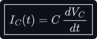

---

## 1 What a capacitor actually is

A capacitor is **two conducting plates separated by a gap** (an insulator, the dielectric). Push
charge onto one plate and it repels an equal charge off the facing plate, so one plate ends up
<!--m:+Q--><!--/m--> and the other <!--m:-Q--><!--/m-->. That separated charge sets up an electric field across the gap, and *that
field* is where the capacitor keeps its energy. How much energy is worked out at the end of this
section, once the charge–voltage law it rests on is on the table.

The defining relationship is simply that the stored charge is proportional to the voltage across
the plates, with the capacitance <!--m:C--><!--/m--> as the constant of proportionality:

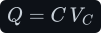

- **<!--m:Q--><!--/m-->** — the charge separated onto the plates, in coulombs (C).
- **<!--m:V_C-->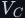<!--/m-->** — the voltage across the plates, in volts (V).
- **<!--m:C--><!--/m-->** — the capacitance, in farads (F): how much charge it stores per volt.

**The stored energy, derived.** A voltage is energy per unit charge: one volt means one joule of
work to carry one coulomb from the <!--m:---><!--/m--> plate to the <!--m:+--><!--/m--> plate (<!--m:1\,\mathrm{V} = 1\,\mathrm{J/C}--><!--/m-->).
So charge the capacitor a little at a time and add up the work. When it already holds a charge <!--m:q--><!--/m-->,
its voltage is <!--m:v = q/C-->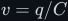<!--/m-->, and carrying the next small charge <!--m:dq--><!--/m--> across costs <!--m:dW = v\,dq = (q/C)\,dq-->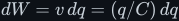<!--/m-->.
Sum every such step from empty (<!--m:q = 0-->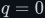<!--/m-->) to full (<!--m:q = Q-->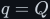<!--/m-->), then use <!--m:Q = C\,V_C--><!--/m-->:

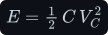

- **<!--m:E--><!--/m-->** — the stored energy, in joules (J). Check the units: farads times volts squared is
  <!--m:(\mathrm{C/V})\cdot\mathrm{V}^2 = \mathrm{C}\cdot\mathrm{V} = \mathrm{J}--><!--/m-->.

The factor of one half is not decoration. The first charge was carried across almost no voltage
and only the last charge across the full <!--m:V_C--><!--/m-->, so on average each coulomb was carried across
<!--m:V_C/2-->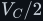<!--/m-->.

## 2 The rule you need — when you may differentiate an equation

Here is the exact step that feels illegal, and the honest worry behind it: *"we can't just
differentiate — and we definitely can't multiply an equation by <!--m:d/dt--><!--/m-->. So when are we actually
allowed to do this?"* That worry is correct, and worth answering precisely, because the answer is
the tool the rest of the subject runs on.

**The rule.** If two quantities are *equal as functions of time* — meaning they are the same
number at every instant <!--m:t--><!--/m--> — then their rates of change are also equal at every instant. In
symbols: if <!--m:f(t) = g(t)-->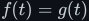<!--/m--> for all <!--m:t--><!--/m-->, then <!--m:df/dt = dg/dt-->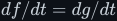<!--/m-->. You are **not** "multiplying the
equation by an operator." You are applying *the same function* — the derivative — to *two
expressions that are already the same function*, so the results are still the same function.

Two moves, so the distinction is unmistakable:

- **Legal — differentiate an identity.** <!--m:Q(t) = C \cdot V(t)-->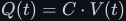<!--/m--> holds at every instant, so applying
  <!--m:d/dt--><!--/m--> to both sides is the same operation done to two things that were already equal.
- **Not a thing — "multiply the equation by <!--m:d/dt--><!--/m-->".** <!--m:d/dt--><!--/m--> is an operator, not a number; you do
  not "multiply both sides" by it the way you'd multiply by 3. "Differentiate both sides" is
  shorthand for the *legal* move above, and it only works because the two sides are equal as
  functions.

Carry out the legal move on <!--m:Q = C \cdot V--><!--/m-->. The capacitance <!--m:C--><!--/m--> is a constant, so it comes out front of
the derivative:

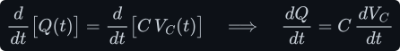

Now bring in the **second** fact — the definition of current. Current *is* the rate at which
charge moves:

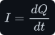

This is the piece that felt "missing": the charge–voltage relationship relates charge to voltage;
the definition of current relates charge to current. Substitute the second into the differentiated
first — replace <!--m:dQ/dt-->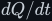<!--/m--> with <!--m:I--><!--/m--> — and the capacitor law falls out:

> **Tip —** The whole trick is: **an equation between two functions of <!--m:t--><!--/m--> stays true if you
> differentiate both sides**, because you are doing the identical thing to two things that are
> already identical. That is the licence to go from <!--m:Q = C \cdot V--><!--/m--> to <!--m:I_C = C \cdot dV/dt-->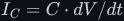<!--/m--> — and, read the
> other way (integration is the inverse), the licence to go from a constant current back to a
> voltage ramp in §4.

> **Note —** This is the same shape as the inductor, where we integrated the constant-voltage
> law to get a current ramp ([../inductor/inductor.md §4](../inductor/inductor.md#4-from-the-law-to-the-ramp--the-integral-done-slowly)).
> Differentiation and integration are inverses, so "differentiate <!--m:Q = C \cdot V--><!--/m-->" and "integrate
> <!--m:V_L = L \cdot dI/dt-->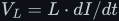<!--/m-->" are the same manoeuvre run in opposite directions.

## 3 The units of the farad

From <!--m:Q = C \cdot V--><!--/m-->, a farad is a coulomb per volt. And since current is charge per time, a coulomb is
an ampere-second (<!--m:1 C = 1 A \cdot s--><!--/m-->):

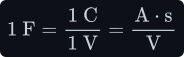

Check it against the law <!--m:I_C = C \cdot dV/dt--><!--/m--> — volts and seconds cancel, leaving amps:

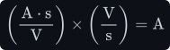

## 4 From the law to the ramp

Run the mirror of the inductor argument. Suppose the **current is held constant** (exactly what a
converter's inductor forces into the capacitor for part of each cycle). Then <!--m:dV_C/dt = I_C/C-->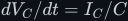<!--/m--> is a
constant, so the voltage climbs in a straight line from wherever it started:

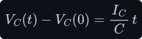

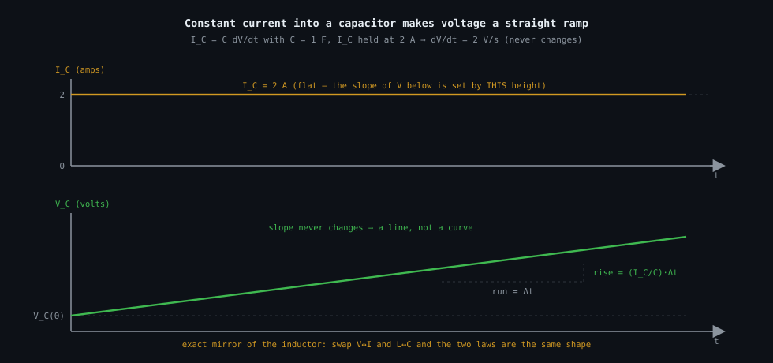

_The flat cause (<!--m:I_C--><!--/m--> on top) sets the slope of the straight-line effect (<!--m:V_C--><!--/m--> below) — the exact
mirror of the inductor's <!--m:I--><!--/m-->-vs-<!--m:t--><!--/m--> ramp. Swap <!--m:V \leftrightarrow I-->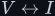<!--/m--> and <!--m:L \leftrightarrow C--><!--/m--> and it is the same picture._

## 5 At the poles

This is where a capacitor is genuinely different from an inductor. **No charge ever crosses the
gap** between the plates. Current *appears* to flow "through" the capacitor only because charge
arrives on the near plate and an equal charge is pushed off the far plate at the same instant.

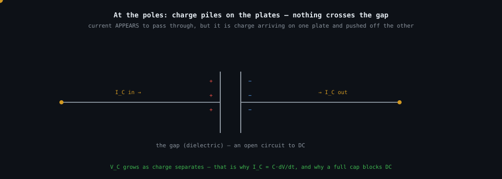

_Charge piles up (<!--m:V_C--><!--/m--> grows) rather than passing through — which is why <!--m:I_C--><!--/m--> can flow while the
voltage is changing, yet a fully-charged capacitor blocks DC entirely (once <!--m:dV/dt = 0--><!--/m-->, <!--m:I_C = 0--><!--/m-->).
Contrast the inductor, where current flows straight through the wire the whole time
([../inductor/inductor.md §6](../inductor/inductor.md#6-at-the-poles))._

> **Note —** "Blocks DC, passes AC" is just this law restated. At DC the voltage is steady, so
> <!--m:dV/dt = 0--><!--/m--> and <!--m:I_C = 0--><!--/m--> — an open circuit. The faster the voltage changes (for a repeating waveform: the more
> cycles per second it makes, that is, the higher its frequency), the more current flows for the same capacitance.

## 6 The duality — one table, read both ways

Everything above is the inductor's story with two swaps: <!--m:V \leftrightarrow I--><!--/m--> and <!--m:L \leftrightarrow C--><!--/m-->. Learn one law and
you have the other for free.

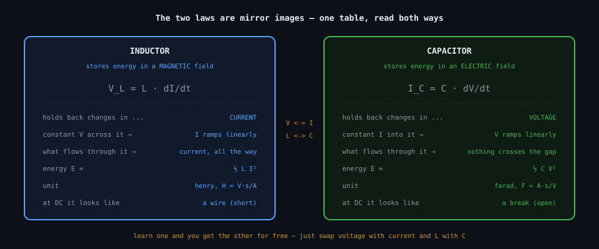

_Same rows, two columns: the inductor holds back changes in current; the capacitor holds back
changes in voltage. This mirror is why the buck's inductor-sizing maths and the boost's
capacitor-sizing maths look so alike._

## 7 Sources and cross-links

- **Mirror law:** [../inductor/inductor.md](../inductor/inductor.md) — <!--m:V_L = L \cdot dI/dt--><!--/m-->, the same
  equation before the <!--m:V \leftrightarrow I--><!--/m-->, <!--m:L \leftrightarrow C--><!--/m--> swap.
- **Where the ramp is used:** the output-capacitor sizing in
  [../../dc-dc-converters/buck/buck.md §5](../../dc-dc-converters/buck/buck.md#5-sizing-the-output-capacitor)
  and [../../dc-dc-converters/boost/boost.md §5](../../dc-dc-converters/boost/boost.md#5-sizing-the-output-capacitor).
- Style and figure conventions: [../../STYLE.md](../../STYLE.md).
