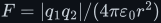
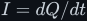
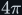
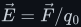
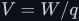
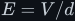
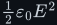

# Coulomb's law

Electric charge from first principles, and everything that follows from the force between two
charges: current as charge per second, <!--m:1\ \mathrm{A} = 1\ \mathrm{C\cdot s^{-1}}-->, Coulomb's law
<!--m:F = |q_1 q_2|/(4\pi\varepsilon_0 r^2)-->, superposition, the electric field, the volt as
<!--m:1\ \mathrm{J\cdot C^{-1}}-->, Gauss's law, and the parallel-plate capacitance
<!--m:C = \varepsilon_0 A/d-->. The full argument is in [coulombs-law.md](coulombs-law.md), in twelve
sections with nine figures (Figures 91–99), three of them animated.

> **The thesis in one line**
>
> Like charges repel and unlike charges attract, with a force proportional to each charge and to the
> inverse square of their distance. The field, the volt, Gauss's law and the capacitor all follow
> from that one law.

## Contents

The treatment covers:

1. Electric charge — two kinds, quantised in units of <!--m:e = 1.602\times10^{-19}\ \mathrm{C}-->, and
   conserved.
2. Current is charge in motion — <!--m:I = dQ/dt-->, electrons per second, and the drift speed in copper
   (Figure 91, animated).
3. Coulomb's law with every symbol and unit, including <!--m:\varepsilon_0--> in
   <!--m:\mathrm{C^{2}\cdot N^{-1}\cdot m^{-2}}--> and why the <!--m:4\pi--> is there (Figures 92, animated, and 93).
4. Worked numbers: two electrons, the hydrogen atom, and 1 C against 1 C at 1 m, which is about
   <!--m:9\times10^9\ \mathrm{N}-->.
5. The vector form and superposition, with a worked three-charge example (Figure 94).
6. The electric field <!--m:\vec E = \vec F/q_0-->, the field of a point charge, and field lines (Figures
   95 and 96, animated).
7. Work, potential and voltage: <!--m:V = W/q-->, the uniform field <!--m:E = V/d-->, the point-charge potential
   <!--m:kq/r-->, and why voltage depends only on the end points.
8. Gauss's law, derived from Coulomb's law: why <!--m:1/r^2--> gives the same flux through every sphere
   (Figure 97).
9. Parallel plates: the uniform field, <!--m:C = \varepsilon_0 A/d-->, <!--m:\varepsilon_0--> in
   <!--m:\mathrm{F\cdot m^{-1}}-->, and the energy density <!--m:\tfrac{1}{2}\varepsilon_0 E^2--> (Figure 98).
10. Why there is no magnetic charge, which leads into Ampère's law (Figure 99).
11. What this costs you — the limits of the law, breakdown, and why you cannot hold a coulomb.
12. Sources and cross-links.

## Reading order

This is the first of the field laws. Read it before
[../electromagnetism/electromagnetism.md](../electromagnetism/electromagnetism.md), whose §1
summarises it. Then go on to [../amperes-law/](../amperes-law/), which starts where §10 here ends,
and [../faradays-law/](../faradays-law/). The capacitor results of §9 are used by
[../capacitor/capacitor.md](../capacitor/capacitor.md).

## Links

- Parent index: [../README.md](../README.md)
- Style guide: [../../STYLE.md](../../STYLE.md)
- Field laws: [../electromagnetism/](../electromagnetism/), [../amperes-law/](../amperes-law/),
  [../faradays-law/](../faradays-law/)
- The capacitor: [../capacitor/](../capacitor/)
- Figure script: [../../../toolchain/figures/coulombs_law.js](../../../toolchain/figures/coulombs_law.js)
