# Coulomb's law — electric charge, the force between charges, and the electric field

Every circuit in this tree pushes electric charge around, and every law in it rests on one
experimental fact: two charges push or pull on each other with a force that falls as the square of
the distance between them. This document starts from nothing. It says what charge is and how it is
measured, defines current as charge per second, states Coulomb's law with every symbol and unit,
and then builds the electric field, voltage, Gauss's law and the capacitance of two plates from it,
step by step and with worked numbers. It ends by asking why magnetism has no charge of its own,
which is where [Ampère's law](../amperes-law/) takes over.

**Contents**

1. [Electric charge](#1-electric-charge)
2. [Current is charge in motion](#2-current-is-charge-in-motion)
3. [Coulomb's law — the force between two point charges](#3-coulombs-law--the-force-between-two-point-charges)
4. [Worked numbers — how strong the electric force is](#4-worked-numbers--how-strong-the-electric-force-is)
5. [The vector form and superposition](#5-the-vector-form-and-superposition)
6. [The electric field](#6-the-electric-field)
7. [Work, potential and voltage](#7-work-potential-and-voltage)
8. [Gauss's law, derived from Coulomb's law](#8-gausss-law-derived-from-coulombs-law)
9. [Parallel plates and capacitance](#9-parallel-plates-and-capacitance)
10. [Why there is no magnetic charge](#10-why-there-is-no-magnetic-charge)
11. [What this costs you — the limits of Coulomb's law](#11-what-this-costs-you--the-limits-of-coulombs-law)
12. [Sources and cross-links](#12-sources-and-cross-links)

> **The thesis in one line**
>
> Like charges repel and unlike charges attract, with a force proportional to each charge and to the
> inverse square of their distance. The field, the volt, Gauss's law and the capacitor all follow
> from this one law:

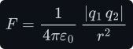

---

## 1 Electric charge

**What it is.** Charge is a property that some particles carry, as they carry mass. It shows up in
only one way: charged objects push or pull on one another. Rub a plastic rod with wool and it
attracts scraps of paper. Two rods rubbed the same way push each other apart. A rubbed plastic rod and
a rubbed glass rod pull together. Experiments like these show that there are exactly two kinds of
charge, and that

- **like charges repel** — two of the same kind push apart;
- **unlike charges attract** — one of each kind pull together.

Benjamin Franklin named the two kinds **positive** (+) and **negative** (−). The names fit the
arithmetic: equal amounts of the two kinds cancel, so an object with equal amounts of each acts as
if it had no charge at all. We call it **neutral**. Ordinary matter is built of protons, which
carry positive charge, electrons, which carry an equal amount of negative charge, and neutrons,
which carry none. A rubbed rod is charged because it has gained or lost a tiny fraction of its
electrons.

**Quantisation.** Charge comes in whole-number multiples of one smallest amount, the
**elementary charge** <!--m:e-->. A proton carries <!--m:+e--> and an electron <!--m:-e-->. Any free object's charge
<!--m:q--> is therefore

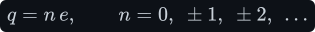

- <!--m:q--> — the charge of the object, in coulombs (C, defined next);
- <!--m:n--> — a whole number, the excess of protons over electrons (negative if electrons are in excess);
- <!--m:e--> — the elementary charge, in coulombs.

(Quarks, inside protons and neutrons, carry 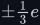<!--m:\pm\tfrac{1}{3} e--> and 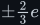<!--m:\pm\tfrac{2}{3} e-->, but they are never
found alone. Every free particle's charge is a whole multiple of <!--m:e-->.)

**The coulomb.** The SI unit of charge is the **coulomb**, symbol C. Since the 2019 redefinition of
the SI, the coulomb is fixed by giving the elementary charge an exact value:

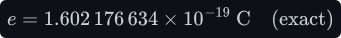

Turn that round to see how many elementary charges make one coulomb:

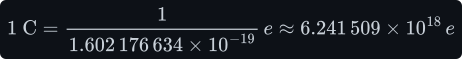

So a coulomb is about six million million million electrons' worth of charge. That sounds like a lot,
and §4 shows that, measured as a force, it is very much more than it sounds.

**Conservation.** The total charge of an isolated system never changes. Charge can move from one
object to another (that is what rubbing does), and particles can be created or destroyed, but only
in combinations whose charges add to zero:

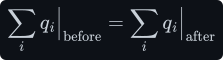

- 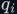<!--m:q_i--> — the charge of object number <!--m:i-->, in coulombs; the sum runs over every object in the system.

For example, a high-energy photon <!--m:\gamma--> (no charge) can turn into an electron and a positron,
the electron's antiparticle with charge <!--m:+e-->:

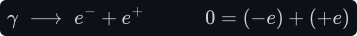

No experiment has ever seen this rule broken. It is the reason Kirchhoff's current law holds: charge
cannot appear or vanish at a junction of wires, so what flows in must flow out (see
[../electromagnetism/electromagnetism.md §1](../electromagnetism/electromagnetism.md#1-charge-current-and-the-electric-field)).

## 2 Current is charge in motion

A circuit does not care how much charge exists. It cares how fast charge **moves** past a point.
Pick a plane cutting across a wire and count the charge <!--m:\Delta Q--> (in coulombs) that crosses it
during a time <!--m:\Delta t--> (in seconds). The **average current** is the ratio:

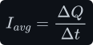

The current at one instant is the limit of that ratio as the counting time shrinks to zero. That
limit is, by definition, the derivative of the charge that has crossed, <!--m:Q(t)-->, with respect to time:

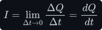

- <!--m:I--> — the current, in amperes (A);
- <!--m:Q--> — the charge that has crossed the plane up to time <!--m:t-->, in coulombs;
- <!--m:t--> — time, in seconds (s).

The unit follows directly from the definition. One ampere is one coulomb crossing the plane every
second. Read backwards, a coulomb is the charge one ampere delivers in one second, an
**ampere-second**:


_Each dot is a packet of 0.1 C. Ten of them cross the plane during each one-second sweep of the
clock, so 1 C crosses per second, and that is 1 A. The animation is slowed down: real electrons in a
wire drift far more slowly still, as the worked number below shows._

**How many electrons is one ampere?** Divide the charge per second by the charge of one electron:

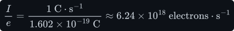

**How fast do they move?** Surprisingly slowly. Let the wire have cross-section area <!--m:A--> (in
<!--m:\mathrm{m^2}-->), let it hold <!--m:n--> free electrons per cubic metre (the carrier density, in
<!--m:\mathrm{m^{-3}}-->), and let them drift along the wire at an average speed <!--m:v--> (in
<!--m:\mathrm{m\cdot s^{-1}}-->). In a short time <!--m:dt--> every carrier within a distance <!--m:v\,dt--> of the
plane crosses it. Those carriers fill a slab of volume <!--m:A\,v\,dt-->, so their number 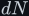<!--m:dN--> is

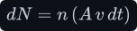

Each carries charge <!--m:e--> (only its size matters here), so the charge that crosses is

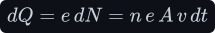

Divide both sides by <!--m:dt-->, which is the definition of current above:

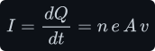

Copper has about 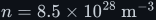<!--m:n = 8.5\times10^{28}\ \mathrm{m^{-3}}--> free electrons. For 1 A in a wire of
cross-section 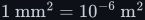<!--m:1\ \mathrm{mm^2} = 10^{-6}\ \mathrm{m^2}-->:

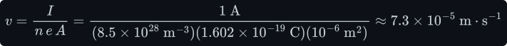

That is less than a tenth of a millimetre per second. An electron would take nearly four hours to
drift one metre. A lamp lights the instant the switch closes because the push travels along
the wire at close to the speed of light. Every electron in the wire starts drifting at once; no
electron has to travel from the switch to the lamp.

> **Note —** Current is defined as the flow of **positive** charge. In a metal the carriers are
> electrons, which move the opposite way to the arrow drawn for <!--m:I-->. The two descriptions give the
> same current, because negative charge moving left changes the charge on each side of the plane
> exactly as positive charge moving right would. Circuit work always uses the conventional
> direction.

## 3 Coulomb's law — the force between two point charges

In 1785 Charles-Augustin de Coulomb hung a light rod from a thin fibre, put a small charged ball on
one end, and brought a second charged ball near it. The twist of the fibre measured the force
between the balls. He found that the force between two small charged bodies

- acts along the straight line joining them;
- is proportional to the product of the two charges;
- falls as the inverse square of the distance between them;
- repels when the charges are alike and attracts when they are unlike.

A **point charge** is a charged body small compared with its distance to the other charges, so that
"the distance between them" has one value. For two point charges, **Coulomb's law** gives the size
of the force as

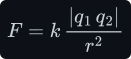

- <!--m:F--> — the size (magnitude) of the force each charge exerts on the other, in newtons (N);
- 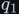<!--m:q_1-->, 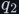<!--m:q_2--> — the two charges, in coulombs, with their signs. The bars <!--m:|\,\cdot\,|--> take the
  size and drop the sign, because the sign tells you the **direction** (repel or attract), not the size;
- <!--m:r--> — the distance between the two charges, in metres (m);
- <!--m:k--> — the **Coulomb constant**, a measured constant of nature that converts "coulombs squared per
  metre squared" into newtons.

The constant is always written in terms of a more basic one, the **permittivity of free space**
<!--m:\varepsilon_0--> (epsilon-nought):

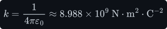

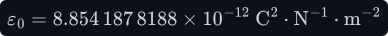

So in full:

**Working out the units.** Solve the law for <!--m:k-->:

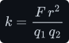

Put in the units of each quantity: newtons on top, metres squared on top, coulombs squared below.

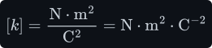

<!--m:\varepsilon_0--> is 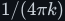<!--m:1/(4\pi k)-->, and <!--m:4\pi--> is a pure number, so its unit is the reciprocal:

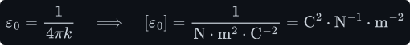

§9 shows that this same unit can be written as farads per metre,
<!--m:\mathrm{F\cdot m^{-1}}-->, which is how datasheets and the
[electromagnetism notes](../electromagnetism/electromagnetism.md#1-charge-current-and-the-electric-field)
quote it. It is the same number in a different unit.

> **Note — where the factor of four pi comes from.** The <!--m:4\pi--> looks like clutter, but it is put there on purpose. §8 shows that
> the electric field of a charge spreads over a sphere of area 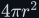<!--m:4\pi r^2-->. Writing <!--m:k--> as
> 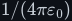<!--m:1/(4\pi\varepsilon_0)--> makes the <!--m:4\pi--> cancel in Gauss's law and in the capacitor formula
> 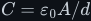<!--m:C = \varepsilon_0 A/d-->. Those are the formulas you use every day, so the <!--m:4\pi--> is moved
> into the law you use least.

**The inverse square.** Because <!--m:r--> is squared, the force is very sensitive to distance:

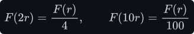

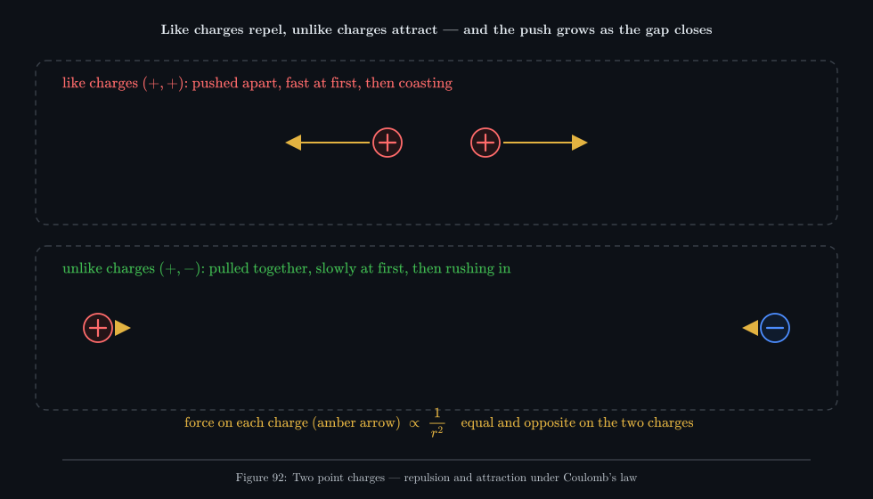

_Two like charges released from rest fly apart. The push is strongest at the start, when they are
close, so they gain speed fast and then coast. Two unlike charges released far apart barely move at
first, then rush together as the pull grows. The amber arrows show the force on each charge. They are
always equal and opposite, and their length follows <!--m:1/r^2--> (clipped at the largest)._

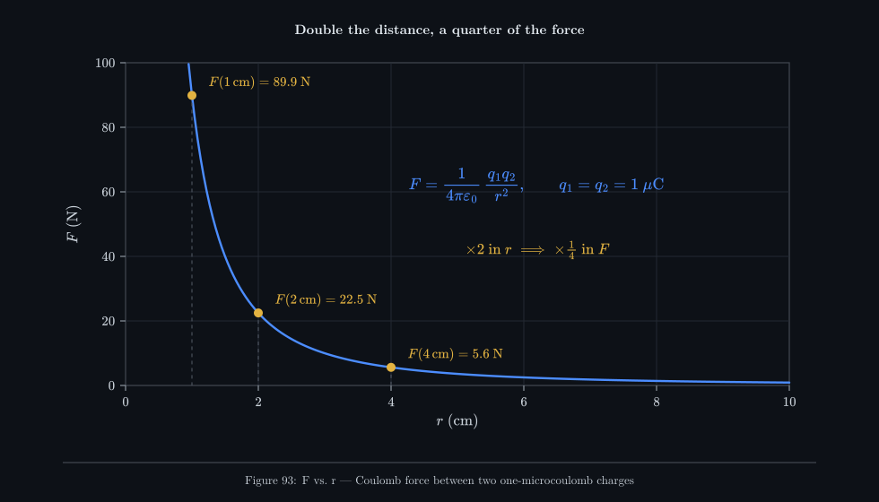

_The same law as a graph, for two 1 µC charges (see §4). From 1 cm to 2 cm the force drops from 90 N
to 22 N. By 10 cm it is under 1 N. The curve never reaches zero, but it gets small quickly._

## 4 Worked numbers — how strong the electric force is

**Two electrons, 1 nm apart.** Each carries <!--m:e = 1.602\times10^{-19}\ \mathrm{C}--> and
<!--m:1\ \mathrm{nm} = 10^{-9}\ \mathrm{m}-->. Both charges are negative, so they repel:

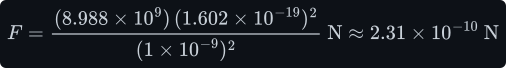

That looks tiny, but an electron has mass 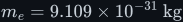<!--m:m_e = 9.109\times10^{-31}\ \mathrm{kg}-->. By Newton's second
law, acceleration <!--m:a--> (in <!--m:\mathrm{m\cdot s^{-2}}-->) is force divided by mass:

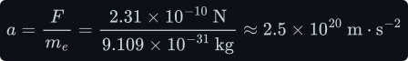

That is more than <!--m:10^{19}--> times the acceleration of gravity.

**Electric force against gravity.** Two electrons also attract each other by gravity, with force
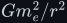<!--m:G m_e^2/r^2-->. Here <!--m:G = 6.674\times10^{-11}\ \mathrm{N\cdot m^{2}\cdot kg^{-2}}--> is the
gravitational constant. Both forces fall as <!--m:1/r^2-->, so their ratio does not depend on the distance:

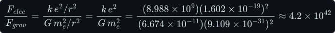

The electric force wins by 42 orders of magnitude. Gravity dominates the everyday world only because
matter is almost perfectly neutral, so the huge electric forces cancel.

**The hydrogen atom.** A proton and an electron sit about <!--m:5.29\times10^{-11}\ \mathrm{m}--> apart (the
Bohr radius). Their attraction is

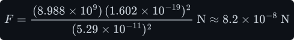

**One coulomb against one coulomb, 1 m apart.** This is the number that shows how big a coulomb is:

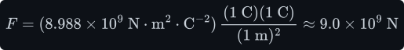

Nine thousand million newtons. Divide by 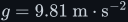<!--m:g = 9.81\ \mathrm{m\cdot s^{-2}}-->, the acceleration of
gravity at the Earth's surface, to find the mass <!--m:m--> that weighs as much:

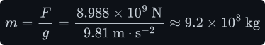

About 900 000 tonnes, the weight of several large ships. Yet a 1 A lamp passes 1 C every second.
There is no contradiction: the coulomb flowing through the lamp is matched, at every instant, by an
equal positive charge in the metal it passes through. The wire stays neutral, so the enormous force
never appears. §11 shows that you cannot even hold 1 C of unbalanced charge on any object of
reasonable size.

**Two 1 µC charges, 1 cm apart.** A microcoulomb (<!--m:1\ \mu\mathrm{C} = 10^{-6}\ \mathrm{C}-->) is about
what a rubbed balloon or a charged capacitor's plate holds in everyday static electricity:

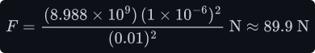

About the weight of a 9 kg mass, from charges far smaller than anything a circuit pushes through
in a second. This is the curve plotted in Figure 93.

## 5 The vector form and superposition

A force has a direction as well as a size. Coulomb's law gives both once positions are written as
vectors (quantities with a direction, printed with an arrow). Let charge <!--m:q_1--> sit at
position 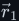<!--m:\vec r_1--> and charge <!--m:q_2--> at 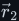<!--m:\vec r_2-->, both measured in metres from any fixed origin.
Define the separation vector, its length, and the **unit vector** (length 1, no unit) pointing from
charge 1 to charge 2:

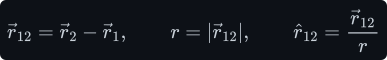

The force on charge 2 due to charge 1 is then

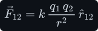

The signs now do the work that the absolute-value bars did before:

- **like charges:** <!--m:q_1 q_2 > 0-->, so 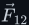<!--m:\vec F_{12}--> points along <!--m:\hat r_{12}-->, away from charge 1.
  That is repulsion.
- **unlike charges:** <!--m:q_1 q_2 < 0-->, so <!--m:\vec F_{12}--> points against <!--m:\hat r_{12}-->, back toward charge 1.
  That is attraction.

Swap the labels and <!--m:\hat r_{21} = -\hat r_{12}-->, so the force on charge 1 is equal and opposite,
as Newton's third law requires:

**Superposition.** When several charges act on one charge <!--m:q-->, each force is computed **as if the
others were absent**, and the forces add as vectors. Here <!--m:\vec F_i--> is the force from charge <!--m:q_i-->,
<!--m:r_i--> is the distance from <!--m:q_i--> to <!--m:q-->, and <!--m:\hat r_i--> is the unit vector from <!--m:q_i--> toward <!--m:q-->:

This is an experimental fact, not a mathematical necessity. The force between two charges is not
changed by a third charge nearby. It is what makes the electric field (§6) and Gauss's law (§8)
possible: anything true of one point charge, if it is linear, is true of any collection of them.

**Worked example.** Put <!--m:q_1 = +4\ \mu\mathrm{C}--> at the origin, <!--m:q_2 = -3\ \mu\mathrm{C}--> at
<!--m:(0.3,\ 0)\ \mathrm{m}-->, and a test charge <!--m:q = +1\ \mu\mathrm{C}--> at <!--m:(0,\ 0.4)\ \mathrm{m}-->. Then
<!--m:q--> is 0.4 m from <!--m:q_1--> and, by Pythagoras, 0.5 m from <!--m:q_2-->.

Force from <!--m:q_1--> alone. Both charges are positive, so it is repulsive and points straight up, away from <!--m:q_1-->:

Force from <!--m:q_2--> alone. The charges are unlike, so it is attractive and points from <!--m:q--> toward <!--m:q_2-->. That direction is
<!--m:(0.3,\ -0.4)/0.5 = (0.6,\ -0.8)-->:

Add the components:

and recombine them into a size and an angle <!--m:\theta--> from the <!--m:x--> axis:

_Each force is found as if the other charge were absent, then the two arrows are added tip to tail.
The pull toward the negative charge cancels part of the push from the positive one. The result is
smaller than the 0.225 N push and tilted toward <!--m:q_2-->._

## 6 The electric field

Coulomb's law describes one charge reaching across empty space to push another. A more useful
description, and the one modern physics uses, says that each charge sets up a **field** in the space
around it, and that another charge feels a force from the field **at the place where it sits**.

**Definition.** Place a small positive **test charge** <!--m:q_0--> (in coulombs) at a point. Measure the
force <!--m:\vec F--> on it. The **electric field** <!--m:\vec E--> at that point is the force per unit test
charge:

The test charge is kept small so that its own push does not move the charges that make the field.
The unit is a newton per coulomb:

(§7 shows that this is the same as volts per metre.) Once the field is known, the force on **any**
charge <!--m:q--> placed there is just

A positive charge is pushed along <!--m:\vec E-->, and a negative charge is pushed the opposite way.

**The field of a point charge.** Put the test charge <!--m:q_0--> at distance <!--m:r--> from a point charge <!--m:q-->.
Let <!--m:\hat r--> be the unit vector pointing from <!--m:q--> out toward <!--m:q_0-->. Coulomb's law (§5) gives the force

and dividing by <!--m:q_0--> removes the test charge, leaving a property of <!--m:q--> and of position alone:

For <!--m:q > 0--> the field points radially outward, and for <!--m:q < 0--> it points inward. Its strength falls
as <!--m:1/r^2-->, exactly like the force. A 1 nC charge (<!--m:10^{-9}\ \mathrm{C}-->) makes, 10 cm away,

By superposition (§5), the field of many charges is the vector sum of their separate fields:

**Field lines.** A field is a vector at every point of space, which is hard to draw. Faraday's
**field lines** are the standard picture. They follow three rules:

1. At every point the line runs in the direction of <!--m:\vec E-->. An arrow on the line shows the
   direction a positive test charge would be pushed.
2. Lines begin on positive charges and end on negative charges (or run off to infinity). The number
   of lines leaving a charge is proportional to its charge.
3. Where the lines are crowded the field is strong. Where they spread out it is weak. Two lines never
   cross, because the field has only one direction at each point.

_Around a single charge the lines are straight spokes. The same number of spokes spreads over a
larger and larger sphere, which is the <!--m:1/r^2--> law drawn as a picture (§8 makes this exact).
Between a positive and a negative charge the lines bend from one to the other. Each line shows the
path along which a positive charge would be pushed at that point._

_The force on a positive test charge points along the line, outward from <!--m:+Q--> and inward toward <!--m:-Q-->.
The dots are drawn drifting through a thick, viscous medium, where speed is proportional to force.
In that case they follow the lines exactly: fast near the source charge, where the lines crowd, and
slow far away. A free charge in vacuum also has momentum, so on a curved line it would drift off to
the outside of the curve. The line gives the direction of the force, not the path._

## 7 Work, potential and voltage

**Work.** A force does **work** when it moves something. For a constant force <!--m:\vec F--> moving an object
along a straight displacement <!--m:\vec d--> (in metres), the work <!--m:W--> (in joules, J) is the force times the
distance moved in the direction of the force. Here <!--m:\theta--> is the angle between <!--m:\vec F--> and <!--m:\vec d-->:

Along a curved path from point A to point B, chop the path into tiny straight steps <!--m:d\vec l--> (in
metres), add up the work done on each step, and take the limit as the steps shrink:

**Potential difference.** Let the electric field move a charge <!--m:q--> from A to B, doing work
<!--m:W_{AB}-->. That work is proportional to <!--m:q-->, because <!--m:\vec F = q\vec E-->. Dividing by <!--m:q--> therefore
gives a quantity that belongs to the two points alone. This is the **potential difference** between
A and B, also called the **voltage** between them:

- <!--m:V_A-->, <!--m:V_B--> — the **electric potential** at A and at B, in volts (V);
- <!--m:W_{AB}--> — the work done by the field on <!--m:q--> as it goes from A to B, in joules;
- <!--m:q--> — the charge carried, in coulombs.

Put <!--m:\vec F = q\vec E--> into the work integral and the <!--m:q--> cancels:

Equivalently, <!--m:V_A - V_B--> is the work **you** must do, per coulomb, to carry a charge slowly
back from B to A against the field. Positive charge "falls" from high potential to low, just as a
mass falls from high to low ground. A 12 V battery is a device that lifts every coulomb through 12 J.

**The volt.** The definition fixes the unit:

and with <!--m:1\ \mathrm{J} = 1\ \mathrm{N\cdot m}--> it also shows that the two units of field are
the same:

So <!--m:\mathrm{N\cdot C^{-1}}--> and <!--m:\mathrm{V\cdot m^{-1}}--> name the same thing. Circuits use the
second: a field is how many volts you drop per metre.

**Uniform field.** If <!--m:\vec E--> is the same everywhere between two points a distance <!--m:d--> apart
along the field, the force <!--m:qE--> is constant and points along the path. The work is force times
distance:

Divide by <!--m:q-->:

For example, 12 V across a 1 mm gap:

**The potential of a point charge.** Choose the zero of potential far away, at <!--m:r = \infty-->, where
the field has died out. Carry a test charge from radius <!--m:r--> straight out to infinity along a field
line. Here <!--m:r'--> is the running radius along the way, in metres:

The step that confuses people is the sign. The field pushes a positive test charge **outward**,
so going from <!--m:r--> out to <!--m:\infty--> the field does positive work, and the starting point <!--m:r--> is at the
**higher** potential. The integral <!--m:\int_r^\infty dr'/r'^2--> comes out as <!--m:+1/r-->, so a positive charge
sits on a "hill" of potential <!--m:kq/r--> that rises as you approach it. The 1 nC charge of §6, at 10 cm:

**Why voltage depends only on the end points.** The Coulomb force on a test charge points straight
toward or away from the source charge. Split any path into tiny steps along the radius and tiny
steps around a circle centred on the charge. The steps around the circle are perpendicular to the
force, so they do no work. The radial steps add up to the integral above, which depends only on the
starting and ending radius. So the work, and hence the voltage, is the same for **every** path
between two points. By superposition this holds for any arrangement of static charges. It is why
"the voltage at a node" means something, and it is the content of Kirchhoff's voltage law (see
[../electromagnetism/electromagnetism.md §1](../electromagnetism/electromagnetism.md#1-charge-current-and-the-electric-field)).
A *changing* magnetic field breaks this property, which is the subject of
[Faraday's law](../faradays-law/).

**Potential energy and the electron-volt.** A charge <!--m:q--> at a point of potential <!--m:V--> has potential
energy <!--m:U--> (in joules)

An electron that falls through 1 V gains one **electron-volt** (eV) of energy, the natural energy
unit for single particles:

## 8 Gauss's law, derived from Coulomb's law

Coulomb's law says the field falls as <!--m:1/r^2-->. The surface of a sphere grows as <!--m:r^2-->. Those two
facts cancel, and the cancellation gives Gauss's law, which is Coulomb's law rewritten in a form
that makes symmetric problems easy.

**Flux.** Give each small patch of a surface an **area vector** <!--m:d\vec A-->. Its length is the
patch's area (in m²) and it points along the patch's normal, outward for a closed surface. The
**electric flux** <!--m:\Phi_E--> through a surface <!--m:S--> adds up the component of <!--m:\vec E--> that crosses
each patch:

Here <!--m:\theta--> is the angle between <!--m:\vec E--> and the normal. A field skimming along the surface
(<!--m:\theta = 90^\circ-->) contributes nothing, and a field crossing it head-on contributes <!--m:EA-->. In the
field-line picture, flux counts how many lines pierce the surface, with lines going out counted
positive and lines coming in counted negative. Its unit is

**A sphere centred on a point charge.** On a sphere of radius <!--m:r--> around <!--m:q-->, the field is the same
size everywhere and points straight out, along the normal (<!--m:\theta = 0-->). So <!--m:E--> comes outside
the integral, and the integral of <!--m:dA--> is just the sphere's area:

Substitute the point-charge field from §6:

The radius has gone. Every sphere around the charge, large or small, carries exactly the same
flux. A sphere twice as big has four times the area, and the field on it is a quarter as strong. In
the picture, the same lines cross every sphere. This works **only** because the force is exactly
inverse-square. With <!--m:1/r^{2.1}-->, larger spheres would carry less flux.

**Any closed surface.** The same is true of a lumpy surface. Measure how big a patch looks from the
charge by its **solid angle** <!--m:d\Omega--> (in steradians, sr). This is the patch's area, tilted to face
the charge, divided by <!--m:r^2-->. The whole sphere of directions is <!--m:4\pi--> steradians:

The flux through one patch is then

So each patch's flux depends only on how big it looks from the charge, not on how far away it is.
A closed surface around the charge surrounds it completely, covering all <!--m:4\pi--> steradians once:

If the charge is **outside** the surface, every cone of directions from the charge that hits the
surface hits it twice: once going in (negative flux) and once coming out (positive flux). The two
patches subtend the same solid angle, so they cancel exactly. An outside charge contributes zero net
flux.

**Gauss's law.** Add up any number of charges by superposition (§5). Each one inside contributes
<!--m:q_i/\varepsilon_0--> and each one outside contributes zero. Let <!--m:Q_{enc}--> be the total charge enclosed
by the surface, in coulombs. Then

_Left: the 16 lines from the charge cross the small sphere and the large sphere alike, so the flux
is the same. Right: a surface beside the charge. Each line that enters it (blue) leaves again (red),
so the net flux is zero. Only enclosed charge counts._

Gauss's law and Coulomb's law contain the same physics for static charges. Gauss's form is more
useful in two ways. It turns symmetric field problems into one line of algebra (§9). It also stays
true when charges move, which is why it appears as the first of Maxwell's four equations in
[../electromagnetism/electromagnetism.md §15](../electromagnetism/electromagnetism.md#15-the-whole-set--maxwells-four-equations).

## 9 Parallel plates and capacitance

A capacitor is two conducting plates facing each other across a gap (see
[../capacitor/capacitor.md](../capacitor/capacitor.md)). Gauss's law gives its field and its
capacitance directly.

**Surface charge density.** Spread charge <!--m:Q--> evenly over a plate of area <!--m:A-->. The charge per
square metre is the **surface charge density** <!--m:\sigma--> (sigma):

**One large sheet.** Take a flat sheet of charge, large enough that its edges are far away. By
symmetry its field must point straight away from it on both sides (for <!--m:\sigma > 0-->), with the same
strength on both sides. Draw a **pillbox**, a short closed cylinder whose two flat faces of area
<!--m:A_p--> sit on either side of the sheet. Flux leaves through both faces and none through the curved
side, which runs parallel to the field. The charge inside is <!--m:\sigma A_p-->. Gauss's law gives

The field does not fall with distance. Close to a large sheet, every field line runs straight out
and never spreads, so the field stays the same at every distance.

**Two plates.** Now put <!--m:+Q--> on one plate and <!--m:-Q--> on the other, a distance <!--m:d--> apart, with
<!--m:d--> much smaller than the plate's width. Each plate alone makes a field of size <!--m:\sigma/(2\varepsilon_0)-->.
The positive plate's field points away from it. The negative plate's field points toward it.
**Between** the plates both point from + to −, so by superposition they add:

**Outside** the plates, the two fields point opposite ways and cancel:

As a check, draw one pillbox around a patch of the positive plate only. Its outer face is in the
zero-field region and its inner face is in the gap, so flux leaves through one face only:

Both routes give the same answer. The field between the plates is **uniform**: the same size and
direction at every point of the gap.

**Voltage and capacitance.** The field is uniform, so §7 gives the voltage across the gap:

The voltage is proportional to the charge. The constant of proportionality is the
**capacitance** <!--m:C-->, the charge stored per volt (in farads, F):

This is the relation <!--m:Q = CV--> that [../capacitor/capacitor.md §1](../capacitor/capacitor.md#1-what-a-capacitor-actually-is)
starts from, now with a formula for <!--m:C--> in terms of the geometry. It explains the design rules. To get
more capacitance, make the plates larger (more area <!--m:A--> holds more charge at the same field), bring them
closer (smaller <!--m:d--> means less voltage for the same field), or fill the gap with a material that
reduces the field (below).

_Between the plates the field is uniform. Outside, the two sheets' fields cancel. The pillbox
around the top plate encloses charge <!--m:\sigma A_p--> and loses flux only through its lower face,
which gives <!--m:E = \sigma/\varepsilon_0-->. Only near the edges does the field bulge outward
("fringing"), which the formula ignores._

**The farad, and the permittivity in farads per metre.** The unit of capacitance is

Now check the units of <!--m:\varepsilon_0 A/d-->, using <!--m:1\ \mathrm{J} = 1\ \mathrm{N\cdot m}--> and
<!--m:1\ \mathrm{J} = 1\ \mathrm{C\cdot V}--> (from <!--m:1\ \mathrm{V} = 1\ \mathrm{J\cdot C^{-1}}-->, §7):

That is why the permittivity is usually quoted as
<!--m:\varepsilon_0 = 8.854\times10^{-12}\ \mathrm{F\cdot m^{-1}}-->. The number is the same as in §3; only
the unit's name has changed.

**Worked numbers.** Two plates <!--m:10\ \mathrm{cm}\times10\ \mathrm{cm}--> (<!--m:A = 0.01\ \mathrm{m^2}-->), 1 mm apart, in vacuum:

Charged to 12 V, the field is <!--m:12\ \mathrm{kV\cdot m^{-1}}--> (§7) and the charge is

About seven thousand million electrons moved from one plate to the other. That sounds like a lot,
but it is fewer than one surface atom in ten million. How big would a **one-farad** vacuum capacitor
with a 1 mm gap have to be?

That is a square more than 10 km on a side. Real farad-sized capacitors use
nanometre-thin insulating layers (the electrolytic capacitor) or the porous surface of carbon (the
supercapacitor) to make <!--m:d--> tiny and <!--m:A--> huge.

**Dielectrics.** An insulating material in the gap contains molecules whose charges shift slightly
in the field, partly cancelling it. The field for a given <!--m:Q--> drops by the material's **relative
permittivity** <!--m:\varepsilon_r--> (a pure number, 1 for vacuum, about 4 to 5 for the FR-4 glass-epoxy
of a circuit board, and thousands for some ceramics), so the capacitance rises by the same factor:

**Where the energy is.** The [capacitor notes](../capacitor/capacitor.md#1-what-a-capacitor-actually-is)
show that a charged capacitor stores energy <!--m:U = \tfrac{1}{2} C V^2--> (in joules). Put in <!--m:C = \varepsilon_0 A/d-->
and <!--m:V = Ed-->. The volume of the gap is <!--m:Ad-->, so the energy per cubic metre <!--m:u--> (in
<!--m:\mathrm{J\cdot m^{-3}}-->) is

The energy belongs to the field itself, spread through the gap.

## 10 Why there is no magnetic charge

Charges come in two kinds that can be separated. Pull an electron off an atom and you have a lone
negative charge and a positive ion, each with a field of its own. Magnetism looks at first as though
it should work the same way. A bar magnet has a north (N) and a south (S) pole, like poles repel, and
unlike poles attract. But the analogy fails at the first test: **cut a magnet in half and you get two
complete magnets**, each with its own N and S. Cut again and again, down to a single atom, and you
still find N and S together. Nobody has ever isolated a lone north or south pole, a **magnetic
monopole**, despite dedicated searches in cosmic rays, in moon rock and at particle colliders.

The reason is that magnetism has a different source. The **magnetic field** <!--m:\vec B--> is defined,
like <!--m:\vec E-->, by the force it exerts. That force acts only on a charge <!--m:q--> that is **moving**, with
velocity <!--m:\vec v--> (in <!--m:\mathrm{m\cdot s^{-1}}-->), and it acts sideways, perpendicular to both <!--m:\vec v-->
and <!--m:\vec B--> (the cross product <!--m:\times-->):

Its unit, the tesla (T), follows from the force law: newtons per (coulomb times metre per second).
Since <!--m:1\ \mathrm{C\cdot s^{-1}} = 1\ \mathrm{A}--> (§2), this can also be written in amperes:

And it is **moving** charge, which means current, that makes <!--m:\vec B--> in the first place. A bar
magnet's field comes from electrons inside its atoms, each of which behaves as a tiny loop of
circulating current (strictly, a quantum property called spin, which acts like one). A current loop
has a "north" face and a "south" face, but they are two sides of the same loop. They cannot be pulled
apart, because there is nothing at either face to pull: only charge flowing round. That is why the
lines of <!--m:\vec B--> never start or end. They close on themselves, passing through the magnet from S to
N and returning outside from N to S. Every line that enters a closed surface also leaves it, so in
the language of §8 the magnetic flux out of **any** closed surface is zero:

Compare Gauss's law for <!--m:\vec E-->, where the right-hand side is <!--m:Q_{enc}/\varepsilon_0-->. For <!--m:\vec B-->
there is nothing to enclose.

_Electric field lines start on positive charge and end on negative charge, and the two charges can be
separated. Magnetic field lines have no ends. They loop through the magnet and back, and cutting
the magnet only makes two shorter loops, never a free pole._

So the magnetic counterpart of Coulomb's law cannot be "pole against pole". It must be a law about
how a **current** makes a magnetic field. That law is **Ampère's law**: around any closed loop, the
magnetic field adds up to a constant times the current passing through the loop. It is developed
from the force between current-carrying wires in [../amperes-law/](../amperes-law/). The two kinds
of field are then joined by [Faraday's law](../faradays-law/): a magnetic flux that **changes** with
time makes an electric field that circulates around it. That electric field is not produced by
charges, and around a closed loop it does net work, so the end-point rule of §7 does not hold for it.

## 11 What this costs you — the limits of Coulomb's law

- **Static charges only.** Coulomb's law gives the force between charges **at rest**. Once charges
  move, a magnetic force appears as well (§10). A change in one charge's position also reaches the
  other only after a delay <!--m:r/c-->, where <!--m:c = 3.0\times10^8\ \mathrm{m\cdot s^{-1}}--> is the speed of
  light. For circuit-sized distances and frequencies the correction is negligible. For antennas and
  fast PCB edges it is the whole story.
- **Point charges and ideal geometry.** The law is exact for points. Real bodies must be split into
  small pieces and summed (superposition). The parallel-plate formula <!--m:C = \varepsilon_0 A/d-->
  ignores fringing at the edges, which adds noticeably to the capacitance when <!--m:d--> is not small
  compared with the plate width.
- **Materials change the numbers.** Inside an insulator the field of a given charge is reduced by
  <!--m:\varepsilon_r-->. For many ceramic dielectrics <!--m:\varepsilon_r--> itself changes with voltage,
  temperature and age. A "10 µF" class-2 ceramic capacitor can lose most of its capacitance at its
  rated voltage.
- **Breakdown caps the field.** Air stops insulating at about <!--m:3\ \mathrm{MV\cdot m^{-1}}-->: free
  electrons gain enough energy between collisions to knock more electrons loose, and a spark jumps.
  This is why you cannot hold one coulomb of unbalanced charge on anything ordinary. Keep the
  surface field of a charged sphere of radius <!--m:R--> (in metres) below the breakdown field <!--m:E_{bd}-->:

  A sphere bigger than a football stadium, just to hold 1 C in air. The circuit coulombs of §2 are
  always balanced by an equal opposite charge close by.
- **Quantum and nuclear scales.** At distances below about <!--m:10^{-15}\ \mathrm{m}--> the strong
  nuclear force dominates, and at atomic scales the motion of the charges needs quantum mechanics.
  The inverse-square law itself has been tested to extraordinary precision, though. Any departure in
  the exponent is smaller than about one part in <!--m:10^{16}-->.
- **The coulomb is a large unit.** Everyday static electricity involves nanocoulombs to
  microcoulombs. Circuits move coulombs every second, but never hold more than a tiny unbalanced
  fraction of them anywhere.

## 12 Sources and cross-links

- **Where these results are used next:**
  [../electromagnetism/electromagnetism.md](../electromagnetism/electromagnetism.md) — §1 there
  summarises charge, current and the field. §14 uses Gauss's law on the plates (§9 here) to show that
  the displacement current equals <!--m:C\,dV/dt-->. §15 lists Gauss's law as the first of Maxwell's equations.
- **The capacitor law:** [../capacitor/capacitor.md](../capacitor/capacitor.md)
  — its §2 differentiates <!--m:Q = CV--> to get <!--m:I_C = C\,dV_C/dt-->, using the definition of current
  from §2 here.
- **Magnetism from current:** [../amperes-law/](../amperes-law/) — Ampère's law, the magnetic
  counterpart of §8, starting from the absence of magnetic charge (§10).
- **Changing flux makes an electric field:** [../faradays-law/](../faradays-law/) — the electric
  field that charges do *not* make, and why it breaks the end-point rule of §7.
- C.-A. de Coulomb, *Premier mémoire sur l'électricité et le magnétisme*, Histoire de l'Académie
  Royale des Sciences (1785) — the torsion-balance measurements.
- E. R. Williams, J. E. Faller and H. A. Hill, "New experimental test of Coulomb's law: a laboratory
  upper limit on the photon rest mass", *Physical Review Letters* 26, 721 (1971) — the inverse-square
  exponent confirmed to about one part in 10¹⁶.
- BIPM, *The International System of Units (SI)*, 9th edition (2019) — the exact value of <!--m:e--> and
  the definitions of the coulomb and the ampere. CODATA 2022 recommended values for
  <!--m:\varepsilon_0-->, <!--m:m_e--> and <!--m:G-->.
- D. J. Griffiths, *Introduction to Electrodynamics*, 4th ed., chapter 2 (Coulomb's law, the field,
  Gauss's law, potential) — the standard textbook route followed here.
- E. M. Purcell and D. J. Morin, *Electricity and Magnetism*, 3rd ed., chapters 1–3 — the
  field-line and flux arguments, and the conductor and capacitor results.
- Style and figure conventions: [../../STYLE.md](../../STYLE.md).
