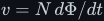
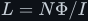

# Electromagnetism

The field laws underneath both component laws: charge and current, the magnetic field and flux,
Ampère's law, Faraday's law <!--m:v = N\,d\Phi/dt--><!--/m-->, Lenz's law, self- and mutual inductance, and
magnetic materials. The full argument is in [electromagnetism.md](electromagnetism.md), in seventeen
sections with seven figures.

> **The thesis in one line**
>
> A winding's voltage is set by how fast the flux through it is *changing* — so the flux is the
> running integral of the voltage, and the inductor law, the transformer turns ratio and the
> "switch faster, smaller core" rule all follow from that one equation.

## Contents

The treatment covers:

1. Charge, current, and the electric field.
2. The magnetic field <!--m:B--><!--/m--> and the tesla (a volt-second per square metre).
3. Magnetic flux, the weber, and flux linkage <!--m:\lambda = N\Phi--><!--/m-->.
4. Where <!--m:B--><!--/m--> comes from — Ampère and Biot–Savart; the long wire and the solenoid,
   <!--m:B = \mu_0 N I/l--><!--/m--> (fig-13, fig-14).
5. <!--m:H--><!--/m-->, permeability, reluctance, and why the core matters.
6. Faraday's law, done slowly — a square voltage makes a triangular flux.
7. **The common inversion corrected:** the flux is the *integral* of the voltage, not its derivative —
   proved by units, by algebra and by waveforms (fig-15).
8. Lenz's law — the minus sign, back-EMF, and where the sign goes in circuit work (fig-16).
9. Self-inductance <!--m:L = N\Phi/I--><!--/m--> — **deriving** the inductor law from Faraday's law.
10. Energy in the magnetic field, <!--m:\tfrac{1}{2}LI^2--><!--/m-->, and why the energy lives in the air gap.
11. Mutual inductance, coupling, and the turns ratio (fig-17).
12. Magnetic materials, saturation, hysteresis, and the B-H curve (fig-18).
13. **Frequency and core size:** for a fixed voltage, a higher frequency gives a *smaller* peak flux,
    which is why the core can shrink — with worked numbers at 50 Hz and 50 kHz (fig-19).
14. Displacement current — why a capacitor passes AC.
15. The whole set — Maxwell's four equations.
16. What this costs you.
17. Sources and cross-links.

## Reading order

Read [../inductor/inductor.md](../inductor/inductor.md) and
[../capacitor/capacitor.md](../capacitor/capacitor.md) first for the circuit view, then
[electromagnetism.md](electromagnetism.md) for where those laws come from. Continue to
[../transformer/](../transformer/), which builds directly on sections 11–13.

## Links

- Parent index: [../README.md](../README.md)
- Style guide: [../../STYLE.md](../../STYLE.md)
- The law derived in section 9: [../inductor/inductor.md](../inductor/inductor.md)
- The law explained in section 14: [../capacitor/capacitor.md](../capacitor/capacitor.md)
- Where it leads: [../transformer/](../transformer/)
