# Electromagnetism — the laws underneath the inductor and the transformer

The [inductor law](../inductor/inductor.md) and the [capacitor law](../capacitor/capacitor.md) are
where this tree starts doing circuits, but neither of them is fundamental. Both are consequences of
a handful of field laws: current makes a magnetic field, a *changing* magnetic flux makes a voltage,
and a *changing* electric field behaves like a current. This document builds those laws from the
ground up, derives <!--m:V_L = L\,dI_L/dt--> from them instead of asserting it, and sets up everything the
[transformer](../transformer/) needs. Along the way it corrects two very natural misreadings — that
the flux is the *derivative* of the voltage, and that a higher switching frequency makes a *bigger*
magnetic field — with proofs and worked numbers.

**Contents**

1. [Charge, current, and the electric field](#1-charge-current-and-the-electric-field)
2. [The magnetic field B and the tesla](#2-the-magnetic-field-b-and-the-tesla)
3. [Magnetic flux and the weber](#3-magnetic-flux-and-the-weber)
4. [Where B comes from — Ampere and Biot-Savart](#4-where-b-comes-from--ampere-and-biot-savart)
5. [H, permeability, and why the core matters](#5-h-permeability-and-why-the-core-matters)
6. [Faraday's law — voltage from changing flux, done slowly](#6-faradays-law--voltage-from-changing-flux-done-slowly)
7. [The common inversion — flux is the integral of voltage, not its derivative](#7-the-common-inversion--flux-is-the-integral-of-voltage-not-its-derivative)
8. [Lenz's law — the sign, and back-EMF](#8-lenzs-law--the-sign-and-back-emf)
9. [Self-inductance — deriving the inductor law](#9-self-inductance--deriving-the-inductor-law)
10. [Energy stored in the magnetic field](#10-energy-stored-in-the-magnetic-field)
11. [Mutual inductance and coupling](#11-mutual-inductance-and-coupling)
12. [Magnetic materials, saturation, and the B-H curve](#12-magnetic-materials-saturation-and-the-b-h-curve)
13. [Frequency and core size — why switching faster shrinks the transformer](#13-frequency-and-core-size--why-switching-faster-shrinks-the-transformer)
14. [Displacement current — why a capacitor passes AC](#14-displacement-current--why-a-capacitor-passes-ac)
15. [The whole set — Maxwell's four equations](#15-the-whole-set--maxwells-four-equations)
16. [What this costs you](#16-what-this-costs-you)
17. [Sources and cross-links](#17-sources-and-cross-links)

> **The thesis in one line**
>
> A winding's voltage is set by how fast the magnetic flux through it is *changing* — so the flux is
> the running integral of the voltage, a square voltage makes a triangular flux, and every inductor
> and transformer law in this tree is this one equation in disguise:

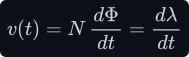

---

## 1 Charge, current, and the electric field

Everything electrical starts with **charge**. Charge comes in indivisible lumps: an electron
carries <!--m:-e-->, a proton <!--m:+e-->, and since the 2019 redefinition of the SI the size of that lump is
*exact* by definition:

A coulomb is therefore an enormous crowd of electrons. What a circuit cares about is not how much
charge exists but how fast it **moves** past a point. That rate is the **current** — the same
definition the capacitor proof leans on in [../capacitor/capacitor.md §2](../capacitor/capacitor.md#2-the-rule-you-need--when-you-may-differentiate-an-equation):

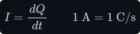

Two charges push or pull on each other even across empty space. Coulomb's law gives the force,
falling off as the square of the distance <!--m:r-->, with the constant <!--m:\varepsilon_0--> (the *permittivity of
free space*) setting the scale:

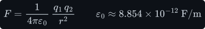

Rather than think of charges reaching across space, physics says each charge sets up an **electric
field** <!--m:\vec{E}--> around itself, and any other charge feels a force from the field *where it sits*. The field
is defined as force per unit test charge, and its units can be read either as newtons per coulomb
or — more usefully for circuits — as volts per metre:

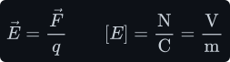

Volts per metre is the key reading. A voltage is just the electric field added up along a path; a
capacitor with <!--m:12\ \mathrm{V}--> across a <!--m:10\ \mu\mathrm{m}--> dielectric holds a field of 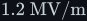<!--m:1.2\ \mathrm{MV/m}--> inside it.
Since the field is force per charge, adding it up along a path (force times distance) gives the
*work done per unit charge* carried along that path. So a voltage is energy per charge: one volt is
one joule per coulomb, <!--m:1\ \mathrm{V} = 1\ \mathrm{J/C}-->.
**Static** charge makes an electric field and nothing else. The next field needs the charge to move.

**Kirchhoff's two circuit laws** follow straight from these definitions, and every circuit analysis
in this tree leans on them:

- **The current law (KCL).** Charge is neither created nor destroyed, and it cannot pile up in a
  junction of wires. So at any node, the currents flowing in add up to the currents flowing out.
- **The voltage law (KVL).** For the static field of charges, the work done carrying a charge
  between two points does not depend on the route taken. Walk once around any closed loop of a
  circuit, adding every voltage rise and subtracting every drop, and you arrive back where you
  started with exactly zero.

(Once a *changing* magnetic flux threads the loop, §6 shows that the sum around it is no longer
zero. Circuit work handles this by booking the induced voltage as the terminal voltage of the coil
that encloses the flux, §8, and KVL then holds again with that term counted.)

## 2 The magnetic field B and the tesla

Moving charge — current — produces a second field, the **magnetic field** <!--m:\vec{B}-->, and the magnetic
field pushes only on charges that are themselves moving. The complete force on a charge <!--m:q-->
moving with velocity <!--m:\vec{v}--> is the **Lorentz force**:

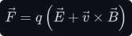

This equation is the *definition* of <!--m:\vec{B}-->: it is whatever quantity makes the velocity-dependent
part of the force come out right. Three things about it matter later:

- The cross product means the magnetic force is **sideways** — perpendicular to both the motion and
  the field. It bends a charge's path but never speeds it up, so a static magnetic field does no
  work on a free charge. (Energy enters and leaves magnetic fields through *induced electric
  fields*, which is Faraday's law, §6.)
- A wire carrying current <!--m:I--> through a field <!--m:B--> feels a force 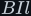<!--m:BIl--> on a length <!--m:l--> — the motor
  effect, and the source of the "magnetic" in "magnetic field".
- **B is called the magnetic flux density**, and the name is literal: §3 shows it is flux per
  square metre.

The SI unit of <!--m:B--> is the **tesla**. Reading it off the force law and then off Faraday's law (§6, below) gives three
equivalent forms, all of which you will meet:

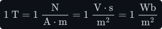

For scale: the Earth's field is about 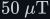<!--m:50\ \mu\mathrm{T}-->, a fridge magnet a few <!--m:\mathrm{mT}-->, a ferrite
transformer core runs at <!--m:0.1--> to <!--m:0.3\ \mathrm{T}-->, and a mains transformer's steel core near <!--m:1.5\ \mathrm{T}-->.

> **Note —** The middle form, 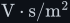<!--m:\mathrm{V\cdot s/m^2}-->, is the one to remember. It says a tesla is
> *volt-seconds* spread over an area. Volt-seconds — a voltage held for a time — are exactly what a
> switching converter applies to its magnetics every half cycle. That unit is the whole of §13 in
> four characters.

## 3 Magnetic flux and the weber

A field fills space; a circuit cares about how much of it threads through a loop. That amount is the
**magnetic flux** <!--m:\Phi-->: add up the component of <!--m:\vec{B}--> perpendicular to a surface over the surface's
area. For a uniform field crossing a flat area <!--m:A--> at an angle 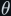<!--m:\theta--> to its normal, the integral
collapses to a product:

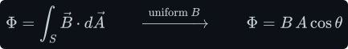

Inside a transformer or inductor core the field runs along the core, perpendicular to its
cross-section <!--m:A_e--> (the *effective area* on a datasheet), so <!--m:\theta = 0--> and simply 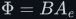<!--m:\Phi = B A_e-->. Read
backwards, <!--m:B = \Phi/A_e-->: flux *density*. The unit of flux is the **weber**:

A coil of <!--m:N--> turns wound around that core is threaded by the same flux <!--m:N--> times over — each turn is a
separate loop the flux passes through. The total is the **flux linkage** 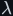<!--m:\lambda-->:

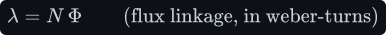

> **Tip —** Keep three quantities apart: <!--m:B--> (tesla, what the *material* feels and what saturates),
> <!--m:\Phi--> (weber, what flows around the *core*), and <!--m:\lambda = N\Phi--> (weber-turns, what the *winding*
> sees). They differ by the factors <!--m:A_e--> and <!--m:N-->, and most magnetics mistakes are dropping one of them.

## 4 Where B comes from — Ampere and Biot-Savart

There are two equivalent laws for the field produced by a current. **Biot–Savart** is the
brute-force version: chop the wire into tiny pieces <!--m:d\vec{l}-->, and each piece contributes a sliver of
field at distance <!--m:r-->, perpendicular to both the wire and the line to the observer:

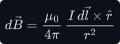

The constant <!--m:\mu_0--> is the **permeability of free space** — the magnetic twin of <!--m:\varepsilon_0-->:

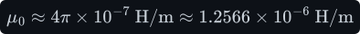

Integrating Biot–Savart is laborious. **Ampère's law** packages the same physics into a statement
about any closed loop <!--m:C-->: walk around the loop adding up the component of <!--m:\vec{B}--> along your path, and
the total equals <!--m:\mu_0--> times the current that pierces the loop:

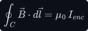

Ampère's law is only *useful* when symmetry tells you the field is constant along a cleverly chosen
loop. Two such cases cover nearly everything in power electronics.

**The long straight wire.** By symmetry the field circles the wire (right-hand rule: thumb along the
current, fingers curl with the field) and has the same strength everywhere on a circle of radius
<!--m:r-->. Take that circle as the loop. <!--m:B--> is constant and parallel to the path, so the integral is just <!--m:B-->
times the circumference:

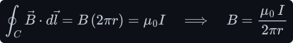

With <!--m:I = 10\ \mathrm{A}--> at 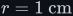<!--m:r = 1\ \mathrm{cm}-->:

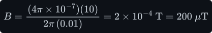

That is four times the Earth's field from an ordinary 10 A wire, one centimetre away — and it falls
as 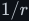<!--m:1/r-->.

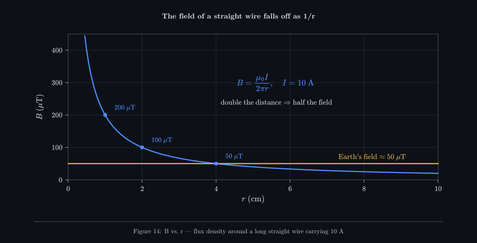

_A bare wire spreads its field thinly through all of space; doubling the distance halves it. To get
a strong, useful field you must concentrate it, which is what coiling the wire does._

**The solenoid.** Wind <!--m:N--> turns uniformly along a length <!--m:l-->. Between neighbouring turns the circling fields
cancel; inside, they all point the same way along the axis and add. The result (for a long coil) is a
strong, uniform field inside and a weak, spread-out return field outside. Choose a rectangular loop
with one long side of length <!--m:l--> inside the coil and the other far outside:

- the inside side contributes <!--m:Bl-->;
- the two short sides cross the field at right angles and contribute nothing;
- the outside side sits where the field is negligible and contributes (almost) nothing;
- the loop is pierced by all <!--m:N--> turns, each carrying <!--m:I-->, so the enclosed current is <!--m:NI-->.

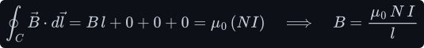

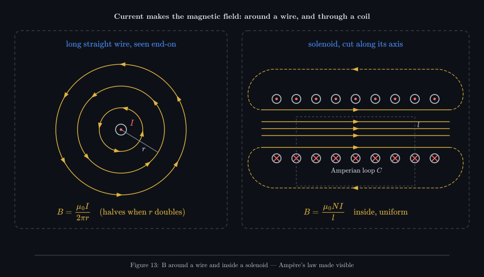

_Left: the wire's field is circles, weaker with distance. Right: coiling the wire stacks every turn's
field into one uniform bundle down the middle — the dashed Ampèrian loop encloses <!--m:N--> currents,
which is why <!--m:B--> grows with <!--m:NI-->._

A concrete air-cored coil — 100 turns, 1 A, 10 cm long:

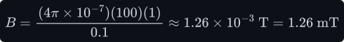

About 25 times the Earth's field — real, but feeble. The product <!--m:NI--> (ampere-turns) is what
makes the field; you can trade turns for current freely. The next section shows how a core
multiplies the result by a thousand or more.

## 5 H, permeability, and why the core matters

Put an iron or ferrite core inside the solenoid and the field grows enormously, because the
material's own atomic magnetic moments line up with the applied field and add to it. To keep the
bookkeeping clean, engineers split the story in two:

- **<!--m:H--> (the magnetic field strength, in A/m)** is set by the current alone. Ampère's law written for
  <!--m:H--> has no material constant in it at all.
- **<!--m:B--> (the flux density, in T)** is what results once the material has responded. The ratio is the
  material's **permeability** 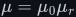<!--m:\mu = \mu_0\mu_r-->, where 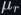<!--m:\mu_r--> (relative permeability) is a pure number.

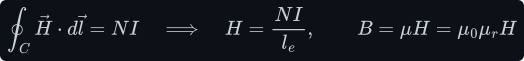

Here 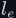<!--m:l_e--> is the *effective magnetic path length* — once around the core — another datasheet number.
Air has 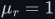<!--m:\mu_r = 1-->; power ferrites have 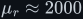<!--m:\mu_r \approx 2000-->–3000; silicon steel several thousand. So the same
100 ampere-turns that made 1.26 mT in air would *ask* for about 2.5 T in a closed ferrite path of the
same length.

> **Watch out —** "Would ask for" is deliberate. No ferrite can deliver 2.5 T: it **saturates** at
> roughly 0.35–0.4 T, after which <!--m:\mu_r--> collapses towards 1. <!--m:B = \mu H--> with a constant <!--m:\mu--> is
> only true on the steep part of the material's curve. Saturation is the single most important
> limit in magnetics design, and §12 and §13 are about it.

There is also a useful circuit analogy, **magnetic Ohm's law**. The ampere-turns <!--m:NI--> act like a
voltage driving flux <!--m:\Phi--> (like a current) around the core against a **reluctance** <!--m:\mathcal{R}--> (like a
resistance):

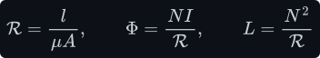

The last form looks ahead to §9, which defines inductance properly as flux linkage per ampere,
<!--m:L = N\Phi/I-->. Substitute 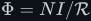<!--m:\Phi = NI/\mathcal{R}--> from the middle form and the current cancels,
leaving 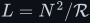<!--m:L = N^2/\mathcal{R}-->.

A long, thin, low-permeability path has high reluctance. An **air gap** is a tiny length of
<!--m:\mu_r = 1--> material in series with the core, and because its permeability is thousands of times lower, a gap
a fraction of a millimetre long can dominate the total reluctance. That is how inductors are made
stable (§12).

## 6 Faraday's law — voltage from changing flux, done slowly

Ampère said current makes field. Faraday found the converse, but with a twist that is the whole
point of this document: a magnetic field makes a voltage **only while the flux is changing**. A
steady flux through a coil, however large, produces nothing at its terminals. A changing one
produces a voltage proportional to *how fast* it changes:

Read it symbol by symbol:

- **<!--m:v(t)-->** — the voltage across the winding's two terminals at the instant <!--m:t-->, in volts.
- **<!--m:N-->** — the number of turns. Each turn is a loop threaded by the flux, and each contributes its own
  share of voltage; the turns are in series, so the shares add. That is the *only* reason <!--m:N--> is
  there.
- **<!--m:d\Phi/dt-->** — the rate of change of the flux through the core, in webers per second. Since
  <!--m:1\ \mathrm{Wb} = 1\ \mathrm{V\cdot s}-->, a weber per second *is* a volt — the units check with no constant needed.

The step that is easy to get wrong is what "rate of change" means here, so take it slowly with a
picture in mind. Suppose the flux climbs steadily from <!--m:0--> to <!--m:30\ \mu\mathrm{Wb}--> in <!--m:10\ \mu\mathrm{s}-->. The rate is
<!--m:3\ \mathrm{Wb/s}-->, so a 4-turn winding shows <!--m:4 \times 3 = 12\ \mathrm{V}-->, constant for the whole <!--m:10\ \mu\mathrm{s}-->. If the same
<!--m:30\ \mu\mathrm{Wb}--> change happened in <!--m:5\ \mu\mathrm{s}--> the voltage would be 24 V; in <!--m:20\ \mu\mathrm{s}-->, 6 V. Once the flux stops
changing — even if it stays at <!--m:30\ \mu\mathrm{Wb}--> forever — the voltage is zero. The *size* of the flux is
invisible to the terminals; only its *slope* shows.

Now run the law the other way, which is how a power converter actually uses it. The converter does
not choose the flux; it chooses the **voltage** (an H-bridge — four switches that connect the winding across the supply one way round, then the
other, see [../../dc-ac-inverters/h-bridge/](../../dc-ac-inverters/h-bridge/) — slams
<!--m:\pm 12\ \mathrm{V}--> onto a winding), and the
flux has to follow. Rearranged, 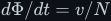<!--m:d\Phi/dt = v/N-->: the voltage dictates the *slope* of the flux. Integrate
both sides from the moment you start the clock, exactly as in the inductor ramp proof
([../inductor/inductor.md §4](../inductor/inductor.md#4-from-the-law-to-the-ramp--the-integral-done-slowly)):

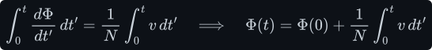

As there, this is a *definite* integral: the left side is 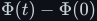<!--m:\Phi(t) - \Phi(0)--> by the Fundamental Theorem
of Calculus, and 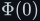<!--m:\Phi(0)--> is whatever flux was already there — no mystery constant. The integral
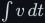<!--m:\int v\,dt--> is the **volt-seconds** applied to the winding, the area under its voltage waveform. So:

> **Tip —** The flux in a winding is the running total of the volt-seconds applied to it, divided by
> <!--m:N-->. Positive volts push the flux up, negative volts pull it down, and the flux only stays bounded
> if the positive and negative volt-seconds cancel over a cycle. That last sentence is
> **volt-second balance** — the same fact that derives the
> [buck](../../dc-dc-converters/buck/buck.md#3-volt-second-balance--the-step-down-ratio) and
> [boost](../../dc-dc-converters/boost/boost.md) ratios — seen from the magnetic side.

**Worked example — a square voltage.** An H-bridge drives a <!--m:N = 4-->-turn primary with <!--m:\pm 12\ \mathrm{V}--> at
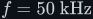<!--m:f = 50\ \mathrm{kHz}-->, the arrangement in the source video, wound on a ferrite core of cross-section 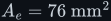<!--m:A_e = 76\ \mathrm{mm}^2-->
(an ETD29-size core). The frequency <!--m:f--> counts cycles per second, so one full cycle lasts the
*period* <!--m:T = 1/f = 1/(50\ \mathrm{kHz}) = 20\ \mu\mathrm{s}-->, and each half cycle
holds a constant <!--m:+12\ \mathrm{V}--> (or <!--m:-12\ \mathrm{V}-->) for <!--m:10\ \mu\mathrm{s}-->. A constant voltage integrates to a straight
line, so during each half cycle the flux ramps linearly, by:

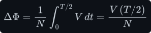

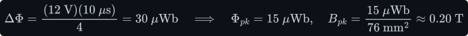

In steady state the bridge applies equal positive and negative volt-seconds, so the flux swings
symmetrically between <!--m:-15--> and 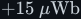<!--m:+15\ \mu\mathrm{Wb}-->. Dividing by the core area <!--m:A_e = 76\ \mathrm{mm}^2-->
gives a peak flux density of 0.20 T — comfortably below saturation. A square voltage gives
a **triangular flux**: up-ramp while the voltage is positive, down-ramp while it is negative, a sharp
corner at each switching edge (Figure 15, panels a and b).

## 7 The common inversion — flux is the integral of voltage, not its derivative

A very natural first reading of "voltage and magnetic field are related through a derivative" is to
write 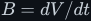<!--m:B = dV/dt--> — the field as the rate of change of the voltage. The ingredients are right (a
voltage, a field, a time derivative) but the relationship is **upside down**, and it is worth seeing
exactly why, three independent ways.

**1 — The units do not match.** A derivative of volts with respect to time has units of volts per
second. A tesla, from §2, is volt-*seconds* per square metre. No constant can turn one into the other
without dragging in 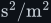<!--m:\mathrm{s^2/m^2}-->, which nothing in the physics supplies:

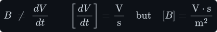

**2 — The derivative sits on the other side.** Faraday's law puts the derivative on the *flux*:
<!--m:v = N\,d\Phi/dt-->. Substituting <!--m:\Phi = B A_e--> (constant area) and integrating gives the field in terms of
the voltage, and it is an **integral**, with the factors <!--m:N--> and <!--m:A--> that the shorthand dropped:

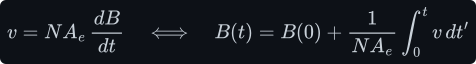

So the correct statement is: **the voltage is proportional to the rate of change of the flux**, or
equivalently **the flux is proportional to the time-integral of the voltage**. Derivative one way,
integral the other — they are the same law read in opposite directions, exactly like the capacitor's
"differentiate <!--m:Q = CV-->" and the inductor's "integrate 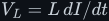<!--m:V_L = L\,dI/dt-->"
([../capacitor/capacitor.md §2](../capacitor/capacitor.md#2-the-rule-you-need--when-you-may-differentiate-an-equation)).

**3 — The waveforms give it away.** Feed the square wave of §6 to both versions. The correct law
integrates each flat into a ramp: a triangle. The inverted law differentiates instead, and the
derivative of a square wave is **zero on every flat** and an infinitely tall, infinitely thin spike
at every edge. It would predict no field at all for 99.9 % of the cycle. Anyone who has put a current
probe on a transformer's magnetising current has seen the triangle, not the spikes.

_Panel (a) is what the H-bridge applies; its shaded area — 120 µV·s per half cycle — is what moves
the flux. Panel (b) is what the core actually does: a triangle whose slope is <!--m:\pm V/N-->. Panel (c)
is what "field = derivative of voltage" would predict — nothing on the flats, spikes at the edges —
and it is not what any real core does._

> **Note —** Why does the inversion survive so long? Because with a **sine wave** both readings
> give a sinusoid. (Here <!--m:\omega = 2\pi f--> is the *angular frequency*, in radians per second: one
> full cycle of a sine is <!--m:2\pi--> radians, so a wave making <!--m:f--> cycles per second advances <!--m:2\pi f-->
> radians per second.) Integrate <!--m:\sin\omega t--> and you get <!--m:-\cos(\omega t)/\omega--> — the same
> shape shifted a quarter cycle, that is <!--m:90^\circ--> of the <!--m:360^\circ--> in a full cycle:
>
> 
>
> The shape cannot tell you whether you integrated or differentiated; only the 90° phase direction
> and the <!--m:1/\omega--> amplitude can. Square-wave drive, which is what every switching converter
> uses, removes the ambiguity at once: integral gives triangles, derivative gives spikes.

## 8 Lenz's law — the sign, and back-EMF

Faraday's law in physics textbooks is written for the **electromotive force (EMF)** <!--m:\mathcal{E}--> —
the voltage the changing flux induces around the winding, in volts ("force" is a historical
misnomer) — and it carries a minus sign:

The minus sign is **Lenz's law**: *the induced EMF always drives current in the direction that
opposes the change in flux that produced it.* Push a magnet's north pole towards a closed loop and
the rising flux induces a current whose own field points back at the magnet — the loop's near face
becomes a north pole and repels it. Pull the magnet away and the induced current reverses, making a
south pole that attracts it back.

_Left: the loop fights the approaching magnet, so you must push — and the work you do is exactly the
electrical energy delivered to the loop. Right: the same law inside a single coil is back-EMF; the
two equations are one fact written in two sign conventions._

The sign is not a convention you may choose; it is **energy conservation**. If the induced current
*aided* the change, the magnet would be pulled in harder, inducing more current, pulling harder still
— a perpetual-motion machine. Opposition is the only possibility that does not create energy from
nothing.

**Back-EMF.** Apply this to a coil carrying its own current. When the current rises, its flux rises,
and the coil induces an EMF opposing that rise — a *back*-EMF pushing against the source. When the
current falls, the induced EMF flips and tries to keep the current going. This is the inductor's
"resistor-like while charging, battery-like while discharging" behaviour from
[../inductor/inductor.md §5](../inductor/inductor.md#5-polarity-lenz-and-the-sign-flip), and the
inductive kick of [../inductor/inductor.md §7](../inductor/inductor.md#7-the-inductive-kick-and-why-the-diode-is-there).

**Where did the minus sign go?** Circuit work uses the *passive sign convention*: label the terminal
where current enters as <!--m:+-->, and call <!--m:v--> the voltage *drop* from <!--m:+--> to <!--m:--->. The induced EMF opposing a
rising current is a *rise* against the current direction, which is the same thing as a *drop* along
it. So with this labelling <!--m:v = -\mathcal{E}--> and

with a plus sign — the form used everywhere else in this tree. The physics (oppose the change) is
unchanged; the minus sign has been absorbed into where you put the <!--m:+-->.

## 9 Self-inductance — deriving the inductor law

Now join §4 and §6. A coil carrying current <!--m:I--> makes a flux through itself (Ampère); a changing
flux through a coil makes a voltage across it (Faraday). So a coil whose *own* current changes
induces a voltage in *itself*. The constant of proportionality between the flux linkage and the
current that causes it is the **self-inductance**:

Notice the units come out as V·s/A — the same henry the inductor document found by cancelling units
([../inductor/inductor.md §3](../inductor/inductor.md#3-the-defining-law)). Now the derivation. As
long as the core stays out of saturation, <!--m:L--> is a constant (it depends only on geometry and
material, as the next equation shows), so <!--m:\lambda(t) = L\,I(t)--> holds at **every instant**. Two
functions of time that are equal at every instant have equal derivatives — the exact licence proved in
[../capacitor/capacitor.md §2](../capacitor/capacitor.md#2-the-rule-you-need--when-you-may-differentiate-an-equation).
Differentiate both sides, pull the constant <!--m:L--> out front, and recognise the left side as
Faraday's <!--m:v = d\lambda/dt-->:

That is the [inductor law](../inductor/inductor.md#3-the-defining-law), **derived**. It is not a
separate fact about inductors; it is Faraday's law applied to a coil whose flux is made by its own
current. Every ramp, every volt-second balance and every inductive kick in this tree follows from
these three lines.

**What sets L.** For the solenoid of §4 (or a core of area <!--m:A--> and path length <!--m:l-->) substitute <!--m:B-->
into <!--m:\Phi = BA--> and divide the linkage by the current:

The current cancels, confirming <!--m:L--> is pure geometry and material. And <!--m:N--> appears **squared**, for a
reason worth seeing: doubling the turns doubles the ampere-turns and hence the flux (one factor of
<!--m:N-->), *and* doubles the number of turns that flux links (a second factor). Numbers for the 100-turn,
1 cm², 10 cm coil:

The same winding is 2000 times the inductor with a ferrite path — which is why power inductors have
cores. (The ferrite figure assumes a closed core of the same path length and that it stays below
saturation, the subject of §12.)

> **Tip —** One more consequence of <!--m:\lambda = LI-->: the peak flux density in an inductor's core is
> <!--m:B_{pk} = L\,I_{pk}/(N A_e)-->. That is where a datasheet's **saturation current** comes from: the current at
> which <!--m:B_{pk}--> reaches <!--m:B_{sat}-->. A buck inductor carries a DC current, so it has to be sized for the
> peak of the ripple triangle, not the average.

## 10 Energy stored in the magnetic field

To build up current in an inductor the source must push against the back-EMF, and the work it does is
stored. Power is voltage times current (volts are joules per coulomb, §1, and amperes are coulombs per
second, so their product is joules per second — watts); substitute the inductor law and integrate from zero current
to <!--m:I-->:

The change of variable is the step to watch: <!--m:L\,i\,(di/dt)\,dt--> is <!--m:L\,i\,di-->, so the integral runs over
*current*, not time — the energy depends only on the final current, not on how fast you got there.
That is the <!--m:\tfrac{1}{2}LI^2--> quoted in [../inductor/inductor.md §1](../inductor/inductor.md#1-what-an-inductor-actually-is), now derived.

Where is the energy? **In the field**, spread through the volume with a density

Check that the two pictures agree for the solenoid: multiply the density by the volume <!--m:Al--> and
substitute <!--m:B = \mu NI/l-->:

Identical — the circuit formula and the field formula are the same energy counted two ways. For the
buck converter's inductor in [../../dc-dc-converters/buck/buck.md §6](../../dc-dc-converters/buck/buck.md#6-worked-numbers--12-v-to-3-v)
(112.5 µH, peak current 1 A + 0.1 A ripple):

68 µJ, handed in and out 100 000 times a second.

> **Note —** The density <!--m:B^2/(2\mu)--> has a surprising consequence. At the *same* flux density, a
> region of low permeability stores far more energy per volume than a region of high permeability.
> At 0.2 T:
>
> 
>
> Since the flux is continuous around the core (§15), the gap sees the same <!--m:B--> as the ferrite —
> so in a gapped inductor almost all the energy lives in the **air gap**, a sliver a fraction of a
> millimetre wide. The ferrite's job is to guide flux to the gap; the gap's job is to store energy.

## 11 Mutual inductance and coupling

Put a second coil where the first coil's flux can reach it. Changing current in coil 1 changes the
flux through coil 2, so coil 2 develops a voltage although no current flows in it and nothing
connects the two electrically. Define <!--m:\Phi_{21}--> as the part of coil 1's flux that threads coil 2; the
**mutual inductance** is the linkage it creates in coil 2 per ampere in coil 1:

(The second form is the same derivation as §9, run across two coils.) Not all of coil 1's flux reaches
coil 2; the part that misses is **leakage flux**. The **coupling coefficient** measures how much is
shared:

Air-cored coils side by side might reach <!--m:k \approx 0.1-->–0.5. Wound on a shared high-permeability core,
which grabs nearly all the flux and steers it through both windings, <!--m:k--> exceeds 0.99.

_One flux, two windings. Because both windings encircle the same core flux, each turn of either
winding sees the same volts per turn; the dashed leakage loop is the small part that links only the
primary._

**The step to the transformer.** In the limit <!--m:k = 1--> every turn of both windings links the same
flux <!--m:\Phi-->. Apply Faraday's law to each winding and divide:

The <!--m:d\Phi/dt--> cancels completely: the voltage ratio is the **turns ratio**, independent of frequency,
core and current. For the inverter in the source video, stepping a <!--m:\pm 12\ \mathrm{V}--> square wave up to the
<!--m:\pm 325\ \mathrm{V}--> needed for 230 V RMS mains. (Mains is quoted as an RMS, "root mean square",
value: the steady DC voltage that would heat a resistor equally. For a sine the peak is <!--m:\sqrt2-->
times the RMS, so 230 V RMS peaks at <!--m:230\sqrt2 \approx 325\ \mathrm{V}--> — derived in
[../signals/ac-and-rms.md](../signals/ac-and-rms.md).)

Note what Faraday's law says about DC: a constant primary voltage makes the flux ramp forever (§6),
so the core saturates and the transformer stops transforming. A transformer *needs* the voltage to
alternate. The full treatment — current ratio, magnetising inductance, leakage, losses — is in
[../transformer/](../transformer/).

## 12 Magnetic materials, saturation, and the B-H curve

<!--m:B = \mu H--> with a constant <!--m:\mu--> is a straight line, and real cores are not. Plot the flux density <!--m:B--> a core
reaches against the applied <!--m:H \propto NI--> and you get the **B-H curve**:

_The steep middle is where the core is useful: a little current makes a lot of flux. At the flat ends
the core is saturated — extra current adds almost no flux, so <!--m:L--> collapses. A gap (green) trades
permeability for headroom._

Four features of that curve drive every magnetics decision:

- **Permeability is the slope.** In the steep region <!--m:dB/dH--> is large, so a given current makes a
  large flux — high inductance. The inductance of a winding is proportional to this slope.
- **Saturation.** Once nearly every atomic moment is aligned the material has nothing left to give,
  and the slope falls to <!--m:\mu_0-->, the slope of empty space — <!--m:\mu_r--> drops from thousands to about 1. The
  inductance collapses by the same factor, <!--m:dI/dt = V/L--> explodes, and the current spikes. Typical
  saturation flux densities: power ferrite about 0.35–0.4 T at operating temperature (it falls as the
  core heats), powdered iron about 1–1.5 T, silicon steel about 1.5–1.8 T.
- **Hysteresis.** The curve going up is not the curve coming down; the material "remembers". The
  area enclosed by the loop is energy turned into heat **every cycle**, so hysteresis loss per second
  grows with frequency. Ferrites have thin loops (low loss), which is why they dominate above a few
  kilohertz.
- **The gap shears the curve.** Adding an air gap puts a large, perfectly linear reluctance in
  series. The curve tilts over (green): lower effective permeability, so fewer henries per turn
  squared, but it now takes far more current to saturate, the inductance becomes nearly independent
  of the material's temperature-dependent <!--m:\mu_r-->, and (§10) the gap stores the energy. Inductors
  that must carry DC — the buck and boost inductors — are gapped; transformers, which should store as
  little as possible, are not.

> **Watch out —** Saturation is not gentle. A core run 10 % past its knee does not lose 10 % of its
> inductance; it can lose most of it, and the current in a switching converter then rises at
> <!--m:V/L_{saturated}--> instead of <!--m:V/L--> — fast enough to destroy a MOSFET (the transistor used as the electronic switch throughout this
tree) within one switching period.

## 13 Frequency and core size — why switching faster shrinks the transformer

The source video makes the claim "switch faster → smaller transformer", and it is true. A tempting
explanation is that a higher frequency produces a *larger* magnetic field, so less core is needed to
get the same effect. The real mechanism runs the **opposite way**, and Faraday's law proves it in two
lines.

**For a fixed voltage, a higher frequency means a smaller flux.** From §6, the flux is the running
integral of the voltage. Drive a winding with a <!--m:\pm V--> square wave at frequency <!--m:f-->. Each half
cycle lasts <!--m:T/2 = 1/(2f)--> and applies <!--m:V \cdot T/2--> volt-seconds, which ramps the flux from its negative peak
to its positive peak — a total swing of <!--m:2\Phi_{pk}-->:

The frequency is in the **denominator**. The slope of the flux, <!--m:V/N-->, is fixed by the voltage and does
not care about frequency at all; frequency only decides **how long** each ramp runs before the
bridge reverses it. A shorter ramp at the same slope reaches a lower peak. Doubling the frequency
halves the volt-seconds per half cycle and halves the peak flux. For sine-wave drive, the note in §7 has
already found the flux amplitude, <!--m:\Phi_{pk} = V_{pk}/(N\omega)--> with <!--m:\omega = 2\pi f-->. Divide by
<!--m:A_e--> to get the flux density, write the peak voltage as <!--m:\sqrt2--> times its RMS value (§11), and
solve for the RMS voltage:

That is the classic transformer equation, with <!--m:2\pi/\sqrt{2} \approx 4.44--> in place of the
square wave's 4:

**Worked numbers.** Same 12 V square wave, same 4-turn primary, same 76 mm² ferrite core, two
frequencies:

A thousand times lower frequency demands a thousand times the flux. No material reaches 197 T; the
core would saturate within roughly the first ten microseconds of every half cycle and the primary would
become a short circuit across the battery. To run at 50 Hz you must instead raise the turns or the
area until <!--m:N A_e--> is a thousand times larger — for example, keeping the core and solving for turns:

Nearly 4000 turns will not fit in an ETD29 window, so in practice a 50 Hz transformer gets a much
bigger core (and steel, which tolerates about 1.5 T) — the heavy lump in the left half of the video's
comparison. At 50 kHz, four turns on a thumb-sized ferrite do the same job. **That** is why switching
faster shrinks the transformer: higher frequency means fewer volt-seconds per half cycle, a smaller
peak flux, and therefore less core area (or fewer turns) to keep that flux below saturation.

_Both triangles climb at the identical slope <!--m:V/(NA_e)-->. The 50 kHz one reverses after 10 µs and peaks at
0.20 T, inside the safe band; the 12.5 kHz one keeps climbing for 40 µs and would need 0.79 T, deep
into saturation. Lower frequency does not make a weaker field — it makes one the core cannot hold._

**Where the "bigger field" intuition comes from.** It is not baseless; it is the same equation held
the other way. If you fix the **flux** amplitude instead of the voltage — as a generator does, with
a magnet of fixed strength spinning past a coil — then

and spinning faster really does give more voltage. A transformer in a converter is the opposite
case: the H-bridge fixes the voltage, so the flux is what must shrink as <!--m:f--> rises. Faster flux
*reversals*, yes; a bigger flux, no.

> **Note —** The video explains the same result as "energy per cycle": 1000 W at 50 Hz is 20 J per
> cycle, at 50 kHz only 0.02 J. That picture is literally true for an **inductor** or a flyback
> "transformer", which store each cycle's energy in the core and gap before releasing it. A forward
> or full-bridge transformer, like the one in the video, ideally stores almost nothing — power passes
> straight through, primary to secondary, in the same instant. What actually sizes its core is the
> volt-seconds argument above: peak flux must stay below <!--m:B_{sat}-->, and peak flux falls as
> <!--m:1/f-->. Both arguments point the same way; the flux one is the one that sets the numbers.

## 14 Displacement current — why a capacitor passes AC

Ampère's law in §4 has a hole, and a capacitor exposes it. Draw a loop around the wire leading to a
charging capacitor: current <!--m:I--> pierces any flat surface spanning it, so <!--m:\oint B\,dl = \mu_0 I-->. Now
stretch the surface like a soap bubble so it passes *between the plates* instead. No charge crosses
the gap ([../capacitor/capacitor.md §5](../capacitor/capacitor.md#5-at-the-poles)), so the enclosed
current is zero — yet the loop, and the field along it, have not changed. One loop, two answers.

Maxwell's fix was to notice that something *is* changing in the gap: the **electric** field, as charge
piles onto the plates. He added a term to Ampère's law that counts a changing electric flux
<!--m:\Phi_E--> as if it were a current — the **displacement current**:

Between parallel plates of area <!--m:A--> and spacing <!--m:d-->, the field is <!--m:E = V/d--> and the electric flux <!--m:\Phi_E = EA-->.
(The field is uniform across the gap, so adding it up from one plate to the other, §1, gives
simply <!--m:V = Ed-->.) Work out the displacement current and watch the capacitance appear:

The last step needs <!--m:C = \varepsilon_0 A/d-->, which comes from **Gauss's law** — the first of the
four equations collected in §15: the electric flux out of any closed surface equals the charge
inside it divided by <!--m:\varepsilon_0-->. Wrap a thin box around one plate. The field exists only in the
gap, so the only flux leaving the box is <!--m:EA--> through its inner face, and the charge inside is the
plate's <!--m:Q-->:

The final step is just <!--m:C = Q/V-->, the defining relation <!--m:Q = CV--> of
[../capacitor/capacitor.md §1](../capacitor/capacitor.md#1-what-a-capacitor-actually-is).
Because <!--m:C = \varepsilon_0 A/d--> for a vacuum-gap capacitor, the displacement current in the gap is
**exactly** <!--m:C\,dV/dt--> — the same value as the conduction current in the wire, which the
[capacitor law](../capacitor/capacitor.md) says is <!--m:I_C = C\,dV/dt-->. Current is continuous after all:
conduction current in the leads, displacement current across the gap, equal at every instant.

This is the field-level reason a capacitor "passes AC and blocks DC". At DC the voltage is steady,
<!--m:dV/dt = 0-->, the electric field in the gap is frozen, and there is no displacement current — an open
circuit. Change the voltage and a displacement current flows in step with the conduction current;
the faster the change (the higher the frequency), the larger it is. No charge ever crosses the gap,
yet the circuit sees a current go round. (With a dielectric of relative permittivity <!--m:\varepsilon_r-->
the same algebra gives <!--m:C = \varepsilon_0\varepsilon_r A/d-->; the conclusion is unchanged.)

> **Tip —** Look at the symmetry with §6. A changing *magnetic* flux makes an electric field
> (Faraday); a changing *electric* flux makes a magnetic field (Maxwell). Each field, by changing,
> creates the other — which is also, at much higher frequencies, how a radio wave crosses empty space.

## 15 The whole set — Maxwell's four equations

Everything above is four equations. In integral form, with <!--m:S--> a closed surface and <!--m:C--> a closed loop:

**Gauss's law** — charge is the source of electric field lines (§1):

**No magnetic monopoles** — magnetic field lines never start or end; every line that enters a closed
surface leaves it. This is why the flux in a core is the *same* all the way round, including across
the air gap (§10):

**Faraday's law** — a changing magnetic flux makes a circulating electric field; summed around the
turns of a winding, that is the terminal voltage of §6:

**Ampère–Maxwell law** — current, and changing electric flux, make a circulating magnetic field (§4,
§14):

For power electronics you mostly use the last two: Ampère–Maxwell tells you the flux a current
makes; Faraday tells you the voltage a changing flux makes. The inductor is both applied to one coil
(§9); the transformer is both applied to two (§11); the capacitor's continuity of current is the
displacement term (§14).

## 16 What this costs you

- **Saturation is a hard wall.** Every inductor and transformer has a maximum flux density, and
  Faraday's law converts it directly into a maximum volt-seconds per half cycle (<!--m:2NA_eB_{sat}--> for a
  square wave). Exceed it — a lower frequency, a higher voltage, a stuck PWM, a DC offset in an
  "AC" drive — and the inductance collapses, the current spikes, and switches fail.
- **Higher frequency is not free.** It shrinks the core (§13), but core loss per cycle (the hysteresis
  area) is paid more often, eddy currents (currents that the changing flux induces, by Faraday's law, in the conducting core
material itself) grow roughly with <!--m:f^2-->, the skin effect pushes current
  into the surface of the copper, and every switching edge costs energy in the transistors. In
  practice ferrite designs at 100 kHz are run at 0.1–0.2 T, well below <!--m:B_{sat}-->, purely to keep
  core loss down — so the "1000 times smaller" of the worked example is a ceiling, not a promise.
- **Ideal coupling does not exist.** <!--m:k < 1--> always; the leakage inductance stores energy that cannot
  reach the secondary and comes out as a voltage spike when the switch turns off, which must be
  clamped or snubbed.
- **The DC offset trap.** Because flux is the *integral* of voltage, even a small DC component in a
  transformer's drive — say 0.1 V of mismatch between the two halves of an H-bridge — integrates
  without limit and walks the core into saturation over many cycles. Bridges driving transformers
  need either matched timing, a series blocking capacitor, or current-mode control to prevent it.
- **Gaps buy stability with turns.** A gapped inductor tolerates DC and temperature, but its lower
  permeability means more turns for the same <!--m:L-->, which means more copper and more resistance,
  plus fringing flux near the gap that heats nearby windings.
- **The magnetic field leaves the part.** The <!--m:1/r--> fields of §4 and the fast <!--m:d\Phi/dt--> of §6
  combine into a radiator: any loop of PCB track near a switching inductor is a one-turn secondary.
  Layout — small current loops, ground planes, shielded or toroidal cores — is part of the
  magnetics design, not an afterthought.

## 17 Sources and cross-links

- **The inductor law, now derived:** [../inductor/inductor.md](../inductor/inductor.md) — §9 here
  derives its <!--m:V_L = L\,dI_L/dt--> from Faraday's law and <!--m:\lambda = LI-->; §10 derives its <!--m:\tfrac{1}{2}LI^2-->.
- **The capacitor, and the differentiation rule used in §9:**
  [../capacitor/capacitor.md](../capacitor/capacitor.md) — §14 here shows its law is the
  displacement current.
- **Transformers in full** (turns ratio for current, magnetising inductance, losses, core sizing):
  [../transformer/](../transformer/).
- **Square waves, sines and RMS** (why 325 V peak is 230 V RMS; the Fourier content of the
  H-bridge square wave): [../signals/](../signals/).
- **Volt-second balance in converters:**
  [../../dc-dc-converters/buck/buck.md](../../dc-dc-converters/buck/buck.md) and
  [../../dc-dc-converters/boost/boost.md](../../dc-dc-converters/boost/boost.md).
- **The H-bridge that drives the transformer** and its DC-offset problem:
  [../../dc-ac-inverters/h-bridge/](../../dc-ac-inverters/h-bridge/).
- **The rectifier after the transformer:** [../../rectifiers/](../../rectifiers/).
- **Source video:** *DC to AC inverter*, part 1 (17 min) — the "switch faster, smaller transformer"
  segment around 5:00–5:45, whose claim §13 proves and whose explanation it refines.
- Standard references for the field laws: D. J. Griffiths, *Introduction to Electrodynamics*
  (Ampère, Faraday, Maxwell's displacement current); R. W. Erickson and D. Maksimović,
  *Fundamentals of Power Electronics*, chapters on magnetics (B-H loop, gapped inductors, the
  transformer flux equation).
- Style and figure conventions: [../../STYLE.md](../../STYLE.md).
