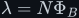
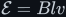
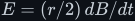

# Faraday's law of induction

The third field law, built from first principles: magnetic flux <!--m:\Phi_B--> and the weber, flux linkage
<!--m:\lambda = N\Phi_B--> in weber-turns, what an EMF <!--m:\mathcal{E}--> physically is, the flux rule
<!--m:\mathcal{E} = -d\Phi_B/dt-->, Lenz's law, motional and transformer EMF, the Maxwell–Faraday equation
and what curl means, the cases where the flux rule misleads, and the machines that run on it. The
full argument is in [faradays-law.md](faradays-law.md), in eighteen sections with twenty figures
(Figures 115–134), six of them animated.

> **The thesis in one line**
>
> The EMF around a loop is minus the rate of change of the magnetic flux through it. Only the
> change counts, never the size of the flux, and the minus sign — the induced current always fights
> the change — is energy conservation.

## Contents

The treatment covers:

1. Where this sits: the companion laws of Coulomb and Ampère, and the Lorentz force.
2. History: Ørsted 1820; Faraday's iron ring of 29 August 1831 (Figure 115) and moving magnet;
   Henry, Lenz, Neumann, Weber, Felici, Maxwell, Heaviside and Einstein.
3. Magnetic flux: the area vector, <!--m:\Phi_B = BA\cos\theta--> for a tilted loop
   (Figure 116), the surface integral, and why any surface on the same rim gives the same flux
   (Figure 117).
4. The weber, derived as a volt-second, and flux linkage <!--m:\lambda = N\Phi_B-->.
5. EMF as work per charge once round a loop, and why it needs a non-conservative push.
6. Faraday's law, the <!--m:N-->-turn form derived step by step, worked numbers, and why the charge moved
   does not depend on speed (animated Figure 118; Figure 119).
7. Lenz's law in four magnet cases (Figure 120), and the energy argument for the minus sign.
8. The two ways to change the flux (animated Figure 121, the three cases).
9. Motional EMF <!--m:\mathcal{E} = Blv--> derived from the magnetic force on the charges (Figure 122), the
   sliding bar (animated Figure 123) and its energy books (Figure 124).
10. Transformer EMF: the induced electric field, <!--m:E = (r/2)\,dB/dt--> (animated Figure 125), and two
    voltmeters that disagree (Figure 126).
11. The Maxwell–Faraday equation in integral and differential form; curl and Stokes (Figure 127).
12. Deriving the flux rule from the field laws via the Leibniz rule (Figure 128), and the Hall effect.
13. The Faraday paradox: the homopolar disk and the rocking plates (Figure 129).
14. Relativity: motional and transformer EMF as one phenomenon.
15. Applications: the generator <!--m:\mathcal{E} = NBA\omega\sin\omega t--> (animated Figure 130, Figure 131),
    the transformer (animated Figure 132), the inductor, eddy currents and braking (Figure 133), the
    induction cooktop (Figure 134), and more.
16. What this costs you.
17. Every symbol in one place.
18. Sources and cross-links.

## Reading order

Read [../coulombs-law/](../coulombs-law/) and [../amperes-law/](../amperes-law/) first: this
document leans on the electric field, voltage as work per charge, and the magnetic field of a
current. Then read [faradays-law.md](faradays-law.md) top to bottom. Afterwards,
[../electromagnetism/](../electromagnetism/) puts all three laws to work on windings and cores, and
[../inductor/](../inductor/) and [../transformer/](../transformer/) are this law applied to one coil
and to two.

## Links

- Parent index: [../README.md](../README.md)
- Style guide: [../../STYLE.md](../../STYLE.md)
- Companion laws: [../coulombs-law/](../coulombs-law/), [../amperes-law/](../amperes-law/)
- Overview: [../electromagnetism/](../electromagnetism/)
- Where it leads: [../inductor/](../inductor/), [../transformer/](../transformer/)
