# Faraday's law of induction — a changing flux drives charge around a loop

A magnet sitting still next to a coil does nothing. Move it, and a current flows for exactly as
long as it moves. That observation, made by Michael Faraday in 1831, is the reason generators,
transformers, inductors, induction cooktops and magnetic brakes work at all. This document builds
the law from nothing: what magnetic flux is and how it is measured in webers, what flux linkage
(written <!--m:\lambda-->: the flux counted once for every turn of a coil, in weber-turns) means, what an
EMF physically is, why the law carries a minus sign, the two very
different mechanisms hiding behind one equation, the field form that Maxwell wrote down, the cases
where the simple rule gives the wrong answer, and the machines that use it, with worked numbers
throughout.

**Contents**

1. [Where this sits, and what you need first](#1-where-this-sits-and-what-you-need-first)
2. [History — from a compass needle to relativity](#2-history--from-a-compass-needle-to-relativity)
3. [Magnetic flux — how much field threads a loop](#3-magnetic-flux--how-much-field-threads-a-loop)
4. [The weber, and flux linkage](#4-the-weber-and-flux-linkage)
5. [EMF — what actually pushes the charges round](#5-emf--what-actually-pushes-the-charges-round)
6. [Faraday's law — the flux rule](#6-faradays-law--the-flux-rule)
7. [Lenz's law — the minus sign is energy conservation](#7-lenzs-law--the-minus-sign-is-energy-conservation)
8. [Two ways to change the flux](#8-two-ways-to-change-the-flux)
9. [Motional EMF — derived from the magnetic force on the charges](#9-motional-emf--derived-from-the-magnetic-force-on-the-charges)
10. [Transformer EMF — the induced electric field](#10-transformer-emf--the-induced-electric-field)
11. [The Maxwell–Faraday equation, and what curl means](#11-the-maxwellfaraday-equation-and-what-curl-means)
12. [Deriving the flux rule from the field laws](#12-deriving-the-flux-rule-from-the-field-laws)
13. [When the flux rule needs care — the Faraday paradox](#13-when-the-flux-rule-needs-care--the-faraday-paradox)
14. [One phenomenon, two descriptions — the road to relativity](#14-one-phenomenon-two-descriptions--the-road-to-relativity)
15. [Applications](#15-applications)
16. [What this costs you](#16-what-this-costs-you)
17. [Every symbol in one place](#17-every-symbol-in-one-place)
18. [Sources and cross-links](#18-sources-and-cross-links)

> **The thesis in one line**
>
> The EMF around any loop equals minus the rate at which the magnetic flux through it changes. The
> size of the flux is irrelevant; only its rate of change counts, and the minus sign says the
> induced current always fights that change:

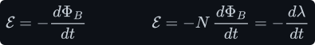

Here <!--m:\mathcal{E}--> is the EMF round the loop, in volts (V); 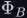<!--m:\Phi_B--> is the magnetic flux through
it, in webers (Wb); <!--m:t--> is time, in seconds (s); <!--m:N--> is the number of turns of a coil; and
<!--m:\lambda = N\Phi_B--> is the flux linkage, in weber-turns. Each is built up from scratch below: the flux
<!--m:\Phi_B--> in §3, the weber and the flux linkage <!--m:\lambda--> in §4, the EMF <!--m:\mathcal{E}--> in §5. A summary
table of every symbol is in §17.

---

## 1 Where this sits, and what you need first

This is the third of three field laws in this tree.

- [../coulombs-law/](../coulombs-law/) — charges push on charges; the **electric field**
  <!--m:\vec{E}--> (force per unit charge, in <!--m:\mathrm{N\cdot C^{-1}} = \mathrm{V\cdot m^{-1}}-->); voltage as
  work per unit charge; and the fact, used in §5, that the field of charges sitting still is
  *conservative* (the work done carrying a charge around any closed path is zero).
- [../amperes-law/](../amperes-law/) — currents make the **magnetic field** <!--m:\vec{B}--> (in tesla, T);
  the field of a wire and of a solenoid; the right-hand rule.
- This document — a *changing* magnetic field, or a conductor moving through a magnetic field,
  pushes charge around a loop.

The overview that ties all three to the inductor and the transformer is
[../electromagnetism/electromagnetism.md](../electromagnetism/electromagnetism.md). The two
components that are Faraday's law in disguise are the [inductor](../inductor/) and the
[transformer](../transformer/); §15 derives both.

Two pieces of vocabulary are used from the start.

**The magnetic field and its force.** The magnetic field <!--m:\vec{B}--> is defined by the force it exerts
on a moving charge. A charge <!--m:q--> (in coulombs, C) moving with velocity <!--m:\vec{v}--> (in
<!--m:\mathrm{m\cdot s^{-1}}-->) through an electric field <!--m:\vec{E}--> and a magnetic field <!--m:\vec{B}--> feels the
**Lorentz force** <!--m:\vec{F}--> (in newtons, N):

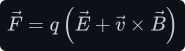

The cross product 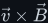<!--m:\vec{v}\times\vec{B}--> is a vector at right angles to both <!--m:\vec{v}--> and <!--m:\vec{B}-->, with
size 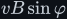<!--m:vB\sin\varphi-->, where <!--m:\varphi--> is the angle between them; its direction is where your right
thumb points when the fingers curl from <!--m:\vec{v}--> towards <!--m:\vec{B}-->. Two consequences matter all
through this document: a charge at rest (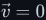<!--m:\vec{v} = 0-->) feels **no** magnetic force at all, and the
magnetic force is always sideways to the motion. Reading the units off the force law gives the tesla:

(The ampere, A, is one coulomb per second: <!--m:1\ \mathrm{A} = 1\ \mathrm{C\cdot s^{-1}}-->.) For scale:
the Earth's field is about <!--m:50\ \mu\mathrm{T}-->, a fridge magnet a few <!--m:\mathrm{mT}-->, a neodymium
magnet's face about <!--m:0.5\ \mathrm{T}-->, and a mains transformer core about <!--m:1.5\ \mathrm{T}-->.

**The colour code in the figures.** Amber is the magnetic field and the flux; blue is whatever is
*induced* (current, EMF, induced electric field); green is motion; red is force (and the north pole of
a magnet); purple is the area normal 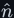<!--m:\hat{n}-->.

## 2 History — from a compass needle to relativity

**1820 — current makes magnetism.** Hans Christian Ørsted noticed that a wire carrying current
deflects a nearby compass needle. If electricity could make magnetism, the obvious question was
whether magnetism could make electricity. For eleven years the answer seemed to be no: a magnet,
however strong, placed beside a closed loop of wire produced no current, and nobody thought to look
at the moment the magnet was *moved*.

**29 August 1831 — the iron ring.** Michael Faraday wound two separate coils of insulated wire on
opposite sides of a soft-iron ring — a primitive toroidal transformer. Coil A went to a battery
through a switch; coil B went to a galvanometer (a sensitive current meter: a coil-driven needle
that swings one way or the other with the direction of the current). On closing the switch the
needle kicked, then settled back to zero although the battery current kept flowing. On opening the
switch it kicked the other way. Faraday described the effect as a "wave of electricity" passing
through the iron. The steady current did nothing; only its *starting* and *stopping* did.

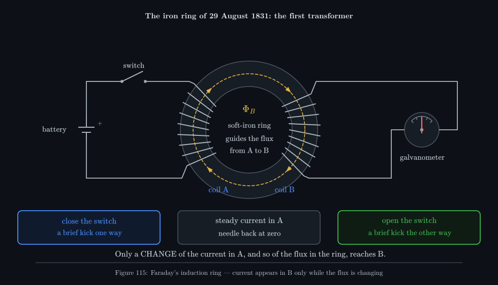

_The ring is the experiment in one picture: B has no electrical connection to A, and a constant
current in A does nothing to it. Only a changing current in A — and so a changing flux in the iron —
reaches B. Section 15 shows this is exactly a transformer._

**Autumn 1831 — the moving magnet.** Faraday then pushed a bar magnet into a coil connected to the
galvanometer and pulled it out again. The needle swung one way as the magnet went in and the other
way as it came out, and stayed at zero whenever the magnet was still, wherever it was. That is the
experiment animated in Figure 118 below, and it is the cleanest statement of the law: the effect
depends on *motion*, on change, never on how strong the field is.

**The disk.** Faraday also spun a copper disk between the poles of a magnet, with sliding contacts at
the axle and the rim. It gave a *steady* current for as long as it turned: the first dynamo, now
called the Faraday disk or homopolar generator. It turns out to be the hardest case to explain with
the simple flux rule, and §13 is devoted to it.

**1832 — Joseph Henry.** The American physicist Joseph Henry found the same effect independently,
including self-induction (a coil inducing a voltage in itself), but Faraday published first.

**1834 — Lenz.** Emil Lenz stated the rule for the *direction* of the induced current: it always
flows so as to oppose the change that produced it. Section 7 shows why it could not be otherwise.

**1845–1851 — the mathematics.** Faraday thought in "lines of force" and wrote no equations, and his
pictures were met with scepticism. Franz Ernst Neumann put the laws of induction into mathematical
form in 1845; Wilhelm Weber built them into his own theory of electrodynamics; and from 1851 Riccardo
Felici tested them experimentally (Felici's law relates the total charge driven round a circuit to
the total change of flux — the result derived in §6 below).

**1861–1865 — Maxwell.** James Clerk Maxwell gave Faraday's field picture a full mathematical
expression and folded it, with the work of Neumann, Weber and Felici, into his complete theory of
the electromagnetic field. In *On Physical Lines of Force* (1861) he already noticed that induction
by a moving wire and induction by a changing field were two different physical processes obeying one
formula.

**1890s — Heaviside.** Oliver Heaviside rewrote the time-varying part as a differential equation —
a statement about the field at each single point rather than around whole loops (the "curl" form
derived in §11), the form in every modern list of Maxwell's equations. That form describes only the changing-field half of induction; the moving-wire half comes from
the Lorentz force (§9 and §12).

**1905 — Einstein.** Albert Einstein opened *On the Electrodynamics of Moving Bodies* with exactly
this effect. Move the magnet past a still coil, or move the coil past a still magnet: the current is
the same, yet the theory of the day explained the two cases by different mechanisms. That asymmetry
was one of the threads that led to special relativity (§14).

## 3 Magnetic flux — how much field threads a loop

Faraday's experiments say the effect depends on how much magnetic field passes *through* the loop
and how fast that amount changes. That amount needs a precise definition.

**The area vector.** A flat loop encloses an area <!--m:A--> (in <!--m:\mathrm{m^2}-->). To say which way it
faces, attach to it a **unit normal** <!--m:\hat{n}-->: an arrow of length 1, perpendicular to the flat
surface. The **area vector** combines the two:

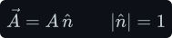

There are two possible normals, one on each side. Which one we choose is tied to a direction of
travel around the loop by the **right-hand rule**: curl the fingers of your right hand along the
chosen direction around the rim, and your thumb gives <!--m:\hat{n}-->. This pairing is the sign convention
for the whole of Faraday's law (§6), so fix it now.

**A uniform field through a flat loop.** Only the part of <!--m:\vec{B}--> that crosses the surface counts;
the part lying along the surface slides past without threading it. If 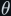<!--m:\theta--> is the angle between
<!--m:\vec{B}--> and <!--m:\hat{n}-->, the crossing part is <!--m:B\cos\theta-->, and the amount of field through the loop
is that times the area. The vector **dot product** does exactly this bookkeeping:

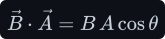

So for a uniform field and a flat loop the **magnetic flux** <!--m:\Phi_B--> is:

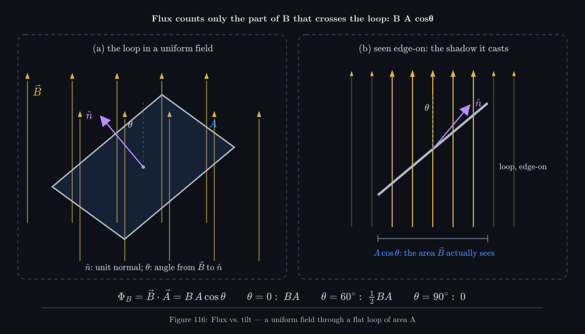

_Panel (b) is the useful way to see it: the flux is the field times the loop's "shadow" — the area
it presents to the field. Face-on (<!--m:\theta = 0-->) it catches the most; edge-on (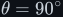<!--m:\theta = 90^{\circ}-->) it
catches none, however large the loop is._

**Worked number.** A <!--m:10\ \mathrm{cm}\times10\ \mathrm{cm}--> loop (<!--m:A = 0.01\ \mathrm{m^2}-->) in a uniform
<!--m:0.2\ \mathrm{T}--> field, tilted so its normal is <!--m:60^{\circ}--> from the field:

**Any field, any surface.** Real fields are not uniform and real loops are not flat. The fix is the
usual one: chop the surface into patches small enough that each is flat and the field across it is
uniform. Patch <!--m:i--> has a tiny area vector 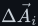<!--m:\Delta\vec{A}_i--> and sees field 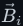<!--m:\vec{B}_i-->; add up:

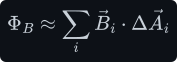

Let the patches shrink to zero size and the sum becomes a **surface integral**. The surface is
called <!--m:\Sigma--> (capital sigma), its rim — the loop itself — is 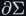<!--m:\partial\Sigma--> ("the boundary of
sigma"), and 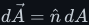<!--m:d\vec{A} = \hat{n}\,dA--> is an infinitesimal patch with its normal:

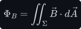

The double integral sign only means "add up over a two-dimensional surface". For a uniform field and
a flat loop it collapses back to <!--m:BA\cos\theta-->.

**Which surface?** A loop of wire does not come with a surface; you choose one with the loop as its
rim. A flat disk, a bowl, a soap-bubble bulge — infinitely many surfaces share the same rim. It does
not matter which, because of a basic fact about magnetic fields, **Gauss's law for magnetism**: there
are no magnetic charges, so field lines never start or end, and every line that enters a closed
surface <!--m:S--> also leaves it:

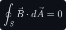

Take two surfaces <!--m:\Sigma_1--> and 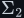<!--m:\Sigma_2--> on the same rim. Together they form a closed surface, so
every line that crosses <!--m:\Sigma_1--> must cross <!--m:\Sigma_2--> as well: the flux through them is the same.
The flux through a loop is a property of the loop alone.

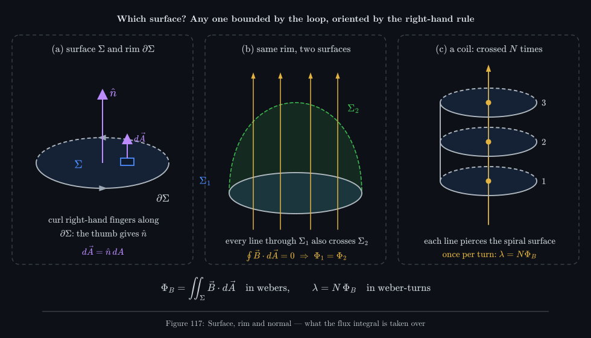

_Panel (a) is the orientation rule (fingers along the rim, thumb along the normal); panel (b) is why
the choice of surface does not matter; panel (c) is why a coil multiplies the flux by its number of
turns, the subject of the next section._

## 4 The weber, and flux linkage

**The weber.** Flux is a field times an area, so its natural unit is the tesla square metre. It has
its own name, the **weber** (Wb), and it is worth seeing why a weber is also a volt-second, because
that identity is the whole of Faraday's law in units. Start from the tesla of §1:

A newton-metre is a joule (J), the unit of work and energy:

A volt (V) is a joule per coulomb, so a joule is a volt-coulomb, and a coulomb is an ampere-second:

So <!--m:1\ \mathrm{Wb} = 1\ \mathrm{T\cdot m^2} = 1\ \mathrm{V\cdot s}-->. A weber is a volt applied for a second.
Turned round, a flux changing at one weber per second is worth one volt, which §6 makes precise.
Practical fluxes are small: the <!--m:1\ \mathrm{mWb}--> of the example in §3, or the <!--m:15\ \mu\mathrm{Wb}--> peak in
the ferrite transformer of [../electromagnetism/electromagnetism.md §6](../electromagnetism/electromagnetism.md#6-faradays-law--voltage-from-changing-flux-done-slowly).

**Flux linkage.** A coil is not one loop but <!--m:N--> loops in series (each loop is a **turn**). The
surface bounded by the whole wire is a spiral ramp, like a car-park ramp, and a field line running
along the coil's axis pierces that ramp once per turn (Figure 117c). So the total flux "seen" by the
wire is the sum of the fluxes through each turn. That total is the **flux linkage**, written
<!--m:\lambda--> (lambda):

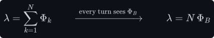

Here 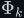<!--m:\Phi_k--> is the flux through turn number <!--m:k-->. In a tightly wound coil, or any winding on a
closed core, every turn encloses the same flux <!--m:\Phi_B-->, and the sum is just <!--m:N--> copies:

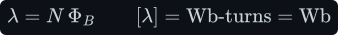

The unit is the **weber-turn**. A "turn" is a pure count, so dimensionally a weber-turn is a weber;
the word "turns" is kept as a reminder that the flux has been counted once per turn. In the
electromagnetism overview the same quantity appears as 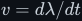<!--m:v = d\lambda/dt-->; it is this <!--m:\lambda-->.

**Worked number.** Wind 200 turns around the loop of §3 (same <!--m:0.2\ \mathrm{T}--> field, same <!--m:60^{\circ}-->
tilt). Each turn holds <!--m:1\ \mathrm{mWb}-->, so:

> **Tip —** Keep three quantities apart. <!--m:B--> (tesla) is what the field is at a point; <!--m:\Phi_B-->
> (weber) is how much of it threads one loop; <!--m:\lambda = N\Phi_B--> (weber-turns) is what the whole
> winding sees. They differ by an area and by a count, and most magnetics mistakes are dropping one
> of the two.

## 5 EMF — what actually pushes the charges round

Faraday's law gives an **EMF**, written <!--m:\mathcal{E}--> (script E). The name, *electromotive force*, is a
historical accident: it is not a force, and it is measured in volts. What it is, physically, needs
care, because it is *not* the same thing as the voltage between two points of a circuit.

**Work per charge around a loop.** Take a closed loop <!--m:C--> (a ring of wire, or just a closed path in
space). Carry a charge <!--m:q--> once around it and add up the work <!--m:W_{\text{loop}}--> that the forces
acting on it do along the way. The EMF is that work per unit charge:

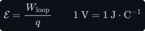

Work is force times distance, added up along the path. If the path is cut into tiny steps
<!--m:d\vec{l}--> (each a little arrow along the loop, in metres, pointing in the chosen direction of
travel), each step contributes 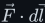<!--m:\vec{F}\cdot d\vec{l}--> — the component of the force along the step,
times its length. Adding those around the whole loop is a **closed line integral**, written
<!--m:\oint_C-->. Dividing by <!--m:q-->, and using the Lorentz force of §1:

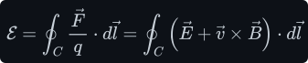

That is the general definition used in the rest of this document. The direction of travel around
<!--m:C-->, and hence the sign of <!--m:\mathcal{E}-->, is tied to the surface normal <!--m:\hat{n}--> by the right-hand
rule of §3.

**Why a battery-free loop normally has zero EMF.** The electric field made by charges sitting still
(the subject of [../coulombs-law/](../coulombs-law/)) is **conservative**: the work it does on a
charge carried from one point to another does not depend on the route, so the work around any
closed route is zero:

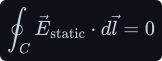

That is why a voltage between two points means something for static fields, and it is Kirchhoff's
voltage law in field form. A closed ring of copper with no battery and no changing magnetism
therefore has zero EMF and no current.

**So something non-conservative is needed.** To keep current flowing round a closed loop against its
resistance, some agent must do net work on each charge per lap. In a battery it is chemistry, over a
thin region at each electrode. In induction there are exactly two possibilities, read straight off
the integrand 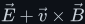<!--m:\vec{E} + \vec{v}\times\vec{B}-->:

- the **magnetic force** 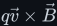<!--m:q\vec{v}\times\vec{B}--> on charges carried along by a *moving* conductor (§9), or
- an **electric field that is not conservative** — one whose closed line integral is not zero.
  Charges at rest cannot make such a field; a changing magnetic field does (§10).

**EMF, current and terminal voltage.** If the loop is a wire of total resistance <!--m:R--> (in ohms,
<!--m:\Omega-->, where <!--m:1\ \Omega = 1\ \mathrm{V\cdot A^{-1}}-->), the EMF drives a current <!--m:I--> (in amperes)
round it:

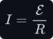

If the loop is cut open and a voltmeter is put across the gap, almost no current flows, charge
piles up at the two ends until its own conservative field exactly cancels the push in the wire, and
the meter reads the EMF. That is what "the induced voltage of a coil" means in circuit work: the
open-circuit EMF, which appears across the terminals.

## 6 Faraday's law — the flux rule

Now the law itself. For any closed loop, with <!--m:\hat{n}--> and the direction of travel paired by the
right-hand rule:

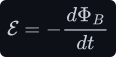

In words: the EMF around a loop equals minus the rate of change of the magnetic flux through it.
Here <!--m:t--> is time in seconds, and <!--m:d\Phi_B/dt--> is the rate of change of the flux (its slope against
time), in webers per second. The units check with no constant needed, by §4:

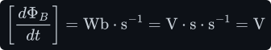

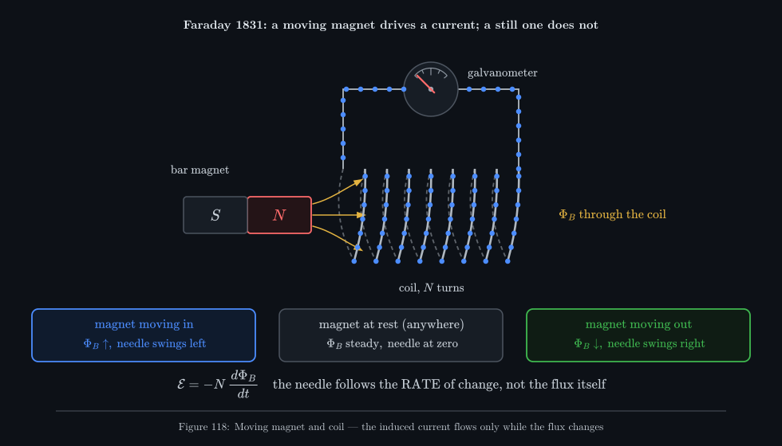

_The animation is Faraday's second experiment. The needle swings while the magnet moves and only
then; it swings one way going in and the other way coming out; and the current dots reverse with it.
The flux through the coil is largest when the magnet is deepest inside — exactly the moment the
needle passes through zero, because the flux has momentarily stopped changing._

**N turns.** For a coil the EMFs of the turns add, because the turns are in series. Do it one step at
a time. First, the total is the sum of the per-turn EMFs, each given by Faraday's law for its own
turn:

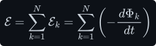

The derivative of a sum is the sum of the derivatives, so the derivative can be pulled outside, and
what is left inside is the flux linkage of §4:

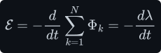

When every turn sees the same flux, <!--m:\lambda = N\Phi_B-->, and <!--m:N--> is a constant that comes out of the
derivative:

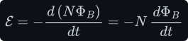

That is the multi-turn form in the thesis. <!--m:N--> is there for one reason only: each turn is a separate
loop threaded by the same changing flux, and the turns are in series.

**Average EMF over a finite change.** Often the flux changes by a known amount <!--m:\Delta\Phi_B--> (in Wb)
over a known time <!--m:\Delta t--> (in s). The average EMF over that interval is:

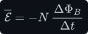

**Worked numbers — the magnet into the coil.** A 200-turn coil of total resistance <!--m:10\ \Omega-->
(galvanometer included). Pushing a magnet in raises the flux through each turn from about zero to
<!--m:0.5\ \mathrm{mWb}--> in <!--m:0.1\ \mathrm{s}-->:

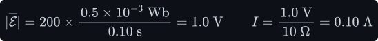

Push twice as fast and the EMF and current double; hold the magnet still inside the coil and both
are zero, though the flux is at its largest. Pull it out and the EMF has the same size, opposite sign.

**The charge does not care how fast.** Here is a less obvious consequence, the content of Felici's
law. The total charge <!--m:Q--> (in coulombs) driven round the circuit is the current integrated over time.
Substitute 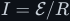<!--m:I = \mathcal{E}/R--> and Faraday's law:

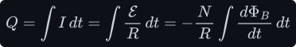

The integral of a rate of change over time is just the total change (the fundamental theorem of
calculus), so:

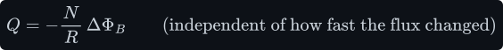

A fast push gives a large current for a short time, a slow push a small current for a long time;
the charge is the same. For the coil above:

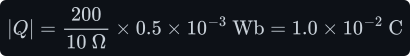

This is how a *fluxmeter* measures flux: it integrates the current and reads <!--m:\Delta\Phi_B--> directly.

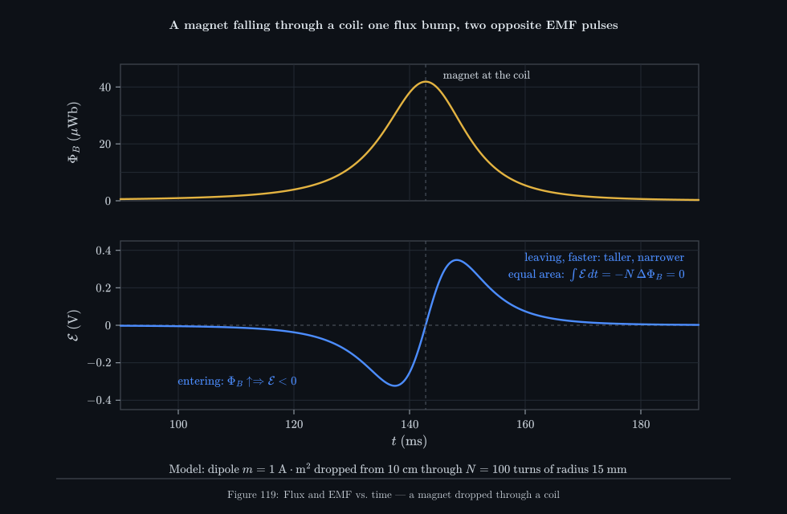

_A magnet dropped through a coil, computed for a real geometry. The flux is one smooth bump; the EMF
is its slope, so it is two pulses of opposite sign. The leaving pulse is taller and narrower because
gravity has sped the magnet up, but its area is the same — the total flux change in and out is zero,
so by the result above no net charge flows._

## 7 Lenz's law — the minus sign is energy conservation

The minus sign in 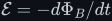<!--m:\mathcal{E} = -d\Phi_B/dt--> carries the direction, and it is easy to apply once the
sign convention is clear.

**Reading the sign.** Choose <!--m:\hat{n}-->, and with it the positive direction around the loop by the
right-hand rule (§3). If the flux along <!--m:\hat{n}--> is increasing, 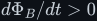<!--m:d\Phi_B/dt > 0-->, so <!--m:\mathcal{E} < 0-->: the
EMF, and the current it drives, run *against* the curl of your fingers. That current makes its own
magnetic field (by [Ampère's law](../amperes-law/)), and inside the loop that field points along
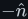<!--m:-\hat{n}--> — against the increase. If the flux is decreasing, everything reverses and the induced
field points along <!--m:\hat{n}-->, propping the flux up.

**Lenz's law** says the same thing without any sign convention: *the induced current flows in the
direction whose own magnetic field opposes the change of flux that produced it.* It opposes the
change, not the flux: a falling flux is propped up, not pushed down.

> **Note —** The Wikipedia article gives an equivalent recipe with the *left* hand. Curl the fingers
> of the left hand along the loop; the thumb then gives a normal <!--m:\hat{n}-->. If the flux along that
> <!--m:\hat{n}--> is increasing, the EMF runs along the curled fingers; if it is decreasing, against them.
> Using the left hand is just a way of building the minus sign into the hand.

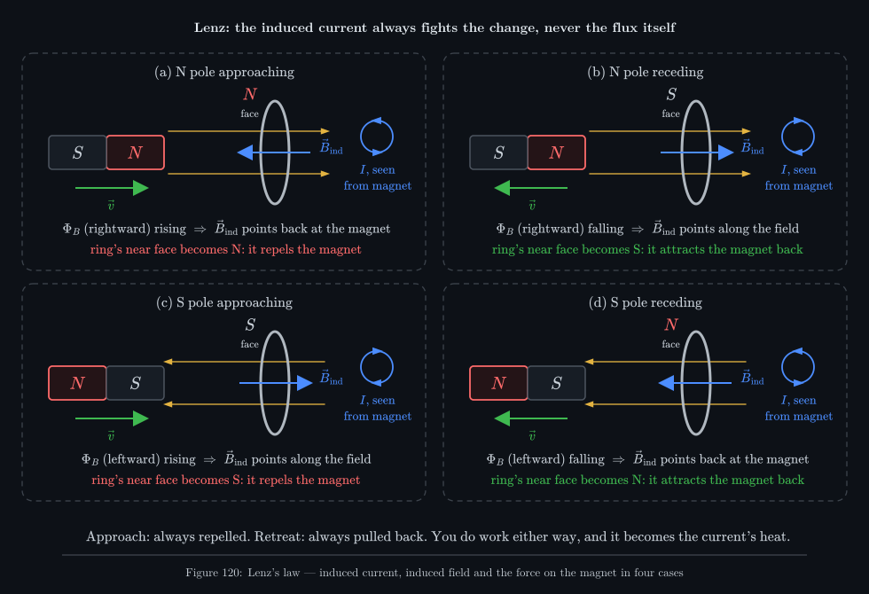

_All four cases follow one rule. An approaching pole always meets a like pole on the ring's near face
and is repelled; a retreating pole always meets an unlike pole and is held back. The ring resists the
motion whichever way you move the magnet._

**Why it must be so — energy.** Suppose the sign were the other way, so that the induced current
*aided* the change. Push a north pole towards a ring: the ring would turn its near face into a south
pole and *pull the magnet in*. The magnet would speed up, the flux would rise faster, the current would
grow, the pull would grow — a runaway that produces kinetic energy and electrical heat from nothing.
No such device exists. With the actual sign, the ring repels the approaching magnet, so you have to
push, and the work you do is exactly the energy that turns up as heat in the ring:

Section 9 checks this balance to the watt for the sliding bar. The minus sign is not a convention you
may choose; it is energy conservation.

## 8 Two ways to change the flux

For a uniform field and a flat loop, <!--m:\Phi_B = BA\cos\theta-->, and any of the three factors may change
with time:

Differentiate with the product rule (the derivative of a product is the sum of terms, each
differentiating one factor and keeping the others), using <!--m:d(\cos\theta)/dt = -\sin\theta\,d\theta/dt-->:

The three terms sort into two physically different mechanisms.

- **The field changes** (first term): the loop sits still and <!--m:B--> grows or shrinks — a switched
  current in a nearby coil, an AC current, a magnet's field sweeping over. No charge in the wire is
  moving, so the magnetic force <!--m:q\vec{v}\times\vec{B}--> is zero; the push must be an electric field.
  This is **transformer EMF** (§10).
- **The loop moves or changes shape** (second and third terms): the field is steady but the area
  grows, or the loop turns. The charges move with the wire through the field and feel <!--m:q\vec{v}\times\vec{B}-->.
  This is **motional EMF** (§9).

_Three different physical situations, one equation. In (a) the loop's charges move through the
field and feel the magnetic force; in (b) and (c) the loop is still, so only an electric field can
push them. Yet the current is identical, because in all three the flux into the page is rising at
the same rate. This coincidence is what Einstein asked about (§14)._

Case (b), a moving magnet and a still loop, looks like case (a) but is physically case (c): in the
loop's frame nothing moves, and the field at each point of the loop is changing in time.

## 9 Motional EMF — derived from the magnetic force on the charges

**A rod on its own.** Take a straight metal rod of length <!--m:l--> (in metres) and move it at constant
velocity <!--m:\vec{v}--> through a uniform field <!--m:\vec{B}-->, with the rod, <!--m:\vec{v}--> and <!--m:\vec{B}--> all at right
angles to each other. Every charge in the rod moves with it, so each feels the magnetic part of the
Lorentz force:

Because <!--m:\vec{v}--> is perpendicular to <!--m:\vec{B}-->, the sine in the cross product is 1, and the
right-hand rule makes the force point *along the rod*:

The step people find confusing is this: the force is sideways to the *motion* of the rod, but that
sideways direction is *along the length* of the rod, and the charges are free to move along the rod.
So the magnetic force pushes them from one end towards the other. Carry a charge the full length
<!--m:l--> and the magnetic force does work:

EMF is work per unit charge (§5), so:

> **Watch out —** A magnetic force does no work on a *free* charge, because it is always
> perpendicular to that charge's total velocity. Here the work is done because the rod's own
> velocity <!--m:\vec{v}--> and the charge's drift along the rod are at right angles: the magnetic force
> has a component along the drift, and an equal and opposite component pushes back on the rod as a
> whole (the drag force below). Whoever keeps the rod moving supplies the energy; the magnetic field
> only redirects it.

_Electrons, the actual mobile charges, carry charge <!--m:-e--> (with <!--m:e = 1.602\times10^{-19}\ \mathrm{C}-->) and are
pushed the opposite way to the arrow for a positive charge — same separation, same sign of the
result. The pile-up stops when the electric field of the separated charge balances the magnetic push._

**What happens in an open rod.** With nowhere to go, the electrons pile up at one end, leaving
positive metal ions exposed at the other. That separated charge sets up an electric field <!--m:E--> (in
<!--m:\mathrm{V\cdot m^{-1}}-->) along the rod, pushing back. The pile-up stops when the electric push on each
charge balances the magnetic one:

Two routes, the same answer: the open-circuit voltage between the ends equals the EMF, as §5 said.
With <!--m:B = 0.5\ \mathrm{T}-->, <!--m:l = 0.2\ \mathrm{m}-->, <!--m:v = 10\ \mathrm{m\cdot s^{-1}}-->:

**Close the circuit: the sliding bar.** Lay the rod across two parallel rails a distance <!--m:l--> apart,
joined at one end by a resistor <!--m:R-->. The bar, the rails and the resistor form a loop whose area
grows as the bar moves. Let <!--m:x(t)--> (in metres) be the bar's distance from the resistor, so
<!--m:dx/dt = v-->. Check the result against the flux rule:

The magnetic-force argument and the flux rule agree exactly, as §12 proves they must. The EMF
drives a current through the resistor:

_The area to the left of the bar, and so the flux, grows steadily, so the current is steady. It runs
counter-clockwise: its own field inside the loop points out of the page, against the growing flux
into the page — Lenz again._

**A loop that is wholly inside the field.** Go back to the square loop of Figure 121(a). While only
its leading side is in the field, that side alone carries the push <!--m:Blv-->, and current flows. Once the
whole loop is inside a uniform field, its trailing side moves through the same field at the same
speed and carries the same push <!--m:Blv--> — but going round the loop, that side is walked in the opposite
direction, so the two pushes cancel and the EMF is zero. The flux rule agrees: the loop's flux is now
constant. When the leading side leaves the field the trailing side's push is left alone, and the
current flows the other way.

**The drag, and the energy.** The current in the bar flows through the field, so the bar feels a
force <!--m:\vec{F}_B = I\vec{l}\times\vec{B}-->, where <!--m:\vec{l}--> is a vector of length <!--m:l--> along the bar in the
current's direction (this is the magnetic force on all the moving charges in the bar added up). It
points backwards, against <!--m:\vec{v}-->:

To keep the speed constant you must push with an equal and opposite force, delivering mechanical
power <!--m:P = Fv--> (in watts, <!--m:1\ \mathrm{W} = 1\ \mathrm{J\cdot s^{-1}}-->):

Power in from your hand equals electrical power out. With <!--m:R = 0.5\ \Omega--> and the numbers above:

_The three powers are the same 2 W. That equality is Lenz's law in numbers: the induced current had
to point the way that makes the bar drag, or the books would not balance._

**If nobody pushes.** Give the bar (mass <!--m:m-->, in kg) a shove and let go. The only horizontal force is
the drag, so Newton's second law gives:

A quantity whose rate of decrease is proportional to itself decays exponentially, with time constant
<!--m:\tau--> (in seconds):

Here <!--m:v_0--> is the speed at the moment you let go. For a <!--m:0.1\ \mathrm{kg}--> bar on the same rails:

All the bar's kinetic energy ends up as heat in the resistor. This is magnetic braking in its
simplest form (§15).

## 10 Transformer EMF — the induced electric field

Now case (c) of Figure 121: the loop is stationary and the field through it changes. The charges in
the wire are at rest, so <!--m:\vec{v} = 0--> and the magnetic force on them is exactly zero. Yet a current
flows. The only thing in the Lorentz force that can push a charge at rest is an electric field. So a
changing magnetic field must be accompanied by an electric field, and since it drives charge all the
way round a closed loop, it must be **non-conservative**: its closed line integral is the EMF, not
zero.

This field exists whether or not a wire is there. The wire is just a detector that lets charge
respond to it.

**Working out the field — a uniform B in a circular region.** Let a uniform field <!--m:B(t)--> fill a
circular region of radius <!--m:R--> (in metres) — the inside of a long solenoid, say — and change with
time. By symmetry the induced field circles the axis: on a circle of radius <!--m:r--> (in metres) it has
the same size <!--m:E--> everywhere and points along the circle. Take that circle as the loop. Then the
closed line integral is just <!--m:E--> times the circumference:

Inside the region the circle encloses flux:

Faraday's law sets the two equal (with the sign):

Outside the region the circle encloses all of it, <!--m:\pi R^2 B-->, however large <!--m:r--> is:

So the induced field grows linearly from zero on the axis to the edge of the region, then falls off
as <!--m:1/r--> outside — where <!--m:B--> itself is zero. A wire loop around a long solenoid, in a region with no
magnetic field at all, still feels a push: the EMF depends on the flux enclosed, not on the field
where the wire is.

_The field lines of this electric field are closed circles: they have no beginning and no end, so
there is no charge for them to start on and no potential to define. While <!--m:B--> grows the push is
counter-clockwise; while it shrinks the dots turn back. The faster the change, the faster they move._

**Worked numbers — a mains transformer core.** A core of radius <!--m:5\ \mathrm{cm}--> carries
<!--m:B(t) = 1.5\ \mathrm{T}\,\sin\omega t--> at <!--m:f = 50\ \mathrm{Hz}-->. The **angular frequency** <!--m:\omega--> (in
radians per second, <!--m:\mathrm{rad\cdot s^{-1}}-->, often written just <!--m:\mathrm{s^{-1}}-->) is
<!--m:\omega = 2\pi f-->, because one cycle is <!--m:2\pi--> radians; here <!--m:\omega = 314\ \mathrm{s^{-1}}-->. The steepest
slope of <!--m:\sin\omega t--> is <!--m:\omega-->, at the zero crossings:

At the surface of the core (<!--m:r = R = 5\ \mathrm{cm}-->) the peak induced field, and the peak EMF in one
turn wound round the core, are:

So every turn of a winding on this core gets <!--m:3.7\ \mathrm{V}--> peak, about <!--m:2.6\ \mathrm{V}--> RMS (root mean square, the equivalent steady value; for a sine it is the peak divided by <!--m:\sqrt2-->, §15.1): the
"volts per turn" of the [transformer](../transformer/transformer.md#3-the-ideal-transformer-derived-from-faraday).

**Voltage is no longer a single number.** Because this field is not conservative, the "voltage
between two points" depends on the path you measure along. Figure 126 makes this concrete. A ring of
two resistors, <!--m:R_1 = 100\ \Omega--> and <!--m:R_2 = 900\ \Omega-->, surrounds a solenoid whose changing flux
gives <!--m:\mathcal{E} = 1\ \mathrm{V}--> round the ring; the current is
<!--m:I = 1\ \mathrm{V}/1000\ \Omega = 1\ \mathrm{mA}-->. Two voltmeters are clipped to the same two nodes A
and B, one with its leads on the left and one on the right:

_Neither meter is wrong. Each reads the work per charge along its own path, and the two paths
together go once round the changing flux, so they differ by exactly the EMF. Kirchhoff's voltage law
holds for each meter's loop because neither loop encloses the flux; the big ring does, and there it
fails by exactly <!--m:\mathcal{E}-->._

> **Watch out —** This is why a scope probe's ground lead picks up "noise" near a switching
> converter: the loop formed by the probe tip, the ground lead and the circuit encloses changing flux,
> and the scope faithfully reports the EMF of that loop. Shrinking the loop (a ground spring instead of
> a long clip) is the cure, because it shrinks the enclosed flux.

## 11 The Maxwell–Faraday equation, and what curl means

**The integral form.** Section 10 says that around *any* closed path <!--m:\partial\Sigma--> fixed in space,
the circulation of <!--m:\vec{E}--> equals minus the rate of change of the flux through any surface <!--m:\Sigma-->
bounded by it. Written as a statement about fields alone, with no wires in it, that is the
**Maxwell–Faraday equation**:

The symbol <!--m:\partial\vec{B}/\partial t--> is a **partial derivative**: the rate of change of <!--m:\vec{B}--> with
time at a fixed point in space (the curly <!--m:\partial--> means "holding position fixed"). The left side is
the circulation of the electric field, the work per charge round the path. In electrostatics it is
always zero (§5); with a changing magnetic field it is not.

When the surface does not move, it makes no difference whether you differentiate before or after
adding up the flux, and the right side becomes the flux rule:

Identify the left side with the work per charge done on the charges in a stationary wire along that
path, and this is Faraday's law for a stationary circuit.

**From loops to points.** The integral form talks about whole loops. To get a statement about a
single point, shrink the loop. The key is the **Kelvin–Stokes theorem**:

Here <!--m:\nabla\times\vec{E}-->, the **curl** of <!--m:\vec{E}--> (in <!--m:\mathrm{V\cdot m^{-2}}-->), is a vector field that
measures how much <!--m:\vec{E}--> circulates around each point. Figure 127(a) shows why the theorem is true:
tile the surface with tiny loops, all circulating the same way. Every inside edge is shared by two
tiles and walked once in each direction, so it cancels. Only the outer rim survives. The circulation
round the rim is therefore the sum of the tiny circulations — and a tiny circulation, divided by the
tiny area it encloses, is what curl *is*.

**Curl, done slowly.** Take a tiny rectangle with sides <!--m:dx--> and <!--m:dy--> in the <!--m:x-->–<!--m:y--> plane, walked
counter-clockwise (so its normal is <!--m:+z-->), with <!--m:E_x-->, <!--m:E_y--> the components of <!--m:\vec{E}--> along <!--m:x--> and
<!--m:y-->. The bottom edge is walked in <!--m:+x--> and the top in <!--m:-x-->, so together they contribute the
difference of <!--m:E_x--> across the height <!--m:dy-->:

The right edge is walked in <!--m:+y--> and the left in <!--m:-y-->:

Add and divide by the area:

Doing the same in the other two planes gives the other two components:

_The paddle-wheel picture is the intuition to keep. Drop a tiny paddle wheel into a flowing field: if
the push is stronger on one side of the wheel than the other, it spins, and the spin rate and axis
are the curl. A uniform field pushes every paddle equally and the wheel stays still; a circulating
field spins it._

**The differential form.** Put Stokes into the integral form and move everything to one side:

The only way an integral can vanish over *every* surface, however small and however oriented, is
for the thing being integrated to be zero at every point:

This is Faraday's law as one of Maxwell's four equations. Read it as: wherever the magnetic field is
changing, the electric field curls around the direction of change, in the left-handed sense (that is
the minus sign); where <!--m:\vec{B}--> is steady, <!--m:\vec{E}--> has no curl and is the ordinary conservative field
of charges.

**Check it on the ring field of §10.** With <!--m:\vec{B} = B_z(t)\,\hat{z}--> (the <!--m:z--> axis out of the page) and
the field inside the region from §10, written in components:

Apply the <!--m:z--> component of the curl:

Exactly <!--m:-\partial B_z/\partial t-->, at every point inside the region. (Outside, the same calculation
with <!--m:E \propto 1/r--> gives zero curl, as it must where <!--m:B--> is steady at zero — the field circulates
there without having any curl, which is possible only because the loop round it encloses the region
where the curl lives.)

**Where the induced field comes from.** For slowly varying fields there is even an explicit
formula, the electric twin of the Biot–Savart law for <!--m:\vec{B}-->: every region where <!--m:\vec{B}--> is
changing contributes to the induced (circulating) part <!--m:\vec{E}_s--> of the electric field at a point
<!--m:\vec{r}-->, weighted by the inverse square of the distance:

Here <!--m:\vec{r}\,'--> runs over the volume <!--m:V--> where the field is changing and <!--m:d^3\vec{r}\,'--> is a small volume
element (in <!--m:\mathrm{m^3}-->). You will rarely evaluate it, but it makes the point: the changing field at
one place produces circulating electric field everywhere around it, falling off with distance.

## 12 Deriving the flux rule from the field laws

The flux rule covers both motional and transformer EMF, while the Maxwell–Faraday equation covers
only the changing-field part. This section shows the flux rule *follows* from the field laws plus the
Lorentz force, and in doing so finds exactly when it holds.

**Step 1 — how fast does the flux through a moving surface change?** Let the surface <!--m:\Sigma(t)--> and
its rim <!--m:\partial\Sigma(t)--> move, each point of the rim with velocity <!--m:\vec{v}_c--> (in
<!--m:\mathrm{m\cdot s^{-1}}-->). The flux changes for two reasons: the field changes at each point, and the
surface moves to enclose a different region. The three-dimensional **Leibniz integral rule** (also
called the flux transport theorem) counts both:

The first term is the field changing in place. The last term is the rim sweeping new area. Figure
128 shows where it comes from: in a time <!--m:dt--> a rim element <!--m:d\vec{l}--> moves by <!--m:\vec{v}_c\,dt--> and sweeps
a thin parallelogram of area <!--m:(\vec{v}_c\,dt)\times d\vec{l}-->, which adds flux
<!--m:\vec{B}\cdot(\vec{v}_c\times d\vec{l})\,dt-->. Swapping the order of a triple product cyclically
(it does not change its value) and then reversing the cross product (which flips its sign) turns that
into <!--m:-(\vec{v}_c\times\vec{B})\cdot d\vec{l}\,dt-->.

_The rim, moving, sweeps a sliver of new surface; the flux through that sliver is the motional term.
The sliding bar of §9 is the simplest case: the only moving part of the rim is the bar, and the
sliver is a strip <!--m:l\times v\,dt-->._

The middle term contains the **divergence** <!--m:\nabla\cdot\vec{B}-->, the net outflow of field per unit
volume from a point. Gauss's law for magnetism (§3) in point form says it is zero everywhere:

So that term drops out:

**Step 2 — use Maxwell–Faraday.** Replace the first term by minus the circulation of <!--m:\vec{E}-->
(§11), and combine the two line integrals:

This is exact. But <!--m:\vec{v}_c--> is the velocity of an abstract rim, not of any charge.

**Step 3 — bring in the actual charges.** A charge carrier in a conductor moves with the conductor
material (velocity <!--m:\vec{v}_c-->, now the velocity of the metal itself) plus its own drift through the
metal (velocity <!--m:\vec{v}_d-->, the drift velocity that makes up the current):

(Simple addition of velocities is fine at these speeds.) The EMF of §5 uses the charge's full
velocity. Split it, and recognise Step 2 in the first part:

**Step 4 — thin wire.** In a thin wire the drift is along the wire, parallel to <!--m:d\vec{l}-->. A cross
product with <!--m:\vec{v}_d--> is perpendicular to <!--m:\vec{v}_d-->, hence to <!--m:d\vec{l}-->, and its dot product with
<!--m:d\vec{l}--> is zero:

That is the flux rule, derived — with the condition attached: **the rim must move with the metal**
(the <!--m:\vec{v}_c--> of Step 1 must be the velocity of the conductor), and the conductor must be thin.
The equivalent form that never needs that condition keeps the two mechanisms separate:

**How big is the drift term?** In a thick conductor it need not vanish, but drift velocities are
tiny. For <!--m:1\ \mathrm{A}--> in a <!--m:1\ \mathrm{mm^2}--> copper wire, with <!--m:n--> the number of free electrons per
cubic metre:

About <!--m:0.07\ \mathrm{mm\cdot s^{-1}}--> — a snail would overtake it. There is one famous case where this
term is the *whole* effect: the **Hall effect**. A current-carrying plate in a magnetic field, with
nothing moving and nothing changing, develops a small voltage across its width, because the drifting
carriers are pushed sideways by <!--m:q\vec{v}_d\times\vec{B}-->. The flux term is zero and the drift term is
all there is; Hall sensors (in every brushless motor and many current probes) read it.

## 13 When the flux rule needs care — the Faraday paradox

It is tempting to promote the flux rule to "for any closed curve in space, the EMF is minus the rate
of change of flux through it". Section 12 shows that is only safe when the curve moves with the
conducting material. Two classic devices break the naive version.

**Faraday's disk.** A copper disk of radius <!--m:R--> (in metres) spins at angular speed <!--m:\omega--> (in
<!--m:\mathrm{rad\cdot s^{-1}}-->) in a steady uniform field <!--m:B--> along its axle. Sliding contacts (brushes) at
the axle and the rim connect it to a meter. The circuit — axle brush, a radius of the disk, rim brush,
external wire — has a fixed shape, the field is steady, so the flux through the circuit never
changes. The naive rule predicts zero. Yet a steady current flows. That is the **Faraday paradox**.

The force law has no trouble. A piece of the disk at distance <!--m:r--> from the axle moves at speed
<!--m:\omega r-->, at right angles to both the radius and <!--m:\vec{B}-->, so a charge there feels a magnetic force
per unit charge <!--m:\omega r B--> along the radius:

Add up the work per charge from the axle to the rim:

For a <!--m:10\ \mathrm{cm}-->-radius disk at <!--m:50--> revolutions per second in <!--m:0.5\ \mathrm{T}-->:

The flux rule can be rescued, but only by following the metal: a curve drawn on the spinning disk is
carried round with it, sweeping area at the rate <!--m:\tfrac{1}{2}R^2\omega-->, and the rule then gives the
same <!--m:\tfrac{1}{2}B\omega R^2-->. The curve that stays still while the metal slides through it gives the
wrong answer.

_Two failures of "just count the flux", in opposite directions: the disk makes an EMF with no flux
change through its circuit, and the rocking plates change the flux through their current path a lot
while making almost no EMF. In both, the force on the actual charges gives the right answer._

**The rocking plates.** Two metal plates with curved edges touch at one point and are wired into a
circuit, the whole thing sitting in a uniform field normal to the plates. Rock the plates slightly:
the contact point slides a long way along the curved edges, so the current path through the plates —
and the area it encloses — changes a lot, quickly. The naive flux rule predicts a large EMF. In fact
the EMF is almost zero, because the metal itself barely moves through the field: <!--m:\vec{v}\times\vec{B}-->
is tiny everywhere. The current path jumped from one piece of metal to another; no charge was carried
across the field.

> **Tip —** When in doubt, never count flux. Compute
> <!--m:\mathcal{E} = \oint(\vec{E} + \vec{v}\times\vec{B})\cdot d\vec{l}--> with <!--m:\vec{v}--> the velocity of the
> material at each point (or the two-term form of §12). It is always right. The flux rule is a
> shortcut that agrees with it for thin wires that carry their circuit with them — which is every
> coil, transformer and ordinary generator, but not sliding contacts.

## 14 One phenomenon, two descriptions — the road to relativity

Go back to Figure 121. In (a) the loop moves through a still magnet's field: the EMF is the magnetic
force on moving charges, and there is no electric field anywhere. In (b) the magnet moves past a still
loop: the charges are at rest, so the EMF is an induced electric field. Two different explanations;
the same current, to every decimal place, depending only on the *relative* motion.

Maxwell had noticed the two processes in 1861. Einstein made the asymmetry the opening paragraph of
his 1905 relativity paper: a physical result that depends only on relative motion should not need two
different explanations depending on which object you call moving. His resolution was that there is
no preferred frame, and that electric and magnetic fields are not separate things but two aspects of
one electromagnetic field, which mix when you change frame. For speeds <!--m:v--> much smaller than the speed
of light <!--m:c--> (<!--m:3.0\times10^8\ \mathrm{m\cdot s^{-1}}-->), an observer moving with velocity <!--m:\vec{v}--> measures:

Apply it to the rod of §9. In the lab, <!--m:\vec{E} = 0--> and the rod's charges feel <!--m:q\vec{v}\times\vec{B}-->. Ride
along with the rod and the charges are at rest — no magnetic force — but you now measure an electric
field <!--m:\vec{E}\,' = \vec{v}\times\vec{B}-->, which pushes them with exactly the same force. What one observer
calls motional EMF, another calls transformer EMF. The flux rule's single formula for both was a hint
that the two were one thing all along.

## 15 Applications

### 15.1 The generator

Turn a flat coil of <!--m:N--> turns and area <!--m:A--> (in <!--m:\mathrm{m^2}-->) at constant angular speed <!--m:\omega--> in a
uniform field <!--m:B-->, about an axle at right angles to the field. Measure the angle <!--m:\theta--> between the
coil's normal and the field from the moment they are aligned. The angle grows steadily, and the flux
follows §3:

_In (a) the bright field lines are the ones threading the loop: a full bundle face-on, none edge-on.
In (b), looking along the field, the loop's shadow — its effective area — swells, vanishes and comes
back reversed (green) each turn. The EMF is largest at the edge-on moment, when the shadow is
changing fastest, not when it is biggest._

Apply Faraday's law for <!--m:N--> turns. <!--m:B-->, <!--m:A--> and <!--m:N--> are constants and come out of the derivative:

Now the derivative of <!--m:\cos(\omega t)-->. Its argument is itself a function of time, so use the chain
rule: differentiate the cosine (giving minus the sine), then multiply by the derivative of the
argument, <!--m:d(\omega t)/dt = \omega-->:

The two minus signs cancel:

A rotating coil in a steady field is a sine-wave generator, with peak EMF <!--m:\mathcal{E}_{pk} = NBA\omega-->.
The RMS value (the steady voltage that would heat a resistor equally; for a sine it is the peak over
<!--m:\sqrt2-->, derived in [../signals/ac-and-rms.md](../signals/ac-and-rms.md)) follows. For a modest
coil at mains frequency:

_The flux is a cosine and the EMF a sine: a quarter turn apart. Peak EMF at edge-on, zero EMF at
face-on. Double the speed and both the frequency and the amplitude double, because <!--m:\omega--> appears in
both places._

**Cross-check with the magnetic force.** Take one rectangular turn with the two sides parallel to the
axle of length <!--m:l-->, a width <!--m:w--> apart (so <!--m:A = lw-->). Each of those sides moves on a circle of radius
<!--m:w/2--> at speed <!--m:\omega w/2-->; only the component of its velocity across the field,
<!--m:(\omega w/2)\sin\omega t-->, gives a force along the wire (the end pieces' forces point across the wire and do nothing). Each
side contributes <!--m:Bl--> times that, and the two sides add round the loop:

Times <!--m:N--> turns, the same <!--m:NBA\omega\sin\omega t-->. Practical alternators usually do it the other way
round — spin the magnet and keep the heavy, high-current windings still — which by §14 changes
nothing.

### 15.2 The transformer

Wind two coils on one closed core, as Faraday did on his ring. The core guides essentially all the
flux <!--m:\Phi_B--> through both, so each turn of either winding sees the same <!--m:d\Phi_B/dt-->. With <!--m:N_p-->
primary turns (driven by the voltage <!--m:v_p-->) and <!--m:N_s--> secondary turns (giving <!--m:v_s-->), and using the
circuit sign convention in which the coil's terminal voltage is <!--m:v = -\mathcal{E}--> (explained in
[../electromagnetism/electromagnetism.md §8](../electromagnetism/electromagnetism.md#8-lenzs-law--the-sign-and-back-emf)):

_The flux builds up one way round the core, collapses, and builds up the other way. The secondary
current follows the rate of change, so it is strongest as the flux passes through zero — the same
quarter-cycle offset as the generator._

With <!--m:12\ \mathrm{V}--> across 4 primary turns, every turn on the core carries <!--m:3\ \mathrm{V}-->, and a
108-turn secondary gives <!--m:324\ \mathrm{V}-->. Faraday's law also explains why a transformer cannot pass DC:
a constant voltage means a constant <!--m:d\Phi_B/dt-->, so the flux ramps without limit until the core
saturates. The full story — current ratio, magnetising current, core size against frequency, losses —
is in [../transformer/](../transformer/).

### 15.3 The inductor

A single coil also links the flux made by its *own* current. Below saturation that flux linkage is
proportional to the current <!--m:I-->, and the constant of proportionality is the **inductance** <!--m:L--> (in
henries, <!--m:1\ \mathrm{H} = 1\ \mathrm{Wb\cdot A^{-1}} = 1\ \mathrm{V\cdot s\cdot A^{-1}}-->). Faraday's law then
gives the coil's self-induced EMF:

The minus sign is Lenz again: the EMF opposes the change of current — a **back-EMF**. Interrupt
<!--m:1\ \mathrm{A}--> in <!--m:1\ \mu\mathrm{s}--> in a <!--m:100\ \mu\mathrm{H}--> inductor:

That is the inductive kick that destroys unprotected switches. The defining law
<!--m:V_L = L\,dI_L/dt-->, its ramps and its kick are developed in [../inductor/](../inductor/).

### 15.4 Eddy currents and magnetic braking

In a solid piece of metal there is no wire to choose a loop for you: *every* closed path inside the
metal is a loop, and wherever the flux through it changes, current flows round it. These whirls are
**eddy currents**. By Lenz they always oppose the change, so in a conductor moving past a magnet they
drag it back, and in a transformer core they waste power as heat.

_Where the plate enters the field the flux is rising and the whirl runs one way; where it leaves, the
flux is falling and the whirl runs the other. Under the pole both run the same way, and the force on
that current points backwards. Slots and insulated laminations cut the whirls into thin strips that
can carry little current._

**Braking.** The sliding bar of §9 is the model: the drag is proportional to <!--m:B^2--> and to the speed,
and inversely to the resistance of the current path. That is why eddy-current brakes on trains,
roller coasters and exercise bikes are strong at speed, fade gently to nothing as the vehicle slows
(they cannot hold it stationary), and never wear, since nothing touches. A strong magnet dropped
down a thick copper tube falls slowly at a steady speed for the same reason: the faster it falls, the
harder the tube's eddy currents push back.

**Losses.** In a transformer core the changing flux drives eddy currents through the core metal. The
EMF round each eddy path grows with the frequency <!--m:f--> (in Hz) and the peak flux density <!--m:\hat{B}-->, the
power with the square of that EMF over the resistance; for sheets of thickness <!--m:t--> (in metres) and
resistivity <!--m:\rho--> (in <!--m:\Omega\cdot\mathrm{m}-->):

Hence laminated silicon steel at <!--m:50\ \mathrm{Hz}-->, and ferrite (a ceramic with enormous <!--m:\rho-->) at
tens of kilohertz; the classical formula and numbers are in
[../transformer/transformer.md §15](../transformer/transformer.md#15-core-loss--the-ceiling-on-frequency).

### 15.5 The induction cooktop

An induction hob is a transformer whose secondary is the pan. A flat spiral coil under a glass plate
carries current from an inverter at <!--m:20--> to <!--m:100\ \mathrm{kHz}-->. Its alternating flux, steered upward by
ferrite bars, passes through the steel base of the pan, and Faraday's law drives eddy currents round
inside the base. The pan's own resistance is the load; it heats from within. The glass carries no
current and only gets warm from the pan.

_The coil is the primary, the pan base a one-turn short-circuited secondary. At these frequencies the
eddy currents crowd into a thin layer at the bottom surface of the pan, and how thin that layer is
decides which pans work._

**Why steel and not copper.** At high frequency the induced currents flow only in a surface layer
whose thickness is the **skin depth** <!--m:\delta--> (in metres), which depends on the resistivity <!--m:\rho-->,
the angular frequency <!--m:\omega--> and the permeability <!--m:\mu--> (in <!--m:\mathrm{H\cdot m^{-1}}-->; <!--m:\mu_r--> is the
material's relative permeability, <!--m:\mu_0 = 4\pi\times10^{-7}\ \mathrm{H\cdot m^{-1}}-->). The result comes
from combining Faraday's law with Ampère's law inside a conductor; here it is stated, not derived:

For carbon steel (<!--m:\rho \approx 1.5\times10^{-7}\ \Omega\cdot\mathrm{m}-->, effective <!--m:\mu_r \approx 100-->) and
for copper (<!--m:\rho = 1.7\times10^{-8}\ \Omega\cdot\mathrm{m}-->, <!--m:\mu_r = 1-->) at <!--m:25\ \mathrm{kHz}-->:

The resistance of the heated skin goes as <!--m:\rho/\delta--> (resistivity over the thickness the current
gets to use):

A steel base presents about thirty times the resistance, which the hob's electronics can drive
efficiently; a copper or aluminium pan is almost a short circuit, takes huge current for little heat,
and a basic hob refuses it. (Steel also adds hysteresis loss, the magnetic friction of its domains,
which helps further.)

### 15.6 More of the same law

- **Electromagnetic flowmeter.** A conducting liquid flowing at speed <!--m:v--> through a pipe of diameter
  <!--m:D--> across a field <!--m:B--> is a moving conductor; electrodes on opposite walls read the motional EMF
  <!--m:BDv-->, with no moving parts in the flow:
  
- **Guitar pickups and dynamic microphones.** A vibrating steel string (or a coil on a moving
  diaphragm) changes the flux through a coil; the EMF is proportional to the velocity of the vibration.
- **Wireless charging** of phones and toothbrushes: two coils sharing an alternating flux, a
  transformer with an air gap.
- **Metal detectors and card readers:** a changing flux induces eddy currents in a buried coin, or the
  stripe's magnetised pattern swept past a head induces an EMF.
- **Induction motors:** a rotating field induces currents in the rotor bars, and the force on those
  currents drags the rotor round after the field.

## 16 What this costs you

- **Every loop is a secondary winding.** Any closed loop near a changing current picks up an EMF
  (between neighbouring circuits this unwanted coupling is called crosstalk). A
  <!--m:1\ \mathrm{cm^2}--> loop of PCB track near a switching inductor whose stray field changes at
  <!--m:10^3\ \mathrm{T\cdot s^{-1}}--> (for example <!--m:10\ \mathrm{mT}--> in <!--m:10\ \mu\mathrm{s}-->) collects
  
  — enough to upset a logic input or a sensitive measurement. Small loop areas, return paths directly
  under signal tracks, and shielded or toroidal magnetics are the defence.
- **Kirchhoff's voltage law is an approximation.** It holds for loops that enclose no changing flux.
  Around a loop that does, the voltages do not sum to zero; they sum to the EMF (Figure 126). Circuit
  theory survives by booking that EMF as the terminal voltage of an inductor or transformer winding,
  but a measurement loop you did not draw on the schematic is not booked anywhere.
- **Lenz charges for every watt.** A generator's output current makes a drag torque on the rotor;
  the electrical power out is paid for, watt for watt, by mechanical power in, plus losses. There is
  no clever winding that avoids it.
- **Eddy currents heat what you did not want heated.** Transformer and motor cores need laminations
  or ferrite; mounting brackets, shields and enclosures near strong AC fields get warm; the cost rises
  with the square of frequency.
- **The inductive kick.** Any attempt to stop a current quickly in an inductance produces an EMF
  <!--m:L\,dI/dt--> that can reach hundreds of volts. Every relay coil and switching converter needs a path
  (a diode, a snubber, a clamp) for that energy.
- **The flux rule can mislead.** With sliding contacts, thick conductors, or a "loop" that does not
  move with the metal, counting flux can give the wrong EMF (§13). The force on the actual charges
  never does.
- **Only change counts.** A large static field does nothing for a stationary circuit. A sensor based
  on induction cannot measure a steady field (a Hall sensor, §12, is needed for that), and a
  generator gives nothing when it stops.

## 17 Every symbol in one place

| Symbol | Name | Unit | Defined in |
|---|---|---|---|
| <!--m:\vec{B}--> | magnetic field (flux density) | <!--m:\mathrm{T} = \mathrm{N\cdot A^{-1}\cdot m^{-1}} = \mathrm{V\cdot s\cdot m^{-2}}--> | §1 |
| <!--m:\vec{E}--> | electric field | <!--m:\mathrm{V\cdot m^{-1}} = \mathrm{N\cdot C^{-1}}--> | §1, [../coulombs-law/](../coulombs-law/) |
| <!--m:q-->, <!--m:\vec{v}-->, <!--m:\vec{F}--> | charge, its velocity, force on it | <!--m:\mathrm{C}-->, <!--m:\mathrm{m\cdot s^{-1}}-->, <!--m:\mathrm{N}--> | §1 |
| <!--m:\hat{n}-->, <!--m:\vec{A}-->, <!--m:d\vec{A}--> | unit normal, area vector, area element | (none), <!--m:\mathrm{m^2}-->, <!--m:\mathrm{m^2}--> | §3 |
| <!--m:\theta--> | angle between <!--m:\vec{B}--> and <!--m:\hat{n}--> | <!--m:\mathrm{rad}--> | §3 |
| <!--m:\Sigma-->, <!--m:\partial\Sigma--> | a surface, and its rim (the loop) | | §3 |
| <!--m:\Phi_B--> | magnetic flux through one loop | <!--m:\mathrm{Wb} = \mathrm{T\cdot m^2} = \mathrm{V\cdot s}--> | §3, §4 |
| <!--m:N--> | number of turns | (count) | §4 |
| <!--m:\lambda--> | flux linkage, <!--m:N\Phi_B--> | weber-turns (<!--m:\mathrm{Wb}-->) | §4 |
| <!--m:\mathcal{E}--> | EMF: work per unit charge once round a loop | <!--m:\mathrm{V} = \mathrm{J\cdot C^{-1}}--> | §5 |
| <!--m:d\vec{l}--> | element of the loop, along the direction of travel | <!--m:\mathrm{m}--> | §5 |
| <!--m:R-->, <!--m:I--> | resistance, current | <!--m:\Omega = \mathrm{V\cdot A^{-1}}-->, <!--m:\mathrm{A} = \mathrm{C\cdot s^{-1}}--> | §5 |
| <!--m:Q--> | charge driven round the circuit | <!--m:\mathrm{C}--> | §6 |
| <!--m:l-->, <!--m:x-->, <!--m:v--> | rod length, bar position, bar speed | <!--m:\mathrm{m}-->, <!--m:\mathrm{m}-->, <!--m:\mathrm{m\cdot s^{-1}}--> | §9 |
| <!--m:\omega-->, <!--m:f--> | angular frequency, frequency | <!--m:\mathrm{rad\cdot s^{-1}}-->, <!--m:\mathrm{Hz} = \mathrm{s^{-1}}--> | §10 |
| <!--m:\nabla\times\vec{E}--> | curl: circulation per unit area | <!--m:\mathrm{V\cdot m^{-2}}--> | §11 |
| <!--m:\nabla\cdot\vec{B}--> | divergence: outflow per unit volume | <!--m:\mathrm{T\cdot m^{-1}}--> | §12 |
| <!--m:\vec{v}_c-->, <!--m:\vec{v}_d--> | conductor (rim) velocity, drift velocity | <!--m:\mathrm{m\cdot s^{-1}}--> | §12 |
| <!--m:L--> | inductance, <!--m:\lambda/I--> | <!--m:\mathrm{H} = \mathrm{Wb\cdot A^{-1}} = \mathrm{V\cdot s\cdot A^{-1}}--> | §15.3 |
| <!--m:\rho-->, <!--m:\mu-->, <!--m:\delta--> | resistivity, permeability, skin depth | <!--m:\Omega\cdot\mathrm{m}-->, <!--m:\mathrm{H\cdot m^{-1}}-->, <!--m:\mathrm{m}--> | §15.4, §15.5 |

## 18 Sources and cross-links

- **Primary source for structure and history:** *Faraday's law of induction*, Wikipedia
  (https://en.wikipedia.org/wiki/Faraday%27s_law_of_induction), read in full: history (Ørsted,
  Faraday's ring of 29 August 1831, the moving magnet, Henry, Lenz, Neumann, Weber, Felici, Maxwell,
  Heaviside, Einstein), the flux rule, motional and transformer EMF, the left-hand rule, the
  Maxwell–Faraday equation and its Biot–Savart-like solution, the derivation via the Leibniz rule and
  the Hall-effect exception, the limitations (Faraday's disk, the rocking plates), and the
  relativity discussion. All text here is a fresh explanation; the worked numbers are new.
- **The figures of three cases, the surface and its normal, and the moving rod** follow the article's
  illustrations of the flux rule in three cases, the Kelvin–Stokes surface, and the rod moving through
  a field (Figures 121, 117 and 122 here).
- D. J. Griffiths, *Introduction to Electrodynamics*, chapter 7 (motional EMF, the induced electric
  field, the flux rule and its exceptions); R. P. Feynman, R. B. Leighton and M. Sands, *The Feynman
  Lectures on Physics*, vol. II, chapter 17 (the rocking plates and the "exceptions to the flux
  rule"); A. Zangwill, *Modern Electrodynamics* (the Leibniz flux theorem).
- A. Einstein, *Zur Elektrodynamik bewegter Körper* (On the Electrodynamics of Moving Bodies), 1905,
  first paragraph.
- **The two companion field laws:** [../coulombs-law/](../coulombs-law/) (electric field, voltage,
  conservative fields) and [../amperes-law/](../amperes-law/) (the magnetic field of currents).
- **The overview that ties them to circuits:** [../electromagnetism/](../electromagnetism/) — its
  §3 (flux and linkage), §6 (voltage from changing flux, volt-seconds), §8 (Lenz and the circuit sign
  convention) and §13 (why switching faster shrinks a transformer).
- **The components that are this law:** [../inductor/](../inductor/) and
  [../transformer/](../transformer/).
- **Sine waves and RMS:** [../signals/ac-and-rms.md](../signals/ac-and-rms.md).
- Style and figure conventions: [../../STYLE.md](../../STYLE.md).
