# The inductor — voltage is proportional to the rate of change of current

An inductor is the simplest component whose behaviour is genuinely a differential equation.
Once you see *why* a constant voltage across it produces a straight-line current, every
switching-converter waveform in this tree becomes readable at a glance.

**Contents**

1. [What an inductor actually is](#1-what-an-inductor-actually-is)
2. [Faraday's law — where the defining law comes from](#2-faradays-law--where-the-defining-law-comes-from)
3. [The defining law](#3-the-defining-law)
4. [From the law to the ramp — the integral, done slowly](#4-from-the-law-to-the-ramp--the-integral-done-slowly)
5. [Polarity, Lenz, and the sign flip](#5-polarity-lenz-and-the-sign-flip)
6. [At the poles](#6-at-the-poles)
7. [The inductive kick, and why the diode is there](#7-the-inductive-kick-and-why-the-diode-is-there)
8. [What this costs you](#8-what-this-costs-you)
9. [Sources and cross-links](#9-sources-and-cross-links)

> **The thesis in one line**
>
> The voltage across an inductor is proportional to how fast its current is changing — Faraday's
> law of induction applied to the coil's own magnetic flux. Hold the voltage constant and the
> current is forced into a straight ramp:

---

## 1 What an inductor actually is

An inductor is **a coil of wire**. That is the entire physical object — no plates, no gap,
nothing separating anything. What makes it useful is one fact about currents: **a current makes a
magnetic field**. A wire carrying a current wraps a circular magnetic field <!--m:\vec{B}--> (measured in
tesla, T) around itself — point your right thumb along the current and your fingers curl the way
the field goes.

**Ampère's law** makes that quantitative. Pick any closed loop <!--m:C--> in space and walk once around it,
adding up the component of <!--m:\vec{B}--> along your path at each step 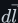<!--m:d\vec{l}-->. The total equals a
constant times the current <!--m:I_{enc}--> that pierces the loop:

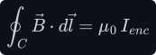

The constant <!--m:\mu_0 \approx 4\pi\times10^{-7}\ \mathrm{H/m}--> is the *permeability of free space*. The law is true for
every loop, but it is only *useful* when symmetry tells you <!--m:B--> is constant along a well-chosen loop.
The coil is such a case. Wind <!--m:N--> turns evenly along a length <!--m:l--> and the fields of neighbouring
turns cancel between the wires and add inside, so (for a long coil) the field inside is strong,
uniform and along the axis, while the field outside is weak and spread out. Take a rectangular loop
with one side of length <!--m:l--> running inside the coil and the opposite side far outside. Only the
inside side contributes (<!--m:B--> times <!--m:l-->): the two short sides cross the field at right angles and
the outside side sits where <!--m:B--> is negligible. The loop is pierced by all <!--m:N--> turns, each carrying
<!--m:I-->, so 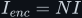<!--m:I_{enc} = NI-->:

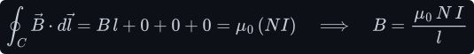

Fill the coil with a magnetic core and the material's own atomic magnets line up with the field and
add to it; this multiplies the result by the core's *relative permeability* <!--m:\mu_r--> (1 for air,
thousands for ferrite), giving 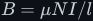<!--m:B = \mu N I/l--> with <!--m:\mu = \mu_0\mu_r-->. So coiling the wire turns
the thin field of one wire into one strong, concentrated field through the core, and that field is
proportional to the current. (The full treatment, with the straight-wire case and worked numbers,
is in [../electromagnetism/electromagnetism.md §4–§5](../electromagnetism/electromagnetism.md#4-where-b-comes-from--ampere-and-biot-savart).)

That magnetic field is where an inductor keeps its energy. Its size,
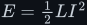<!--m:E = \tfrac{1}{2}LI^2-->, needs the inductance <!--m:L-->, which is defined in §2 — the energy formula is
derived at the end of §3. There is no charge sitting anywhere waiting to be released — the energy
lives entirely in the field created by the moving charge (the current). This is the first thing to get straight,
because it is the exact opposite of a capacitor:

> **Note —** An inductor does **not** have two plates and does **not** separate charge. If you
> are picturing charge building up on something, you are picturing a capacitor. An inductor stores
> energy in a *magnetic field made by current*, not in *separated static charge*. The two
> mechanisms are completely different — see [../capacitor/capacitor.md](../capacitor/capacitor.md).

## 2 Faraday's law — where the defining law comes from

The inductor law is not a separate fact about inductors that you have to take on trust. It is
Faraday's law of induction applied to a coil whose magnetic flux is made by its *own* current. This
section builds that law from nothing — flux, Faraday, Lenz — and then derives the inductor law from
it in five short steps. (The full electromagnetic treatment, with worked numbers, is in
[../electromagnetism/electromagnetism.md](../electromagnetism/electromagnetism.md) §3–§9; this is the
part the inductor needs.)

**Magnetic flux — how much field threads the coil.** A magnetic field <!--m:\vec{B}--> (measured in tesla, T)
fills space, but a coil only cares about how much of it passes *through* each of its turns. That
amount is the **magnetic flux** <!--m:\Phi_B-->: add up the component of <!--m:\vec{B}--> perpendicular to a surface,
over the whole area of that surface. For a uniform field crossing a flat area <!--m:A--> at an angle
<!--m:\theta--> to the surface's normal, the integral collapses to a product, and inside a coil the field
runs straight along the axis, perpendicular to each turn (<!--m:\theta = 0-->), so it is simply <!--m:B--> times
the cross-sectional area:

The unit of flux is the **weber** (Wb). Note the last form — a weber is a volt-second, which is the
first hint that flux and voltage are tied together through time:

A coil of <!--m:N--> turns is threaded by that same flux <!--m:N--> times over, once per turn. The total — the flux
counted once for every turn it passes through — is the **flux linkage** <!--m:\lambda-->:

**Faraday's law of induction.** Faraday's discovery is that a magnetic flux produces a voltage in a
coil **only while the flux is changing**. A steady flux, however large, produces nothing. A changing
flux produces an EMF proportional to how fast it changes:

- **<!--m:\mathcal{E}-->** — the **induced EMF** ("electromotive force"), in volts. Despite the name it is not a
  force: it is the work done per coulomb on charge carried once along the wire. The changing flux
  sets up an electric field that *circulates* around it and pushes the free electrons along the
  wire, exactly as a battery's chemistry pushes them. So <!--m:\mathcal{E}--> is a *source* of voltage that
  lives inside the coil, and it exists whether or not a current is flowing — with the terminals
  open you can measure it directly as a voltage across them. It is reckoned positive when it pushes
  charge in the same direction as the coil's reference current <!--m:I--> (the direction that makes
  positive <!--m:\Phi_B--> by the right-hand rule).
- **<!--m:N-->** — the number of turns. Each turn is one loop the flux threads, and each contributes an EMF
  of <!--m:-d\Phi_B/dt-->. The turns are connected in series, so their EMFs add — that is the only reason
  <!--m:N--> is there.
- **<!--m:\Phi_B-->** — the magnetic flux through one turn, in webers, as defined above.
- **<!--m:d\Phi_B/dt-->** — its rate of change, in webers per second. Since <!--m:1\ \mathrm{Wb} = 1\ \mathrm{V\cdot s}-->, a weber
  per second *is* a volt, so the law needs no conversion constant.
- **the minus sign** — Lenz's law, next.

**Lenz's law — the minus sign.** The minus sign says the induced EMF always pushes in the
direction that **opposes the change in flux that produced it**. If the flux through the coil is
rising, the EMF drives charge the way that would make an opposing flux and hold the rise back; if
the flux is falling, the EMF reverses and tries to keep it up. This is not a convention you may
choose; it is energy conservation. If the induced EMF *aided* the change, a rising flux would
cause more current, which would cause more flux, without limit — energy from nothing.

Apply Lenz to a coil carrying its *own* current. When that current rises, its own flux rises, and
the EMF it induces in itself pushes *against* the current — a **back-EMF**. When the current falls,
the back-EMF flips and pushes *with* the current, trying to keep it going. Hold on to that picture;
the derivation below just puts numbers on it.

_Everything in this section is in one picture: the current makes the flux (step 1), the rising flux
induces an EMF that pushes back against the current (Faraday and Lenz), and that push shows up at the
terminals as a voltage drop in the direction of the current — positive where the current enters
(step 5)._

### Deriving the defining law, step by step

**Step 1 — the current makes a flux proportional to itself.** As §1 showed from Ampère's law, a long
coil (a solenoid) of <!--m:N--> turns wound along a length <!--m:l-->, carrying current <!--m:I-->, has a uniform field
inside:

Here <!--m:\mu--> is the permeability of whatever fills the coil — <!--m:\mu_0 \approx 4\pi\times10^{-7}\ \mathrm{H/m}--> for air,
times the relative permeability <!--m:\mu_r--> (thousands, for a ferrite core).

**Step 2 — so the flux is proportional to the current.** Multiply by the cross-sectional area <!--m:A-->:

Every factor in front of <!--m:I--> — <!--m:\mu-->, <!--m:N-->, <!--m:A-->, <!--m:l--> — is fixed by how the coil is built. Double the
current and you double the flux; that proportionality is the whole basis of inductance.

**Step 3 — name the constant: that is the inductance.** Multiply both sides by <!--m:N--> to get the flux
linkage. It is a constant times <!--m:I-->, and that constant is what we *define* as the inductance <!--m:L-->:

The current cancels out of <!--m:L-->: it depends only on the geometry (<!--m:N-->, <!--m:A-->, <!--m:l-->) and the core
material (<!--m:\mu-->). This is what "a constant fixed by geometry alone" means in §3. The definition
<!--m:N\Phi_B = LI--> is general — a toroid, a gapped ferrite core or a single loop each has its own formula
for <!--m:L-->, but every one of them satisfies <!--m:N\Phi_B = LI-->; the solenoid is just the case where the
formula is easiest to see. It also gives the henry a second meaning: <!--m:1\ \mathrm{H} = 1\ \mathrm{Wb/A}-->, one weber-turn
of linkage per ampere.

**Step 4 — substitute into Faraday's law.** Now let the current change with time. Start from
Faraday, move the constant <!--m:N--> inside the derivative, replace <!--m:N\Phi_B--> by <!--m:LI--> (step 3), and move the
constant <!--m:L--> back out:

The last move — pulling <!--m:L--> out of the derivative — is only allowed because <!--m:L--> is a constant. That
is a real assumption, and it is worth stating plainly: **the geometry is fixed** (the coil is not
being stretched or its core pulled out) and **the core is not saturated** (so <!--m:\mu-->, and with it <!--m:L-->,
does not change with the current; see §8). Under those conditions <!--m:N\Phi_B = LI--> holds at *every
instant*, and two quantities equal at every instant have equal rates of change.

Read the result with Lenz in mind: when <!--m:I--> is rising (<!--m:dI/dt > 0-->), <!--m:\mathcal{E}--> is **negative** —
the induced EMF pushes *against* the current. That is the back-EMF, now with a size: exactly
<!--m:L\,dI/dt--> volts.

**Step 5 — from the EMF to the terminal voltage: where the minus sign goes.** This is the step
people get wrong, so slowly. <!--m:\mathcal{E}--> and <!--m:V_L--> are **not the same quantity measured twice**; they
are measured in *opposite senses*:

- <!--m:\mathcal{E}--> is a **push** (a potential *rise*) acting along the direction of the current. Think of
  a battery: going through it from its <!--m:---> terminal to its <!--m:+--> terminal, the potential rises by its
  EMF. An EMF <!--m:\mathcal{E}--> acting from terminal A to terminal B (the current's direction) therefore
  makes B higher than A by <!--m:\mathcal{E}-->:  <!--m:V_B - V_A = \mathcal{E}-->.
- <!--m:V_L-->, in the **passive sign convention** used for every component in this tree (resistor
  included), is the voltage **drop** in the direction of the current — label the terminal where the
  current enters (A) as <!--m:+-->, and <!--m:V_L = V_A - V_B-->.

A rise of <!--m:\mathcal{E}--> from A to B is the same thing as a drop of <!--m:-\mathcal{E}--> from A to B. So:

The minus sign has not been thrown away or "dropped for convenience": it has been *used up*
converting a rise into a drop. Both equations describe the same physics. When the current rises,
<!--m:\mathcal{E} < 0--> (the coil pushes back, from B towards A), and equivalently <!--m:V_L > 0--> (the entry terminal A
sits higher, so the coil *drops* voltage like a resistor, absorbing energy into its field).

**Check it with Kirchhoff.** Kirchhoff's voltage law (KVL) says that **the voltages around any
closed loop of a circuit add up to zero**. The reason is energy conservation: a volt is a joule per
coulomb, so the voltage between two points is the energy a coulomb of charge gains or loses going
between them. A charge carried once around a closed loop ends where it started, at the same
potential, so the gains (EMFs that push it along) must exactly cancel the losses (drops). Now connect an ideal voltage source <!--m:V_s--> straight across an ideal coil, <!--m:+-->
to terminal A. Walk once around the loop: the source's EMF <!--m:V_s--> plus the coil's induced EMF
<!--m:\mathcal{E}--> must add to zero (there is no resistance to drop anything):

The current rises at exactly the rate where the back-EMF cancels the applied voltage — no faster, no
slower — and <!--m:V_L = V_s-->, as the plus-sign law says. A positive applied voltage gives a rising
current; nothing is backwards. (The same sign argument from the field-theory side, and the
integral form of Faraday's law, are in
[../electromagnetism/electromagnetism.md §8–§9](../electromagnetism/electromagnetism.md#8-lenzs-law--the-sign-and-back-emf).)

## 3 The defining law

That is the result of the derivation just completed in §2: Faraday's law of induction, applied to
a coil whose flux is made by its own current, makes the voltage across an inductor proportional to
the rate of change of the current through it:

- **<!--m:V_L-->** — the voltage across the inductor's two terminals ("poles"), in volts (V).
- **<!--m:I_L-->** — the current flowing through it, in amps (A).
- **<!--m:L-->** — the inductance, in henries (H). A constant fixed by geometry and core material alone —
  for a solenoid <!--m:L = \mu N^2 A/l--> (§2, step 3): number of turns, core material, size. Think of it as *stiffness against sudden current changes* — a bigger <!--m:L-->
  means the same voltage produces a slower change of current.

Rearranged for the rate of change:

**The units of the henry.** A natural question: what are the units of <!--m:L-->? Solve the defining law
for it — the ratio of volts to (amps per second) is *defined* as the henry:

Check it forwards — multiply <!--m:L--> (in V·s/A) by <!--m:dI/dt--> (in A/s) and the amps and seconds cancel,
leaving volts:

> **Tip —** This is a good habit for the whole subject: whenever a formula looks unfamiliar,
> cancel the units. If they don't reduce to what the left-hand side claims, you've mis-remembered
> the formula.

**Power, and the energy stored.** First, why voltage times current is power. A volt is a joule per
coulomb (energy per unit charge) and an ampere is a coulomb per second (charge per unit time), so
their product is joules per second — energy per unit time, which is the watt:

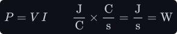

With the passive sign convention, a positive 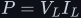<!--m:P = V_L I_L--> means energy flowing *into* the component,
and a negative one means energy flowing *out*. For the inductor, substitute the defining law:

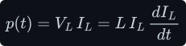

Energy is power added up over time. Start from zero current at 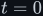<!--m:t = 0--> and let the current reach
<!--m:I-->. Integrating 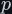<!--m:p--> over time, the factor 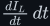<!--m:\frac{dI_L}{dt}\,dt--> is just the small change of current
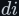<!--m:di-->, so the time integral becomes an integral over the current itself, from 0 to <!--m:I-->:

That is the energy held in the magnetic field of §1. It depends only on the current *now*, not on
how the current got there, and it is handed back as the current falls — which is exactly the
"absorbing power" and "delivering power" of §5. (The same result from the field side, as an energy
density in the core, is in
[../electromagnetism/electromagnetism.md §10](../electromagnetism/electromagnetism.md#10-energy-stored-in-the-magnetic-field).)

## 4 From the law to the ramp — the integral, done slowly

Here is the step that is genuinely easy to lose. We have <!--m:dI_L/dt = V_L/L-->. Suppose <!--m:V_L--> is
**held constant** (this is exactly what happens inside a converter during each switching
interval). Integrate both sides with respect to time, from the moment we start the clock (<!--m:0-->) to
some later time <!--m:t-->:

Two things worth pinning down, because both are common sticking points:

- **This is a *definite* integral, not an indefinite one.** There is no floating "+C" to worry
  about. The left side evaluates to <!--m:I_L(t) - I_L(0)--> by the Fundamental Theorem of Calculus —
  full stop. Nobody is secretly assuming a constant of integration is zero.
- **<!--m:I_L(0)--> is the initial condition** — whatever current was already flowing when you started
  the clock. If you start from zero current it simplifies to <!--m:I_L(t) = (V_L/L) \cdot t-->, but that is a
  *choice of scenario*, not something baked into the maths. Inside a converter in steady state,
  <!--m:I_L(0)--> is genuinely non-zero. The full result is:

With <!--m:V_L--> constant, <!--m:I_L--> is a **straight line** in time. Its slope is <!--m:V_L/L--> and never changes
— so there is no curve, just a ramp.

_The flat cause (<!--m:V_L--> on top) sets the slope of the straight-line effect (<!--m:I_L--> below): double the
voltage and the ramp gets twice as steep. This is <!--m:dI_L/dt = V_L/L--> made visible._

> **Watch out —** If <!--m:V_L--> is **not** constant — say it ramps, <!--m:V_L = k \cdot t--> — then
> <!--m:dI_L/dt = k \cdot t/L-->, and integrating gives <!--m:I_L \propto t^{2}-->, a curve. A straight-line current requires a
> *flat* voltage. And constant current (<!--m:dI/dt = 0-->) requires <!--m:V_L = 0--> — zero volts across the
> inductor, not a steady voltage. Getting this backwards is the most common inductor mistake.

## 5 Polarity, Lenz, and the sign flip

Which terminal is positive? Use the passive-component convention (the same one you use for a
resistor): current flows from the <!--m:+--> terminal to the <!--m:---> terminal *inside* the component.

- **While the current is increasing** (<!--m:dI/dt > 0-->, so <!--m:V_L > 0-->): the entry terminal is <!--m:+--> and
  the exit is <!--m:---> — exactly like a resistor. The inductor is *absorbing* power
  (<!--m:P = V_L I_L > 0-->, §3), and by Lenz's law (§2)
  it generates a back-EMF that opposes the increase.
- **While the current is decreasing** (<!--m:dI/dt < 0-->, so <!--m:V_L < 0-->): the polarity **flips**. Now the
  exit terminal is <!--m:+--> and the entry is <!--m:--->. The inductor is *delivering* power (<!--m:P < 0-->: energy comes back out of the field), acting like a
  battery that pushes current forward using its stored magnetic energy.

_The inductor never commits to a fixed polarity — it takes whatever sign keeps the current
changing smoothly. That reversal, the exit terminal jumping above the entry, is literally how a
boost converter pushes its output above the input._

> **Tip —** Remember this reversal. It is not a curiosity — it is the mechanism of the
> [boost converter](../../dc-dc-converters/boost/boost.md). When the switch opens and the current
> starts to fall, the inductor's voltage flips and *adds on top of* the input.

## 6 At the poles

At the two terminals, current flows **straight through the coil the entire time** — nothing is
blocked. The "storage" is not a dammed-up path; it is the magnetic field surrounding the wire,
which grows and shrinks as the current changes.

_Charge travels all the way through, terminal A to terminal B, while the B-field pulses. Contrast
this with a capacitor, where no charge ever crosses the gap — see
[../capacitor/capacitor.md §5](../capacitor/capacitor.md#5-at-the-poles)._

## 7 The inductive kick, and why the diode is there

Because voltage is proportional to <!--m:dI/dt-->, forcing the current to change *infinitely fast* would
demand an *infinite* voltage. So what happens if you simply open a switch in series with an
inductor, breaking its current path outright?

The inductor "tries" to keep its current flowing and, denied any path, generates a huge voltage
spike — in an idealised model, unboundedly large. This is the **inductive kick** (or "flyback"):
it is exactly how an old car ignition coil makes tens of thousands of volts from a 12 V battery,
and exactly why every relay or motor driven by a transistor needs a *flyback diode* across it.

> **Watch out —** In a buck or boost converter this is precisely what the **diode** (or the
> second MOSFET in a synchronous design) prevents. A *diode* is a one-way valve for current: it
> conducts in one direction and blocks the other (see
> [../../rectifiers/half-wave.md §1](../../rectifiers/half-wave.md#1-what-a-diode-is-and-its-iv-curve)).
> A *MOSFET* is a transistor used as a voltage-controlled switch: a voltage on its gate turns the
> path between its other two terminals fully on or fully off (see
> [../../dc-ac-inverters/h-bridge/h-bridge.md §5](../../dc-ac-inverters/h-bridge/h-bridge.md#5-the-mosfet-as-a-switch)). The instant the switch opens, the diode gives
> the inductor's current an alternate path within nanoseconds. The current itself never stops —
> only its *slope* changes abruptly, from ramping up to ramping down, making a sharp kink in the
> triangle wave. A kink is finite and fine; a *broken path* is what causes the dangerous spike.

## 8 What this costs you

- **An inductor resists changes you might *want* to be fast.** The same stiffness that smooths a
  converter's current also limits how quickly the circuit can respond to a load step.
- **Real inductors are not ideal.** This document assumes a pure <!--m:L--> in henries. Real parts also
  have winding resistance (I²R loss), a saturation current above which <!--m:L--> collapses, and core
  losses that rise with frequency — which is why a real design never just plugs into the ideal
  formula and stops.
- **The kick is always lurking.** Any time an inductor's current path can be interrupted, you must
  provide a freewheeling path or pay for it in arcs and dead transistors (§7).

## 9 Sources and cross-links

- **Where the law comes from, in full:**
  [../electromagnetism/electromagnetism.md](../electromagnetism/electromagnetism.md) — flux and the
  weber (§3), Ampère and the solenoid field (§4–§5), Faraday (§6), Lenz and back-EMF (§8), and
  self-inductance (§9), with worked numbers; §2 here is the condensed path through them.
- **Mirror law:** [../capacitor/capacitor.md](../capacitor/capacitor.md) — the capacitor obeys
  <!--m:I_C = C \cdot dV/dt-->, the same equation with <!--m:V \leftrightarrow I--> and <!--m:L \leftrightarrow C--> swapped.
- **Where the ramp is used:**
  [../../dc-dc-converters/buck/buck.md](../../dc-dc-converters/buck/buck.md) and
  [../../dc-dc-converters/boost/boost.md](../../dc-dc-converters/boost/boost.md) — each switching
  interval is one constant-<!--m:V_L--> ramp from §4.
- Style and figure conventions: [../../STYLE.md](../../STYLE.md).
