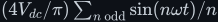
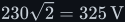
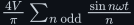
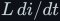
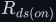
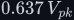

# Signals — edges, Fourier series, AC and RMS

The language every switching circuit in this tree is described in: what an edge is and why its
speed matters, how any repeating waveform breaks down into sines (Fourier series), and what the
"230 V" on a mains socket actually measures. Two documents, ten figures (20–29).

> **The thesis in one line**
>
> A switched waveform is a sum of sines whose amplitudes the circuit sets. An H-bridge into a lamp
> gives <!--m:(4V_{dc}/\pi)\sum_{n\ \text{odd}} \sin(n\omega t)/n--><!--/m-->. Mains is quoted by the RMS of its sine,
> so 230 V means a peak of <!--m:230\sqrt2 = 325\,\mathrm{V}--><!--/m-->.

## Documents

| Document | Result | What it covers |
|---|---|---|
| [edges-and-fourier.md](edges-and-fourier.md) | <!--m:\tfrac{4V}{\pi}\sum_{n\ \text{odd}}\tfrac{\sin n\omega t}{n}--><!--/m--> | rising and falling edges, 10–90 % rise time, slew rate, why real edges are finite (gate charge, parasitic C, loop L), the <!--m:C\,dv/dt--><!--/m--> and <!--m:L\,di/dt--><!--/m--> consequences; Fourier series from scratch with orthogonality derived; the square wave derived, Gibbs, Parseval, THD of 48.3 %; **the H-bridge output as a Fourier series** with lamp resistance, <!--m:R_{ds(on)}--><!--/m-->, dead time / quasi-square angle <!--m:\alpha--><!--/m--> and edge speed as variables (figs 20–26) |
| [ac-and-rms.md](ac-and-rms.md) | <!--m:V_{rms} = V_{pk}/\sqrt2--><!--/m--> | sinusoid, period, phase; signed average 0, rectified average <!--m:0.637\,V_{pk}--><!--/m-->; RMS defined by equal heating and derived for a sine; why 230 V peaks at 325 V; square and triangle RMS; is SA mains really a sine (flat-topping, NRS 048-2, ±10 %, 8 % THD); true-RMS versus average-responding meters (figs 27–29) |

## Reading order

1. [ac-and-rms.md](ac-and-rms.md) first if the 325 V question is what brought you here. It needs
   nothing beyond a sine and an integral.
2. [edges-and-fourier.md](edges-and-fourier.md) next. It uses the RMS result in its power-per-harmonic
   section and is the foundation for [../../pwm/](../../pwm/),
   [../../dc-ac-inverters/spwm/](../../dc-ac-inverters/spwm/) and
   [../../filters/lc-filter/](../../filters/lc-filter/).

## Links

- Parent index: [../README.md](../README.md)
- Style guide: [../../STYLE.md](../../STYLE.md)
- The two laws behind edge behaviour: [../inductor/inductor.md](../inductor/inductor.md),
  [../capacitor/capacitor.md](../capacitor/capacitor.md)
- Where the square wave comes from: [../../dc-ac-inverters/h-bridge/](../../dc-ac-inverters/h-bridge/)
