# AC and RMS — why 230 V mains peaks at 325 V

The video's slide shows a 230 V socket next to a sine wave that clearly peaks at **325 V**, with
dashed lines at 325, 230 and −325. So what is the 230 measuring, if not the height? Is it the
average height under the curve? And is the mains wave really an exact sine? This document answers
all three from first principles, with South Africa's 230 V, 50 Hz supply as the running example.

**Contents**

1. [The sinusoid — amplitude, frequency, phase](#1-the-sinusoid--amplitude-frequency-phase)
2. [Averages — why "average height" gives the wrong number](#2-averages--why-average-height-gives-the-wrong-number)
3. [RMS — defined by equal heating](#3-rms--defined-by-equal-heating)
4. [Why 230 V peaks at 325 V](#4-why-230-v-peaks-at-325-v)
5. [RMS of other waveforms](#5-rms-of-other-waveforms)
6. [Why everything is quoted in RMS](#6-why-everything-is-quoted-in-rms)
7. [Is mains really a sine wave?](#7-is-mains-really-a-sine-wave)
8. [Measuring it — true-RMS and average-responding meters](#8-measuring-it--true-rms-and-average-responding-meters)
9. [What this costs you](#9-what-this-costs-you)
10. [Sources and cross-links](#10-sources-and-cross-links)

> **The thesis in one line**
>
> 230 V is neither the height of the mains wave nor its average height. It is the **root-mean-square**
> value: the steady DC voltage that would heat a resistor equally. For a sine that is the peak
> divided by root two, so 230 V mains swings to plus and minus 325 V:

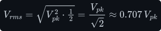

---

## 1 The sinusoid — amplitude, frequency, phase

An AC voltage, in its ideal form, is a sine wave in time:

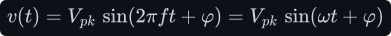

There are three numbers in this formula, and each has a job:

- **<!--m:V_{pk}-->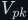<!--/m-->, the peak (amplitude).** This is the highest voltage the wave reaches. The sine function
  swings between <!--m:-1--><!--/m--> and <!--m:+1--><!--/m-->, so <!--m:v--><!--/m--> swings between <!--m:-V_{pk}--><!--/m--> and <!--m:+V_{pk}--><!--/m-->. The full swing from
  bottom to top, <!--m:V_{pp} = 2V_{pk}-->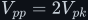<!--/m-->, is the **peak-to-peak** value.
- **<!--m:f--><!--/m-->, the frequency, in hertz (cycles per second).** One full cycle takes the **period**
  <!--m:T = 1/f-->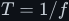<!--/m-->. The **angular frequency** <!--m:\omega = 2\pi f--><!--/m--> measures the same rate in radians per
  second, because one cycle of a sine is <!--m:2\pi--><!--/m--> radians. For South Africa's 50 Hz mains:

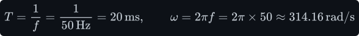

- **<!--m:\varphi--><!--/m-->, the phase.** This slides the wave left or right in time. It does not change the
  shape. A phase of <!--m:\varphi--><!--/m--> radians is the same as a time shift of a fraction <!--m:\varphi/2\pi-->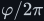<!--/m--> of
  a period:

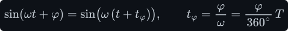

  Phase only matters when comparing *two* waveforms, for example a voltage and the current it
  drives, or the three phases of a 400 V three-phase supply, which are <!--m:120^\circ--><!--/m--> apart. For a
  single waveform you can always choose <!--m:t = 0--><!--/m--> so that <!--m:\varphi = 0--><!--/m-->.

## 2 Averages — why "average height" gives the wrong number

The natural first guess, and the user's own guess on seeing the 325 V peak, is that 230 V is
some kind of *average height* of the wave. That is a good instinct, because an average is indeed
involved. But averaging the voltage itself gives the wrong number, and the reason is worth seeing.

The average (mean) of any signal over one period is its area divided by the period:

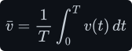

**The signed average of a sine is exactly zero.** The positive half-cycle and the negative
half-cycle have equal area and opposite sign:

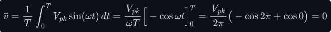

So the "average height" of mains, counting below the axis as negative, is **0 V**. That cannot be
what 230 V means. It is still a real and useful fact. It is why a DC voltmeter on mains reads zero,
and why a transformer, which only passes *changing* flux, needs a waveform with zero average.

**The rectified average is 0.637 of the peak.** Flip the negative half up (take <!--m:|v|-->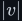<!--/m-->) and average
that instead. A half-cycle is enough, because every half-cycle of <!--m:|v|--><!--/m--> is identical. In angle
(<!--m:\theta = \omega t--><!--/m-->, half-cycle <!--m:0--><!--/m--> to <!--m:\pi--><!--/m-->):

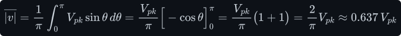

This *is* the literal "average height of the area underneath the curve", and it is **207 V**, not
230 V. So the guess was close in spirit, but the number does not match. What 230 V actually
measures is the average of something else: the **power**.

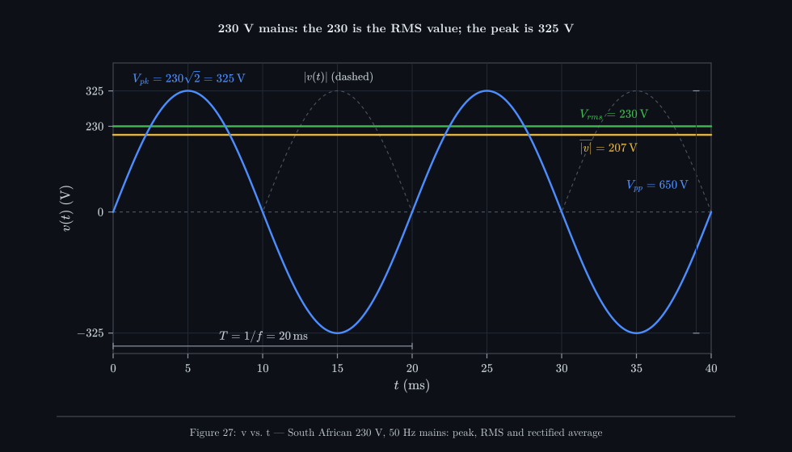

_Three different "sizes" of the same wave. The peak is 325 V. The rectified average height is
207 V. The RMS value, the one printed on the socket, is 230 V and sits between them. The signed
average is zero._

## 3 RMS — defined by equal heating

Here is the definition that actually matters. Connect a resistor <!--m:R--><!--/m--> (a kettle element, a lamp
filament) to a voltage <!--m:v(t)-->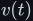<!--/m-->. At each instant it dissipates power:

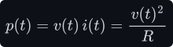

The element's temperature responds to the *average* of that power over many cycles:

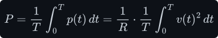

**Definition.** The **RMS value** of <!--m:v(t)--><!--/m--> is the steady DC voltage that would deliver the same
average power to the same resistor. Set <!--m:V_{dc}^2/R--><!--/m--> equal to the average power above. The <!--m:R--><!--/m-->
cancels, so the definition doesn't depend on which resistor you pick:

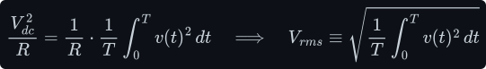

Read the name right to left and it is the recipe: **square** the voltage, take the **mean** of the
square, then take the square **root**. Root-mean-square.

> **Note —** Why square? Because heating goes as <!--m:v^2--><!--/m-->. A negative voltage heats a resistor
> exactly as much as a positive one, since current flows the other way but the element gets just as
> hot. Squaring makes both halves count as positive. It also weights large voltages more heavily
> than small ones, exactly as heating does: twice the voltage gives four times the power. A plain
> average of <!--m:|v|--><!--/m--> misses this weighting, which is why it comes out low (207 V instead of 230 V).

**Deriving it for a sine.** We need the mean of <!--m:v^2 = V_{pk}^2 \sin^2\theta-->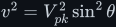<!--/m-->, so the job is the
mean of <!--m:\sin^2\theta-->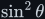<!--/m-->. The trick is the double-angle identity. Start from
<!--m:\cos 2\theta = \cos^2\theta - \sin^2\theta-->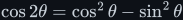<!--/m--> and replace <!--m:\cos^2\theta--><!--/m--> with <!--m:1 - \sin^2\theta-->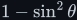<!--/m-->:

This rewrites <!--m:\sin^2\theta--><!--/m--> as a constant <!--m:\tfrac12-->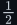<!--/m--> minus a cosine at *twice* the frequency. Over
a full cycle that cosine averages to zero (it is a pure oscillation), leaving only the constant:

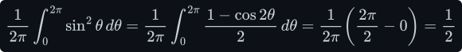

The mean of <!--m:\sin^2-->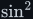<!--/m--> is **exactly one half**. Take the square root of <!--m:V_{pk}^2 \cdot \tfrac12-->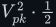<!--/m-->:

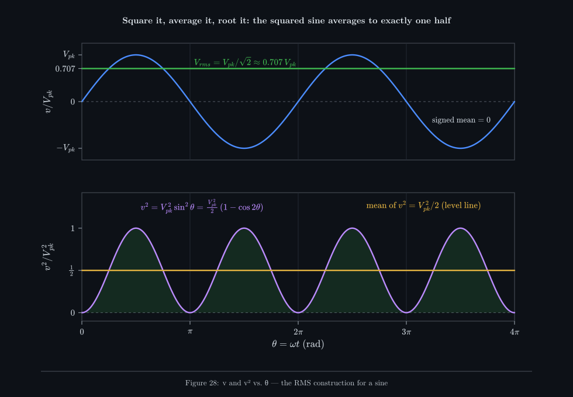

_Bottom: the squared sine swings between 0 and 1 around a constant one half. The humps above one
half are exactly the shape of the troughs below it, so they fill them in. Its mean is therefore one
half, and the root of one half is 0.707._

## 4 Why 230 V peaks at 325 V

Run the result backwards. Mains is specified as 230 V **RMS**, so its peak is:

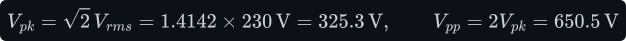

That is the whole answer to the slide. The 230 V is the heating-equivalent value. The wave itself
swings from +325 V to −325 V, a 650 V excursion, 50 times a second. A 230 V DC supply and the 325 V
peak sine would boil a kettle in exactly the same time.

To make that concrete, take a 2 kW kettle. Its element resistance follows from the RMS rating, and
its instantaneous power pulses:

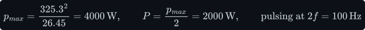

The element is actually pulsed between 0 W and 4 kW, a hundred times a second, and averages 2 kW.
The water's thermal mass smooths that out completely. A lamp filament smooths it nearly completely,
which is why incandescent bulbs on 50 Hz mains flicker faintly at 100 Hz.

> **Watch out —** The peak, not the RMS, is what stresses insulation and what a capacitor-input
> rectifier charges up to. Rectify 230 V mains into a capacitor and you get about **325 V DC**, not
> 230 V (see [../../rectifiers/](../../rectifiers/)). Allowing for the +10 % supply tolerance (§7),
> that peak can reach 358 V, which is why mains-input supplies use 400 V-rated bulk capacitors.

## 5 RMS of other waveforms

The definition works for any shape. Here are the two that matter most in power electronics.

**Square wave, ±V.** Squaring removes the sign, so <!--m:v^2--><!--/m--> is the same at every instant:

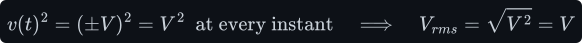

A ±12 V square wave from an H-bridge has an RMS of exactly 12 V. Its peak and RMS are equal, and a
lamp glows as brightly on it as on 12 V DC (see
[edges-and-fourier.md §8](edges-and-fourier.md#8-the-h-bridge-output-as-a-fourier-series)).

**Triangle wave, ±V.** By symmetry one quarter-period is enough, where <!--m:v--><!--/m--> rises linearly from 0 to
<!--m:V--><!--/m-->:

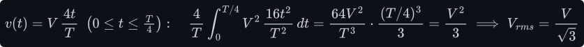

The triangle spends most of its time at small voltages, so its RMS, <!--m:V/\sqrt3 \approx 0.577\,V-->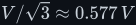<!--/m-->, is
lower than a sine's.

Two ratios summarise a waveform's shape. The **crest factor** (CF) is peak over RMS, telling you how
"spiky" a waveform is. The **form factor** (FF) is RMS over rectified average, which matters for
meters in §8:

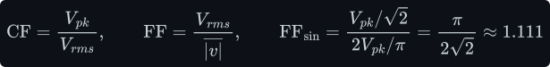

| Waveform (peak V) | Signed average | Rectified average | RMS | Crest factor | Form factor |
|---|---|---|---|---|---|
| DC | <!--m:V--><!--/m--> | <!--m:V--><!--/m--> | <!--m:V--><!--/m--> | 1 | 1 |
| Sine | 0 | <!--m:0.637\,V-->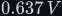<!--/m--> | <!--m:0.707\,V-->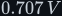<!--/m--> | <!--m:\sqrt2 \approx 1.414-->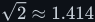<!--/m--> | 1.111 |
| Square (±V) | 0 | <!--m:V--><!--/m--> | <!--m:V--><!--/m--> | 1 | 1 |
| Triangle (±V) | 0 | <!--m:0.5\,V-->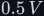<!--/m--> | <!--m:0.577\,V-->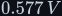<!--/m--> | <!--m:\sqrt3 \approx 1.732-->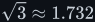<!--/m--> | 1.155 |

**RMS of a waveform with harmonics.** For a waveform with harmonics, Parseval's theorem
([edges-and-fourier.md §7](edges-and-fourier.md#7-reading-a-spectrum--gibbs-parseval-and-thd)) says
the total mean square is the sum of each harmonic's mean square. The RMS values therefore add like
the sides of a right-angled triangle:

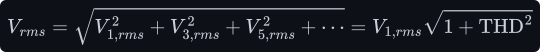

For real mains at 5 % THD, the RMS is only <!--m:\sqrt{1 + 0.05^2} = 1.00125--><!--/m--> times the fundamental's.
Distortion barely changes the RMS, but as §7 shows, it changes the *peak* noticeably.

## 6 Why everything is quoted in RMS

Engineers quote AC voltages and currents in RMS, almost never as peaks, because RMS makes AC power
calculations look exactly like DC ones:

- **Power formulas carry over unchanged.** <!--m:P = V_{rms}^2/R = I_{rms}^2 R = V_{rms} I_{rms}--><!--/m--> for a
  resistor, with no stray factors of <!--m:\tfrac12--><!--/m-->. A "230 V, 2 kW" kettle and a "230 V, 60 W" lamp can
  be compared directly.
- **Heating is what limits most equipment.** Wire, fuses, transformer windings and resistors all
  fail by overheating, and heating follows RMS. A cable's current rating is an RMS rating.
- **Waveform independence.** RMS is defined for any shape, so a square-wave inverter, a sine and DC
  can be compared on one scale. A 12 V RMS square wave and 12 V DC deliver identical power to a lamp.

The cost is that the peak is hidden. Anything that breaks down at a voltage rather than heating up
(insulation, capacitors, semiconductor ratings) must be checked against the peak, <!--m:\sqrt2-->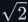<!--/m--> times
higher for a sine.

## 7 Is mains really a sine wave?

Close, but not exactly. It starts almost perfect and is then bent by what we plug into it.

**Generators make near-sinusoids by design.** South Africa's grid is fed mainly by Eskom's large
synchronous generators. In a two-pole machine one revolution produces one electrical cycle, so
50 Hz means 3000 rpm:

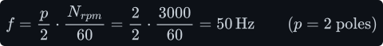

The voltage induced in a stator winding follows the shape of the magnetic field sweeping past it
(Faraday's law, [../electromagnetism/](../electromagnetism/)). Machine designers shape that field
and spread each winding over several slots, with the coil span slightly short of a full pole pitch
("distributed, short-pitched windings"). This cancels most of the field's harmonics, so the
generated EMF is a sine to within a few percent. The 50 Hz itself is held by matching total
generation to total demand. In normal operation the national system operator keeps the frequency
within a fraction of a hertz of 50 Hz.

**Nonlinear loads bend it.** A resistor draws current proportional to voltage, a perfect sine
current for a sine voltage. Most modern electronics does not. Every phone charger, laptop brick,
television, LED driver and variable-speed drive starts with a rectifier feeding a reservoir
capacitor (see [../../rectifiers/](../../rectifiers/)). The capacitor sits near the peak voltage, so
the diodes conduct only in a short window around each peak, when the mains voltage climbs above the
capacitor's. The current arrives as tall, narrow pulses.

Those pulses flow through the network's impedance (transformers, lines, cables) and drop voltage
across it, *but only at the peaks*. Millions of such loads, all pulling at the same instant of every
half-cycle, shave the tops off the voltage wave. Real mains is **flat-topped**. The distortion is
mostly 3rd, 5th and 7th harmonic, with the 5th usually dominant on the public network.

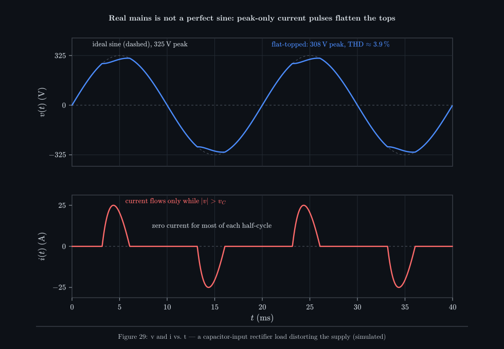

_A simulation of one lumped capacitor-input load behind a source resistance. Current flows only
while the supply exceeds the capacitor voltage, and the voltage drop during those pulses flattens
the peak from 325 V to about 308 V. The illustrative values are exaggerated to make the effect
visible._

**South Africa's numbers.** Supply quality in South Africa is specified by **NRS 048-2** (*Quality of
supply, Part 2: Voltage characteristics, compatibility levels, limits and assessment methods*):

- **Voltage:** standard low-voltage supply 230 V single-phase (400 V between phases), within
  **±10 %** at the customer's point of supply:

- **Frequency:** 50 Hz nominal.
- **Harmonics:** a voltage **THD compatibility level of 8 %** on LV and MV networks, with
  individual-harmonic levels (largest for the 5th, at about 6 %). These follow the IEC 61000-2-2
  compatibility levels. Typical measured LV THD is a few percent, highest in the evening when
  household electronics load peaks.

So the honest answer to "is 230 V, 50 Hz in South Africa an exact sine?" is: **no, but close.** It
is a sine distorted by a few percent, flattened at the top, with its RMS anywhere from 207 V to
253 V and its peak correspondingly between about 293 V and 358 V (lower still when flat-topped).
Equipment is designed for exactly this envelope.

> **Note —** An inverter that drives appliances (the subject of
> [../../dc-ac-inverters/spwm/](../../dc-ac-inverters/spwm/)) is held to the same standard in
> spirit. Its output should be within the voltage tolerance and well under 8 % THD. A plain square
> wave (48 % THD) or a "modified sine" (also 48 %) is far outside it. A properly filtered SPWM
> output can be cleaner than the grid itself.

## 8 Measuring it — true-RMS and average-responding meters

A multimeter on its AC-volts range has to turn a moving waveform into one number, and there are two
ways to do it.

**Average-responding meters** (most cheap ones) rectify the signal, measure the rectified average
<!--m:\overline{|v|}-->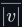<!--/m--> (easy with a diode and a capacitor), and multiply by the *sine* form factor so the
display reads RMS **for a sine**:

That factor of 1.111 is only right for a pure sine. Point the same meter at anything else and it is
wrong:

An average-responding meter on a "modified sine" inverter reads **181 V** when the true RMS is
**230 V**. Many people have concluded that their inverter is faulty from exactly this reading.

**True-RMS meters** compute the definition directly. They sample the waveform fast, square, average
and root (or use an analogue RMS converter chip). They read correctly for any shape, within two
limits printed on the datasheet: a **bandwidth** (harmonics above it are missed) and a maximum
**crest factor** (spikier waveforms overload the input stage). For flat-topped mains, either meter
type reads within about 1 % (the shape is close to a sine). For inverter outputs, rectifier
currents or anything switched, use true RMS.

## 9 What this costs you

- **RMS hides the peak.** Quoting 230 V invites the mistake of choosing 250 V-rated parts for a
  circuit that sees up to 358 V peaks. Every voltage-stress check must use <!--m:\sqrt2 \times V_{rms}-->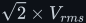<!--/m-->,
  plus the supply tolerance, plus any surges.
- **The root-two factor is sine-only.** <!--m:V_{pk} = \sqrt2\,V_{rms}-->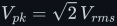<!--/m--> and the 1.111 form factor hold only for a
  pure sine. For a square wave peak equals RMS. For flat-topped mains the peak is a few percent
  below <!--m:\sqrt2 \times V_{rms}--><!--/m-->. For a modified sine they hold for neither the meter nor the peak.
  Know your waveform before using the factors.
- **Rectifier loads pay for the distortion they cause.** A capacitor-input rectifier on flat-topped
  mains charges to a lower peak, so the DC bus it feeds is a few percent lower than the 325 V ideal.
  The tall current pulses also mean an RMS current far above the average, and that RMS current heats
  every wire and fuse upstream.
- **"Average" is ambiguous.** The signed average (0 V), the rectified average (207 V) and the RMS
  (230 V) are three different numbers for one waveform. Always say which one you mean.

## 10 Sources and cross-links

- **The companion document:** [edges-and-fourier.md](edges-and-fourier.md). It covers harmonics,
  Parseval, THD, and the square-wave and quasi-square-wave (modified sine) spectra used above.
- **Where the peak matters:** [../../rectifiers/](../../rectifiers/) (325 V DC bus,
  capacitor-input current pulses) and [../transformer/](../transformer/) (why AC is needed at all).
- **Generating 230 V RMS from a battery:** [../../dc-ac-inverters/h-bridge/](../../dc-ac-inverters/h-bridge/),
  [../../dc-ac-inverters/spwm/](../../dc-ac-inverters/spwm/), [../../pwm/](../../pwm/) and
  [../../filters/lc-filter/](../../filters/lc-filter/).
- **The field law behind the generator:** [../electromagnetism/](../electromagnetism/).
- **Standards:** NRS 048-2, *Electricity supply — Quality of supply, Part 2: Voltage
  characteristics, compatibility levels, limits and assessment methods* (South Africa; check the
  current edition for exact limits). IEC 61000-2-2, *Compatibility levels for low-frequency
  conducted disturbances in public low-voltage power supply systems*. SANS 1019, *Standard voltages,
  currents and insulation levels for electricity supply*.
- Source video: *DC_to_AC_1.mp4* at 0:36 (the DC 12 V and AC 230 V slide with the ±325 V sine).
- Style and figure conventions: [../../STYLE.md](../../STYLE.md).
