# Edges and Fourier series — every switched waveform is a sum of sines

Every circuit in this tree switches. A buck converter chops its input, an H-bridge flips a battery
back and forth across a lamp, and a PWM inverter does both thousands of times per cycle. Each switch
transition is an **edge**. Edges have a speed, and that speed has consequences. The square waves that
edges build turn out to be sums of plain sine waves. That one fact, the **Fourier series**, explains
why an H-bridge's square output makes a lamp glow, why it makes a transformer hum and run hot, and why
the PWM and SPWM documents later in this tree go to such lengths to shape it. This document builds
the maths from nothing. You only need to know what a sine wave and an integral are.

**Contents**

1. [What an edge is](#1-what-an-edge-is)
2. [Why real edges are not vertical](#2-why-real-edges-are-not-vertical)
3. [Why steep edges matter — C dv/dt and L di/dt](#3-why-steep-edges-matter--c-dvdt-and-l-didt)
4. [The Fourier idea — building shapes out of sines](#4-the-fourier-idea--building-shapes-out-of-sines)
5. [Orthogonality — the trick that makes it work](#5-orthogonality--the-trick-that-makes-it-work)
6. [The square wave, derived](#6-the-square-wave-derived)
7. [Reading a spectrum — Gibbs, Parseval and THD](#7-reading-a-spectrum--gibbs-parseval-and-thd)
8. [The H-bridge output as a Fourier series](#8-the-h-bridge-output-as-a-fourier-series)
9. [Why the harmonics matter downstream](#9-why-the-harmonics-matter-downstream)
10. [What this costs you](#10-what-this-costs-you)
11. [Sources and cross-links](#11-sources-and-cross-links)

> **The thesis in one line**
>
> Any repeating waveform, however square, is exactly a sum of sines at whole-number multiples of its
> frequency. An ideal H-bridge driving a lamp produces the series below. Every real-world detail
> (MOSFET on-resistance, dead time, edge speed) only scales or reshapes those amplitudes:

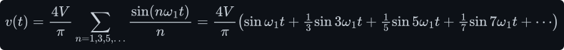

---

## 1 What an edge is

An **edge** is the moment a signal jumps from one level to another. A jump upward, for example from
0 V to 12 V when a MOSFET turns on, is a **rising edge**. A jump downward is a **falling edge**. A
square wave is nothing more than flat stretches joined by alternating rising and falling edges. The
flat parts carry the energy. The edges carry most of the trouble.

On paper the edge is a perfect vertical line. This is the **ideal step**, written with the unit step
function <!--m:u(t)-->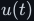<!--/m-->:

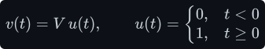

The ideal step goes from 0 to <!--m:V--><!--/m--> in zero time, so its slope <!--m:dv/dt-->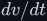<!--/m--> at <!--m:t = 0--><!--/m--> is
**infinite**. No physical voltage can do that, for a reason this whole tree keeps coming back to.
Every real node has some capacitance, and the capacitor law <!--m:i_C = C \, dv/dt-->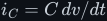<!--/m-->
([../capacitor/capacitor.md](../capacitor/capacitor.md)) says an infinite <!--m:dv/dt--><!--/m--> needs infinite
current. Real edges therefore have a finite **rise time** <!--m:t_r--><!--/m--> (and **fall time** <!--m:t_f--><!--/m-->).

**The 10–90 % rule.** Real edges approach their final value gradually, curving in at the start and
creeping in at the end. That makes "start" and "end" hard to pin down. So by convention the rise time
is measured from the moment the signal crosses **10 %** of its swing to the moment it crosses **90 %**.
The fall time is measured from 90 % down to 10 %. Oscilloscopes measure it this way automatically.

The cleanest worked case is a step driven through a resistance <!--m:R-->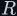<!--/m--> into a capacitance <!--m:C--><!--/m--> (an "RC
edge"). This is roughly what a gate driver charging a MOSFET gate looks like:

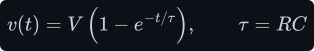

Find the two crossing times by setting <!--m:v--><!--/m--> to 10 % and 90 % of <!--m:V--><!--/m--> and solving for <!--m:t--><!--/m-->:

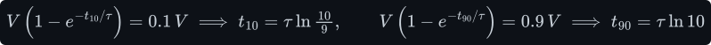

Subtract them. The logarithms combine because <!--m:\ln a - \ln b = \ln(a/b)-->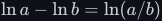<!--/m-->:

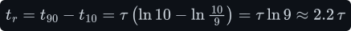

So an RC edge's rise time is about <!--m:2.2\,\tau-->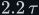<!--/m-->. Differentiating shows the edge is steepest at the
very start, where its slope is <!--m:V/\tau-->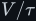<!--/m-->. A straight line at that slope would reach the final value
after exactly one <!--m:\tau-->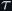<!--/m-->, and that is the tangent drawn in Figure 20:

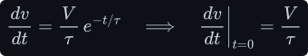

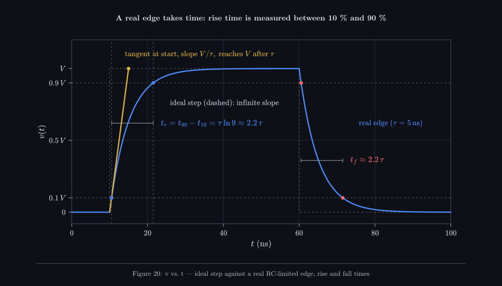

_The dashed ideal step has zero width. The real edge needs about 2.2 time constants to cover the
middle 80 % of its swing, and the same again on the way down._

**Slew rate.** The other way to describe an edge is by its steepness, the **slew rate** (SR), in volts
per second (usually V/ns or V/µs). Over the 10–90 % portion the signal covers <!--m:0.8\,V-->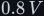<!--/m--> in <!--m:t_r--><!--/m-->:

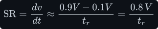

As an example, take the 325 V DC bus of the inverter's second H-bridge, switched in 50 ns:

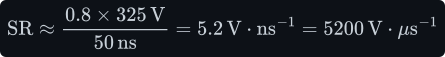

That is 5.2 billion volts per second. The number looks absurd, and it is completely normal for a
modern MOSFET. Its consequences are the subject of §3.

## 2 Why real edges are not vertical

Three physical effects set the speed of a real switching edge. Each one is a capacitor or an
inductor that the edge has to drive.

**Gate charge (the MOSFET's own capacitance).** A MOSFET is turned on by charging its gate, which
is physically a capacitor plate insulated from the channel. The channel only conducts once enough
charge has been pushed onto the gate. The slow part is the **Miller plateau**. While the drain
voltage is swinging, the gate driver has to supply the gate-drain charge <!--m:Q_{gd}-->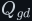<!--/m-->, and the gate
voltage stays flat until it has. With a gate-drive current <!--m:I_g-->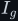<!--/m-->, the drain edge takes roughly:

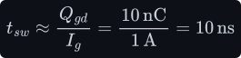

Double the driver current and the edge is twice as fast. That is why gate drivers are rated in amps
even though the gate draws no steady current.

**Parasitic capacitance at the switching node.** The switching node (the H-bridge midpoint, or the
buck's switch node) has capacitance to everything around it. That includes the MOSFETs' own output
capacitance <!--m:C_{oss}--><!--/m-->, the PCB copper, the heatsink and the transformer windings. The current
available to charge it is finite, so by the capacitor law the slew rate is capped:

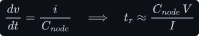

**Inductance in the current loop.** Every wire and PCB trace is a one-turn inductor. A few
centimetres of loop is tens of nanohenries. By the inductor law <!--m:v_L = L \, di/dt--><!--/m-->
([../inductor/inductor.md](../inductor/inductor.md)), current cannot change instantly in it either.
The current edge is slowed, and any attempt to force it fast shows up as a voltage spike (§3).

> **Note —** So the ideal step is not just "very fast". It is physically forbidden, by the same two
> laws that run every converter in this tree. Any real node has some <!--m:C--><!--/m-->, so <!--m:v--><!--/m--> cannot jump. Any
> real loop has some <!--m:L--><!--/m-->, so <!--m:i--><!--/m--> cannot jump. Real edges are the compromise between how hard you
> drive and how much <!--m:L--><!--/m--> and <!--m:C--><!--/m--> is in the way.

## 3 Why steep edges matter — C dv/dt and L di/dt

Fast edges are good for efficiency. While a MOSFET is half-on it carries current and supports voltage
at the same time, and that overlap is pure heat (switching loss). So designers want short edges. But
a steep edge drives the circuit's hidden capacitors and inductors hard, and both answer back.

**Steep dv/dt pushes current through every capacitance.** Take the 5.2 V/ns edge from §1 and a mere
100 pF of stray capacitance. That could be the capacitance between a transformer's primary and
secondary, or from a MOSFET's drain tab to a grounded heatsink:

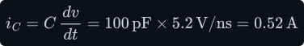

Half an amp flows for the 50 ns of the edge, through a part that is supposed to be an insulator.
It goes wherever the capacitance leads: into the secondary side, into the chassis, into ground.
This is **common-mode noise**. It is why insulation between windings matters at high frequency,
and why a fast edge can falsely trigger a logic input nearby.

**Steep di/dt makes every inductance spike.** When the MOSFET interrupts, say, 10 A in 10 ns, the
20 nH of loop inductance answers with:

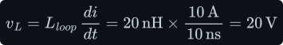

That 20 V adds on top of the supply across the turning-off MOSFET. It is a small cousin of the
inductive kick in [../inductor/inductor.md §6](../inductor/inductor.md#6-the-inductive-kick-and-why-the-diode-is-there).
The loop inductance and the node capacitance then form an LC tank. Kicked by the edge, it **rings**
at its natural frequency:

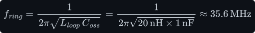

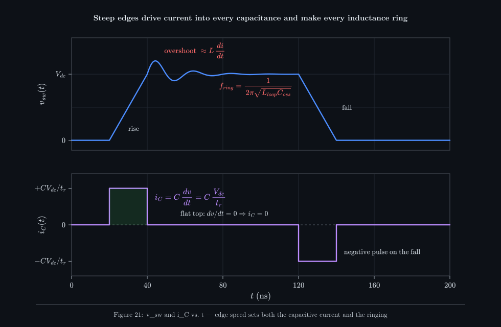

_Top: the overshoot and ringing come from loop inductance and node capacitance. Bottom: current
flows into a capacitance only while the voltage is moving. A flat top draws nothing, and a fast
edge draws a tall pulse._

**The bandwidth of an edge.** An edge also contains high frequencies, and the rise time tells you
how high. An RC network passes frequencies up to its −3 dB corner <!--m:f_{3\mathrm{dB}} = 1/(2\pi\tau)-->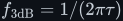<!--/m-->.
Combine that with <!--m:t_r = \tau \ln 9-->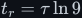<!--/m--> and you get one of the most used rules of thumb in electronics:

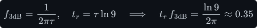

A 50 ns edge carries significant content up to about <!--m:0.35/50\,\mathrm{ns} = 7\,\mathrm{MHz}-->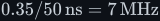<!--/m-->, even
when the waveform repeats at only 50 Hz. To see *why* a fast edge contains high frequencies, we need
the Fourier series.

## 4 The Fourier idea — building shapes out of sines

**Periodic functions.** A signal is **periodic** if it repeats exactly every <!--m:T--><!--/m--> seconds. <!--m:T--><!--/m--> is the
**period**, and its inverse is the **fundamental frequency** <!--m:f_1-->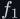<!--/m-->:

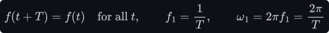

The angular frequency <!--m:\omega_1 = 2\pi f_1-->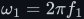<!--/m--> (in radians per second) just counts one full cycle as
<!--m:2\pi--><!--/m--> radians instead of 1. That makes sine waves tidy: <!--m:\sin(\omega_1 t)-->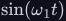<!--/m--> completes exactly one
cycle as <!--m:t--><!--/m--> goes from 0 to <!--m:T--><!--/m-->.

**The claim.** Joseph Fourier's claim (1807) was that *any* reasonable periodic function, square,
triangle, sawtooth or whatever shape, can be written as a sum of sines and cosines whose frequencies
are whole-number multiples of <!--m:f_1--><!--/m-->:

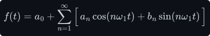

Here is what each piece means:

- **<!--m:a_0--><!--/m-->** is a constant offset, the **DC component**. It is the signal's average value.
- **<!--m:n = 1-->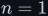<!--/m-->** is the **fundamental**. It repeats at the same rate as the signal itself.
- **<!--m:n = 2, 3, 4, \dots-->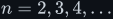<!--/m-->** are the **harmonics**. The <!--m:n--><!--/m-->-th harmonic oscillates <!--m:n--><!--/m--> times per period,
  at frequency <!--m:n f_1-->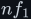<!--/m-->. For 50 Hz the 3rd harmonic is 150 Hz and the 5th is 250 Hz.
- **<!--m:a_n--><!--/m--> and <!--m:b_n--><!--/m-->** are the **coefficients**: *how much* of each cosine and sine the recipe needs.
  Finding them is the whole job.

Only whole-number multiples can appear, and the reason is simple. Every term must itself repeat every
<!--m:T--><!--/m-->, otherwise the sum would not repeat every <!--m:T--><!--/m-->. A sine at <!--m:2.5 f_1-->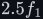<!--/m--> does not fit a whole number of
cycles into <!--m:T--><!--/m-->, so it can't be part of the recipe.

**Why sines and not some other building block?** Because sines are the one shape that linear
circuits leave alone. Differentiate <!--m:\sin\omega t-->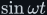<!--/m--> and you get <!--m:\omega \cos\omega t-->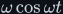<!--/m-->: the same
frequency, just scaled and shifted. Integrate it and the same thing happens. Inductors differentiate
current (<!--m:v = L\,di/dt--><!--/m-->) and capacitors differentiate voltage (<!--m:i = C\,dv/dt-->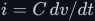<!--/m-->). So a sine going into
any network of R, L and C comes out as **a sine of the same frequency**, only bigger or smaller and
shifted in time. No other waveform has this property. A square wave into an RC filter comes out
rounded. That is a different *shape*, not just a different size. So the strategy is: break any
waveform into sines, push each sine through the circuit separately (easy), and add the results.
That is the whole reason Fourier series run electrical engineering.

## 5 Orthogonality — the trick that makes it work

The series is useless unless we can find the coefficients. The tool is a set of integrals called the
**orthogonality relations**. We derive them from nothing.

**Step 1 — a cosine integrates to zero over whole cycles.** For any non-zero whole number <!--m:k--><!--/m-->,
<!--m:\cos(k\omega_1 t)-->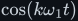<!--/m--> fits exactly <!--m:k--><!--/m--> whole cycles into one period. Its positive humps and negative
troughs cancel:

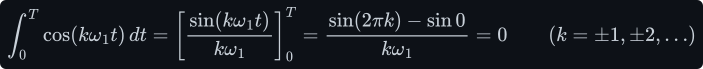

The last step uses <!--m:\omega_1 T = 2\pi-->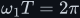<!--/m-->, so <!--m:\sin(k\omega_1 T) = \sin(2\pi k) = 0-->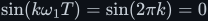<!--/m--> for every whole
number <!--m:k--><!--/m-->. The same argument shows <!--m:\sin(k\omega_1 t)-->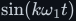<!--/m--> also integrates to zero over a period.

**Step 2 — turn products into sums.** We will need to integrate *products* of two sinusoids. The
trigonometric product-to-sum identities turn a product into a sum of single cosines (or sines), each
of which Step 1 can kill. They come straight from adding and subtracting the angle-sum formulas,
for example <!--m:\cos(A-B) - \cos(A+B) = 2\sin A \sin B--><!--/m-->:

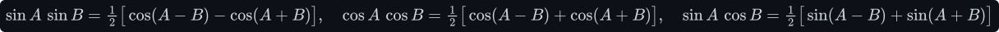

**Step 3 — integrate a product of two harmonics.** Take harmonics <!--m:m--><!--/m--> and <!--m:n--><!--/m--> (both positive whole
numbers). Apply the first identity:

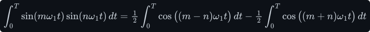

The second integral always vanishes by Step 1, because <!--m:m + n-->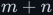<!--/m--> is a non-zero whole number. The first
vanishes too, *unless* <!--m:m = n--><!--/m-->. Then <!--m:m - n = 0--><!--/m-->, the cosine is <!--m:\cos 0 = 1--><!--/m-->, and its integral is
just the length of the interval, <!--m:T--><!--/m-->:

The other two identities give the cosine–cosine and sine–cosine cases the same way:

This is **orthogonality**. Two *different* harmonics multiplied together average to exactly zero.
A harmonic multiplied by *itself* does not. The word comes from geometry. Perpendicular
(orthogonal) vectors have zero dot product, and the integral of a product plays the role of a dot
product for functions.

_Top: a product of two different harmonics swings positive and negative, and the shaded areas cancel
exactly. Bottom: a harmonic times itself is a square, never negative, so it averages to one half and
integrates to half the period._

**Step 4 — use it to extract a coefficient.** Now the payoff. Multiply both sides of the series by
<!--m:\sin(m\omega_1 t)--><!--/m--> for some chosen <!--m:m--><!--/m--> and integrate over one period. On the right-hand side every
term is a product of two sinusoids, and orthogonality kills all of them except the single term where
the harmonic matches:

Solve for <!--m:b_m--><!--/m-->. Repeating the same move with <!--m:\cos(m\omega_1 t)--><!--/m--> gives <!--m:a_m--><!--/m-->, and integrating the
series by itself (multiplying by 1) gives <!--m:a_0--><!--/m-->:

These are the **Fourier coefficient formulas**. Read <!--m:b_n--><!--/m--> in words: *multiply the signal by a test
sine at frequency <!--m:n f_1--><!--/m--> and average*. If the signal contains that sine, the product has a steady
positive part and the average is non-zero. If it does not, the product swings both ways and averages
to zero. A Fourier analyser, from a pencil to a spectrum analyser, is doing exactly this.

> **Tip —** It is often neater to measure time in **angle**, <!--m:\theta = \omega_1 t--><!--/m-->, so one period is
> always <!--m:0--><!--/m--> to <!--m:2\pi--><!--/m--> no matter what <!--m:T--><!--/m--> is. The substitution <!--m:d\theta = (2\pi/T)\,dt--><!--/m--> turns the
> <!--m:b_n--><!--/m--> formula into:

**Two symmetry shortcuts.** Most power-electronics waveforms have symmetries that halve the work.

- **Odd symmetry**, <!--m:f(-\theta) = -f(\theta)--><!--/m-->. The waveform is a mirror image through the origin, as
  a sine is. All the <!--m:a_n--><!--/m--> (and <!--m:a_0--><!--/m-->) vanish and only sines remain, because <!--m:f\cos--><!--/m--> is then odd and
  integrates to zero over a symmetric interval.
- **Half-wave symmetry**, <!--m:f(\theta + \pi) = -f(\theta)--><!--/m-->. The second half-cycle is the first one
  flipped upside down. This is exactly what an H-bridge produces, because it applies <!--m:+V_{dc}--><!--/m--> then
  <!--m:-V_{dc}--><!--/m--> by symmetric switching. Substitute <!--m:\theta = s + \pi--><!--/m--> in the second half of the integral,
  using <!--m:\sin(n(s+\pi)) = (-1)^n \sin ns--><!--/m-->:

For even <!--m:n--><!--/m--> the two halves cancel exactly. **A half-wave-symmetric waveform contains only odd
harmonics.** That is why an H-bridge's output has no 2nd, 4th or 6th harmonic, and why the
interesting numbers below are all 3, 5, 7 and so on.

## 6 The square wave, derived

Now the waveform from the video. An H-bridge flipping <!--m:\pm V--><!--/m--> across a load, with one period
written in angle:

It is odd, so every <!--m:a_n = 0--><!--/m-->. Its average is zero, so <!--m:a_0 = 0--><!--/m-->. Only the <!--m:b_n--><!--/m--> remain. Split the
integral at <!--m:\theta = \pi--><!--/m-->, where the waveform changes sign:

Each piece is an elementary integral, since the antiderivative of <!--m:\sin n\theta--><!--/m--> is
<!--m:-\cos n\theta / n--><!--/m-->. Use <!--m:\cos 2n\pi = 1--><!--/m-->:

Subtracting the second from the first gives twice the first. Then <!--m:\cos n\pi--><!--/m--> is <!--m:+1--><!--/m--> for even <!--m:n--><!--/m-->
and <!--m:-1--><!--/m--> for odd <!--m:n--><!--/m-->, which is written <!--m:(-1)^n--><!--/m-->:

Even harmonics vanish, as the half-wave symmetry promised. Odd harmonics have amplitude
<!--m:4V/(n\pi)--><!--/m-->, falling as <!--m:1/n--><!--/m-->. Put the coefficients back into the series:

**Check it.** At a quarter period, <!--m:t = T/4--><!--/m-->, the square wave is plainly <!--m:+V--><!--/m-->. The series gives
<!--m:\sin(n\pi/2) = +1, -1, +1, -1, \dots--><!--/m--> for <!--m:n = 1, 3, 5, 7, \dots--><!--/m-->. The bracket becomes Leibniz's
famous series for <!--m:\pi/4--><!--/m-->, and the result is exactly <!--m:V--><!--/m-->:

_Top: the building blocks, each odd harmonic at one-<!--m:n--><!--/m-->-th the amplitude of the fundamental.
Bottom: adding them up. One term is a plain sine. Three terms already show flat-ish tops. Nine terms
give steep edges, but there is a stubborn overshoot at every jump._

Notice what the edges need. The fundamental alone has a gentle slope. Each higher harmonic
contributes a steeper and steeper wiggle, and it takes the high harmonics to make the jump sharp.
**A steep edge *is* high-frequency content.** That is the precise sense in which §3's 50 ns edge
"contains" 7 MHz. Section 8 shows that finite rise time gently rolls off the harmonics above about
<!--m:1/(\pi t_r)--><!--/m-->.

## 7 Reading a spectrum — Gibbs, Parseval and THD

**The spectrum.** Plotting each harmonic's amplitude against <!--m:n--><!--/m--> gives the waveform's **spectrum**.
It is the same information as the time plot, sorted by frequency instead of by time. For the square
wave it is a row of bars at odd <!--m:n--><!--/m--> only, falling as <!--m:4V/(n\pi)--><!--/m-->:

_The fundamental stands taller than the square wave itself, at 1.27 V. The harmonics fall slowly, as
<!--m:1/n--><!--/m-->, which is why square waves are "noisy". Their energy reaches far up the frequency axis._

The fundamental's amplitude is <!--m:4/\pi \approx 1.273--><!--/m--> times the square wave's height. That surprises
almost everyone the first time, so it is worth stating plainly: **the best-fitting sine to a ±V
square wave peaks at about 1.27 V, higher than the square wave ever goes.** The harmonics then pull
the tops down flat and push the shoulders up.

**Gibbs overshoot.** Adding more terms makes the partial sum converge to the square wave *everywhere
except right at the jumps*. Next to each jump the partial sum overshoots, and the overshoot does not
shrink as you add terms. It only gets narrower. In the limit it settles at about 9 % of the jump:

(<!--m:\operatorname{Si}--><!--/m--> is the sine integral, <!--m:\operatorname{Si}(x) = \int_0^x \sin u / u \, du--><!--/m-->.) Gibbs
overshoot is a real effect, not a maths curiosity. Any time a sharp edge passes through a system that
cuts off sharply above some frequency (a brick-wall filter, a band-limited amplifier), the edge
comes out with this ringing overshoot.

**Parseval — where the power goes.** Power in a resistor goes as voltage squared. Square the series,
average over a period, and orthogonality kills every cross term between different harmonics. What
survives is the sum of each harmonic's own mean square:

This is **Parseval's theorem**. In words: *the total power is the sum of the powers in each
harmonic*, and harmonics never interfere in their power contribution. For the square wave the mean
square is obviously <!--m:V^2--><!--/m-->, because <!--m:v^2 = V^2--><!--/m--> at every instant. Parseval agrees, which needs the sum
of <!--m:1/n^2--><!--/m--> over odd <!--m:n--><!--/m-->, <!--m:\pi^2/8--><!--/m-->:

The fundamental's share is therefore:

About 81 % of a square wave's power is in the fundamental and 19 % is in the harmonics.

**THD.** **Total harmonic distortion** measures how far a waveform is from a pure sine: the RMS of
all the harmonics together, divided by the RMS of the fundamental. With Parseval, the harmonics'
combined mean square is the total minus the fundamental's:

For the square wave, <!--m:V_{rms} = V--><!--/m--> and <!--m:V_{1,rms} = (4V/\pi)/\sqrt2--><!--/m-->, so:

A square wave has **48.3 % THD**. For comparison, South African mains is allowed at most 8 % (see
[ac-and-rms.md §7](ac-and-rms.md#7-is-mains-really-a-sine-wave)). A square wave is nowhere near
mains quality, and that is the problem the inverter's later stages exist to solve.

## 8 The H-bridge output as a Fourier series

Now the question that started this document: *can an H-bridge be represented as a Fourier series,
with variables for the MOSFET details and the lamp's resistance?* Yes, and every real-world detail
slots in as one more factor on the harmonic amplitudes. We build it up in layers.

_The video's S1 to S4 are drawn here as MOSFETs Q1 to Q4, with the same positions: Q1 top left, Q2
top right, Q3 bottom left, Q4 bottom right. The diagonal pairs Q1 with Q4 and Q2 with Q3 conduct
together. In each half-cycle the lamp current passes through two on-resistances in series with the
filament._

**Layer 1 — the ideal bridge.** Diagonal pairs alternate at 50 Hz. Q1 and Q4 put <!--m:+V_{dc}--><!--/m--> across the
lamp, then Q2 and Q3 put <!--m:-V_{dc}--><!--/m-->. This is exactly the square wave of §6 with <!--m:V = V_{dc}--><!--/m-->:

With the video's 12 V battery:

**Layer 2 — the lamp as a resistance <!--m:R--><!--/m-->.** A resistor obeys Ohm's law at every instant and at every
frequency, so the current is the same series divided by <!--m:R--><!--/m-->. Each harmonic of voltage drives its own
harmonic of current:

The power each harmonic delivers to the lamp is its peak voltage squared over <!--m:2R--><!--/m--> (the factor of 2
because a sine's mean square is half its peak squared, derived in
[ac-and-rms.md §3](ac-and-rms.md#3-rms--defined-by-equal-heating)):

The total is <!--m:V_{dc}^2/R--><!--/m-->, exactly what a DC supply of <!--m:V_{dc}--><!--/m--> would deliver. A lamp's filament
cannot tell a ±12 V square wave from 12 V DC, because its glow depends on heating and <!--m:v^2--><!--/m--> is
<!--m:144\,\mathrm{V}^2--><!--/m--> at every instant either way. Here are the numbers for a 12 V, 24 W lamp (hot
resistance <!--m:R = 12^2/24 = 6\,\Omega--><!--/m-->):

Of the 24 W, 19.45 W is carried by the 50 Hz fundamental. The other 4.55 W arrives at 150 Hz,
250 Hz, 350 Hz and up. The lamp doesn't care. A motor or a transformer does (§9).

**Layer 3 — MOSFET on-resistance.** A conducting MOSFET is not a perfect short. It behaves as a small
resistor <!--m:R_{ds(on)}--><!--/m-->, typically a few milliohms to a few hundred. In each half-cycle the current
passes through **two** of them in series with the lamp (Q1 and Q4, or Q2 and Q3). That makes a
voltage divider:

The divider is purely resistive, so it scales every harmonic by the same factor. The shape and THD
are unchanged, and only the size shrinks:

With <!--m:R_{ds(on)} = 50\,\mathrm{m}\Omega--><!--/m--> and the 6 Ω lamp:

So 98.4 % of the battery's power reaches the lamp, and the switches warm up by 0.39 W between them.

> **Watch out —** The lamp's resistance is not constant. A tungsten filament's cold resistance is
> roughly a tenth of its hot value, so at switch-on the current is around ten times normal for the
> first tens of milliseconds. The Fourier picture assumes steady state, with the filament hot and its
> <!--m:R--><!--/m--> effectively constant over a 20 ms cycle (its thermal time constant is much longer). Size the
> MOSFETs for the cold inrush, not the steady-state 2 A.

**Layer 4 — zero intervals (dead time and the quasi-square wave).** Real bridges do not go straight
from <!--m:+V_{dc}--><!--/m--> to <!--m:-V_{dc}--><!--/m-->. Between turning one diagonal pair off and the other on, the controller
inserts a **dead time**, an interval with all four switches off. Without it, Q1 and Q3 (or Q2 and Q4), the two switches in one leg,
could briefly conduct together and short the supply. This is shoot-through, covered in
[../../dc-ac-inverters/h-bridge/](../../dc-ac-inverters/h-bridge/). With a resistive lamp, all
switches off means no current, so the lamp voltage is **zero** during that interval. Some inverters
also add zero intervals *deliberately*, by turning on both low-side switches, to shape the output.
Either way the waveform becomes a **quasi-square wave**: zero for an angle <!--m:\alpha--><!--/m--> on each side of
every zero crossing.

It is still odd and half-wave symmetric, so only odd sines survive. Use the half-wave formula from
§5. The integrand is non-zero only between <!--m:\alpha--><!--/m--> and <!--m:\pi - \alpha--><!--/m-->:

Expand the second cosine with the angle-difference formula. For odd <!--m:n--><!--/m-->, <!--m:\cos n\pi = -1--><!--/m--> and
<!--m:\sin n\pi = 0--><!--/m-->:

The square-wave amplitudes are simply multiplied by <!--m:\cos(n\alpha)--><!--/m-->. Setting <!--m:\alpha = 0--><!--/m--> recovers
the square wave, as it must. The new factor lets you **choose a harmonic to delete**:

At <!--m:\alpha = 30^\circ--><!--/m--> the 3rd harmonic disappears, and with it every harmonic divisible by 3. The
reason is that <!--m:\cos(3(2k+1) \cdot 30^\circ) = \cos((2k+1) \cdot 90^\circ) = 0--><!--/m-->:

_Top: the quasi-square wave at 30 degrees and its fundamental. Bottom: each harmonic's amplitude as
the zero interval widens. Wherever a curve crosses zero, that harmonic is gone from the output. The
price is a smaller fundamental, which falls as <!--m:\cos\alpha--><!--/m-->._

The RMS of a quasi-square wave follows from its definition (the waveform is <!--m:\pm V_{dc}--><!--/m--> for a
fraction <!--m:(\pi - 2\alpha)/\pi--><!--/m--> of the time and zero otherwise):

and so its THD at <!--m:\alpha = 30^\circ--><!--/m--> is:

Removing the triplen harmonics cuts THD from 48.3 % to 31.1 %. This is the simplest example of
**selective harmonic elimination**, and the seed of the idea behind SPWM: place the switching
instants to put zeros in the spectrum where you want them.

**The "modified sine wave" inverter.** Cheap inverters sold as "modified sine" are quasi-square
waves. They choose <!--m:\alpha--><!--/m--> so that the peak *and* the RMS both match mains, 325 V peak and 230 V RMS:

At <!--m:\alpha = 45^\circ--><!--/m--> the 3rd harmonic is *not* removed (<!--m:\cos 135^\circ = -0.707--><!--/m-->). Working it
through, the THD comes out at 48.3 %, the same as a plain square wave. The modified sine wave fixes
the peak and the RMS. It does not fix the distortion.

**How big is protective dead time, in angle?** Dead time <!--m:t_d--><!--/m--> makes a zero interval of width <!--m:t_d--><!--/m-->
at each transition. In the notation above that interval is <!--m:2\alpha--><!--/m--> wide:

At 50 Hz, protective dead time is spectrally invisible. At the 50 kHz switching of the inverter's
first stage it is a 4.5° zero interval. That trims the fundamental by <!--m:1 - \cos 4.5^\circ \approx 0.3\,\%--><!--/m-->
and starts reshaping the harmonics, so it matters there.

**Layer 5 — finite edges.** The last idealisation is the vertical edge. A trapezoidal wave with rise
time <!--m:t_r--><!--/m--> is a square wave smoothed by a moving average of width <!--m:t_r--><!--/m-->. A moving average multiplies
each harmonic by a <!--m:\sin x / x--><!--/m--> factor. Below the corner <!--m:f_c = 1/(\pi t_r)--><!--/m--> the factor is about 1.
Above it, the harmonics fall as <!--m:1/n^2--><!--/m--> instead of <!--m:1/n--><!--/m-->:

For a 50 ns edge, <!--m:f_c \approx 6.4\,\mathrm{MHz}--><!--/m-->, which is roughly the 127 000th harmonic of 50 Hz.
It is irrelevant to the lamp and decisive for radio-frequency interference.

**Everything together.** Stacking all five layers gives the H-bridge-into-a-lamp output, with every
variable visible:

Each factor is something you can change. Raise <!--m:V_{dc}--><!--/m--> and everything scales. Choose better
MOSFETs and the divider factor approaches 1. Choose <!--m:\alpha--><!--/m--> to place zeros. Slow the edges to tame
the radio-frequency tail, at the cost of switching loss.

## 9 Why the harmonics matter downstream

A lamp is the one load that genuinely doesn't care: heat is heat. Almost everything else in the
inverter chain responds to frequency, so the harmonics of §8 become real costs.

- **Transformers.** Each harmonic adds its own core loss (eddy-current loss per unit of flux rises
  steeply with frequency) and audible hum, so a 50 Hz transformer fed a square wave runs warmer and
  noisier than on a sine of the same RMS. The fast edges also push
  <!--m:C\,dv/dt--><!--/m--> current through the interwinding capacitance (§3), straight into the secondary. And a
  transformer cannot pass the DC offset an asymmetric bridge might produce. See
  [../transformer/](../transformer/) and [../electromagnetism/](../electromagnetism/).
- **Inductive loads (motors, fans).** An inductor's impedance is <!--m:\omega L--><!--/m-->. Harmonic <!--m:n--><!--/m--> has <!--m:1/n--><!--/m--> of
  the fundamental's voltage and meets <!--m:n--><!--/m--> times the impedance, so it draws <!--m:1/n^2--><!--/m--> of the
  fundamental's current. The harmonic currents are small, but they make torque ripple, buzzing and
  extra copper heating.
- **Filters.** To turn a square wave into a sine you must remove the 3rd harmonic at 150 Hz while
  keeping the fundamental at 50 Hz. Those are only a factor of 3 apart. An LC low-pass filter
  attenuates 40 dB per decade above its corner (see [../../filters/lc-filter/](../../filters/lc-filter/)),
  so separating 50 Hz from 150 Hz needs a corner squeezed between them and enormous L and C.

That last point is the motivation for everything after the H-bridge in this tree. **Pulse-width
modulation** ([../../pwm/](../../pwm/)) and its sinusoidal form **SPWM**
([../../dc-ac-inverters/spwm/](../../dc-ac-inverters/spwm/)) switch the bridge at tens of kilohertz
and vary the pulse widths so that the low-order harmonics nearly vanish. The unwanted energy is
pushed up to clusters around the switching frequency, far from 50 Hz, where a small LC filter removes
it easily. The Fourier series is the tool that both predicts this and proves it works.

## 10 What this costs you

- **Fast edges trade switching loss for noise.** Faster edges waste less energy in the MOSFET but
  inject more <!--m:C\,dv/dt--><!--/m--> current and <!--m:L\,di/dt--><!--/m--> ringing (§3). Every real design picks an edge speed,
  usually with a gate resistor, as a compromise. There is no setting that is both efficient and
  quiet.
- **The Fourier series assumes steady state and linearity.** The derivation needs a waveform that
  repeats forever, into a circuit whose R, L and C do not change with voltage or current. Start-up
  transients, a filament heating up and a saturating core all break those assumptions. The series
  then describes an idealisation, not the measured waveform.
- **Truncation and Gibbs.** Any practical calculation keeps finitely many harmonics. Near jumps the
  partial sum overshoots by about 9 % no matter how many terms you keep (§7). Don't mistake that
  overshoot for a real voltage spike, and do expect it from any sharply band-limited system.
- **Ideal zero intervals assume a resistive load.** With an inductive load the current keeps flowing
  through the body diodes during dead time, and the voltage is <!--m:\pm V_{dc}--><!--/m--> (depending on current
  direction), not zero. The clean <!--m:\cos(n\alpha)--><!--/m--> result then no longer holds exactly.
- **Harmonic elimination costs fundamental.** Choosing <!--m:\alpha--><!--/m--> to kill a harmonic also shrinks
  the fundamental by <!--m:\cos\alpha--><!--/m-->. At <!--m:\alpha = 30^\circ--><!--/m--> you lose 13.4 % of the useful output to
  remove the 3rd.

## 11 Sources and cross-links

- **The two laws behind §2–3:** [../inductor/inductor.md](../inductor/inductor.md)
  (<!--m:v = L\,di/dt--><!--/m-->, the inductive kick) and [../capacitor/capacitor.md](../capacitor/capacitor.md)
  (<!--m:i = C\,dv/dt--><!--/m-->).
- **The companion document:** [ac-and-rms.md](ac-and-rms.md). It explains sinusoids, averages, why
  RMS uses <!--m:\sqrt2--><!--/m-->, and why 230 V mains peaks at 325 V.
- **The H-bridge itself:** [../../dc-ac-inverters/h-bridge/](../../dc-ac-inverters/h-bridge/). It
  covers switch states, shoot-through, dead time, gate drive and body diodes.
- **Where the harmonics go next:** [../../pwm/](../../pwm/),
  [../../dc-ac-inverters/spwm/](../../dc-ac-inverters/spwm/),
  [../../filters/lc-filter/](../../filters/lc-filter/), [../transformer/](../transformer/) and
  [../../rectifiers/](../../rectifiers/).
- The same volt-second, switch-node square waves appear in
  [../../dc-dc-converters/buck/buck.md](../../dc-dc-converters/buck/buck.md).
- Standard references: any signals-and-systems text (for example Oppenheim and Willsky, *Signals
  and Systems*) for the series and Parseval. Mohan, Undeland and Robbins, *Power Electronics*, for
  square-wave and quasi-square-wave inverter harmonics. Johnson and Graham, *High-Speed Digital
  Design*, for the <!--m:0.35/t_r--><!--/m--> bandwidth rule.
- Source video: *DC_to_AC_1.mp4* (12 V battery, H-bridge S1 to S4, lamp, ±12 V square wave).
- Style and figure conventions: [../../STYLE.md](../../STYLE.md).
