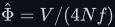
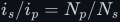

# The transformer

Deep treatment of the transformer: two windings sharing one flux, each obeying Faraday's law
<!--m:v = N\,d\Phi/dt-->. The full argument is in [transformer.md](transformer.md), in eighteen sections
with ten figures (Figures 30–39).

> **The thesis in one line**
>
> The core flux is the *time-integral of the applied voltage*, so the voltages scale with the
> turns — and raising the frequency shortens every half-cycle, *shrinking* the peak flux
> <!--m:\hat\Phi = V/(4Nf)-->. That, not steeper edges or a bigger field, is why a 50 kHz transformer can be
> about thirty times lighter than a 50 Hz one.

## Contents

The treatment covers:

1. Where the transformer sits in the 12 V → 230 V inverter, and why not a boost (Figure 39).
2. Two coils, one flux — mutual inductance and the coupling coefficient (Figure 30).
3. The ideal transformer derived from Faraday: <!--m:v_s/v_p = N_s/N_p-->.
4. The current ratio, from power and from ampere-turn balance: <!--m:i_s/i_p = N_p/N_s-->.
5. Impedance reflection, <!--m:Z' = (N_p/N_s)^2 Z_L-->, and why the primary sees 0.144 Ω.
6. The dot convention.
7. Magnetising inductance — why an open secondary still draws current.
8. **Flux is the integral of voltage** — the gentle correction of the "steep edges, bigger field"
   intuition, the derivation of <!--m:\hat\Phi = V/(4Nf)-->, and the 4.44 sine equation (Figure 31).
9. Worked numbers: 12 V at 50 Hz vs 50 kHz (a 1000× difference in <!--m:N A_e-->), and the 1:27 → 1:30
   turns ratio once drops are counted.
10. Why DC cannot pass — volt-second balance on the core and DC bias (Figure 33).
11. The B–H curve, saturation, and why steel at 50 Hz but ferrite at 50 kHz (Figure 32).
12. Square wave in, square wave out (Figure 34).
13. The real transformer — equivalent circuit, copper loss, skin and proximity effect (Figure 35).
14. Leakage inductance, the hard-switching spike, and snubbers (Figure 36).
15. Core loss — hysteresis grows as <!--m:f-->, eddy loss as <!--m:f^2--> — the ceiling on frequency (Figure 38).
16. Size and weight — the area product, 50 Hz iron vs 50 kHz ferrite to scale (Figure 37).
17. What this costs you.
18. Sources and cross-links.

## Reading order

Read [../inductor/inductor.md](../inductor/inductor.md) first: the transformer's flux ramp and its
magnetising current are the inductor's constant-voltage ramp. The physics of induction is in
[../electromagnetism/](../electromagnetism/). Then read [transformer.md](transformer.md) top to
bottom; section 8 is the heart of it.

## Links

- Parent index: [../README.md](../README.md)
- Style guide: [../../STYLE.md](../../STYLE.md)
- Foundations: [../inductor/inductor.md](../inductor/inductor.md),
  [../electromagnetism/](../electromagnetism/), [../signals/](../signals/)
- The stage before it: [../../dc-ac-inverters/h-bridge/](../../dc-ac-inverters/h-bridge/)
- The stages after it: [../../rectifiers/](../../rectifiers/),
  [../../dc-ac-inverters/spwm/](../../dc-ac-inverters/spwm/),
  [../../filters/lc-filter/](../../filters/lc-filter/)
