# The transformer — two windings, one flux, and why 50 kHz makes it small

A transformer is two inductors that share one magnetic flux. Everything it does — scale voltage,
scale current the other way, reflect impedance, refuse DC, saturate, leak, heat up — follows from
one law, Faraday's, applied to both windings at once. This document builds the transformer from
that law, then uses it to answer the question raised by the 12 V to 230 V inverter video: *why
does switching the H-bridge at 50 kHz let the step-up transformer be so small?*

**Contents**

1. [Where the transformer sits in the inverter](#1-where-the-transformer-sits-in-the-inverter)
2. [Two coils, one flux — mutual inductance](#2-two-coils-one-flux--mutual-inductance)
3. [The ideal transformer, derived from Faraday](#3-the-ideal-transformer-derived-from-faraday)
4. [The current ratio — power and ampere-turns](#4-the-current-ratio--power-and-ampere-turns)
5. [Impedance reflection](#5-impedance-reflection)
6. [The dot convention](#6-the-dot-convention)
7. [Magnetising inductance — why an open secondary still draws current](#7-magnetising-inductance--why-an-open-secondary-still-draws-current)
8. [Flux is the integral of voltage — and why high frequency shrinks the core](#8-flux-is-the-integral-of-voltage--and-why-high-frequency-shrinks-the-core)
9. [Worked numbers — 12 V at 50 Hz vs 50 kHz, and the turns ratio](#9-worked-numbers--12-v-at-50-hz-vs-50-khz-and-the-turns-ratio)
10. [Why DC cannot pass — volt-second balance on the core](#10-why-dc-cannot-pass--volt-second-balance-on-the-core)
11. [The B–H curve, saturation, and core materials](#11-the-bh-curve-saturation-and-core-materials)
12. [Square wave in, square wave out](#12-square-wave-in-square-wave-out)
13. [The real transformer — equivalent circuit and copper loss](#13-the-real-transformer--equivalent-circuit-and-copper-loss)
14. [Leakage inductance and the hard-switching spike](#14-leakage-inductance-and-the-hard-switching-spike)
15. [Core loss — the ceiling on frequency](#15-core-loss--the-ceiling-on-frequency)
16. [Size and weight — the area product](#16-size-and-weight--the-area-product)
17. [What this costs you](#17-what-this-costs-you)
18. [Sources and cross-links](#18-sources-and-cross-links)

> **The thesis in one line**
>
> A transformer's core carries a flux that is the *time-integral of the applied voltage*. Each
> winding sees the same rate of change of that flux, so voltages scale with turns; and because
> raising the frequency shortens every half-cycle, it shrinks the peak flux — which is the whole
> reason a 50 kHz transformer can be a hundred times smaller than a 50 Hz one:

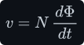

---

## 1 Where the transformer sits in the inverter

The inverter in the video turns a 12 V battery into 230 V AC mains. Mains of 230 V RMS has a peak
of <!--m:230\sqrt{2} \approx 325\,\mathrm{V}--><!--/m--> (the RMS derivation is in [../signals/](../signals/)),
so somewhere in the chain the voltage has to be multiplied by about 27. The video does it in the
front end, like this:

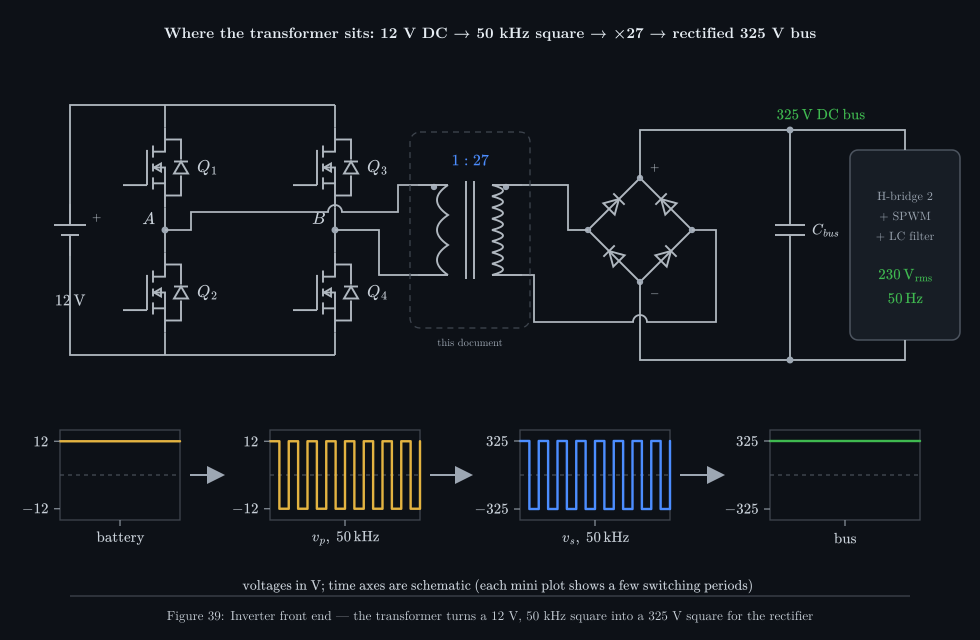

_The transformer is the only part of the chain that changes the voltage level. Everything before
it chops DC into AC so the transformer can work at all; everything after it turns the high-voltage
square back into DC and then into a 50 Hz sine._

1. A **first H-bridge** ([../../dc-ac-inverters/h-bridge/](../../dc-ac-inverters/h-bridge/))
   chops the 12 V DC into a ±12 V square wave at 50 kHz.
2. The **transformer** multiplies that square wave by its turns ratio, to roughly ±325 V. Section
   12 shows that the square shape passes through unchanged.
3. A **bridge rectifier and capacitor** ([../../rectifiers/](../../rectifiers/)) turn the ±325 V
   square back into a 325 V DC bus. A rectified square wave is nearly ripple-free, because the
   rectified value is flat except during the brief edges.
4. A **second H-bridge** under sinusoidal PWM ([../../dc-ac-inverters/spwm/](../../dc-ac-inverters/spwm/))
   plus an **LC filter** ([../../filters/lc-filter/](../../filters/lc-filter/)) carve the 50 Hz
   sine out of that bus.

Why not simply boost 12 V to 325 V with a [boost converter](../../dc-dc-converters/boost/boost.md)?
From <!--m:V_{out} = V_{in}/(1-D)-->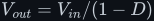<!--/m-->, a ratio of 27 needs <!--m:D = 1 - 12/325 = 0.963-->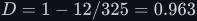<!--/m-->. The switch would be
off for only 3.7 % of each period, the peak currents would be enormous, and every parasitic
resistance in the circuit would eat into the output (see
[../../dc-dc-converters/boost/startup.md](../../dc-dc-converters/boost/startup.md) on extreme duty
cycles). A transformer does the same multiplication with a fixed turns ratio, at a sensible 50 %
duty, and adds galvanic isolation between the battery and the mains side for free. The price is
that a transformer only works on *changing* voltage — which is why the first H-bridge has to exist.

## 2 Two coils, one flux — mutual inductance

Start from the single inductor ([../inductor/inductor.md](../inductor/inductor.md)). A current
<!--m:i--><!--/m--> through <!--m:N--><!--/m--> turns drives a flux <!--m:\Phi--><!--/m--> around the core, and Faraday's law says that a changing
flux induces a voltage in every turn it passes through. The electromagnetism behind both halves of
that sentence — Ampère for "current makes flux", Faraday for "changing flux makes voltage" — is in
[../electromagnetism/](../electromagnetism/). Here we only need the result. For a winding of <!--m:N--><!--/m-->
turns, all linked by the same flux:

The inductance is how much flux-linkage you get per amp. The core's **reluctance** <!--m:\mathcal{R}-->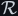<!--/m-->
plays the role of a resistance to flux: a long magnetic path <!--m:\ell_e-->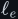<!--/m--> raises it, while a wide
cross-section <!--m:A_e-->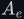<!--/m--> or a high permeability <!--m:\mu-->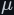<!--/m--> lowers it:

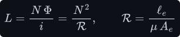

Now wind a **second** coil on the same core. Current in coil 1 makes flux; some or all of that flux
also threads coil 2, so changing <!--m:i_1-->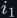<!--/m--> induces a voltage in coil 2 even though no wire connects
them. That cross-coupling is **mutual inductance** <!--m:M-->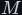<!--/m-->, and the two coils obey a pair of coupled
equations:

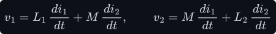

How much flux the coils actually share is captured by the **coupling coefficient** <!--m:k--><!--/m-->:

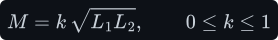

- <!--m:k = 0-->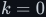<!--/m--> means the coils share no flux — two separate inductors.
- <!--m:k = 1--><!--/m--> means every line of flux from one coil threads every turn of the other.
- A gapped flyback transformer might reach <!--m:k \approx 0.95-->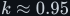<!--/m-->. A well-wound ferrite power
  transformer reaches <!--m:k = 0.99-->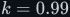<!--/m--> to <!--m:0.999--><!--/m-->. The tiny missing fraction is the **leakage flux**, and
  section 14 shows why it matters more than its size suggests.

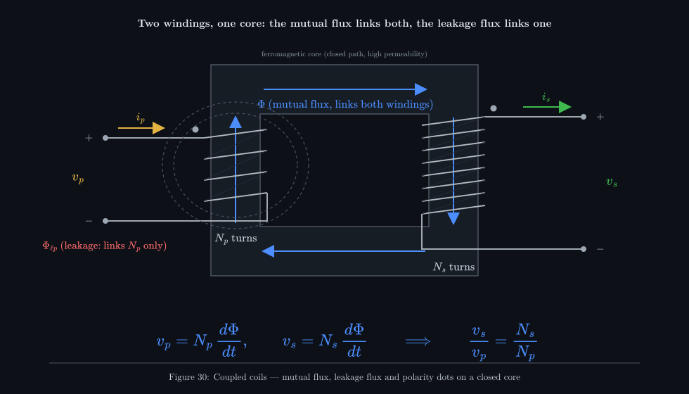

_The high-permeability core gives the flux an easy closed path, so almost all of it (blue) links
both windings. A little (red, dashed) closes through the air around one winding only. That
leakage flux is what turns into voltage spikes later._

**A useful check.** Set <!--m:k = 1--><!--/m--> in the coupled equations. Both self-inductances and the mutual
inductance come from the same reluctance, so substituting them makes the current-dependent bracket
cancel, leaving a ratio of turns:

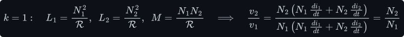

The voltage ratio does not depend on either current — on what the load draws, or on how hard the
source pushes. That is the ideal transformer, and the next section derives it again more directly.

## 3 The ideal transformer, derived from Faraday

Make three idealisations: the coupling is perfect (<!--m:k = 1--><!--/m-->), the windings have no resistance, and
the core has infinite permeability with no loss. One flux <!--m:\Phi(t)-->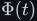<!--/m--> then threads every turn of
both windings. Apply Faraday's law to each winding separately:

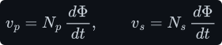

Both equations contain the **same** <!--m:d\Phi/dt-->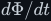<!--/m-->, because it is the same flux. Solve each one for it
and set them equal:

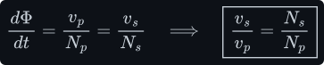

That is the turns-ratio law. Two points about it are easy to miss.

- **It holds instant by instant**, not just for RMS values. At every moment <!--m:v_s(t)-->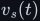<!--/m--> is
  <!--m:N_s/N_p-->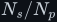<!--/m--> times <!--m:v_p(t)-->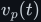<!--/m-->. So the transformer reproduces the *shape* of the primary voltage —
  sine in, sine out; square in, square out (section 12).
- **It is about volts per turn.** The rate <!--m:d\Phi/dt--><!--/m--> is the "volts per turn" of the core: every
  turn on it, primary or secondary, has exactly <!--m:v_p/N_p-->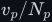<!--/m--> volts induced across it. With 12 V
  across 2 primary turns, each turn carries 6 V, so a 60-turn secondary delivers
  <!--m:60 \times 6 = 360\,\mathrm{V}-->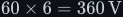<!--/m-->. Thinking in volts per turn makes multi-winding transformers easy.

> **Note —** Nothing in this derivation mentions frequency. An ideal transformer works the same at
> 1 Hz as at 1 MHz. Frequency enters only once you ask how large the flux gets (section 8) and
> how much the core and copper lose (sections 13 and 15). Those questions set the transformer's
> size; the turns ratio never depends on them.

## 4 The current ratio — power and ampere-turns

The current ratio can be derived two ways. Each one is worth seeing.

**From the magnetic circuit.** Ampère's law around the closed core path says that the total
ampere-turns enclosed equals the reluctance times the flux. With the secondary current defined
flowing *out* of its winding into the load, it opposes the primary's ampere-turns:

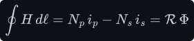

In the ideal transformer the core has infinite permeability, so <!--m:\mathcal{R} \to 0-->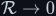<!--/m-->. A finite flux
then needs *zero* net ampere-turns:

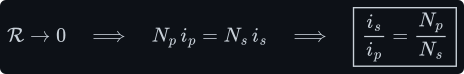

Read physically: when the load draws secondary current, that current's ampere-turns try to change
the core flux. The flux, however, is pinned by the primary voltage through Faraday's law. So the
primary instantly draws exactly enough extra current to cancel the secondary's ampere-turns. The
load "pulls" current through the primary by way of the core.

**From energy.** An ideal transformer has nowhere to store or lose energy, so power in equals power
out at every instant. Multiply the two ratios:

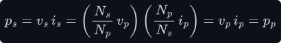

The voltage goes up by <!--m:N_s/N_p--><!--/m--> and the current comes down by the same factor. For the inverter
at 1 kW: the secondary carries <!--m:1000/325 \approx 3.1\,\mathrm{A}--><!--/m-->, while the primary carries
<!--m:1000/12 \approx 83\,\mathrm{A}--><!--/m-->. A step-up transformer is also a step-*down* current transformer.
This is why the 12 V side of an inverter needs thick copper and the 325 V side does not.

## 5 Impedance reflection

Put a load <!--m:Z_L-->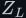<!--/m--> on the secondary. What does the primary source "see"? Divide the primary voltage
by the primary current, then substitute both ratios:

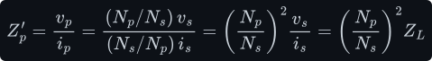

The load is **reflected** through the transformer scaled by the *square* of the turns ratio:
once for the voltage ratio and once more for the current ratio. For the inverter, a 1 kW load on
the 325 V bus looks like 105.6 Ω on the secondary. Seen from the 12 V primary it is a fraction of
an ohm:

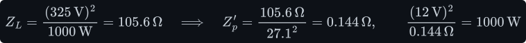

That 0.144 Ω is the brutal fact of low-voltage power electronics. Every milliohm in the primary
loop — MOSFET on-resistance, PCB traces, battery cables, the primary winding — sits in series with
an effective load of only 144 mΩ. Two MOSFETs of 2 mΩ each already add 4 mΩ, 2.8 % of the load,
before anything else is counted.

> **Tip —** Impedance reflection is a two-way street. A short circuit on the 325 V side reflects
> as a short on the 12 V side, and a stray capacitance on the secondary reflects to the primary
> multiplied by <!--m:(N_s/N_p)^2 \approx 730-->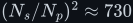<!--/m-->. A 100 pF winding capacitance on the secondary looks like
> about 73 nF to the H-bridge, and the bridge must charge it on every edge.

## 6 The dot convention

A transformer symbol carries a dot at one end of each winding (Figure 30 and Figure 35). The dots
mark terminals that rise **together**: when the dotted end of the primary goes positive relative to
its undotted end, the dotted end of the secondary goes positive relative to *its* undotted end at
the same instant. Equivalently, current flowing *into* a dot on either winding drives flux around
the core in the same direction.

Physically, the dots record which way each winding is wound around the core. Wind the secondary the
other way, or swap its leads, and the dot moves to the other end — the secondary voltage is then
inverted.

When dots matter, and when they do not:

- **They do not matter** for the inverter here. A full-bridge rectifier accepts either polarity,
  so swapping the secondary leads changes nothing at the 325 V bus.
- **They matter** whenever windings are combined or timed against each other: a centre-tapped
  push-pull primary, two secondaries in series, or a flyback converter. A flyback deliberately uses
  *opposite* dots, so the secondary diode conducts while the primary switch is off. With a
  winding's dot on the wrong end, two windings meant to add will cancel, or the energy transfer
  happens in the wrong half-cycle.

## 7 Magnetising inductance — why an open secondary still draws current

Disconnect the load so that <!--m:i_s = 0-->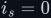<!--/m-->, and put the primary on the H-bridge. The ideal-transformer
equation <!--m:N_p i_p = N_s i_s-->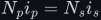<!--/m--> predicts zero primary current. A real transformer still draws current.
Why?

Because a real core has finite permeability, so its reluctance is not zero. To set up the flux that
Faraday's law demands, the primary must supply some ampere-turns, and the current that does it is
the **magnetising current** <!--m:i_m-->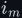<!--/m-->. Seen from the primary, an unloaded transformer is just an
inductor — the primary winding on its core. That inductance is the **magnetising inductance**,
often specified through the core's <!--m:A_L-->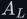<!--/m--> value (nH per turn squared):

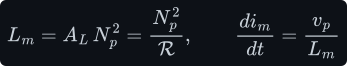

With a ±V square wave on the primary, <!--m:i_m--><!--/m--> is a triangle, exactly like the inductor ramp in
[../inductor/inductor.md §3](../inductor/inductor.md#3-from-the-law-to-the-ramp--the-integral-done-slowly).
During each half-period <!--m:T/2-->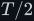<!--/m--> it ramps through <!--m:V (T/2)/L_m-->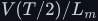<!--/m-->, from <!--m:-\hat\imath_m-->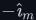<!--/m--> to <!--m:+\hat\imath_m-->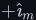<!--/m-->:

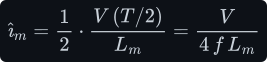

For the 50 kHz design worked out in section 9 (2 primary turns on an ETD49 ferrite core, with
<!--m:A_L--><!--/m--> of order 5 μH per turn squared for an ungapped set, so <!--m:L_m \approx 20\,\mu\mathrm{H}-->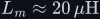<!--/m-->):

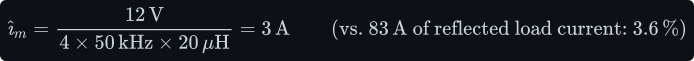

Load the secondary and the primary current is the **sum** of two parts: the reflected load current
from section 4, plus this magnetising current, which flows whether or not there is a load:

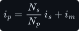

Three facts follow.

- **The magnetising current is reactive.** It stores energy in the core during one quarter of the
  cycle and returns it during the next; through the H-bridge's body diodes it goes back to the
  battery. It costs conduction loss in the MOSFETs and copper, but it is not "used up".
- **It is the flux in disguise.** Since <!--m:i_m = N_p \Phi / L_m-->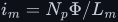<!--/m-->, the magnetising current is
  proportional to the core flux. When the flux heads towards saturation, <!--m:i_m--><!--/m--> is what you see
  blowing up on a current probe (Figure 33).
- **A bigger** <!--m:L_m-->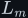<!--/m--> **means less magnetising current**, which is why power transformer cores have
  no air gap. Adding turns raises <!--m:L_m--><!--/m--> as <!--m:N^2--><!--/m-->, but it also costs window space and copper — the
  first of many trade-offs in section 16.

## 8 Flux is the integral of voltage — and why high frequency shrinks the core

This is the central section, because it is where the intuition from the video needs one careful
correction.

**The intuition.** It goes roughly like this: *"A transformer works because the rate of change of
the magnetic field is proportional to the rate of change of voltage. Our edges, 12 V to −12 V, are
not very steep, so to get enough field we'd need a huge magnet. Or we raise the frequency: same
edges, but more of them, so a larger magnetic field is created and a small transformer will do."*

The conclusion — higher frequency, smaller transformer — is **right**. The physics on the way there
needs fixing in two places, and fixing them is what lets you *calculate* how small the transformer
can be.

**Correction 1: it is the voltage, not its rate of change, that sets how fast the flux changes.**
Faraday's law relates the voltage itself to the *derivative* of the flux:

Rearrange Faraday's law and integrate, exactly as for the inductor ramp. The flux is the
time-integral of the voltage:

So during the long **flat tops** of the square wave, where <!--m:v_p--><!--/m--> is constant at +12 V, the flux
ramps up in a straight line at slope <!--m:V/N--><!--/m-->. During the flat bottoms it ramps down at the same
slope. The **edges** do almost nothing: an edge lasts perhaps 50 ns out of a 10 μs half-period, and
the area under it is negligible compared with the area under a flat top:

An edge only *reverses the direction* in which the flux is ramping. Steep edges are not what moves
energy through a transformer. Energy moves as <!--m:v \cdot i--><!--/m--> during the flat tops, while the flux
ramps; making the edges steeper changes nothing about that, and mostly just makes noise
(section 14).

**Correction 2: higher frequency gives a *smaller* peak flux, not a larger one.** Take a
symmetric ±V square wave of period <!--m:T = 1/f--><!--/m-->. In steady state the flux swings symmetrically between
<!--m:-\hat\Phi--><!--/m--> and <!--m:+\hat\Phi--><!--/m-->. During one positive half-period it climbs the full swing <!--m:2\hat\Phi--><!--/m-->:

Halve it:

Frequency sits in the **denominator**. Doubling <!--m:f--><!--/m--> halves the time spent on each flat top, so the
flux gets only half as far before the voltage reverses and sends it back. Higher frequency means
*fewer volt-seconds per half-cycle*, which means *less* peak flux:

_Both square waves have identical 12 V levels and identical edges, so both flux triangles climb at
the identical slope <!--m:V/N--><!--/m-->. The faster one simply turns around four times sooner and peaks at a
quarter of the height. At 50 kHz versus 50 Hz the same picture holds with a factor of 1000._

Why does a smaller peak flux mean a smaller transformer? Because what limits a core is its **flux
density** <!--m:B = \Phi/A_e--><!--/m-->: every core material saturates above some <!--m:B_{sat}--><!--/m--> (section 11). Divide
the peak flux by the core's cross-section:

To keep <!--m:\hat B--><!--/m--> below the material's limit, the product <!--m:N A_e--><!--/m--> — turns times core area — must be
at least <!--m:V/(4 f \hat B)--><!--/m-->. Raise <!--m:f--><!--/m--> a thousandfold and <!--m:N A_e--><!--/m--> can drop a thousandfold: fewer
turns, a thinner core, or both. *That* is why a 50 kHz transformer is small. It is not because the
field gets bigger; it is because the field gets **smaller**, so less iron is needed to carry it
without saturating.

**The sine-wave version.** The classic transformer equation found in textbooks is the same
argument for a sine. Integrate a sine and the flux is a cosine:

Convert the peak voltage to RMS and this becomes the famous "4.44 equation":

The square-wave equation has 4.00 where the sine has 4.44. The ratio <!--m:4.44/4.00 = 1.11--><!--/m--> is the sine's
*form factor* (RMS divided by rectified average): for the same RMS voltage, a sine reaches a
slightly higher peak flux than a square wave does.

> **Note — the video's own argument.** The video explains the same point with energy: at 1 kW, a
> 50 Hz transformer handles 20 J per cycle, a 50 kHz one only 0.02 J per cycle, so the core can be
> smaller. The trend is right, but in a transformer (unlike an inductor or a flyback) that energy
> is *not stored in the core* — it passes straight through from primary to secondary. The energy
> the core actually stores is the small magnetising energy:
>
> 
>
> That is only 0.45 % of what passes through each cycle. What really sizes a transformer core is
> the volt-seconds it must absorb without saturating (this section) and the copper it must hold
> (section 16). The energy-per-cycle picture is exact for a flyback, which stores every joule in
> its gap before releasing it.

## 9 Worked numbers — 12 V at 50 Hz vs 50 kHz, and the turns ratio

Use the square-wave result to size the primary. MnZn ferrite saturates at roughly 0.3 to 0.4 T at
operating temperature (its <!--m:B_{sat}--><!--/m--> falls as it heats), so design to <!--m:\hat B = 0.2\,\mathrm{T}--><!--/m-->
for margin:

At the two frequencies:

Make it concrete. An ETD49 ferrite core has <!--m:A_e = 2.11\,\mathrm{cm}^2--><!--/m-->. At **50 kHz** it needs
only <!--m:3/2.11 = 1.4--><!--/m--> turns, rounded up to 2. Check the peak flux density with 2 turns:

That is comfortably below saturation, and low enough to keep core loss modest (section 15). At
**50 Hz**, the same ETD49 core would need 1422 primary turns — and about 38 000 secondary turns —
which is absurd. Keeping a sensible 2-turn primary instead would need <!--m:A_e = 1500\,\mathrm{cm}^2--><!--/m-->,
a core leg about 39 cm on a side.

Nobody builds a 50 Hz transformer from ferrite, of course: at 50 Hz you use laminated silicon steel,
which can run at about 1.4 T. That claws back a factor of 7:

So the honest comparison is: like-for-like the 50 Hz core needs 1000 times the <!--m:N A_e--><!--/m-->; with the
best material for each frequency, it still needs about 143 times. Section 16 turns that into a size
and weight.

**The turns ratio.** The ideal ratio is just the voltage ratio:

A real design has to account for drops, because 83 A through anything costs volts. On the primary
side: the battery and its cables sag (about 0.5 V at 83 A), two MOSFETs conduct in series (about
0.3 V at 2 mΩ each), and the primary copper takes about 0.2 V. On the secondary side: the bridge
rectifier has two diodes conducting (about 1 V each at 3 A), plus about 1 V of secondary copper.
The secondary must therefore produce 328 V from an effective 11 V primary:

So the practical ratio is about 1:30 rather than 1:27, wound as 2 turns to 60 turns.

> **Watch out —** A fixed turns ratio means the bus voltage *follows the battery*. A 12 V lead-acid
> battery ranges from about 10.5 V (flat) to 14.4 V (charging), so a 1:30 transformer gives a bus of
> roughly 300 V to 420 V. Something downstream must cope: either the SPWM stage adjusts its
> modulation index (which needs at least 325 V at minimum battery, and bus capacitors and
> MOSFETs rated for the maximum), or the front end is regulated itself (for example by
> phase-shifting the first H-bridge's legs). See
> [../../dc-ac-inverters/spwm/](../../dc-ac-inverters/spwm/).

## 10 Why DC cannot pass — volt-second balance on the core

Put a constant voltage on the primary. Faraday's law still applies, so the flux ramps — and with a
constant voltage it never stops ramping:

There is no steady state. On the 2-turn ETD49 design, 12 V DC drives the core from zero into
saturation (taking <!--m:B_{sat} \approx 0.35\,\mathrm{T}--><!--/m-->) in about twelve microseconds:

After that, the magnetising inductance collapses (section 11) and the only thing limiting the
current is the milliohms of copper and MOSFET resistance: in principle kiloamps. In practice
something melts. This is the real reason a transformer "blocks DC". It is not that DC fails to
couple to the secondary (a *changing* DC would couple fine while it changed). It is that a steady
DC voltage on a winding saturates the core and short-circuits the source.

The condition for a steady state is the same one that governs the
[buck](../../dc-dc-converters/buck/buck.md) and boost inductors — **volt-second balance** — applied
now to the core flux. The flux returns to its starting value each period only if the primary
voltage averages to exactly zero:

A symmetric ±12 V square wave satisfies this exactly. A *slightly* asymmetric one does not, and the
difference accumulates. Suppose gate-drive mismatch makes <!--m:Q_1/Q_4--><!--/m--> conduct 50 ns longer than
<!--m:Q_2/Q_3--><!--/m--> each period. That is a tiny DC component — but the flux walks upward by a fixed amount
every period:

_Each period the flux climbs a little more than it falls, so its centre drifts upward until the
peaks reach saturation. The magnetising current then stops being a gentle triangle and spikes —
this is how an unbalanced bridge destroys its MOSFETs._

Real circuits have a weak restoring force: the DC component drives a DC current through the loop
resistance, and the resulting resistive drop opposes the imbalance. The circuit settles where the
two cancel. With only milliohms in the loop, though, the settling current is large, and so is the
**DC bias flux** it adds to the core:

A bias of 60 μWb plus the 30 μWb AC swing is 90 μWb, well past the 74 μWb saturation flux. A 50 ns
timing mismatch — half a percent of the half-period — is enough to saturate this transformer. The
standard remedies:

- **A DC-blocking capacitor** in series with the primary. It charges to whatever DC component
  exists and cancels it. Easy at high voltage; at 83 A RMS it must be a large, low-ESR film part.
- **Peak-current-mode control**, which ends each half-cycle on a current threshold rather than a
  timer. A drift in the magnetising current then shortens the next pulse automatically.
- **Matched, symmetric gate drive** and dead-time, so that the two diagonals really do get
  identical volt-seconds (see [../../dc-ac-inverters/h-bridge/](../../dc-ac-inverters/h-bridge/)).
- **A small air gap**, which lowers <!--m:L_m--><!--/m--> (so the same DC current makes less bias flux) at the
  cost of more magnetising current.

## 11 The B–H curve, saturation, and core materials

Why have a core at all? Because the core's material multiplies the flux that a given current
produces. The field strength <!--m:H--><!--/m--> is set by the ampere-turns per metre of path; the flux density
<!--m:B--><!--/m--> that results depends on the material's permeability:

Ferrite has <!--m:\mu_r--><!--/m--> of 2000 to 3000, and grain-oriented silicon steel tens of thousands. A core
therefore gives thousands of times more inductance (more <!--m:L_m--><!--/m-->, less magnetising current) and keeps
the flux confined to a path through both windings (higher <!--m:k--><!--/m-->, less leakage). Without one, a
transformer is two loosely coupled air coils.

The catch is that <!--m:\mu--><!--/m--> is not constant. Plot <!--m:B--><!--/m--> against <!--m:H--><!--/m--> and the curve is steep near the
origin, then flattens:

_The slope <!--m:dB/dH--><!--/m--> is the permeability. Once the material saturates, the slope collapses towards that
of air, the inductance falls with it, and the current is no longer limited. The loop area is the
energy lost as heat on every cycle._

Three things to read from the curve:

- **Saturation.** Past <!--m:B_{sat}--><!--/m-->, every magnetic domain in the material is already aligned and
  there is nothing left to add. Further <!--m:H--><!--/m--> adds only the <!--m:\mu_0 H--><!--/m--> of empty space, so the effective
  permeability drops by a factor of thousands. Then <!--m:L_m--><!--/m--> drops by the same factor, <!--m:di_m/dt = v_p/L_m--><!--/m-->
  shoots up, and the current spikes (Figure 33). Saturation is a cliff edge, not a gentle limit.
- **Hysteresis.** The curve going up is not the curve coming down; the material "remembers"
  its previous magnetisation. The enclosed area <!--m:\oint H\,dB--><!--/m--> is energy per cubic metre turned into
  heat **on every cycle**, so this loss grows in proportion to frequency (section 15).
- **Remanence.** At <!--m:H = 0--><!--/m--> the descending branch still holds some flux. That is why a transformer
  switched on at the wrong point of the mains cycle can draw a huge inrush current: it starts with
  leftover flux and is driven into saturation on the first half-cycle.

**Why laminated silicon steel at 50 Hz.** Steel saturates high, at 1.8 to 2.0 T, so it carries a
lot of flux per square centimetre. At 50 Hz that is exactly what you want, because section 9 showed
that low frequency demands a lot of flux. Steel is a good electrical conductor, though, so the
changing flux induces circulating **eddy currents** inside it (section 15). Silicon (about 3 %)
raises the resistivity, and slicing the core into thin insulated **laminations** (0.23 to 0.5 mm)
breaks the eddy loops into thin ribbons. At 50 Hz this works well.

**Why ferrite at tens of kilohertz.** Ferrite is a ceramic of iron oxide with manganese and zinc
(MnZn) or nickel and zinc (NiZn). It saturates low, at about 0.4 T, roughly a fifth of steel. But
its resistivity is a million to ten million times higher, so eddy currents are negligible even in a
solid core, and its hysteresis loop is narrow. At 50 kHz, section 8 says only a small flux swing is
needed, so the low <!--m:B_{sat}--><!--/m--> costs little, while the loss advantage is decisive (Figure 38). Above
roughly 1 to 2 MHz, MnZn losses rise steeply and NiZn ferrite or powdered cores take over.

## 12 Square wave in, square wave out

Section 3 showed that the voltage ratio holds at every instant. So the transformer does not
"convert" the square wave into anything; it passes it through scaled:

_The secondary is the primary's square wave multiplied by the turns ratio. Its only blemishes are
brief ringing at each edge from leakage inductance. The primary current is the load current
reflected through the turns ratio, with the magnetising triangle (exaggerated here) riding on top._

Three consequences:

- **The core sees triangular flux, the windings see square voltage.** Both are correct at once:
  one is the integral of the other (Figure 31).
- **The rectified secondary is nearly DC already.** A full-bridge rectifier flips the negative
  half-cycles up, and a square wave flipped is flat. The bus capacitor only has to bridge the short
  edge intervals. This is a major advantage of square-wave over sine-wave links
  ([../../rectifiers/](../../rectifiers/)).
- **Every harmonic passes through too.** A square wave is a sum of odd harmonics, which decay only
  as <!--m:1/n--><!--/m--> ([../signals/](../signals/)). The transformer must handle them all — up to tens of
  megahertz for fast edges. Its leakage inductance and winding capacitance shape those high
  harmonics into the ringing visible at each edge.

## 13 The real transformer — equivalent circuit and copper loss

Every departure from the ideal can be drawn as a component around an ideal transformer:

_Series elements carry load current, so they cost voltage and copper loss. Shunt elements see the
full winding voltage, so they draw current even at no load. The ideal transformer in the middle
only scales._

| Element | Physical origin | What it does |
|---|---|---|
| <!--m:R_p--><!--/m-->, <!--m:R_s--><!--/m--> | resistance of the copper windings | <!--m:I^2 R--><!--/m--> heat; voltage drop under load |
| <!--m:L_{\ell p}--><!--/m-->, <!--m:L_{\ell s}--><!--/m--> | flux that links one winding but not the other | voltage spikes at switching edges; duty-cycle loss (section 14) |
| <!--m:L_m--><!--/m--> | finite core permeability | magnetising current (section 7) |
| <!--m:R_c--><!--/m--> | hysteresis and eddy currents in the core | core-loss heat, present even at no load (section 15) |

**Copper loss** is the familiar <!--m:I^2 R--><!--/m--> in both windings:

At 50 kHz, though, the resistance that matters is not the DC resistance. Two effects raise the AC
resistance by a factor <!--m:F_R--><!--/m-->:

- **Skin effect.** A high-frequency current crowds towards the surface of a conductor, within a
  depth <!--m:\delta--><!--/m-->, because the conductor's own changing internal field opposes current in its centre:

  

  The 83 A primary needs about 24 mm² of copper at a typical 3.5 A/mm². As one round wire that is
  5.5 mm across, but at 50 kHz only the outer 0.3 mm of it would carry current. The fix is to
  divide the copper into conductors no thicker than about <!--m:2\delta--><!--/m-->: copper **foil** about 0.2 to
  0.3 mm thick and as wide as the winding window, or **Litz wire** made of hundreds of insulated
  strands.
- **Proximity effect.** In a multi-layer winding, each layer sits in the field of the layers
  around it, which induces eddy currents that push its current to one face. Loss grows rapidly with
  the number of layers (the Dowell analysis). The standard cure is **interleaving**: split the
  primary and wind it as primary–secondary–primary, so that the ampere-turns cancel between
  neighbouring layers. This also cuts leakage inductance, which is why the two goals usually go
  together.

## 14 Leakage inductance and the hard-switching spike

The leakage flux in Figure 30 links only one winding, so it transfers nothing. It behaves as a
small inductor <!--m:L_\ell--><!--/m--> in series with the ideal transformer (Figure 35), and since it carries the
full load current, it stores energy <!--m:\tfrac12 L_\ell I^2--><!--/m-->. The trouble is that an H-bridge
**hard-switches**: it tries to reverse the primary current in nanoseconds, and an inductor resists
a fast change of current with a voltage <!--m:L\,di/dt--><!--/m--> — the inductive kick of
[../inductor/inductor.md §6](../inductor/inductor.md#6-the-inductive-kick-and-why-the-diode-is-there).
Take an illustrative <!--m:L_\ell = 50\,\mathrm{nH}--><!--/m--> referred to the primary (realistic for a well-interleaved
2-turn foil primary) and an 83 A current switched off in 50 ns:

That is 83 V of potential overshoot on a 12 V bridge built from 40 to 60 V MOSFETs.

_Interrupting current in any inductance makes the voltage jump until something gives the current a
path. Without a snubber, the drain rings with the MOSFET's capacitance and the first peak can
approach the device rating. A snubber absorbs the energy and damps the ring._

Where the energy goes depends on the topology:

- **On the primary of a full bridge** the leakage current, denied its path through the switch
  that just turned off, forces the body diodes of the opposite pair into conduction. That clamps
  the primary to the rail, and the leakage energy goes back into the bus capacitor rather than
  into a spike. What the body diodes cannot clamp is the stray inductance of the loop between the
  bus capacitor and the switches, often a few nanohenries. That is why the bus capacitors sit
  millimetres from the MOSFETs. Figure 36 shows what happens when the loop is *not* tight.
- **On the secondary**, the leakage inductance rings with the rectifier diodes' junction
  capacitance and the winding capacitance at every polarity reversal. The diodes can see far
  more than the 325 V bus — commonly 1.5 to 2 times — so they are rated at 600 V or more and
  snubbed.

Even when clamped, leakage costs you twice. First, every edge has to reverse the current in
<!--m:L_\ell--><!--/m-->, and during that **commutation time** the secondary voltage is not available to the load:

Second, if the leakage energy is dumped into a dissipative clamp instead of being recycled, it
costs real power:

**Snubbers.** An RC snubber places a capacitor (to slow the voltage rise and lower the ring
frequency) in series with a resistor (to damp the ringing) across the node that rings. A common
starting point is a capacitor 3 to 4 times the parasitic capacitance, and a resistor equal to the
ring's characteristic impedance. The snubber capacitor is fully charged and discharged through the
resistor on every edge, so it dissipates power at a rate proportional to frequency:

The alternatives are an RCD clamp (which only acts on the overshoot, so it wastes less) or, at the
top end, **soft switching**: a phase-shifted full bridge uses the leakage energy itself to swing
the switch node before each MOSFET turns on (zero-voltage switching), turning the parasitic into a
feature.

## 15 Core loss — the ceiling on frequency

If higher frequency shrinks the core, why stop at 50 kHz? Why not 5 MHz and a transformer the size
of a sugar cube? Because core loss, copper loss and switching loss all rise with frequency, and
eventually they outrun the size benefit.

**Hysteresis loss** is the loop area of Figure 32, paid once per cycle, so it is proportional to
frequency:

**Eddy-current loss** grows with the *square* of frequency. The changing flux induces an EMF around
every closed path inside the core material, proportional to <!--m:dB/dt--><!--/m-->, and therefore to <!--m:f \hat B--><!--/m-->.
That EMF drives current through the material's resistance, and power goes as EMF squared over
resistance:

For laminations of thickness <!--m:t--><!--/m--> the classical result is:

For 0.35 mm silicon-steel laminations this gives a quite acceptable loss at 50 Hz and 1.5 T. Try
the same steel at 50 kHz, even at a tenth of the flux density, and it is hopeless:

(At 50 kHz the classical formula overstates the figure, because the eddy currents push the flux to
the surface of each lamination. Either way, the steel is unusable.) Ferrite escapes the <!--m:f^2--><!--/m--> term
through its resistivity, not by thinner slicing:

Manufacturers characterise ferrite with an empirical **Steinmetz** fit to measured loss:

_At 50 Hz steel's loss is tiny and its high saturation is what counts. By 50 kHz the eddy term has
grown a millionfold and ferrite is hundreds of times better. The model is illustrative, but the
slopes are the physics._

Notice the steep <!--m:\beta--><!--/m--> in the Steinmetz fit: loss rises as roughly the cube of <!--m:\hat B--><!--/m-->. That is
why, at 50 kHz, the ferrite design flux density is set by **loss rather than saturation** — about
0.1 to 0.15 T, against a saturation of about 0.35 T. Pushing the frequency up lets you lower
<!--m:\hat B--><!--/m--> further, but each step costs more in loss at the same <!--m:\hat B--><!--/m-->. For the ETD49 at 50 kHz and
0.14 T, the core loss is of order 1 to 2 W. Acceptable, but not free.

The rest of the circuit also pays for frequency:

- **Copper** — the skin depth shrinks as <!--m:1/\sqrt{f}--><!--/m--> and proximity losses grow, so <!--m:F_R--><!--/m--> climbs
  (section 13).
- **Switching** — each MOSFET dissipates energy on every edge while it is half-on, carrying current
  and blocking voltage at the same time. That loss is proportional to frequency:

  

  That is 10 W across four switches at 50 kHz. At 500 kHz it would be 100 W, a tenth of the output
  power.
- **Leakage and snubbers** — both the clamp loss and the snubber loss in section 14 are
  proportional to frequency, and the commutation time takes a growing fraction of a shrinking
  period.

So 50 kHz is a compromise: high enough that the ferrite is small and the switching is above the
audible range, low enough that the 83 A primary's switching, copper and leakage costs stay
manageable. Low-voltage, high-current front ends like this one typically run at 20 to 100 kHz.
Higher-voltage, lower-current converters (where every one of those costs is smaller) run at
hundreds of kilohertz.

## 16 Size and weight — the area product

Section 9 counted the turns. To size a whole transformer you need to account for the copper as
well, and the cleanest way is the **area product**: the core cross-section times the winding window
area. Two constraints set it.

**Flux constraint (Faraday).** For the square wave, the primary turns needed on a core of area
<!--m:A_e--><!--/m--> are:

**Window constraint (copper).** Both windings' copper, carrying current density <!--m:J--><!--/m-->, must fit in the
window area <!--m:A_w--><!--/m-->, of which only a fraction <!--m:K_u--><!--/m--> (the window utilisation, typically 0.3 to 0.4)
can actually be copper. In an ideal transformer the two windings carry equal ampere-turns:

Multiply the two, and the turns cancel:

The core needed is proportional to the power, and inversely proportional to frequency times flux
density. For 1 kW with <!--m:K_u = 0.4--><!--/m--> and <!--m:J = 3.5\,\mathrm{A/mm^2}--><!--/m-->:

The ratio is about 107, not 1000. The thousandfold frequency gain is partly spent on dropping
<!--m:\hat B--><!--/m--> from 1.4 T (steel) to 0.15 T (loss-limited ferrite). Then turn area into size. Every length
of a geometrically similar core scales together, so area product grows as length to the fourth
power, while volume and mass grow as length cubed:

_Real parts agree with the scaling argument. An EI150 steel stack with windings weighs about 8 kg;
an ETD49 ferrite set with its 2:60 windings, about 0.3 kg — roughly 27 times lighter, close to
the predicted 33._

This is the payoff the video promised, now with a mechanism and a number: switching at 50 kHz
instead of 50 Hz makes the 1 kW transformer about 30 times lighter and about 3 times smaller in
every dimension. Most of the weight of an old-style inverter was its 50 Hz transformer.

## 17 What this costs you

- **You must make AC first.** A transformer only couples a *changing* flux, so the battery's DC has
  to be chopped by an H-bridge — four MOSFETs, gate drivers, dead-time management — before the
  transformer can do anything (section 10). The "free" step-up is not free.
- **Volt-second balance is unforgiving.** A drive asymmetry of a fraction of a percent saturates a
  low-resistance, high-current transformer (section 10). Blocking capacitors, current-mode control
  or careful matching are mandatory, not optional polish.
- **The frequency gain is capped by loss.** Core loss (<!--m:f--><!--/m--> for hysteresis, <!--m:f^2--><!--/m--> for eddy
  currents), skin and proximity effect in the copper, switching loss in the MOSFETs, and snubber
  loss all grow with frequency (section 15). 50 kHz is a compromise, and the 1000× frequency
  advantage delivers about 30× in weight, not 1000× (section 16).
- **Leakage inductance makes spikes.** Hard-switching 83 A through tens of nanohenries produces
  overshoots of tens of volts on the primary and hundreds on the secondary. They need tight layout,
  snubbers or clamps, and over-rated devices; the snubbers dissipate watts (section 14).
- **Low voltage means huge primary current.** At 12 V and 1 kW the primary carries 83 A into an
  effective load of 0.144 Ω (section 5). Every milliohm of MOSFET, trace and cable costs a
  percentage point of efficiency, and the primary winding has to be foil or Litz wire.
- **The ratio is fixed.** The bus voltage follows the battery, from roughly 300 to 420 V with a
  1:30 transformer. Regulation has to happen somewhere else in the chain (section 9).
- **Ferrite is fragile.** It is a brittle ceramic whose saturation flux density falls as it warms
  (from about 0.5 T cold to about 0.38 T at 100 °C). A hot transformer is closer to saturation than
  a cold one, which is exactly the wrong direction for a fault.

## 18 Sources and cross-links

- **The single-coil law this builds on:** [../inductor/inductor.md](../inductor/inductor.md) —
  the constant-voltage ramp (§3) is the flux ramp and the magnetising-current ramp here; the
  inductive kick (§6) is the leakage spike.
- **Faraday, Ampère, reluctance, mutual inductance in depth:**
  [../electromagnetism/](../electromagnetism/).
- **Square-wave harmonics, edges, RMS and the 325 V peak:** [../signals/](../signals/).
- **Volt-second balance, first met on an inductor:**
  [../../dc-dc-converters/buck/buck.md](../../dc-dc-converters/buck/buck.md) and
  [../../dc-dc-converters/boost/boost.md](../../dc-dc-converters/boost/boost.md); why a boost cannot
  sensibly reach ×27: [../../dc-dc-converters/boost/startup.md](../../dc-dc-converters/boost/startup.md).
- **The stage before the transformer:** [../../dc-ac-inverters/h-bridge/](../../dc-ac-inverters/h-bridge/)
  (dead-time, body diodes, gate-drive symmetry) and [../../pwm/](../../pwm/).
- **The stages after it:** [../../rectifiers/](../../rectifiers/) (the 325 V bus),
  [../../dc-ac-inverters/spwm/](../../dc-ac-inverters/spwm/) and
  [../../filters/lc-filter/](../../filters/lc-filter/) (the 50 Hz sine).
- **Source material:** the 12 V to 230 V inverter video (DC_to_AC_1, around 4:50 to 6:00 for the
  "switch faster, smaller transformer" argument, and 16:44 for the full chain). Core figures (ETD49
  and EI150 dimensions, ferrite and steel saturation and resistivity) are typical manufacturer
  datasheet values, rounded. The area-product method and the Steinmetz and classical eddy-current
  loss models are standard magnetics-design results.
- Style and figure conventions: [../../STYLE.md](../../STYLE.md).
