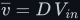
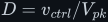
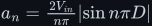

# Pulse-width modulation (PWM)

Deep treatment of PWM: what period, switching frequency, on-time and duty cycle mean; why the
average is <!--m:\overline{v} = D\,V_{in}--><!--/m--> (derived, not asserted); how a microcontroller timer and an
analogue ramp-plus-comparator both make it, and why they are the same idea; the spectrum that
explains why an LC filter recovers the average; and dead time for complementary outputs. Full
argument in [pwm.md](pwm.md).

> **The thesis in one line**
>
> A PWM wave is its average, <!--m:D\,V_{in}--><!--/m-->, plus harmonics that start at the switching frequency —
> so anything slow enough to ignore <!--m:f_{sw}--><!--/m--> sees a voltage set by one number, the duty cycle.

## Contents

The treatment covers:

1. What a PWM wave is — period, frequency, on-time, duty cycle (fig-01).
2. The average is <!--m:D\,V_{in}--><!--/m-->, derived from the integral; the bipolar form <!--m:(2D-1)V--><!--/m-->.
3. Resolution: <!--m:N = f_{clk}/f_{sw}--><!--/m--> steps — 1680 steps (10.7 bits) at 84 MHz and 50 kHz.
4. Timer counter-compare PWM: CNT, ARR, CCR (fig-02).
5. Analogue PWM: triangle plus comparator, <!--m:D = v_{ctrl}/V_{pk}--><!--/m--> (fig-03).
6. Edge-aligned vs. centre-aligned.
7. The spectrum <!--m:a_n = \tfrac{2V_{in}}{n\pi}\lvert\sin n\pi D\rvert--><!--/m--> and the LC filter (fig-04).
8. Motors, LEDs, converters: who does the averaging.
9. Complementary outputs, shoot-through and dead time (fig-05).
10. From constant <!--m:D--><!--/m--> to a sinusoidal <!--m:D(t)--><!--/m--> — the bridge to SPWM.
11. What this costs you.
12. Sources and cross-links.

Figures 66–70.

## Reading order

Read after the [inductor](../fundamentals/inductor/) and [capacitor](../fundamentals/capacitor/)
laws; it pairs with the [buck converter](../dc-dc-converters/buck/) (a PWM wave plus an LC filter)
and leads directly into [SPWM inverters](../dc-ac-inverters/spwm/).

## Links

- Style guide: [../STYLE.md](../STYLE.md)
- The filter that recovers the average: [../filters/lc-filter/](../filters/lc-filter/)
- PWM with a sinusoidal duty cycle: [../dc-ac-inverters/spwm/](../dc-ac-inverters/spwm/)
- The bridge it drives: [../dc-ac-inverters/h-bridge/](../dc-ac-inverters/h-bridge/)
