# Pulse-width modulation — controlling an average by switching fast

A switch can only be fully ON or fully OFF; it cannot "half conduct" without burning the
difference as heat. Pulse-width modulation (PWM) gets an in-between value anyway: it flips the
switch so fast that whatever is downstream only responds to the *time average*, and it sets that
average by choosing what fraction of each period the switch spends ON. Every converter in this
tree, from the [buck](../dc-dc-converters/buck/) to the
[SPWM inverter](../dc-ac-inverters/spwm/), is driven this way.

**Contents**

1. [What a PWM wave is](#1-what-a-pwm-wave-is)
2. [The average is D times the amplitude — derived](#2-the-average-is-d-times-the-amplitude--derived)
3. [Resolution — how finely you can set D](#3-resolution--how-finely-you-can-set-d)
4. [Making PWM in a microcontroller — counter and compare](#4-making-pwm-in-a-microcontroller--counter-and-compare)
5. [Making PWM with analogue parts — ramp and comparator](#5-making-pwm-with-analogue-parts--ramp-and-comparator)
6. [Edge-aligned vs. centre-aligned](#6-edge-aligned-vs-centre-aligned)
7. [The spectrum — why a filter recovers the average](#7-the-spectrum--why-a-filter-recovers-the-average)
8. [Where the average goes — motors, LEDs, converters](#8-where-the-average-goes--motors-leds-converters)
9. [Complementary outputs and dead time](#9-complementary-outputs-and-dead-time)
10. [From constant D to a moving D — the step to SPWM](#10-from-constant-d-to-a-moving-d--the-step-to-spwm)
11. [What this costs you](#11-what-this-costs-you)
12. [Sources and cross-links](#12-sources-and-cross-links)

> **The thesis in one line**
>
> A PWM wave is a DC level plus harmonics that all sit at multiples of the switching frequency;
> the DC level is exactly <!--m:D\,V_{in}-->, so anything slow enough to ignore the harmonics — a
> motor's inertia, your eye, an LC filter — sees a voltage you set with one number, the duty cycle.

---

## 1 What a PWM wave is

A PWM signal is a rectangular wave that repeats every **period** <!--m:T-->. Its **switching
frequency** is the number of periods per second, <!--m:f_{sw} = 1/T-->. In each period the signal is
high (the switch is ON, the output sits at <!--m:V_{in}-->) for an **on-time** 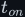<!--m:t_{on}-->, and low (switch
OFF, output at 0 V) for the rest. The **duty cycle** is the fraction of the period spent high:

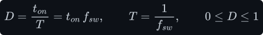

So a PWM wave is fully described by two numbers: how often it repeats (<!--m:f_{sw}-->) and what
fraction of each repetition it is ON (<!--m:D-->). The amplitude <!--m:V_{in}--> is whatever the switch is
connected to; PWM does not change it.

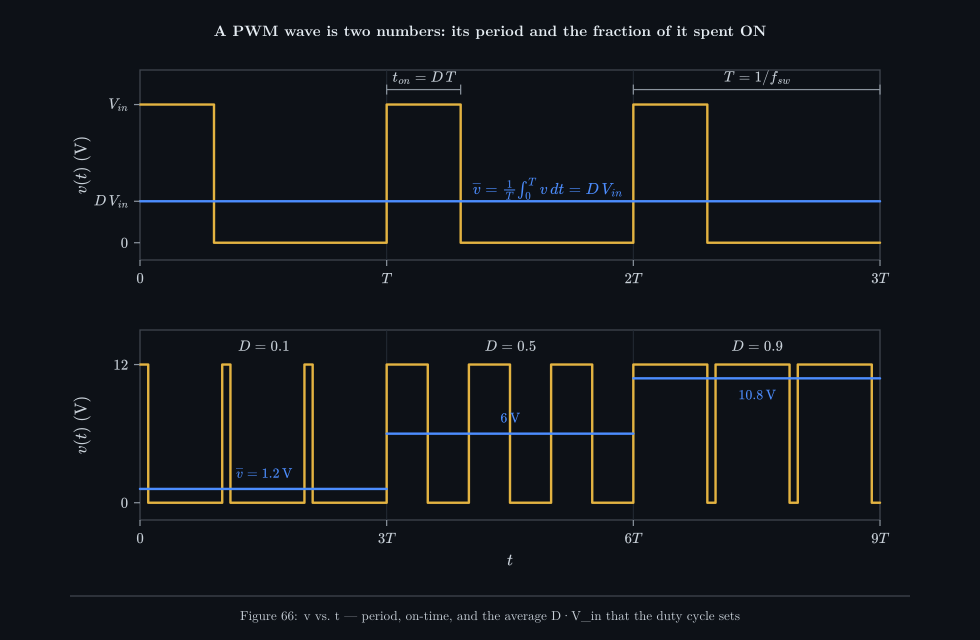

_Top: one PWM wave with its period and on-time marked; the blue line is its average. Bottom: the
same 12 V switched at three duty cycles — the average moves from 1.2 V to 6 V to 10.8 V while the
pulse height never changes. Only the width carries the information._

> **Note —** "Pulse-*width*" is literal: the information is in the width of each pulse, not its
> height. Two PWM waves with the same <!--m:D--> have the same average whatever their frequency; the
> frequency only decides how hard the ripple is to filter out (§7).

## 2 The average is D times the amplitude — derived

The average of any periodic signal is its integral over one period divided by the period — the
area under one cycle, spread evenly across the cycle:

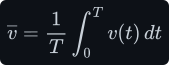

For a PWM wave the integrand is piecewise constant: <!--m:V_{in}--> for the first <!--m:D T--> seconds and 0 for
the remaining 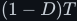<!--m:(1-D) T-->. Split the integral at the switching instant and each piece is just a
rectangle (height times width):

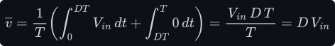

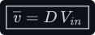

That is all there is to it: the period cancels, so the average depends only on the duty cycle and
the amplitude. Doubling the frequency at the same <!--m:D--> leaves the average unchanged.

If the switch instead flips the output between <!--m:+V--> and <!--m:-V--> (as an H-bridge does — see
[../dc-ac-inverters/h-bridge/](../dc-ac-inverters/h-bridge/)), the same rectangle argument gives:

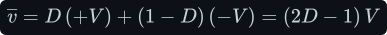

Now <!--m:D = 0.5--> means 0 V average, <!--m:D = 1--> means <!--m:+V--> and <!--m:D = 0--> means <!--m:-V-->. Keep this one in mind:
it is the formula the [SPWM inverter](../dc-ac-inverters/spwm/) runs on.

## 3 Resolution — how finely you can set D

A digital PWM cannot produce any duty cycle; it produces one of a finite set. A timer counts clock
ticks at 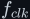<!--m:f_{clk}--> and one PWM period lasts <!--m:N--> ticks, so the on-time can only be a whole number of
ticks. The number of steps, the smallest change in duty, and the equivalent number of bits are:

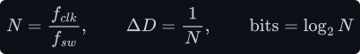

A typical STM32 timer clocked at 84 MHz running a 50 kHz PWM:

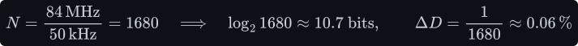

On a 12 V supply that is a smallest average-voltage step of:

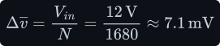

The catch is that <!--m:N--> and <!--m:f_{sw}--> share a fixed budget, the clock. Raise the switching frequency
and you lose steps in direct proportion:

This is the central trade-off of digital PWM: a higher <!--m:f_{sw}--> makes the ripple easier to filter
(§7) but makes <!--m:D--> coarser. A converter regulating to 0.1 % needs roughly 1000 steps, which on an
84 MHz clock caps it near 84 kHz unless the chip has a high-resolution timer (some parts
interpolate edges to a fraction of a tick, e.g. 184 ps steps on STM32 HRTIM).

## 4 Making PWM in a microcontroller — counter and compare

A microcontroller timer has three registers that matter: a **counter** (CNT) that increments on
every clock tick (after an optional prescaler PSC), an **auto-reload register** (ARR) at which the
counter wraps back to 0, and a **capture/compare register** (CCR). A comparator in the hardware
watches CNT continuously and drives the output pin:

- output **high** while CNT < CCR,
- output **low** while CNT ≥ CCR.

The counter ramps 0, 1, 2, … ARR, 0, 1, … — a digital sawtooth. Comparing that sawtooth with the
fixed number in CCR produces a pulse whose width is proportional to CCR:

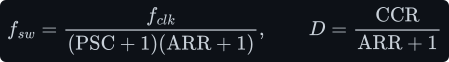

Changing the duty cycle is a single register write to CCR; the hardware takes the new value at the
next wrap, so the pulse in progress is never cut short. The CPU does nothing per cycle.

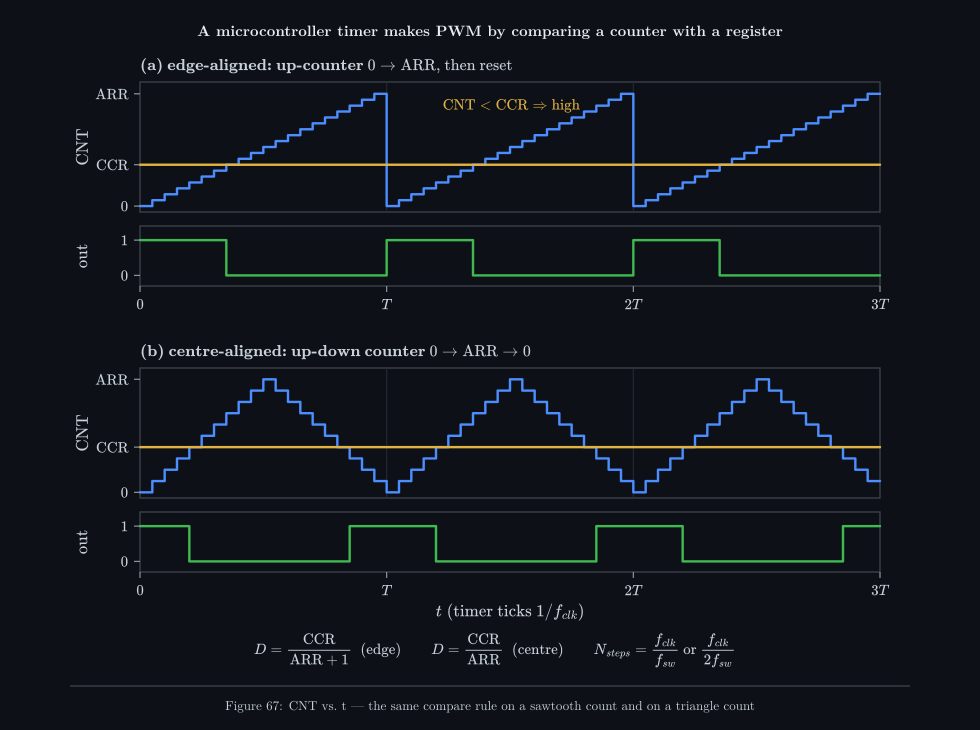

_(a) An up-counter (blue staircase) compared with CCR (amber): the output is high while the count
is below the line. (b) The same rule on an up-down count gives a pulse centred in the period. Each
step of the staircase is one clock tick — that granularity is the resolution of §3._

## 5 Making PWM with analogue parts — ramp and comparator

Before microcontrollers, and still inside most analogue controller ICs, PWM was made from two
signals and a comparator: a **triangle (or sawtooth) wave** at <!--m:f_{sw}-->, and a slowly-varying
**control voltage** 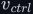<!--m:v_{ctrl}-->. The comparator's output is high whenever <!--m:v_{ctrl}--> is above the
triangle. Nothing else is needed.

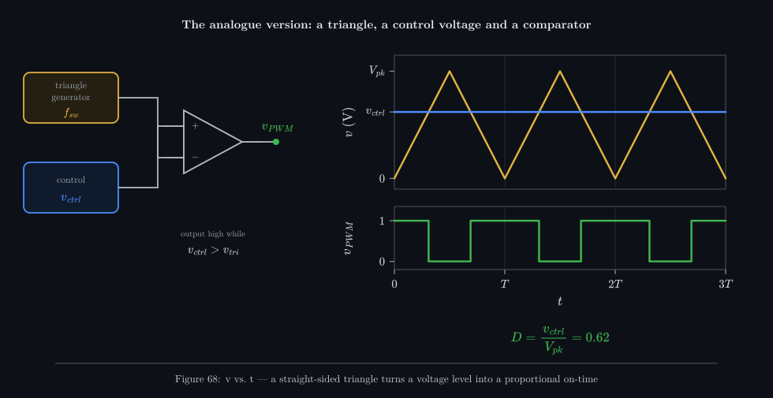

_The comparator only answers one question — which input is higher? — but because the triangle
rises and falls in straight lines, the time it spends below the control level is proportional to
that level. A voltage becomes a width._

Why is the on-time proportional? Because the triangle is a straight line. On its rising half it
goes from 0 to its peak <!--m:V_{pk}--> in half a period, so its value is a fixed multiple of time, and
the crossing instant 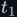<!--m:t_1--> is found by setting it equal to the control voltage:

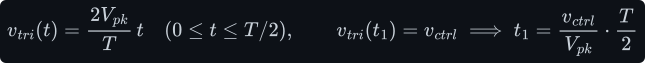

The falling half is the mirror image, so the output is high for <!--m:t_1--> on each side of every valley:

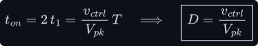

**It is the same idea as §4.** The timer's counter *is* a sawtooth (a staircase of clock ticks)
and CCR *is* the control level; the hardware compare *is* the comparator. Digital PWM is the
analogue ramp-and-comparator with the ramp quantised into ticks. Keep this picture: the
[SPWM inverter](../dc-ac-inverters/spwm/) is exactly this circuit with <!--m:v_{ctrl}--> replaced by a sine
wave.

> **Tip —** The triangle must be *linear*. If the ramp bows (an RC charge curve instead of a
> constant-current ramp), the on-time is no longer proportional to <!--m:v_{ctrl}--> and the converter's
> gain changes with operating point.

## 6 Edge-aligned vs. centre-aligned

The two counting modes in Figure 67 produce the same average but different pulse positions.

- **Edge-aligned** (up-counter, sawtooth): every pulse starts at the beginning of the period. All
  channels of a timer switch on at the same instant, which bunches the current steps together.
- **Centre-aligned** (up-down counter, triangle): every pulse is centred on the middle of the
  period (here, the counter's valley). The period now takes 2·ARR ticks, so at the same clock the
  resolution halves:

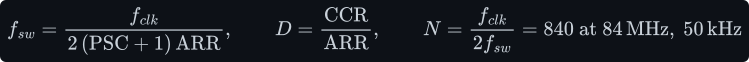

Centre-aligned PWM is preferred for motor drives and inverters: the pulses of different phases are
symmetrical about the same instant, and the
midpoint of each pulse is the ideal moment to sample the current (it equals the cycle average).
It is also the digital twin of the triangle carrier used in [SPWM](../dc-ac-inverters/spwm/).

## 7 The spectrum — why a filter recovers the average

A PWM wave is not "a DC voltage with some noise". By Fourier's theorem (see
[../fundamentals/signals/](../fundamentals/signals/)) any periodic wave is a sum of a constant plus
sinusoids at whole-number multiples of its repetition frequency. For PWM:

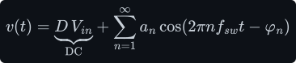

The DC term is exactly the average from §2. The harmonic amplitudes are quickest to get in the
*complex* form of the Fourier coefficients. Euler's formula, 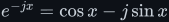<!--m:e^{-jx} = \cos x - j\sin x--> with
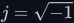<!--m:j = \sqrt{-1}-->, packs the cosine and sine coefficient integrals of
[../fundamentals/signals/edges-and-fourier.md §5](../fundamentals/signals/edges-and-fourier.md#5-orthogonality--the-trick-that-makes-it-work)
into one: 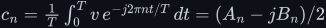<!--m:c_n = \tfrac{1}{T}\int_0^T v\,e^{-j2\pi nt/T}\,dt = (A_n - j B_n)/2-->, where 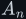<!--m:A_n--> and 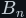<!--m:B_n-->
are that section's cosine and sine coefficients (named 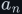<!--m:a_n-->, 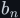<!--m:b_n--> there). So the peak amplitude
of harmonic <!--m:n-->, 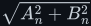<!--m:\sqrt{A_n^2 + B_n^2}--> — the <!--m:a_n--> of the series above — is 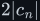<!--m:2|c_n|-->. For PWM the integral runs over the ON interval
only (the OFF interval contributes nothing because the signal is 0 there), and the exponential
integrates like any exponential:

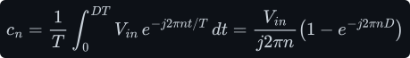

The bracket has magnitude twice a sine: factor out 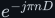<!--m:e^{-j\pi nD}--> to get
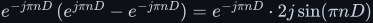<!--m:e^{-j\pi nD}\,(e^{j\pi nD} - e^{-j\pi nD}) = e^{-j\pi nD} \cdot 2j\sin(\pi nD)-->, by Euler's formula
again, and the factor in front has size 1. That gives the peak amplitude of the *n*th harmonic:

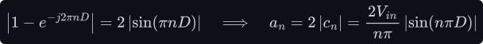

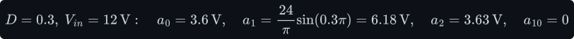

Three facts fall straight out of that formula. **(i)** There is *nothing* between DC and
<!--m:f_{sw}-->: the lowest unwanted frequency is the switching frequency itself. **(ii)** Harmonics fall
off as <!--m:1/n-->. **(iii)** Harmonic <!--m:n--> vanishes whenever 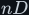<!--m:nD--> is a whole number (at <!--m:D = 0.5--> every
even harmonic is gone; at <!--m:D = 0.3--> the 10th is).

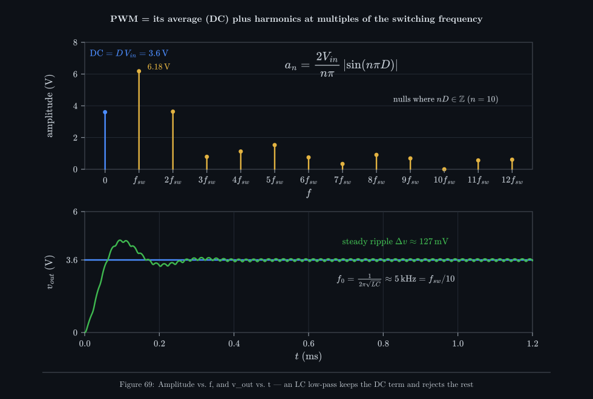

_Top: the exact Fourier amplitudes of a 12 V, 30 % PWM wave — one DC bar and a comb at multiples
of the switching frequency. Bottom: the same wave at 50 kHz through a simulated 100 µH / 10 µF
filter into 4 Ω: after the start-up overshoot it sits on 3.6 V with about 0.13 V of ripple._

So recovering the average is a filtering problem with a very convenient shape: keep DC, reject
everything at <!--m:f_{sw}--> and above. A second-order LC low-pass (see
[../filters/lc-filter/](../filters/lc-filter/)) does this with an attenuation that grows as the
square of frequency above its corner:

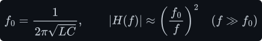

For the filter in Figure 69:

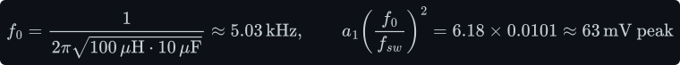

63 mV peak is 126 mV peak-to-peak — the 127 mV the simulation measured. Place the corner a decade
below <!--m:f_{sw}--> and the first harmonic is cut 100-fold; a higher <!--m:f_{sw}--> lets the same attenuation
come from a smaller <!--m:L--> and <!--m:C-->. That is the whole reason converters switch fast.

## 8 Where the average goes — motors, LEDs, converters

Different loads do the averaging for you, in different ways:

- **DC motors.** The winding inductance smooths the current (its time constant is typically a
  few milliseconds, far longer than a 20 kHz period), and the rotor's inertia smooths the speed
  further. The motor runs as if fed <!--m:D\,V_{in}-->. Pick <!--m:f_{sw}--> above about 20 kHz or the
  winding whines audibly at the switching frequency.
- **LEDs.** An LED does not average at all — it flashes at full brightness — but your eye
  integrates over roughly 10–20 ms, so perceived brightness tracks <!--m:D-->. Frequencies above a few
  hundred hertz look steady; above about 1–3 kHz avoids flicker on camera sensors. Because the
  current at each instant is the full rated current, colour stays constant as you dim, unlike
  analogue dimming.
- **Switching converters.** The [buck](../dc-dc-converters/buck/) uses an explicit LC filter, and
  its <!--m:V_{out} = D\,V_{in}--> is the §2 result: the inductor's volt-second balance forces the
  output to the switch node's average. The [boost](../dc-dc-converters/boost/) uses the same
  switching but a different topology, so its ratio is <!--m:1/(1-D)-->. The soft-start ramp in
  [../dc-dc-converters/buck/startup.md](../dc-dc-converters/buck/startup.md) is simply <!--m:D--> raised slowly from 0.
- **Heaters, solenoids, servos.** Heaters average thermally (seconds), so their PWM can be very
  slow; RC servos read the pulse width itself (1–2 ms in a 20 ms frame) as a position command.

## 9 Complementary outputs and dead time

A half-bridge or [H-bridge](../dc-ac-inverters/h-bridge/) leg has two switches stacked across the
supply: a high-side switch to <!--m:+V_{dc}--> and a low-side switch to ground. Driving the output
high means turning the top one ON and the bottom one OFF; driving it low is the reverse. So the two
gates get **complementary** PWM signals, 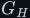<!--m:G_H--> and its inverse 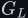<!--m:G_L-->.

If you literally invert one signal to make the other, both switches change state at the same
instant — and real MOSFETs and IGBTs (insulated-gate bipolar transistors, the other common power switch)
turn OFF more slowly than they turn ON. For a few tens or
hundreds of nanoseconds both conduct at once, shorting the supply straight through the leg
(**shoot-through**). The current is limited only by stray resistance; the parts heat up or fail.

The fix is **dead time**: every turn-ON edge is delayed by <!--m:t_d-->, so that after one switch turns
OFF, both stay OFF for <!--m:t_d--> before the other turns ON.

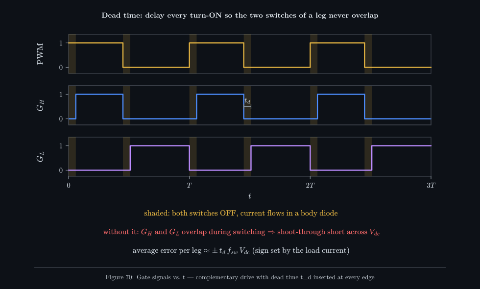

_The command PWM, and the two gate signals derived from it. In the shaded windows both switches
are OFF; the load current keeps flowing through one switch's body diode (the diode built into every power
MOSFET, see [../dc-ac-inverters/h-bridge/h-bridge.md §5](../dc-ac-inverters/h-bridge/h-bridge.md#5-the-mosfet-as-a-switch)), so the output voltage
during those windows is set by the current's direction, not by the controller._

Dead time costs accuracy. During each window the output follows the current, not the command, so
the average is shifted by a small amount whose sign follows the load current:

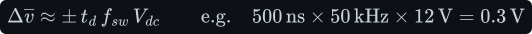

Typical <!--m:t_d--> is 100 ns to 1 µs, set in the timer (STM32 advanced timers have a DTG field in the
BDTR register), in the gate-driver IC (several half-bridge drivers have a fixed internal dead
time), or with an RC delay. Too short risks shoot-through; too long wastes voltage and, in an
inverter, distorts the sine near each current zero crossing.

## 10 From constant D to a moving D — the step to SPWM

Everything above assumed <!--m:D--> is fixed, or changes slowly as a control loop adjusts it. Nothing in
the hardware requires that. Write a new CCR every period, or replace the analogue <!--m:v_{ctrl}--> with
a moving signal, and the switching-cycle average becomes a function of time,
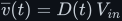<!--m:\overline{v}(t) = D(t)\,V_{in}-->. Make <!--m:D(t)--> follow a sine and the filtered output *is* a
sine — that is a DC-to-AC inverter. The details (why the comparator against a triangle gives
exactly the right <!--m:D(t)-->, how high the carrier must be, where the harmonics land) are in
[../dc-ac-inverters/spwm/](../dc-ac-inverters/spwm/).

## 11 What this costs you

- **Switching losses grow with frequency.** Every edge dissipates roughly
  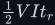<!--m:\tfrac12 V I t_r--> (or 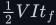<!--m:\tfrac12 V I t_f-->) in the switch, the triangle of overlapping voltage and
  current derived in
  [../fundamentals/transformer/transformer.md §15](../fundamentals/transformer/transformer.md#15-core-loss--the-ceiling-on-frequency),
  and there are two per period, so loss is
  proportional to <!--m:f_{sw}-->. This is the counterweight to the smaller filter a high <!--m:f_{sw}--> allows.
- **Resolution falls with frequency.** <!--m:N = f_{clk}/f_{sw}-->: at 84 MHz you have 1680
  steps at 50 kHz but only 168 at 500 kHz (§3).
- **EMI.** Fast edges with large <!--m:dv/dt--> radiate and couple capacitively into everything
  nearby; the harmonic comb of §7 extends to many times <!--m:f_{sw}-->. Layout, snubbers and input
  filters are part of the price.
- **Audible noise.** Below about 20 kHz, inductors and motor windings magnetostrict and whine at
  <!--m:f_{sw}-->.
- **Dead-time error and the shoot-through risk** (§9) — a correctness cost you cannot design away,
  only minimise.
- **The average is only the average.** The load still sees the full pulse height at every instant.
  A component rated for <!--m:D\,V_{in}--> but not for <!--m:V_{in}--> will fail even though the
  meter reads the safe value.

## 12 Sources and cross-links

- Where <!--m:V_{out} = D\,V_{in}--> is used in a real circuit, via volt-second balance:
  [../dc-dc-converters/buck/](../dc-dc-converters/buck/), and the step-up mirror
  [../dc-dc-converters/boost/](../dc-dc-converters/boost/).
- The filter that recovers the average: [../filters/lc-filter/](../filters/lc-filter/).
- Fourier series and spectra: [../fundamentals/signals/](../fundamentals/signals/).
- The bridge whose legs need complementary drive and dead time:
  [../dc-ac-inverters/h-bridge/](../dc-ac-inverters/h-bridge/).
- PWM with a sinusoidally varying duty cycle: [../dc-ac-inverters/spwm/](../dc-ac-inverters/spwm/).
- Inductor and capacitor laws behind the filter:
  [../fundamentals/inductor/](../fundamentals/inductor/), [../fundamentals/capacitor/](../fundamentals/capacitor/).
- Background: N. Mohan, T. Undeland, W. Robbins, *Power Electronics: Converters, Applications and
  Design*, ch. 7–8; ST application note AN4013, *STM32 cross-series timer overview*.
- Style and figure conventions: [../STYLE.md](../STYLE.md).
