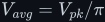
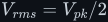
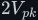
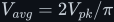
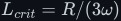
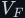

# Rectifiers — turning AC back into DC

A rectifier is the stage that makes current flow one way only, and its smoothing capacitor is what
turns that one-way current into a usable DC rail. In the 12 V → 230 V inverter from the video, the
rectifier sits right in the middle: H-bridge 1 and a 50 kHz step-up transformer produce a 325 V
square wave, and a full bridge of four diodes plus one capacitor turns it into the **325 V DC bus**
that H-bridge 2 chops into a sine. This topic builds that stage from the diode up, with every
integral and every sizing formula derived, and answers the question the video leaves open: why the
bus is smoothed with a capacitor only, and not with an inductor as well.

> **The thesis in one line**
>
> Diodes pass current one way; a bridge of four uses both half-cycles; a reservoir capacitor holds
> the result near the peak with ripple <!--m:\Delta V \approx I_{load}/(2fC)--><!--/m-->. At 50 kHz that capacitor
> is a thousand times smaller than at 50 Hz, and with a square-wave input it barely works at all —
> which is why the inverter needs no smoothing inductor on its DC bus.

## Documents

| Document | Key results | What it covers |
|---|---|---|
| [half-wave.md](half-wave.md) | <!--m:V_{avg} = V_{pk}/\pi--><!--/m-->, <!--m:V_{rms} = V_{pk}/2--><!--/m-->, <!--m:\Delta V \approx I_{load}/(fC)--><!--/m--> | the diode: Shockley I–V curve, forward drop of Si vs Schottky vs SiC, reverse blocking and PIV, **reverse recovery and why it decides the diode at 50 kHz**; the half-wave rectifier with every integral done in full, form and ripple factors, the reservoir capacitor, the <!--m:2V_{pk}--><!--/m--> PIV, and the DC it forces into a transformer winding (figures 80–82) |
| [full-bridge.md](full-bridge.md) | <!--m:V_{avg} = 2V_{pk}/\pi--><!--/m-->, <!--m:V_{rms} = V_{pk}/\sqrt{2}--><!--/m-->, <!--m:\Delta V \approx I_{load}/(2fC)--><!--/m-->, <!--m:L_{crit} = R/(3\omega)--><!--/m--> | centre-tapped full-wave, the bridge's two conduction paths, PIV, ripple at <!--m:2f--><!--/m-->, the reservoir capacitor cycle, conduction angle and the tall current pulses (derived peak current), the thousandfold capacitor at 50 kHz, power factor and mains harmonics, **rectifying a square wave**, **why only a capacitor and not an LC filter**, inrush and NTC/soft start, honest costs (figures 83–89) |

## Reading order

1. [half-wave.md](half-wave.md) — the diode and the simplest rectifier; the integrals here are
   reused by the bridge.
2. [full-bridge.md](full-bridge.md) — the rectifier the inverter actually uses, and the
   capacitor-versus-inductor question (§10).

Prerequisites: the capacitor law <!--m:I_C = C\,dV_C/dt--><!--/m-->
([../fundamentals/capacitor/](../fundamentals/capacitor/)) and the inductor law
([../fundamentals/inductor/](../fundamentals/inductor/)). RMS and Fourier background is in
[../fundamentals/signals/](../fundamentals/signals/).

## Where it fits

- **Upstream:** the H-bridge that makes the square wave
  ([../dc-ac-inverters/h-bridge/](../dc-ac-inverters/h-bridge/)) and the transformer that steps it
  up ([../fundamentals/transformer/](../fundamentals/transformer/)).
- **Downstream:** H-bridge 2 and SPWM ([../dc-ac-inverters/spwm/](../dc-ac-inverters/spwm/)), then
  the output LC filter ([../filters/lc-filter/](../filters/lc-filter/)).
- **Relatives:** the buck converter's LC filter, which forward and full-bridge DC-DC converters put
  after their rectifier ([../dc-dc-converters/buck/](../dc-dc-converters/buck/)); soft start for
  the bus capacitor ([../dc-dc-converters/startup.md](../dc-dc-converters/startup.md)).

## Conventions

Follows [../STYLE.md](../STYLE.md). <!--m:V_{pk}--><!--/m--> is the peak of the AC input (325 V in the inverter),
<!--m:f--><!--/m--> its frequency, <!--m:V_F--><!--/m--> one diode's forward drop, <!--m:I_{load}--><!--/m--> the DC load current, and <!--m:\Delta V--><!--/m--> the
peak-to-peak output ripple. Every waveform in figures 82–89 is a numerical simulation from
`toolchain/parts/rectifiers.js`, not a sketch.
