# The full-bridge rectifier and the reservoir capacitor — making the 325 V DC bus

The inverter in the video has a step in the middle that is easy to skip over: after H-bridge 1 and
the 50 kHz step-up transformer have turned 12 V DC into a 325 V square wave, four diodes and one
capacitor turn that square wave back into 325 V of DC. This document derives everything about that
step — the bridge's two conduction paths, the average and RMS values, the reservoir capacitor's
ripple, the tall charging-current pulses and the power factor they cause, what changes when the
input is a square wave instead of a sine, inrush at switch-on — and answers properly the question
that the slide raises and does not answer:

**Why only a capacitor? Why smooth only the voltage, and not the current too, with an inductor?**

**Contents**

1. [Where the rectifier sits in the inverter](#1-where-the-rectifier-sits-in-the-inverter)
2. [Full-wave with a centre-tapped transformer](#2-full-wave-with-a-centre-tapped-transformer)
3. [The full bridge](#3-the-full-bridge)
4. [Average, RMS and the ripple at 2f](#4-average-rms-and-the-ripple-at-2f)
5. [The reservoir capacitor](#5-the-reservoir-capacitor)
6. [Conduction angle and the tall current pulses](#6-conduction-angle-and-the-tall-current-pulses)
7. [50 Hz versus 50 kHz — the thousandfold capacitor](#7-50-hz-versus-50-khz--the-thousandfold-capacitor)
8. [Power factor and harmonics on the mains](#8-power-factor-and-harmonics-on-the-mains)
9. [Rectifying a square wave — the inverter's case](#9-rectifying-a-square-wave--the-inverters-case)
10. [Why only a capacitor — and not an LC filter](#10-why-only-a-capacitor--and-not-an-lc-filter)
11. [Inrush at power-up](#11-inrush-at-power-up)
12. [What this costs you](#12-what-this-costs-you)
13. [Sources and cross-links](#13-sources-and-cross-links)

> **The thesis in one line**
>
> A bridge flips the negative half-cycles up so that every half-cycle refills the capacitor, which
> then holds the bus near the *peak* <!--m:V_{pk}--><!--/m--> with ripple <!--m:\Delta V \approx I_{load}/(2fC)--><!--/m-->. Rectify at
> 50 kHz instead of 50 Hz and the capacitor shrinks a thousandfold; rectify a *square* wave and it
> barely has to work at all. A capacitor alone is the right filter here because the next stage
> wants a stiff voltage source near the peak, and a square wave's current is already smooth — an
> inductor would only be needed if the transformer's output were a variable-width pulse train.

---

## 1 Where the rectifier sits in the inverter

The pipeline from the video (slide 25) is: 12 V battery → H-bridge 1 → 12 V square wave at
50 000 Hz → transformer → 325 V square wave → **rectifier → 325 V DC** → H-bridge 2 (SPWM) →
LC filter → 230 V AC. Slide 6 zooms in on the highlighted box: a diamond of four diodes across the
transformer secondary, and one smoothing capacitor across the load.

The transformer steps the voltage up by its turns ratio. To land the bus at about 325 V — the peak
of 230 V RMS, <!--m:230\sqrt{2} \approx 325\,\mathrm{V}--><!--/m-->, so that H-bridge 2 can synthesise a full mains
sine — the ratio must cover the bridge's two diode drops as well:

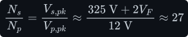

Why rectify at all, when the transformer already delivers 325 V? Because what comes out of the
transformer is AC at 50 kHz, and what H-bridge 2 needs is a fixed DC rail it can chop into a
50 Hz sine with SPWM ([../dc-ac-inverters/spwm/](../dc-ac-inverters/spwm/)). The transformer can
only pass change — it cannot pass DC ([../fundamentals/transformer/](../fundamentals/transformer/))
— so the step-up has to happen in AC, and then be turned back into DC. The high frequency is what
makes the transformer small; §7 shows it makes the capacitor small too.

## 2 Full-wave with a centre-tapped transformer

The [half-wave rectifier](half-wave.md) wastes every negative half-cycle and puts DC into the
transformer winding. The first fix uses a secondary with a **centre tap**: two diodes, one on each
end of the winding, cathodes joined at the output, and the centre tap as the return. On the positive
half-cycle the top half of the winding drives current through the top diode; on the negative
half-cycle the bottom half drives it through the bottom diode. Both halves push current into the
load in the same direction:

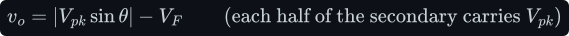

Its strengths are one diode drop per path and only two diodes, which is why low-voltage,
high-current supplies (5 V, 12 V outputs) use it. Its costs are a winding twice as long, each half
of which works only half the time, and a **PIV of <!--m:2V_{pk}--><!--/m-->** per diode: when one diode conducts,
the other sees the full voltage across the *whole* secondary. For a 325 V bus the bridge is the
better trade.

## 3 The full bridge

Four diodes arranged in a diamond. The AC source connects to the left and right corners; the DC
output is taken from the top (where two cathodes meet: <!--m:+--><!--/m-->) and the bottom (where two anodes meet:
<!--m:---><!--/m-->).

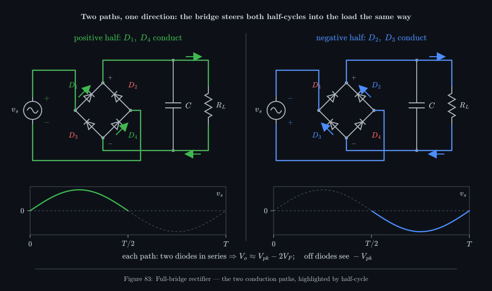

_Follow the coloured loop. When the left terminal is positive (green), current goes up through
<!--m:D_1--><!--/m-->, down through the load from top to bottom, and back through <!--m:D_4--><!--/m-->. When the right terminal is
positive (blue), it goes up through <!--m:D_2--><!--/m-->, through the load in the same direction, and back through
<!--m:D_3--><!--/m-->. The load cannot tell which half-cycle it is in._

Three facts fall straight out of the two paths:

- **Both half-cycles are used**, and the winding carries current in both directions, so its
  average current is zero — no DC in the transformer, no saturation problem.
- **Every path crosses two diodes in series**, so the output is the input magnitude minus *two*
  forward drops:

  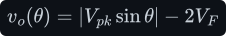

  At 325 V that is about 1.8–3 V lost (0.6–0.9 %), depending on the diode type.
- **Each blocking diode sees only <!--m:V_{pk}--><!--/m-->.** On the positive half-cycle, <!--m:D_2--><!--/m--> has its cathode at
  the top rail and its anode at the right terminal; with the conducting diodes' drops neglected,
  the voltage across it is just the source voltage. Comparing all three rectifiers:

  

  So a 600 V or 650 V ultrafast or SiC diode is right for a 325 V bus, leaving margin for the
  leakage-inductance ringing discussed in [half-wave.md §3](half-wave.md#3-reverse-recovery-and-why-it-decides-everything-at-50-khz).

## 4 Average, RMS and the ripple at 2f

With no filter the output is <!--m:\lvert V_{pk}\sin\theta\rvert--><!--/m-->: the half-wave humps with the gaps
filled in. The waveform now repeats every <!--m:\pi-->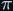<!--/m--> radians instead of every <!--m:2\pi--><!--/m-->, so one integral
over a single hump is the whole story.

**Average.** Area of one hump over its length <!--m:\pi--><!--/m-->:

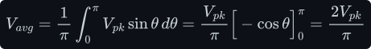

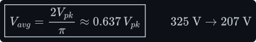

Exactly twice the half-wave's <!--m:V_{pk}/\pi--><!--/m-->, as it must be: the same area, twice as often.

**RMS.** Using the same <!--m:\int_0^\pi \sin^2\theta\,d\theta = \pi/2-->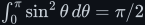<!--/m--> proved in
[half-wave.md §6](half-wave.md#6-the-rms-value-by-integration):

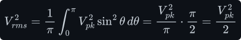

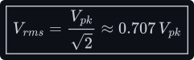

This is the same RMS as the unrectified sine — of course: squaring removes the sign, so
<!--m:\lvert\sin\rvert^2 = \sin^2--><!--/m-->, and a resistor heats identically either way. Only the *average* is
changed by rectification.

**Figures of merit**, by the same definitions as [half-wave.md §7](half-wave.md#7-form-factor-ripple-factor-and-efficiency):

**The ripple frequency doubles.** The Fourier series of the rectified sine contains only the DC
term and *even* harmonics of the source. It follows from the half-wave series of
[half-wave.md §7](half-wave.md#7-form-factor-ripple-factor-and-efficiency): <!--m:|\sin\theta|--><!--/m--> is the
half-wave output plus a copy of it delayed by half a cycle, <!--m:\theta \to \theta + \pi-->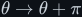<!--/m-->. The delay
flips the sign of <!--m:\sin\theta--><!--/m--> but leaves the DC term and every <!--m:\cos 2k\theta--><!--/m--> unchanged, so in
the sum the fundamental cancels and the rest doubles:

The half-wave's large component at <!--m:f--><!--/m--> has cancelled. The lowest ripple component sits at <!--m:2f--><!--/m--> —
100 Hz on 50 Hz mains, **100 kHz in the inverter** — with amplitude <!--m:4V_{pk}/(3\pi) \approx 0.42\,V_{pk}-->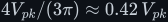<!--/m-->.
Higher frequency is easier to filter; §5 shows by how much.

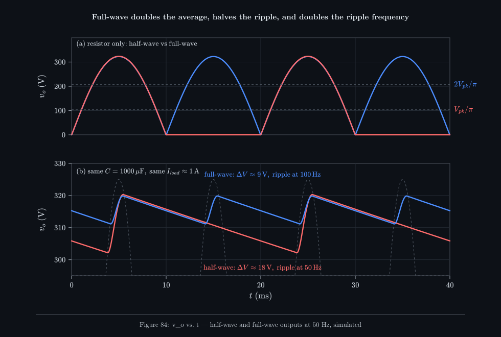

_(a) The bridge fills in the missing humps, doubling the average from 103 V to 207 V. (b) Add the
same 1000 µF capacitor to both and the bridge's ripple is half as large (9 V against 18 V) and twice
as frequent, because the capacitor is refilled every half-cycle instead of every cycle._

## 5 The reservoir capacitor

Without a capacitor the bridge's "DC" swings from 0 to <!--m:V_{pk}--><!--/m--> a hundred times a second — useless
as a supply. Put a capacitor <!--m:C--><!--/m--> across the output and the cycle becomes:

1. **Charge.** Near each peak of <!--m:\lvert v_s\rvert--><!--/m-->, the source rises above the capacitor voltage
   (plus <!--m:2V_F-->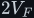<!--/m-->). Two diodes conduct and the source tops the capacitor up to nearly <!--m:V_{pk}--><!--/m-->.
2. **Diodes turn off.** Just after the peak the source starts falling faster than the capacitor
   can, so the diodes become reverse-biased and switch off.
3. **Discharge.** For the rest of the half-cycle the capacitor alone feeds the load. A constant
   load current discharges it in a straight line, slope <!--m:-I_{load}/C--><!--/m--> — the capacitor law
   ([../fundamentals/capacitor/capacitor.md §4](../fundamentals/capacitor/capacitor.md#4-from-the-law-to-the-ramp))
   with the current reversed.
4. **Recharge** begins when the next hump of <!--m:\lvert v_s\rvert--><!--/m--> rises to meet the sagging voltage.

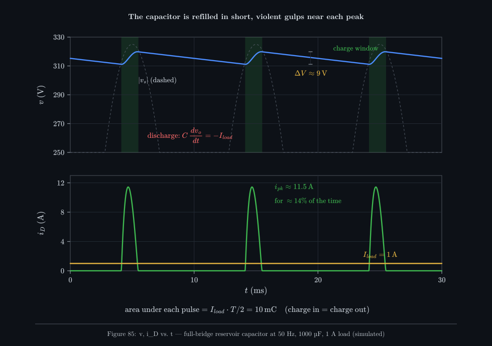

_Top: the output (blue) hugs the peaks and sags in straight lines between them; the green bands are
the only times the diodes conduct. Bottom: all of the charge the load uses over a 10 ms half-cycle
is pushed back into the capacitor during those short windows — so the current must be large._

**The ripple, derived.** During the discharge the capacitor loses charge <!--m:\Delta Q = I_{load}\,\Delta t--><!--/m-->,
and since <!--m:Q = CV--><!--/m-->, its voltage falls by <!--m:\Delta V = \Delta Q / C--><!--/m-->. The discharge lasts almost
the whole half-period (the charging window is short), so <!--m:\Delta t \approx T/2 = 1/(2f)--><!--/m-->:

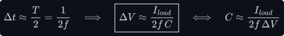

Compare the half-wave's <!--m:\Delta V \approx I_{load}/(fC)--><!--/m--> ([half-wave.md §8](half-wave.md#8-adding-a-reservoir-capacitor)):
the factor 2 is simply that the bridge refills the capacitor twice per cycle. The approximation
slightly overestimates the ripple because it ignores the charging time; it errs on the safe side.

The DC output is then close to the peak, not the average:

- **capacitor input:** <!--m:V_o \approx V_{pk} - 2V_F - \Delta V/2-->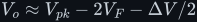<!--/m-->, e.g. about 315 V from a 325 V peak at
  1 A with 1000 µF.

That is the first half of the answer to "why only a capacitor": a capacitor-input filter delivers
roughly <!--m:V_{pk}--><!--/m-->, about 57 % more than the average <!--m:2V_{pk}/\pi-->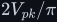<!--/m--> that an inductor would give (§10).

## 6 Conduction angle and the tall current pulses

The capacitor gets all its charge during a short window just before each peak. How short, and how
tall must the current be?

**The conduction angle.** Measure the phase <!--m:\theta--><!--/m--> backwards from the peak, so the source near
the peak is <!--m:V_{pk}\cos\theta-->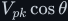<!--/m-->. Conduction starts when the rising source meets the capacitor at its
lowest, <!--m:V_{pk} - \Delta V-->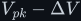<!--/m-->:

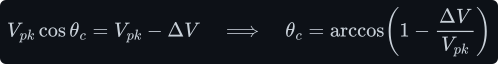

For small ripple, use the first two terms of the cosine series:

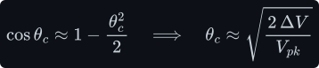

So with 10 V of ripple on a 325 V peak, the diodes conduct for about 0.8 ms out of every 10 ms.

**The average pulse current** follows from charge balance: in steady state, the charge delivered
during <!--m:t_c-->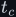<!--/m--> must equal the charge the load drew over the whole half-period:

**The peak current.** During conduction the capacitor voltage follows the source, so the diode
current is the capacitor's current plus the load's. It is largest at the moment conduction begins,
where the source is still rising steeply:

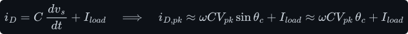

Substitute the capacitor that sets the ripple, <!--m:C = I_{load}/(2f\Delta V)--><!--/m-->, and the angle
<!--m:\theta_c = \sqrt{2\Delta V/V_{pk}}-->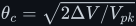<!--/m--> — the <!--m:f--><!--/m--> cancels and so does most of the rest:

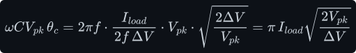

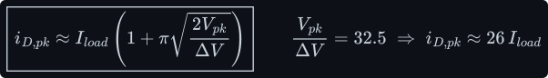

Read the boxed result carefully: **the smaller you make the ripple, the taller the pulses get.**
Better smoothing means a narrower window, and the same charge has to squeeze through it. With an
ideal source the pulse is 26 times the load current. In the simulation of Figure 85 the 0.5 Ω
source resistance (transformer winding and wiring) rounds the pulse off to 11.5 A peak and widens
it to about 14 % of the time; with 0.05 Ω it rises to 17.8 A. Real mains supplies sit in between.

> **Tip —** This is a property of the *frequency-independent* shape. Notice that <!--m:f--><!--/m--> dropped out
> of the peak-current result: rectifying at 50 kHz with a 1 µF capacitor gives exactly the same
> ratio of peak to average current as 50 Hz with 1000 µF. Only the input waveform's shape changes
> that (§9).

## 7 50 Hz versus 50 kHz — the thousandfold capacitor

This is the quiet reason the inverter rectifies at high frequency. Size the capacitor for 10 V of
ripple at 1 A, at both frequencies:

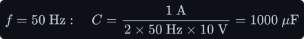

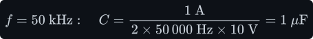

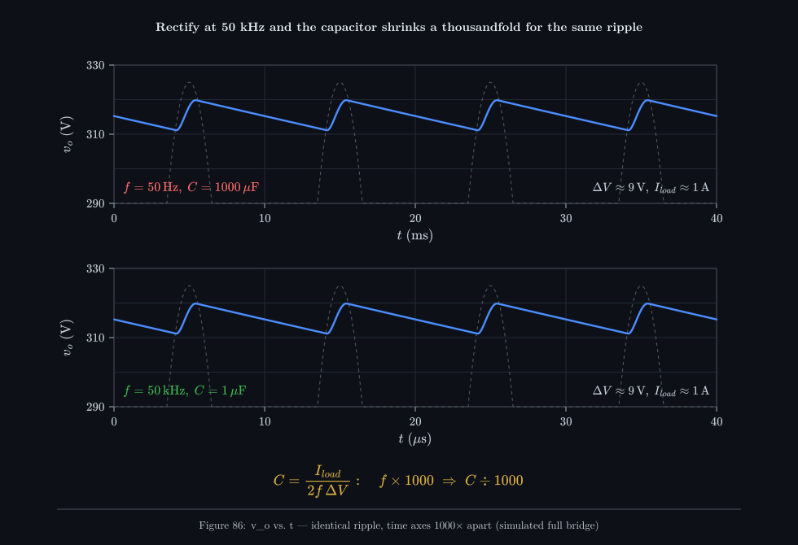

_The two simulations are indistinguishable except for the units on the time axis. The ripple
depends only on how long the capacitor must hold up the load, and at 50 kHz that time is a
thousand times shorter._

A 1000 µF, 400 V electrolytic is a can the size of a fist; a 1 µF, 450 V film capacitor is the
size of a fingertip. The stored energy, which is a rough proxy for size and cost, falls in the same
ratio:

That is the same logic as the transformer itself: at higher frequency each cycle moves less energy,
so every energy-storing part — core, capacitor, inductor — can shrink in proportion
([../dc-dc-converters/buck/buck.md §4](../dc-dc-converters/buck/buck.md#4-sizing-the-inductor)
makes the same point for the inductor through <!--m:f_{sw}--><!--/m-->).

> **Watch out —** The 1 µF covers the *rectifier's* ripple. The bus also feeds H-bridge 2, which
> draws power from it in two ways the rectifier knows nothing about: chopped current pulses at the
> SPWM switching frequency, and a power flow that pulses at 100 Hz because single-phase AC power
> <!--m:p(t) = P\,(1 - \cos 2\omega t)-->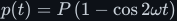<!--/m--> (the <!--m:\sin^2--><!--/m--> of
> [../fundamentals/signals/ac-and-rms.md §4](../fundamentals/signals/ac-and-rms.md#4-why-230-v-peaks-at-325-v))
> swings between zero and twice the average. The bus capacitor
> must source the switching pulses locally (so it needs low ESR and short connections to H-bridge
> 2), and the 100 Hz pulsation must come either from a large bus capacitor or, as in this
> unregulated design, straight back through the transformer from the battery. Real inverters
> therefore still carry tens to hundreds of microfarads on the bus — sized by the load, not by the
> rectifier.

## 8 Power factor and harmonics on the mains

When the bridge is fed straight from the mains — as in every off-line power supply, PC, phone
charger and LED driver — the tall, narrow pulses of §6 are drawn from the grid. The grid voltage is
sinusoidal; the current is not. **Power factor** is the ratio of real power to the product of RMS
voltage and RMS current. Why it splits into two parts: with a sine voltage, the real power
<!--m:P = \tfrac1T\int v\,i\,dt-->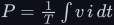<!--/m--> comes only from the current's fundamental, because the product of the
voltage with any *other* harmonic averages to zero (orthogonality,
[../fundamentals/signals/edges-and-fourier.md §5](../fundamentals/signals/edges-and-fourier.md#5-orthogonality--the-trick-that-makes-it-work)).
The fundamental itself contributes <!--m:V_{rms}\,I_{1,rms}\cos\varphi_1-->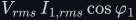<!--/m-->, where <!--m:\varphi_1--><!--/m--> is its phase
shift from the voltage (the mean of <!--m:\sin x\,\sin(x - \varphi)--><!--/m--> is <!--m:\tfrac12\cos\varphi-->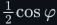<!--/m-->). Meanwhile the
total RMS current is <!--m:I_{1,rms}\sqrt{1 + \text{THD}_I^2}--><!--/m-->
([../fundamentals/signals/ac-and-rms.md §5](../fundamentals/signals/ac-and-rms.md#5-rms-of-other-waveforms)).
Divide:

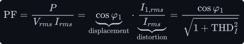

A capacitor-input rectifier's current pulses are centred on the voltage peaks, so the
*displacement* factor <!--m:\cos\varphi_1--><!--/m--> is close to 1. The poor power factor comes almost entirely
from *distortion*: the pulses are rich in odd harmonics (3rd, 5th, 7th … of 50 Hz), which carry
RMS current but no real power. From the simulation of Figure 85:

So the grid must carry 3.0 A RMS to deliver 1 A of DC: three times the copper heating in the
wiring, and harmonic currents that flatten the tops of the mains voltage for everyone on the same
transformer, overheat neutral conductors in three-phase buildings (triplen harmonics add in the
neutral), and are limited by regulation (IEC 61000-3-2) above about 75 W. Larger supplies therefore
add **power-factor correction**: a boost converter after the bridge that shapes the input current
into a sine ([../dc-dc-converters/boost/](../dc-dc-converters/boost/)). The harmonic picture —
why a narrow pulse means many harmonics — is the Fourier argument in
[../fundamentals/signals/](../fundamentals/signals/).

> **Note —** None of this reaches the grid in the video's inverter: its rectifier is fed from a
> transformer driven by a battery, not from the mains, and it is fed a square wave, which (§9) does
> not produce the pulses in the first place.

## 9 Rectifying a square wave — the inverter's case

Everything so far assumed a sine. The inverter's transformer delivers a **square wave**: <!--m:+V_{pk}-->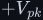<!--/m-->
for almost half a period, a short *dead time* <!--m:t_d--><!--/m--> at zero (both switches of each leg off, to
avoid shoot-through in H-bridge 1 — see [../dc-ac-inverters/h-bridge/](../dc-ac-inverters/h-bridge/)),
then <!--m:-V_{pk}--><!--/m-->, and so on. Rectified, <!--m:\lvert v_s\rvert--><!--/m--> sits at <!--m:V_{pk}--><!--/m--> almost all the time. It is
already nearly DC.

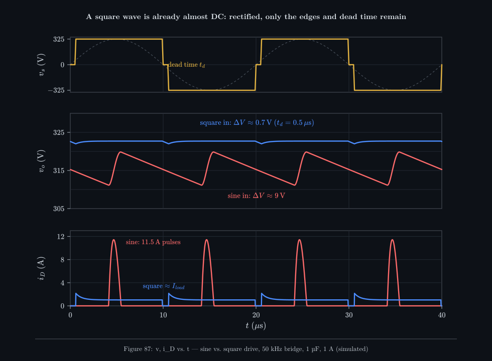

_The same bridge, the same 1 µF, the same 1 A load. Fed a sine (red) the output ripples 9 V and the
diodes deliver 11.5 A pulses. Fed a square wave with 0.5 µs dead time (blue) the output dips only
0.7 V, and only during the dead time; the diode current is simply the load current, with a small
recharge spike after each dead time._

The capacitor's job shrinks to bridging the dead time and the switching edges:

(The simulation shows 0.7 V; the extra comes from the 100 ns rise and fall edges.) Four
consequences matter for the design:

- **The output is close to <!--m:V_{pk} - 2V_F-->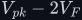<!--/m-->** regardless of load — no sag between peaks, because
  there are no "between peaks".
- **The diode current is nearly constant**, so the peak-to-average ratio is close to 1 and the
  RMS-dependent losses (diode resistance, capacitor ESR, transformer copper) are minimal. From the
  simulation, the capacitor's RMS ripple current is about 0.34 A instead of 2.8 A for the sine
  (§12).
- **The edges are where the stress lives.** At each transition two diodes must turn off and two
  turn on within the edge time. That is why reverse recovery
  ([half-wave.md §3](half-wave.md#3-reverse-recovery-and-why-it-decides-everything-at-50-khz))
  dominates the rectifier's losses at 50 kHz, not conduction.
- **The transformer's leakage inductance** sits in series with the bridge and limits how fast the
  current can transfer from one diode pair to the other. It slows the edges (a little lost
  volt-seconds, "duty-cycle loss") and rings with the diode capacitances — usually tamed with an RC
  snubber across the secondary or the diodes.

## 10 Why only a capacitor — and not an LC filter

The user's question, in full: *the slide smooths the voltage with a capacitor. Why not also smooth
the current with an inductor?* It is a good question, because there is a classical alternative —
the **choke-input filter**, an inductor in series between the bridge and the capacitor — and
because the inverter's *output* stage does use an LC filter ([../filters/lc-filter/](../filters/lc-filter/)).
The honest answer has several parts.

### What a choke-input filter does

With an inductor first, the bridge no longer sees the capacitor directly. The inductor resists
change in current ([../fundamentals/inductor/inductor.md](../fundamentals/inductor/inductor.md)),
so if it is large enough the current flows *continuously*, all the time, with two diodes always
conducting. Then the voltage at the bridge output is the full rectified waveform
<!--m:\lvert V_{pk}\sin\omega t\rvert--><!--/m-->, and the LC pair passes its DC term and attenuates the rest. The
output settles at the **average**, not the peak:

- **choke input:** <!--m:V_o \approx 2V_{pk}/\pi - 2V_F-->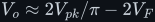<!--/m-->, about 205 V from a 325 V peak.

The inductor must be large enough to keep the current from falling to zero. Using the Fourier
series of §4, the dominant ripple at <!--m:2\omega--><!--/m--> drives a ripple current through the inductor's
impedance <!--m:2\omega L-->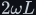<!--/m--> (the capacitor, with impedance <!--m:1/(2\omega C)--><!--/m-->, is nearly a short at
<!--m:2\omega--><!--/m-->; impedances are in
[../filters/lc-filter/lc-filter.md §2](../filters/lc-filter/lc-filter.md#2-two-laws-read-as-smoothing-rules)), while the load draws the DC
current:

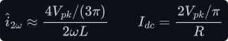

Continuous conduction needs the ripple's peak not to exceed the DC level:

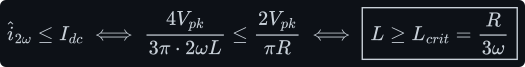

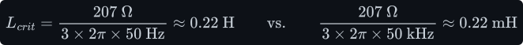

Below <!--m:L_{crit}-->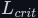<!--/m--> the current goes discontinuous and the output climbs back towards the peak in a
load-dependent way — the worst of both behaviours. Above it, the output ripple is the
second-harmonic amplitude divided by the LC attenuation at <!--m:2\omega--><!--/m-->, which is about
<!--m:(2\omega)^2 LC--><!--/m--> far above the corner
([../filters/lc-filter/lc-filter.md §6](../filters/lc-filter/lc-filter.md#6-the-transfer-function-derived)):

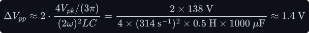

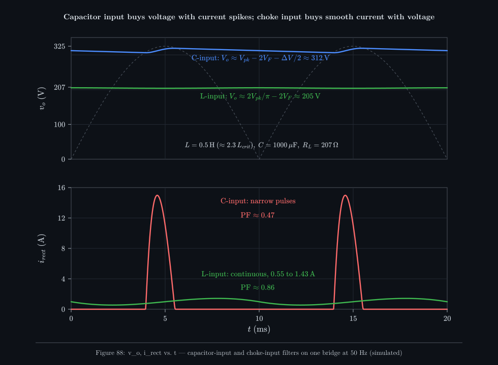

_The same bridge and the same 1000 µF, at 50 Hz. Capacitor input (blue/red): 312 V out, drawn as
15 A pulses. Choke input with 0.5 H (green): only 205 V out, but the current never stops, swinging
gently between 0.55 A and 1.43 A, and the power factor rises from 0.47 to 0.86._

### The comparison

| | Capacitor input (C only) | Choke input (L then C) |
|---|---|---|
| DC output | <!--m:\approx V_{pk}-->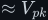<!--/m--> (about 312–315 V) | <!--m:\approx 2V_{pk}/\pi-->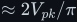<!--/m--> (about 205 V) |
| Output vs. load | droops as load rises (ripple and source drop) | nearly constant once <!--m:L > L_{crit}--><!--/m--> |
| Input current | narrow pulses, peak <!--m:\gg--><!--/m--> average | continuous, near-rectangular |
| Mains power factor (50 Hz) | about 0.4–0.6 | about 0.86–0.9 |
| Diode and transformer stress | high peak and RMS current | low; current form factor near 1 |
| Capacitor ripple current | high (2.8 A RMS for 1 A load here) | low |
| Inrush at switch-on | very high (§11) | limited by <!--m:L--><!--/m-->, but <!--m:LC--><!--/m--> can overshoot |
| Light-load behaviour | fine | needs a minimum load or a bleeder to stay above <!--m:L_{crit}--><!--/m--> |
| Size and cost at 50 Hz | small: one capacitor | heavy iron choke (0.2–0.5 H at 1 A) |
| Size at 50 kHz | tiny | small (hundreds of µH) |
| Output impedance seen by the next stage | low: a stiff voltage | higher, with an <!--m:LC--><!--/m--> resonance |

### Why the video's design uses only a capacitor

1. **It wants the peak voltage.** The bus is meant to be about 325 V so that H-bridge 2 can build a
   230 V RMS sine with a 325 V peak. A choke-input filter on a sine would deliver 0.637 of the
   peak, and the transformer would need a 57 % higher ratio to compensate.
2. **The next stage wants a stiff, low-impedance voltage source.** H-bridge 2 draws chopped current
   at its SPWM switching frequency and a 100 Hz power pulsation (§7). A capacitor right at its
   supply pins supplies those pulses locally with almost no voltage change. Any filter you put
   between the rectifier and H-bridge 2 *must still end in that capacitor* — an LC filter is a
   capacitor with an inductor in front of it, not instead of it.
3. **With a square-wave input there is almost nothing for an inductor to do.** The whole case for
   a choke is that it smooths the pulsed current of a sine-fed bridge. A square wave rectifies to
   nearly flat DC (§9), the current is already nearly constant, and the average of the rectified
   square wave is itself almost the peak:

   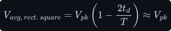

   so even the voltage penalty of choke input disappears. What remains — the edges and the dead
   time — is already handled by a small inductance that is there anyway: the **transformer's
   leakage inductance**, which sits in series with the bridge and limits the edge current spikes.
4. **It is unregulated by design.** The front end runs at a fixed duty cycle — a "DC transformer".
   No duty-cycle control, so no averaging is needed.

### Where an LC is the right answer

Point 4 is the key, because it explains why other converters that look almost identical do use an
output inductor. In a **forward converter** or a **phase-shifted full-bridge DC-DC converter**, the
transformer is driven with a *variable* duty cycle in order to regulate the output. The secondary
then delivers pulses of <!--m:\pm V_{pk}-->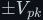<!--/m--> separated by long intervals at zero, and the rectified
waveform is a pulse train with average <!--m:D\,V_{pk}--><!--/m-->. Smoothing that with a capacitor alone would
just charge to the peak and lose all regulation. These converters therefore put an LC after the
rectifier — and that LC is exactly the buck converter's output filter, with the rectifier diodes
doing the freewheeling ([../dc-dc-converters/buck/buck.md](../dc-dc-converters/buck/buck.md),
[../filters/lc-filter/](../filters/lc-filter/)). At 50–200 kHz that inductor is small. And
off-line supplies that need good power factor get the benefit of a choke-input filter (smooth,
continuous input current) electronically, with an active PFC boost stage, rather than with a heavy
50 Hz choke.

> **Tip —** The general rule: **a capacitor-input filter makes a voltage source near the peak; a
> choke-input filter makes a current-smoothed source at the average.** Use the first when the input
> is already "fat" (a square wave, or a sine where peaky current is acceptable) and the load wants
> a stiff rail. Use the second when the input is a variable pulse train whose *average* is the
> thing you control, or when the input current's shape matters.

## 11 Inrush at power-up

At switch-on the reservoir capacitor is empty, and an empty capacitor is a short circuit: <!--m:v_C = 0--><!--/m-->
cannot change instantly ([../fundamentals/capacitor/capacitor.md](../fundamentals/capacitor/capacitor.md)).
If the supply happens to be switched on near a voltage peak, the only thing limiting the first
gulp is the total series resistance:

_With only 1 Ω in the path the first half-cycle draws about 300 A — enough to blow fuses, weld
switch contacts and stress the diodes' surge rating. A 10 Ω cold NTC thermistor cuts it to about
29 A and the bus climbs over a few cycles instead. (The simulation holds the NTC cold; a real one
heats up and falls below 1 Ω within seconds.)_

There is a hidden cost even in a perfect charge-up. Charging a capacitor through *any* resistance
from a fixed voltage dissipates exactly as much energy in the resistance as ends up stored. The
charging current is <!--m:i = C\,dv/dt = (V/R)\,e^{-t/RC}--><!--/m--> (the RC edge of
[../fundamentals/signals/edges-and-fourier.md §1](../fundamentals/signals/edges-and-fourier.md#1-what-an-edge-is)),
so <!--m:i^2 R = (V^2/R)\,e^{-2t/RC}--><!--/m-->, whose integral from zero to infinity is <!--m:(V^2/R)(RC/2)--><!--/m-->:

so 53 J lands in the diodes, wiring and NTC in a fraction of a second. The usual remedies:

- **NTC thermistor** in series: high resistance cold, low when it has self-heated. Cheap; but it
  stays hot, wastes a little power, and gives no protection on a quick off-on restart while still
  hot.
- **Resistor plus bypass relay or thyristor**: a fixed resistor limits the inrush, then is shorted
  out once the bus is up.
- **Soft start** where there is an active stage in front of the capacitor. In the inverter, the
  bus is charged *through* H-bridge 1 and the transformer, so the controller can ramp H-bridge 1's
  duty cycle (or frequency) from zero over many cycles, charging the bus gently from the battery —
  the same slow-climb idea as the converters in [../dc-dc-converters/buck/startup.md](../dc-dc-converters/buck/startup.md)
  and [../dc-dc-converters/boost/startup.md](../dc-dc-converters/boost/startup.md).
  The small 50 kHz bus capacitor (§7) also helps: 53 mJ instead of 53 J.

## 12 What this costs you

- **Two diode drops.** Each path crosses two diodes, so conduction loss is about <!--m:2V_F I_{load}--><!--/m-->:

  

  Under 1 % at 325 V, but it is all heat in four small packages, so the bridge needs a heatsink at
  kilowatt levels. SiC Schottkys trade a higher drop (about 1.5 V) for almost no recovery loss;
  at 50 kHz that is usually the better deal.
- **Reverse-recovery loss** at every edge, <!--m:Q_{rr}V_Rf--><!--/m--> per diode — the dominant loss at 50 kHz
  with the wrong diode (29 W per standard-recovery diode in the model of
  [half-wave.md §3](half-wave.md#3-reverse-recovery-and-why-it-decides-everything-at-50-khz)).
- **Capacitor ripple current and heating.** The capacitor carries everything the diodes deliver
  minus what the load takes. The load's share is the DC part, so the capacitor carries the AC part,
  and mean squares split as DC squared plus AC mean square
  ([half-wave.md §7](half-wave.md#7-form-factor-ripple-factor-and-efficiency)):

  

  That current heats the capacitor's equivalent series resistance:

  

  With a sine input the ripple-current rating, not the capacitance, usually sets the capacitor's
  size. With the inverter's square-wave input it is far lower, which is another reason film
  capacitors work there.
- **Electrolytic lifetime.** Aluminium electrolytics dry out; a common rule of thumb (Arrhenius)
  is that life doubles for every 10 K the core runs below its rating:

  

  A 2000-hour, 105 °C part run with a 65 °C core is good for roughly 32 000 hours; run hot by
  ripple current, it may last only a year or two. Film capacitors, viable at 50 kHz because only a
  few microfarads are needed, avoid the problem.
- **Peaky current** with a sine input: peak-to-average around 10–25, poor power factor (about 0.47
  here), harmonics on the mains, high RMS current in every series part.
- **Inrush.** Without limiting, hundreds of amps at switch-on, and <!--m:\tfrac{1}{2}CV^2--><!--/m--> dissipated in
  the charging path no matter what.
- **No regulation.** A capacitor-input bus is only as steady as its input. In the video's design
  the bus is the battery voltage times the turns ratio: a 12 V lead-acid battery that ranges from
  about 10.5 V (flat) to 14.4 V (charging) moves the bus from about 280 V to 385 V. Holding it at
  325 V would need closed-loop control of H-bridge 1 — and then the transformer output becomes a
  variable-width pulse train, and §10's argument says you would need the output inductor after
  all.

## 13 Sources and cross-links

- Previous: [half-wave.md](half-wave.md) — diode physics, PIV, reverse recovery and the integrals
  used here. Topic landing page: [README.md](README.md).
- The capacitor and inductor laws: [../fundamentals/capacitor/capacitor.md](../fundamentals/capacitor/capacitor.md),
  [../fundamentals/inductor/inductor.md](../fundamentals/inductor/inductor.md).
- RMS, Fourier series, harmonics and THD: [../fundamentals/signals/](../fundamentals/signals/).
- Transformer (why the step-up must be AC): [../fundamentals/transformer/](../fundamentals/transformer/).
- H-bridge 1 that drives the transformer, and H-bridge 2 that the bus feeds:
  [../dc-ac-inverters/h-bridge/](../dc-ac-inverters/h-bridge/), [../dc-ac-inverters/spwm/](../dc-ac-inverters/spwm/),
  and the PWM background in [../pwm/](../pwm/).
- The LC filter as an averaging filter (the choke-input filter's cousin, and the inverter's output
  filter): [../filters/lc-filter/](../filters/lc-filter/).
- The buck filter that forward and full-bridge DC-DC converters put after their rectifier:
  [../dc-dc-converters/buck/buck.md](../dc-dc-converters/buck/buck.md); PFC boost:
  [../dc-dc-converters/boost/](../dc-dc-converters/boost/); soft start:
  [../dc-dc-converters/buck/startup.md](../dc-dc-converters/buck/startup.md),
  [../dc-dc-converters/boost/startup.md](../dc-dc-converters/boost/startup.md).
- Source video: *DC to AC inverter*, slides at 5:56 (rectify and smooth: the DC bus) and 16:44
  (the full pipeline).
- Capacitor-input and choke-input filter design, critical inductance: F. E. Terman, *Radio
  Engineers' Handbook* (1943), rectifier section; O. H. Schade, "Analysis of rectifier operation",
  *Proc. IRE* 31 (1943) — the classic capacitor-input curves. Rectifier harmonics and power factor:
  Mohan, Undeland & Robbins, *Power Electronics*, ch. 5; IEC 61000-3-2 for harmonic limits.
- Figures 83–89 are generated by `toolchain/figures/rectifiers.js`. Every waveform is simulated by
  `toolchain/parts/rectifiers.js`: Shockley diodes with series resistance, a 0.5 Ω source
  resistance unless stated, implicit-Euler time stepping; the numbers quoted in the text (peak
  currents, power factors, ripple) are read from the same simulations.
- Style and figure conventions: [../STYLE.md](../STYLE.md).
