# The diode and the half-wave rectifier — one valve, half the wave

A rectifier turns alternating current into current that flows one way only. Its working part is the
diode, a two-terminal valve that lets current through in one direction and blocks it in the other.
This document builds the diode up from its I–V curve, explains the two non-ideal properties that
decide which diode you may use in a 50 kHz inverter (forward drop and reverse recovery), and then
derives everything about the simplest rectifier there is — one diode, one source, one load — with
every integral done in full. The [full bridge](full-bridge.md) that the inverter actually uses is
built on these results.

**Contents**

1. [What a diode is and its I–V curve](#1-what-a-diode-is-and-its-iv-curve)
2. [Reverse blocking, breakdown and PIV](#2-reverse-blocking-breakdown-and-piv)
3. [Reverse recovery and why it decides everything at 50 kHz](#3-reverse-recovery-and-why-it-decides-everything-at-50-khz)
4. [The half-wave rectifier circuit](#4-the-half-wave-rectifier-circuit)
5. [The average value, by integration](#5-the-average-value-by-integration)
6. [The RMS value, by integration](#6-the-rms-value-by-integration)
7. [Form factor, ripple factor and efficiency](#7-form-factor-ripple-factor-and-efficiency)
8. [Adding a reservoir capacitor](#8-adding-a-reservoir-capacitor)
9. [The transformer problem — DC in the winding](#9-the-transformer-problem--dc-in-the-winding)
10. [What this costs you](#10-what-this-costs-you)
11. [Sources and cross-links](#11-sources-and-cross-links)

> **The thesis in one line**
>
> A diode passes current only one way. Put one in series with an AC source and you keep one half
> of every cycle: the average is 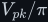<!--m:V_{pk}/\pi-->, the ripple repeats at the source frequency <!--m:f-->, and
> the winding feeding it carries a DC current it was never designed for. That is why real power
> supplies, including the inverter's DC bus, use the full bridge instead.

---

## 1 What a diode is and its I–V curve

A silicon diode is a **PN junction**: one side of the crystal doped to have spare electrons (N),
the other doped to have spare holes (P). Where they meet, electrons and holes recombine and leave
a thin region with no free carriers at all, the *depletion region*, held in place by the built-in
electric field of the ions left behind. That field is a hill the carriers must climb.

- **Forward bias** (P side, the anode, more positive than N side, the cathode) lowers the hill.
  Once the applied voltage approaches the built-in potential, carriers flood across and the
  current rises *exponentially*.
- **Reverse bias** raises the hill. Essentially nothing crosses except a tiny thermally generated
  leakage current.

The exponential is the Shockley diode equation:

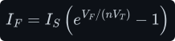

- **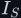<!--m:I_S-->** — the saturation current, a property of the junction area and material, typically
  <!--m:10^{-14}--> to <!--m:10^{-8}\,\mathrm{A}--> for silicon rectifiers.
- **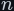<!--m:n-->** — the ideality factor, between 1 and 2.
- **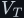<!--m:V_T-->** — the thermal voltage, set by Boltzmann's constant <!--m:k-->, the absolute temperature <!--m:T--> in
  kelvin and the electron charge 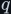<!--m:q-->:

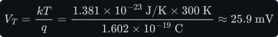

Turn the equation round to ask the question a power designer actually asks — *at this current,
how many volts do I lose?* — and add the series resistance 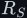<!--m:R_S--> of the silicon and the leads:

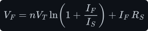

The logarithm is why every diode seems to have a fixed "forward drop". Multiply the current by ten
and the voltage rises by only:

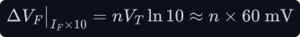

so across the three decades from 10 mA to 10 A a silicon rectifier's drop only wanders between
roughly 0.6 V and 1.1 V. That narrow band is the "0.7 V" rule of thumb.

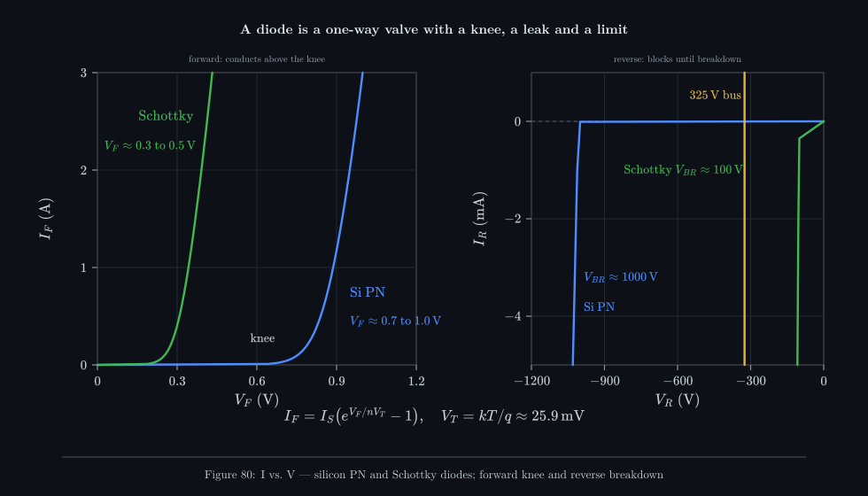

_Left: the forward knee. The model silicon PN rectifier drops 0.89 V at 1 A; the Schottky drops
0.34 V. Right: the reverse side on a milliamp scale. The PN part blocks with nanoamps up to about
1000 V; a silicon Schottky leaks visibly and breaks down near 100 V, far below a 325 V bus._

A **Schottky diode** replaces the PN junction with a metal–semiconductor junction. Its barrier is
lower, so the drop is only about 0.3–0.5 V, and it has no stored minority charge (see §3). The
price is higher leakage and a low breakdown voltage: silicon Schottkys stop at roughly 100–200 V.
**Silicon carbide (SiC) Schottkys** move the same idea to a wide-bandgap material and block 650 V
or 1200 V, at the cost of a *higher* drop (about 1.3–1.7 V) and a higher price.

> **Note —** The forward drop is where the rectifier's conduction loss comes from. Model the diode
> as a fixed voltage 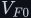<!--m:V_{F0}--> plus a small resistance 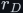<!--m:r_D--> and the loss is
>
> 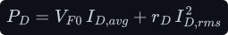
>
> The average term dominates at low current; the RMS term punishes the peaky currents of §8.

## 2 Reverse blocking, breakdown and PIV

On the reverse side the diode stays off until the field across the depletion region is strong
enough to tear electrons loose and start an avalanche — the **breakdown voltage** 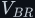<!--m:V_{BR}-->. A
rectifier diode in normal use must never get there. The number that matters is the largest reverse
voltage the circuit ever puts across the diode, the **peak inverse voltage (PIV)**, and the diode's
rated repetitive reverse voltage 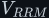<!--m:V_{RRM}--> must exceed it with margin.

The PIV is set by the circuit, not the diode, so each rectifier gets its own derivation. For the
half-wave rectifier with a reservoir capacitor (§8) it turns out to be <!--m:2V_{pk}-->; for the full
bridge it is only <!--m:V_{pk}--> ([full-bridge.md §3](full-bridge.md#3-the-full-bridge)). For a 325 V
bus a sensible choice is a 600 V or 650 V part — the extra margin is for the voltage spikes that
a transformer's leakage inductance rings up at every edge.

## 3 Reverse recovery and why it decides everything at 50 kHz

A conducting PN diode is full of *stored charge*: minority carriers injected across the junction
that have not yet recombined. When the circuit reverses the voltage, the diode cannot block until
that charge has been swept out — and the only way out is backwards, through the circuit. For a
short time the diode conducts **in reverse**, as if it were a short circuit. This is
**reverse recovery**:

- the current falls at a rate set by the circuit, 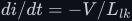<!--m:di/dt = -V/L_{lk}-->, where 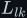<!--m:L_{lk}--> is the
  stray (leakage) inductance in the loop;
- it overshoots through zero to a peak reverse current <!--m:I_{RRM}-->;
- it then decays back to zero over the recovery time; the total time spent conducting backwards is
  the **reverse-recovery time 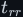<!--m:t_{rr}-->**, and the charge that flowed backwards is

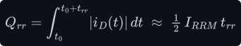

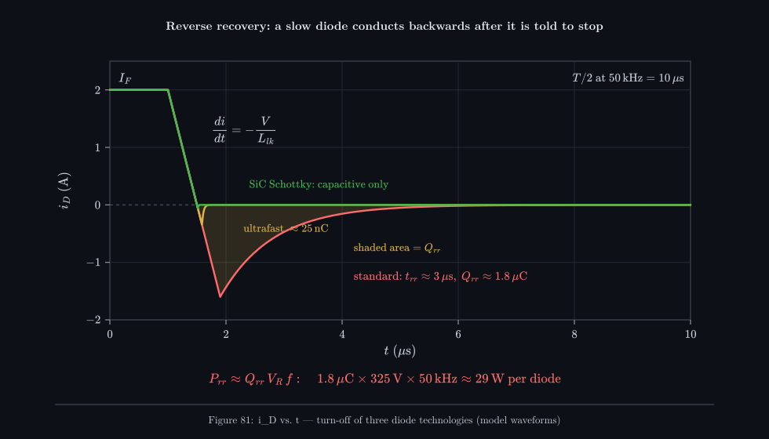

_The same turn-off for three model diodes. The standard-recovery part conducts backwards for about
3 µs — almost a third of the 10 µs half-period of a 50 kHz square wave. The ultrafast part
recovers in tens of nanoseconds; the SiC Schottky has no stored charge at all, only a little
junction capacitance to charge._

**Why it does not matter at 50 Hz.** The mains half-period is 10 ms. A 1N4007-class diode with a
few microseconds of recovery is reverse-conducting for well under a thousandth of the cycle, and
its current is falling slowly anyway because the mains voltage changes slowly. Nobody notices.

**Why it matters enormously at 50 kHz.** In the inverter the rectifier is fed by a transformer
switching every 10 µs. Every edge, two diodes of the bridge must turn off while the other two turn
on. While a slow diode recovers, it and its newly conducting partner form a short across the
transformer secondary. Three things go wrong at once:

1. **Loss.** Every recovery dumps roughly <!--m:Q_{rr}--> worth of charge through the full reverse
   voltage, once per cycle per diode:

   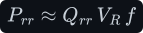

   

   Twenty-nine watts per diode is not a loss figure; it is a diode on fire.
2. **Stress on the primary switches.** The recovery current is reflected through the transformer
   into H-bridge 1's MOSFETs as a current spike at every turn-on
   ([../dc-ac-inverters/h-bridge/](../dc-ac-inverters/h-bridge/)).
3. **Ringing and EMI.** When the recovery ends abruptly ("snappy" recovery), the current in
   <!--m:L_{lk}--> is cut off suddenly and rings with the diode capacitance, producing voltage spikes well
   above <!--m:V_{pk}--> — which is where the PIV margin of §2 gets used up.

The fix is to choose a diode built for it:

| Diode family | Typical <!--m:t_{rr}--> | Forward drop | Fit for a 325 V, 50 kHz rectifier |
|---|---|---|---|
| Standard recovery (1N400x) | 2–30 µs | ~0.9–1.1 V | **No** — fine for 50 Hz mains only |
| Fast recovery | 150–500 ns | ~1.0–1.3 V | Marginal |
| Ultrafast (UF400x, MUR4xx, "hyperfast") | 25–75 ns | ~1.0–1.7 V | **Yes** — the usual choice |
| Silicon Schottky | ~0 (no stored charge) | ~0.3–0.5 V | **No** — cannot block 325 V |
| SiC Schottky | ~0 (capacitive charge only) | ~1.3–1.7 V | **Yes** — best switching, highest cost |

> **Watch out —** A datasheet's <!--m:t_{rr}--> is measured at a stated 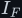<!--m:I_F--> and <!--m:di/dt-->. At higher
> current, higher temperature or faster edges it gets worse. Always compare at the conditions your
> circuit will produce.

## 4 The half-wave rectifier circuit

Put one diode in series between an AC source 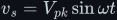<!--m:v_s = V_{pk}\sin\omega t--> and a load resistor <!--m:R_L-->.

- During the **positive half-cycle** the anode is above the cathode, the diode conducts, and the
  load sees the source minus one forward drop, 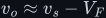<!--m:v_o \approx v_s - V_F-->.
- During the **negative half-cycle** the diode is reverse-biased; no current flows and 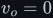<!--m:v_o = 0-->.
  The whole source voltage appears across the diode instead.

Ignoring the drop for the moment, and writing the phase <!--m:\theta = \omega t-->:

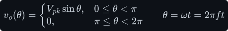

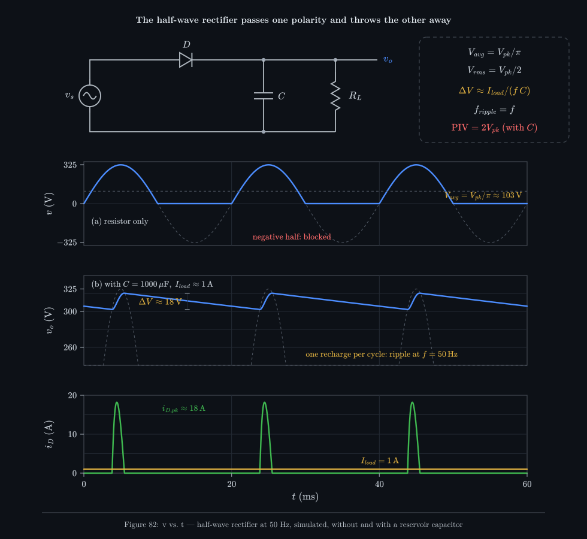

_(a) On a resistor, one hump per cycle and nothing in between. (b) With a 1000 µF reservoir
capacitor and a 1 A load the output stays near the peak, sagging 18 V between recharges — once per
cycle, so the ripple is at 50 Hz. Bottom: each recharge is a single 18 A gulp lasting about 1.5 ms._

The output is now *unidirectional* — it never goes negative — but it is far from steady. To
describe how much "DC" it contains we need two numbers: the average and the RMS.

## 5 The average value, by integration

The average (DC) value of any periodic waveform is its area over one period divided by the period.
In terms of phase, one period is 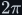<!--m:2\pi--> radians. The integrand is zero for the second half, so only
the first half contributes:

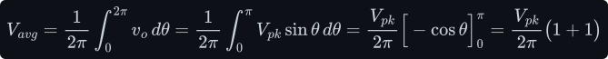

The evaluation is where sign slips happen, so slowly: <!--m:-\cos\pi = -(-1) = +1--> and
<!--m:-\cos 0 = -1-->, so the bracket is 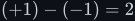<!--m:(+1) - (-1) = 2-->. Therefore:

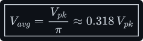

For a 325 V peak that is about 103 V of DC — less than a third of the peak. A moving-coil DC meter
on the output would read this number.

## 6 The RMS value, by integration

RMS ("root mean square") is the value of DC that would heat a resistor equally. Square the
waveform, average the square, take the root. Squaring needs the identity that turns
<!--m:\sin^2--> into something integrable:

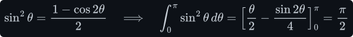

(The <!--m:\sin 2\theta--> term vanishes at both <!--m:0--> and <!--m:\pi-->, leaving 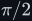<!--m:\pi/2-->.) Now the mean square:

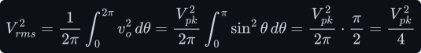

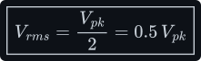

Compare the full sine wave, whose RMS is 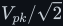<!--m:V_{pk}/\sqrt{2}-->. Throwing away half the wave halves
the *power* (the mean square goes from 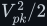<!--m:V_{pk}^2/2--> to 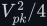<!--m:V_{pk}^2/4-->), so the RMS falls by
<!--m:\sqrt{2}-->, not by 2. The signals background for RMS is in
[../fundamentals/signals/](../fundamentals/signals/).

## 7 Form factor, ripple factor and efficiency

Three ratios summarise how "un-DC" the output is.

**Form factor** — RMS over average:

**Ripple factor** — the RMS of the AC part over the DC part. It uses the fact that a waveform's
mean square is the sum of its DC part squared and its AC part's mean square (the cross term
averages to zero because the AC part averages to zero):

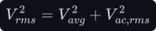

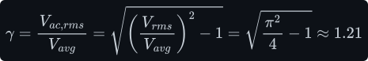

A ripple factor above 1 means there is *more* AC than DC in the output.

**Rectification efficiency** — the fraction of the load power that is DC power:

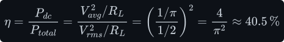

The other 59.5 % heats the load as AC. The Fourier series makes the content explicit. Its coefficients come from the formulas of
[../fundamentals/signals/edges-and-fourier.md §5](../fundamentals/signals/edges-and-fourier.md#5-orthogonality--the-trick-that-makes-it-work),
in angle form, with the integrand zero on the second half-cycle. The DC term 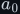<!--m:a_0--> is the average of
§5, <!--m:V_{pk}/\pi-->. The fundamental's sine coefficient is 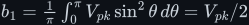<!--m:b_1 = \tfrac{1}{\pi}\int_0^\pi V_{pk}\sin^2\theta\,d\theta = V_{pk}/2-->,
using the <!--m:\pi/2--> of §6; every other <!--m:b_n--> is zero. The cosine coefficients need
<!--m:\sin\theta\cos n\theta = \tfrac12[\sin(1-n)\theta + \sin(1+n)\theta]-->:

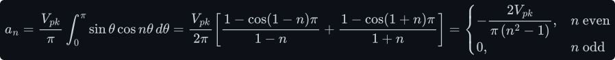

Put together — the DC term, a large component *at the source frequency itself*, and even harmonics
(write 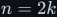<!--m:n = 2k-->):

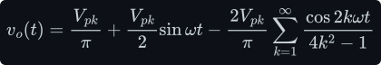

That 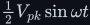<!--m:\tfrac{1}{2}V_{pk}\sin\omega t--> term is the half-wave rectifier's signature: the strongest
ripple sits at <!--m:f-->, the lowest frequency available, which is the hardest to filter. The full bridge
cancels it exactly ([full-bridge.md §4](full-bridge.md#4-average-rms-and-the-ripple-at-2f)).

## 8 Adding a reservoir capacitor

Put a capacitor <!--m:C--> across the load. Near each positive peak the diode conducts and charges <!--m:C-->
to almost <!--m:V_{pk}-->. As soon as the source falls below the capacitor voltage the diode turns off,
and for the rest of the cycle the capacitor alone feeds the load. A capacitor feeding a roughly
constant current discharges in a straight line — the capacitor law from
[../fundamentals/capacitor/capacitor.md §4](../fundamentals/capacitor/capacitor.md#4-from-the-law-to-the-ramp)
run backwards:

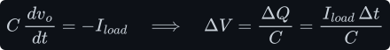

With one recharge per cycle, the discharge lasts nearly a whole period <!--m:T = 1/f-->:

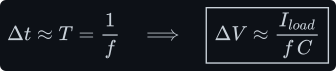

The estimate is slightly pessimistic because the discharge really lasts <!--m:T--> minus the charging
time. Three consequences follow directly from the picture:

- **The ripple frequency is <!--m:f-->.** One recharge per cycle.
- **The capacitor must hold up the load for a full period**, so for a given ripple it needs twice
  the capacitance of a full-wave rectifier ([full-bridge.md §5](full-bridge.md#5-the-reservoir-capacitor)).
- **The PIV doubles.** At the negative peak the capacitor still holds about <!--m:+V_{pk}--> on the
  cathode while the source pulls the anode to <!--m:-V_{pk}-->:

The charging current comes in one short, tall pulse per cycle — 18 A peak for a 1 A load in the
simulation of Figure 82. The full bridge halves the gap between pulses but keeps the shape; the
detailed analysis of conduction angle and peak current is in
[full-bridge.md §6](full-bridge.md#6-conduction-angle-and-the-tall-current-pulses).

## 9 The transformer problem — DC in the winding

This is the reason a half-wave rectifier is never put on a transformer secondary in a power supply
of any size. The secondary current flows one way only, so it has an average value — equal to the
load current — that never reverses. Ampère's law around the core
([../fundamentals/electromagnetism/electromagnetism.md §5](../fundamentals/electromagnetism/electromagnetism.md#5-h-permeability-and-why-the-core-matters))
turns those DC ampere-turns into a steady flux density:

A transformer cannot pass DC: the primary only supplies whatever current is needed to cancel the
*changing* part of the secondary's magnetising force. The DC ampere-turns <!--m:N_s I_{s,avg}--> are
cancelled by nothing, so they bias the core flux permanently to one side. For an illustrative
ungapped ferrite core:

The core saturates long before the load is reached. A saturated core has almost no inductance, the
magnetising current balloons, and the primary switches in H-bridge 1 see current spikes they were
never sized for. (The transformer basics — why it passes only change, and what saturation is — are
in [../fundamentals/transformer/](../fundamentals/transformer/) and
[../fundamentals/electromagnetism/](../fundamentals/electromagnetism/).) Even with a gapped core
that avoids saturation, half the winding's copper sits idle half the time: the standard
**transformer utilisation factor** (DC output power over transformer VA rating) is only about 0.29
for half-wave against about 0.81 for the bridge.

> **Note —** Half-wave rectifiers survive where none of this bites: tiny auxiliary supplies,
> signal detectors, and the *flyback* converter, whose "transformer" is really a coupled inductor
> that is meant to store energy and carries DC by design (with a gapped core).

## 10 What this costs you

- **Only half the input is used.** Average <!--m:V_{pk}/\pi-->, efficiency 40.5 %, ripple factor 1.21.
- **Ripple at <!--m:f-->, not <!--m:2f-->.** For the same ripple the capacitor must be twice as large as a
  full-wave design's.
- **PIV of <!--m:2V_{pk}-->** with a reservoir capacitor: 650 V on a 325 V peak, before ringing — a
  1000 V diode in practice.
- **DC in the transformer.** Core saturation or an oversized, gapped core; poor utilisation.
- **One forward drop** is the only advantage: 0.9 V lost instead of the bridge's 1.8 V. At 325 V
  that is 0.3 % and irrelevant; at 3.3 V it would matter, which is why low-voltage outputs use
  Schottkys or synchronous MOSFETs instead.
- **Recovery losses at high frequency** apply to every rectifier, half or full: at 50 kHz use
  ultrafast or SiC parts, never standard-recovery diodes.

## 11 Sources and cross-links

- Next: [full-bridge.md](full-bridge.md) — the rectifier the inverter uses, the reservoir
  capacitor in depth, and why the bus has no smoothing inductor.
- Topic landing page: [README.md](README.md).
- Capacitor law used in §8: [../fundamentals/capacitor/capacitor.md](../fundamentals/capacitor/capacitor.md).
- RMS, averages and Fourier series: [../fundamentals/signals/](../fundamentals/signals/).
- Transformers and core saturation: [../fundamentals/transformer/](../fundamentals/transformer/),
  [../fundamentals/electromagnetism/](../fundamentals/electromagnetism/).
- The H-bridge that drives the transformer: [../dc-ac-inverters/h-bridge/](../dc-ac-inverters/h-bridge/).
- Shockley's diode law: W. Shockley, "The theory of p-n junctions in semiconductors and p-n junction
  transistors", *Bell System Technical Journal* 28 (1949). Rectifier ratios (form factor, ripple
  factor, efficiency, utilisation factor): any power-electronics text, e.g. Mohan, Undeland &
  Robbins, *Power Electronics*, ch. 5; Rashid, *Power Electronics Handbook*, ch. on diode
  rectifiers.
- Figures 80–82 are generated by `toolchain/figures/rectifiers.js`; the waveforms in Figure 82 are
  simulated by `toolchain/parts/rectifiers.js` (Shockley diode with series resistance, 0.5 Ω
  source resistance, implicit-Euler time stepping).
- Style and figure conventions: [../STYLE.md](../STYLE.md).
